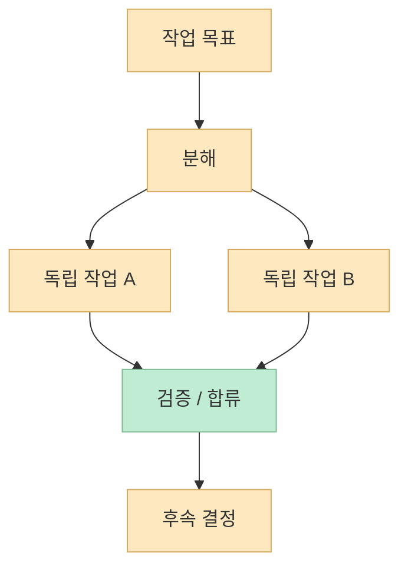
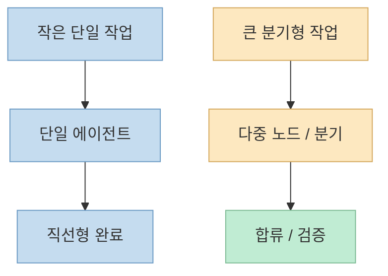

이번 X Article의 제목은 아주 실용적입니다. 
**"Graph Engineering explained: what it is, when to use it and when not to"**  
즉 그래프 엔지니어링을 또 하나의 유행어로 포장하기보다, **언제 써야 하고 언제 쓰지 말아야 하는지** 를 구분하려는 글입니다. 공개적으로 복구 가능한 미리보기 텍스트도 "대부분의 사람은 AI를 실제 잠재력의 5~10%만 사용하고 있고, 더 빠른 길이 있지만 그건 생각보다 더 큰 구조 변화"라고 말합니다. <https://x.com/i/status/2080668775796314331>

이 관점이 중요한 이유는, 그래프 엔지니어링이 자칫 모든 문제의 답처럼 소비되기 쉽기 때문입니다. 
하지만 실제로는 모든 AI 작업이 그래프를 필요로 하지는 않습니다. 어떤 문제는 프롬프트 하나면 충분하고, 어떤 문제는 루프만으로도 해결됩니다. 그래프는 **분기, 병렬성, 합류, 재시도 구조가 실제 이득을 주는 순간** 에만 가치가 커집니다.

<!--more-->

## Sources

- <https://x.com/i/status/2080668775796314331>
- <https://code.claude.com/docs/en/workflows>
- <https://code.claude.com/docs/en/sub-agents>
- <https://code.claude.com/docs/en/overview>

## 1. 그래프 엔지니어링은 '더 복잡한 프롬프트'가 아니라 일의 모양을 설계하는 일이다

공개 미리보기 문구를 보면, 이 글의 전제는 분명합니다. 
사람들은 AI를 아직도 생각보다 낮은 수준으로 쓰고 있고, 더 빠른 길이 있지만 그건 단순한 모델 교체나 프롬프트 최적화보다 **더 큰 구조 변화** 라는 것입니다. <https://x.com/i/status/2080668775796314331>

그래프 엔지니어링의 핵심은 보통 다음 질문에 답하는 데 있습니다.

- 어떤 작업은 동시에 실행 가능한가
- 어떤 작업은 특정 결과를 기다려야 하는가
- 어떤 경로는 실패 시 되돌아가야 하는가
- 결과를 어디서 다시 모아야 하는가

즉 그래프는 "한 단계씩 시키는 법"이 아니라, **일의 위상(topology)** 을 설계하는 일입니다.

따라서 그래프 엔지니어링이 필요하냐는 질문은 곧, **내 작업이 정말 이런 구조를 요구하느냐** 는 질문과 같습니다.

## 2. 그래프를 써야 하는 경우: 독립 작업이 많고, 합류 지점이 분명할 때

그래프 엔지니어링이 특히 강해지는 경우는 대체로 아래와 같습니다.

### 1) 독립적으로 병렬 처리 가능한 작업이 많을 때

예를 들어:

- 여러 문서를 동시에 조사
- 여러 레포나 디렉터리의 상태를 동시에 파악
- 여러 후보안을 비교
- 서로 다른 출처에서 정보를 모으고 마지막에 종합

이런 경우는 한 agent가 순차적으로 다 읽는 것보다, **역할이나 영역을 분리한 subagent** 에게 나눠 보내는 편이 효율적일 수 있습니다.

Claude Code sub-agents 문서도 subagent가 각자 context window와 custom system prompt, tool access를 가진다고 설명합니다. 즉 독립적 작업 단위가 있을 때 subagent는 자연스러운 노드가 됩니다. <https://code.claude.com/docs/en/sub-agents>

### 2) 분기 후 다시 합쳐야 하는 구조가 있을 때

예를 들어:

- 조사 결과와 코드 분석 결과를 나중에 합침
- 구현과 검증이 따로 돌고, 마지막에 승인
- 여러 실험 경로 중 가장 좋은 결과를 고름

이런 문제는 "길어진 직선형 스텝"보다 **분기와 합류가 있는 구조** 로 표현하는 편이 훨씬 명확합니다.

### 3) 상태 전이나 재시도 경로를 명시해야 할 때

작업이 단순히 끝나느냐 마느냐가 아니라:

- 성공
- 부분 성공
- 실패 후 재시도
- 다른 경로로 우회

같은 상태를 가질 때 그래프는 특히 유용합니다.

즉 graph는 단순 "빠르게 하자"의 도구가 아니라, **복잡한 실행 경로를 통제 가능하게 만드는 도구** 입니다.

## 3. 그래프를 굳이 쓰지 않아도 되는 경우: 직선형으로 끝나는 작은 작업

반대로 graph engineering이 과한 경우도 많습니다.

### 1) 단일 목표, 단일 경로, 단일 산출물인 작업

예를 들면:

- 짧은 문장 고치기
- 설정 파일 한 군데 수정
- 간단한 README 보완
- 단일 함수 리팩터링

이런 작업은 사실상 하나의 agent가 한 세션 안에서 끝내도 무방합니다. 
분기와 병렬화, 합류를 설계하는 비용이 오히려 더 큽니다.

### 2) 컨텍스트가 작고 독립 작업이 거의 없을 때

작업이 아주 작은데도 subagent를 만들고, orchestration을 짜고, 노드와 엣지를 설계하면, 실제로는 생산성보다 **메타 설계 비용** 만 늘어납니다.

### 3) 최종 판단이 강하게 통합돼 있어 분리 이익이 적을 때

예를 들어 아주 미묘한 디자인 판단, 복잡한 단일 흐름 디버깅, 깊은 맥락 일관성이 중요한 문제는 여러 agent로 나누는 순간 오히려 품질이 흔들릴 수 있습니다.

즉 graph를 안 쓰는 것도 실력입니다. 
모든 문제를 그래프로 만들면 sophisticated해 보일 수는 있어도, 실제로는 **오버엔지니어링** 이 되기 쉽습니다.

## 4. Claude Code 관점에서 보면: graph는 dynamic workflow와 subagent orchestration 문제다

Claude Code workflow 문서는 dynamic workflows를 many subagents를 scripts로 orchestration하는 방식이라고 설명합니다. script 안에는 loops, branching, intermediate results가 직접 들어갑니다. <https://code.claude.com/docs/en/workflows>

이걸 실무 관점에서 번역하면 graph engineering은:

- 어떤 subagent를 언제 호출할지
- 어떤 결과를 어디에 저장하고 전달할지
- 어느 시점에 분기하고 다시 합칠지
- 실패했을 때 어떤 노드로 되돌릴지

를 결정하는 문제입니다.

즉 graph engineering은 단순히 "subagent를 쓴다"가 아니라, **subagent들이 어떤 위상으로 연결되는지** 를 설계하는 것입니다.

그래서 graph가 필요한 작업이라면, 보통 이미 다음 조건을 만족합니다.

- 한 세션에 다 넣기엔 컨텍스트가 큼
- 역할 분리가 유리함
- 병렬화 가능한 조각이 있음
- 합류 지점이 있음

반대로 이 조건이 없으면, dynamic workflow는 멋있어 보이지만 **불필요하게 큰 공사** 가 될 수 있습니다.

## 5. 실무 판단 기준: '복잡하다'가 아니라 '분리 이익이 분명한가'를 봐야 한다

graph engineering이 필요한지 판단할 때 가장 좋은 질문은 "이 문제가 복잡한가?"가 아닙니다. 
복잡하지만 분리 이익이 별로 없는 문제도 있고, 반대로 겉보기엔 단순해도 병렬 수집과 합류가 잘 맞는 문제도 있습니다.

더 실용적인 기준은 아래에 가깝습니다.

### 그래프를 고려할 만한 신호

- 작업이 여러 독립 소스로 나뉜다
- 각 소스의 결과를 종합해야 한다
- 같은 루프를 여러 경로에 적용해야 한다
- 한 에이전트의 컨텍스트가 금방 포화된다
- 실패 경로와 재시도 경로가 분명하다

### 그래프를 피하는 게 나은 신호

- 결과가 하나의 긴 생각 흐름에 묶여 있다
- 병렬로 나누면 오히려 맥락 손실이 크다
- 합류 비용이 병렬화 이득보다 크다
- 작업이 너무 작아 orchestration이 더 비싸다

즉 그래프의 질문은 "멋있나?"가 아니라, **분리했을 때 얻는 순이익이 있나?** 입니다.

## 6. 결국 이 글이 말하려는 것: 그래프는 '더 큰 망치'가 아니라 '더 넓은 작업판'이다

공개 미리보기는 사람들의 AI 활용이 아직 5~10% 수준에 머물러 있다고 말합니다. 이 표현을 과장된 마케팅 문구로만 볼 수도 있지만, 일정 부분은 맞는 말입니다. 많은 사용자가 여전히 AI를 단일 질문-응답 도구로만 쓰고 있기 때문입니다. <https://x.com/i/status/2080668775796314331>

다만 그 다음 결론은 중요합니다. 
그렇다고 모든 사람이 당장 graph engineering으로 가야 한다는 뜻은 아닙니다.

오히려 더 정확한 결론은 이렇습니다.

- 단일 작업에는 단순한 흐름이 낫다
- 분기와 병렬화가 필요한 작업은 graph가 강하다
- graph는 만능이 아니라, 분리 이익이 클 때만 진가를 보인다

즉 graph engineering은 더 큰 망치가 아닙니다. 
그건 **여러 작업자를 배치할 수 있는 더 넓은 작업판** 에 가깝습니다. 필요한 순간엔 강력하지만, 늘 꺼내 들면 오히려 비효율적일 수 있습니다.

## 핵심 요약

- 이 X Article은 graph engineering을 "무엇인가"보다 "언제 써야 하고 언제 쓰지 말아야 하는가" 관점에서 다룬다.
- graph engineering은 작업의 위상, 즉 분기·합류·병렬성·재시도 구조를 설계하는 층위다.
- 독립 작업이 많고 합류 지점이 분명하며 상태 전이가 중요한 문제는 graph와 잘 맞는다.
- 반대로 단일 목표, 단일 경로, 작은 작업은 graph 없이 직선형 흐름이 더 낫다.
- Claude Code 관점에서 graph는 dynamic workflow와 subagent orchestration을 설계하는 문제로 이해할 수 있다.

## 결론

graph engineering이 중요해지는 건 사실입니다. 
하지만 그 이유는 모든 일을 복잡하게 만들기 위해서가 아니라, **직선형으로는 비효율적인 문제를 더 자연스럽게 풀기 위해서** 입니다. 
그래서 중요한 건 "지금은 그래프 시대다" 같은 선언이 아니라, **이 작업이 정말 분기와 합류, 병렬화의 이득을 가지는가** 를 먼저 보는 것입니다.

결국 graph engineering의 실력은 더 많은 노드를 그리는 데 있지 않습니다. 
오히려 **그래프가 필요한 순간과 필요하지 않은 순간을 구분하는 판단력** 에 더 가깝습니다.
