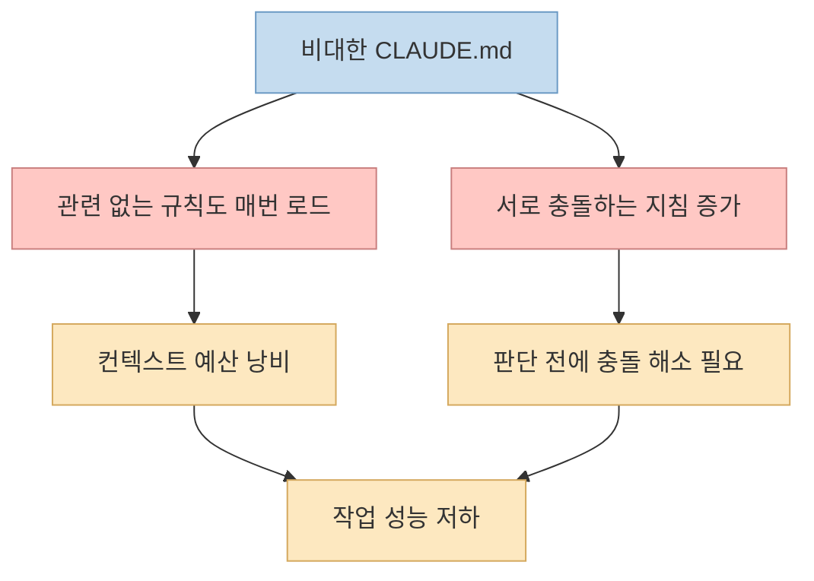
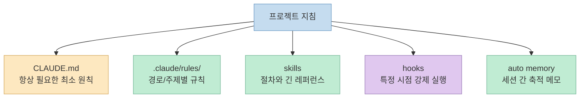
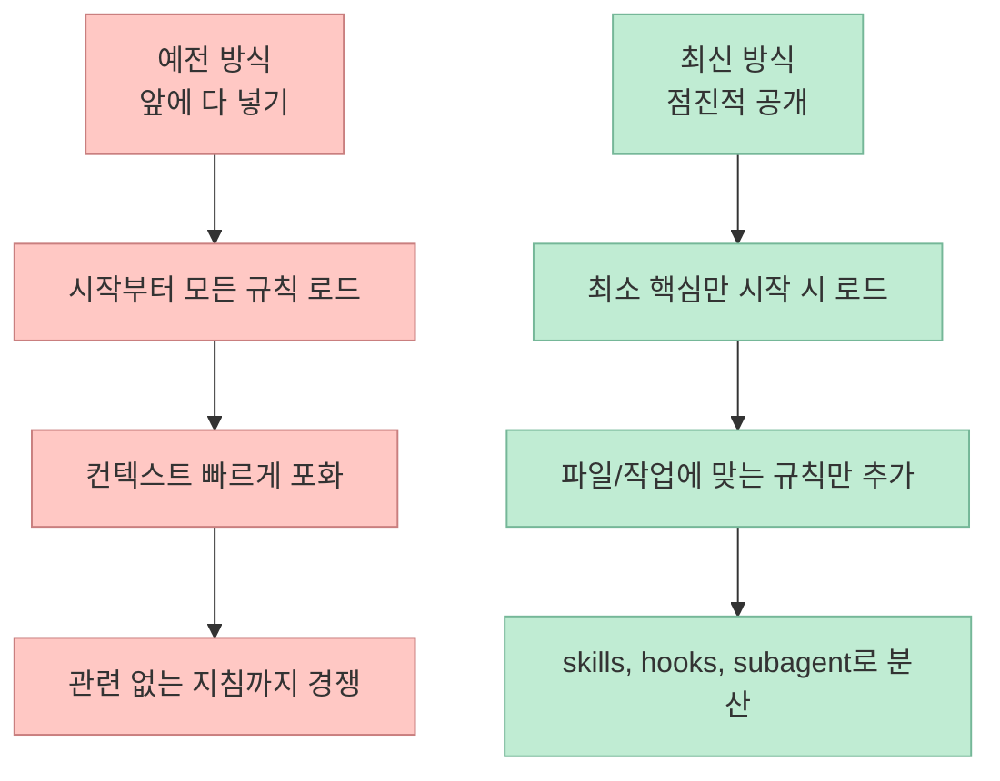

최근 Claude Code 사용자들 사이에서는 `CLAUDE.md`를 계속 두껍게 만드는 것이 정답처럼 여겨지는 경우가 많았습니다. 
그런데 2026년 7월 27일 기준으로 확인한 CHOI의 Threads 스레드는, Anthropic의 최신 방향이 오히려 **"계속 쌓지 말고 줄여라"** 쪽이라고 요약합니다. 특히 `CLAUDE.md`에 이것저것 다 넣기보다, 규칙은 규칙대로 쪼개고 절차는 스킬로 빼고, 반복 주입이 필요하면 훅으로 보내며, 정말 매 세션에 필요한 내용만 남기라는 메시지가 핵심입니다. <https://www.threads.com/share/BASx4OKcAP/> <https://www.threads.com/@choi.openai/post/DbNETTcj7Vq>

이 방향은 단순한 감각적 조언이 아닙니다. 
Claude Code 공식 문서는 이미 긴 `CLAUDE.md`가 더 많은 컨텍스트를 먹고, 경로별 규칙은 `.claude/rules/`로 나누고, 절차성 지침은 skills로 빼며, 특정 시점에 반드시 실행돼야 하는 것은 hooks로 옮기라고 설명하고 있습니다. 즉 최신 컨텍스트 엔지니어링의 핵심은 "많이 넣기"가 아니라 **필요한 순간에 필요한 것만 정확히 로드되게 설계하기** 입니다. <https://code.claude.com/docs/en/memory> <https://code.claude.com/docs/en/skills> <https://code.claude.com/docs/en/best-practices>

<!--more-->

## Sources

- <https://www.threads.com/share/BASx4OKcAP/>
- <https://www.threads.com/@choi.openai/post/DbNETTcj7Vq>
- <https://code.claude.com/docs/en/memory>
- <https://code.claude.com/docs/en/skills>
- <https://code.claude.com/docs/en/best-practices>
- <https://code.claude.com/docs/en/hooks-guide>
- <https://code.claude.com/docs/en/context-window>
- <https://www.anthropic.com/engineering/effective-context-engineering-for-ai-agents>

## 1. 스레드가 말하는 문제: CLAUDE.md를 쌓을수록 오히려 충돌이 늘어난다

스레드의 첫 번째 핵심 포인트는 꽤 인상적입니다. 
CHOI는 Anthropic 쪽 메시지를 요약하면서, 예전처럼 `CLAUDE.md`에 규칙을 촘촘히 늘려놓는 방식이 최신 세대에서는 오히려 역효과를 낼 수 있다고 설명합니다. 스레드에 따르면 Claude Code 내부 사용 기록에서는 한 요청 안에 "문서는 적절히 남겨라"와 "주석은 절대 달지 마라" 같은 상충하는 지침이 함께 들어가 있던 사례가 관찰됐습니다. <https://www.threads.com/@choi.openai/post/DbNETTcj7Vq>

이 요지는 공식 문서와도 잘 맞습니다. 
Claude Code 메모리 문서는 `CLAUDE.md`가 너무 크면 더 많은 컨텍스트를 소비하고 adherence가 떨어질 수 있다고 분명히 적고 있습니다. 특히 **200줄이 넘는 파일은 더 많은 컨텍스트를 먹고 따르기 어려워질 수 있다** 고 설명하며, 필요 없는 내용을 잘라내고 경로별 규칙으로 나누라고 권합니다. <https://code.claude.com/docs/en/memory>

즉 문제는 "규칙이 많으면 안전하다"가 아니라:

- 규칙끼리 충돌하고
- 매 세션 초반부터 다 로드되며
- 지금 작업과 무관한 지침도 같이 올라오고
- 모델이 우선순위를 정리하는 데 토큰과 판단을 써야 한다

는 데 있습니다.

여기서 중요한 건, 이건 단지 파일 정리 습관의 문제가 아니라 **성능 문제** 라는 점입니다. 
Anthropic의 컨텍스트 엔지니어링 글도 결국 목표를 "원하는 결과를 낼 가능성이 가장 높은 최소한의 토큰 묶음" 쪽으로 설명합니다. 긴 컨텍스트는 공짜가 아니고, 매번 모델이 계산해야 하는 예산입니다. <https://www.anthropic.com/engineering/effective-context-engineering-for-ai-agents>

## 2. 공식 문서가 실제로 권하는 것: CLAUDE.md 하나에 다 넣지 말고 계층을 나눠라

공식 문서를 읽어 보면, Anthropic은 이미 `CLAUDE.md` 하나에 모든 지침을 몰아넣는 방식을 정답으로 설명하지 않습니다.

Claude Code 메모리 문서는 persistent context를 다섯 층 정도로 나눠 이해하게 만듭니다.

- `CLAUDE.md`: 프로젝트 전반에 항상 필요한 상위 지침
- `.claude/rules/`: 파일 경로나 주제별로 나뉘는 규칙
- skills: 절차성 지침이나 길고 무거운 레퍼런스
- hooks: 특정 라이프사이클에서 반드시 실행돼야 하는 것
- auto memory: 세션 간 학습된 개인화 메모

특히 `.claude/rules/`에 있는 path-scoped rules는 **matching file이 열릴 때만** 로드됩니다. 그리고 skills는 더 명확합니다. 공식 skills 문서는 skill 본문은 **사용될 때만 로드되므로 긴 레퍼런스 자료는 필요할 때까지 거의 비용이 없다** 고 설명합니다. <https://code.claude.com/docs/en/memory> <https://code.claude.com/docs/en/skills>

즉 구조는 이렇게 바뀝니다.

이 구조가 의미하는 건 명확합니다. 
**중요한 것은 지침의 총량이 아니라 로딩 전략** 입니다.

Anthropic의 컨텍스트 윈도우 문서도 startup 시점에 `CLAUDE.md`, auto memory, MCP tool names, skill descriptions가 먼저 로드된다고 설명합니다. 그리고 작업 중에는 matching file을 읽을 때 path-scoped rules가 추가되고, compaction 이후에는 무엇이 다시 들어오고 무엇이 사라지는지도 구분합니다. 즉 요즘 Claude Code는 단순 메모장 기반이 아니라 **계층적 컨텍스트 로더** 로 이해하는 쪽이 맞습니다. <https://code.claude.com/docs/en/context-window>

## 3. 왜 최신 모델일수록 "규칙"보다 "판단" 쪽으로 이동하는가

CHOI 스레드는 이 변화를 몇 가지 뒤집힘으로 요약합니다.

- 규칙 대신 판단
- 예시 대신 인터페이스 설계
- 앞에 다 넣기 대신 점진적 공개

이 중 일부는 공식 문서로 직접 확인되고, 일부는 스레드 기반 단일 출처 주장입니다. 예를 들어 "Opus 5, Fable 5 기준으로 시스템 프롬프트 80% 이상을 지웠다"는 숫자와 "2026년 7월 24일 Thariq가 공개했다"는 설명은 현재 제가 확인한 범위에서는 **스레드 단독 정보** 입니다. 따라서 흥미로운 힌트로 볼 수는 있지만, 이 숫자 자체를 공식 확정치처럼 받아들이는 건 조심해야 합니다. <https://www.threads.com/@choi.openai/post/DbNETTcj7Vq>

반면 방향 자체는 공식 문서가 강하게 뒷받침합니다.

메모리 문서는:

- `CLAUDE.md`가 너무 크면 줄이라고 하고
- 경로 규칙은 path-scoped rules로 빼라고 하고
- 절차성 내용은 skills가 더 적합하다고 설명합니다. <https://code.claude.com/docs/en/memory> <https://code.claude.com/docs/en/skills>

또 best practices 문서는 context를 적극적으로 관리하라고 하면서:

- unrelated task 사이에는 `/clear`
- 긴 세션에서는 `/compact`
- compaction 시 중요한 내용이 남도록 `CLAUDE.md`에 preservation instruction 추가

를 권합니다. <https://code.claude.com/docs/en/best-practices>

이건 모델이 똑똑해져서 아무 지침도 필요 없다는 뜻이 아닙니다. 
오히려 **더 넓은 판단을 모델에게 맡길 수 있게 됐으니, 인간은 충돌 없는 구조를 설계하라** 는 쪽에 가깝습니다.

## 4. 예시는 줄이고 인터페이스를 설계하라는 말의 실전 의미

스레드에서 특히 중요한 부분은 "예시를 많이 붙이는 것보다 도구와 매개변수 설계를 먼저 보라"는 대목입니다. Todo 도구에서 `pending`, `in_progress`, `completed` 같은 enum만 잘 정의해도 원하는 동작이 드러난다는 설명은 좋은 예입니다. 이 부분도 현재는 **스레드 요약 기반** 이지만, 공식 skills 문서와 context window 문서를 함께 보면 충분히 납득됩니다. <https://www.threads.com/@choi.openai/post/DbNETTcj7Vq> <https://code.claude.com/docs/en/skills> <https://code.claude.com/docs/en/context-window>

실무적으로 이 말은 이런 뜻입니다.

- "이럴 때는 A, 저럴 때는 B" 예시 20개를 `CLAUDE.md`에 붙이기보다
- 도구 이름, 인자 이름, 상태값, 파일 구조, 스킬 이름을 더 설명적으로 만들고
- task-specific 절차는 별도 skill로 옮기고
- matching file에만 규칙이 들어오게 해야 한다

예시는 범위를 좁히고, 인터페이스는 선택 공간을 설계합니다. 
최신 모델에서 후자가 더 강하다는 게 스레드의 문제의식이고, 공식 문서는 적어도 **skills와 rules의 분리** 로 그 방향을 제도화하고 있습니다.

## 5. 점진적 공개가 왜 중요한가: "앞에 다 넣기"는 이제 비효율이다

Anthropic의 컨텍스트 엔지니어링 글은 Claude Code를 hybrid model로 설명합니다. 
`CLAUDE.md`는 upfront로 들어가지만, 파일 탐색과 검색은 런타임에 just-in-time으로 이뤄진다는 뜻입니다. <https://www.anthropic.com/engineering/effective-context-engineering-for-ai-agents>

이 철학은 공식 제품 문서 전체에 반복됩니다.

- rules는 matching file이 열릴 때 로드
- nested `CLAUDE.md`는 관련 디렉터리 파일을 읽을 때 로드
- skills는 relevant할 때만 로드
- subagent는 큰 읽기를 별도 context로 격리

즉 "앞에 다 넣기"는 단순 과잉이 아니라 아키텍처 위반에 가깝습니다.

context window 문서는 compaction 뒤에도 무엇이 자동 재주입되는지 세세하게 설명합니다. project-root `CLAUDE.md`와 unscoped rules, auto memory는 다시 들어오지만, path-scoped rules와 nested `CLAUDE.md`는 matching file을 다시 읽어야 돌아옵니다. 이건 결국 **항상 필요한 것과 그때만 필요한 것을 구분하라** 는 설계 원칙입니다. <https://code.claude.com/docs/en/context-window>

## 6. 그럼 실제로는 어떻게 옮겨야 하나: CLAUDE.md 감량 가이드

이제 중요한 건 해석이 아니라 실행입니다. 
공식 문서와 스레드의 메시지를 합치면, 실전 정리는 대략 이런 순서가 됩니다.

### 6-1. CLAUDE.md에는 정말 항상 필요한 것만 남긴다

남겨야 할 것은 보통 이런 종류입니다.

- 프로젝트 전체에 항상 적용되는 핵심 규칙
- 코드베이스의 함정과 예외
- 팀의 일관된 의사결정 원칙
- compaction 때 꼭 보존돼야 하는 정보

반대로 줄여야 할 것은:

- 디렉터리 구조 설명
- 코드에서 쉽게 유도되는 정보
- 드문 상황에서만 필요한 절차
- 긴 예시 묶음
- 파일별 세부 지침

공식 문서는 `/doctor`가 checked-in `CLAUDE.md`에 대해 trim 제안을 해 준다고 설명합니다. 코드베이스에서 유도 가능한 내용은 잘라내고, pitfall·rationale·convention 같은 차별적 정보는 남기라는 방향입니다. <https://code.claude.com/docs/en/memory> <https://code.claude.com/docs/en/skills>

### 6-2. 파일별 규칙은 `.claude/rules/`로 보낸다

예를 들어:

- API 파일만 해당하는 규칙
- 프론트엔드만 해당하는 스타일
- 테스트 파일에서만 필요한 검증 원칙

은 root `CLAUDE.md`에 둘 이유가 약합니다. 
공식 문서가 path frontmatter를 지원하는 이유가 바로 이것입니다. <https://code.claude.com/docs/en/memory>

### 6-3. 절차는 skills로 옮긴다

체크리스트, 리뷰 절차, 배포 순서, 조사 워크플로처럼 **순서가 있는 지침** 은 `CLAUDE.md`보다 skill이 더 맞습니다. 
공식 skills 문서도 "같은 instructions, checklist, multi-step procedure를 계속 붙여넣는다면 skill을 만들라"고 설명합니다. 그리고 skill 본문은 필요할 때만 로드되므로 긴 참고 자료도 상시 비용이 아닙니다. <https://code.claude.com/docs/en/skills>

### 6-4. 특정 시점 강제 실행은 hooks로 보낸다

공식 메모리 문서는 "before every commit"이나 "after each file edit"처럼 **반드시 특정 타이밍에 실행돼야 하는 것** 은 `CLAUDE.md`가 아니라 hook으로 쓰라고 말합니다. <https://code.claude.com/docs/en/memory>

또 hooks guide는 compaction 이후 critical context를 다시 주입하고 싶다면 `SessionStart` hook의 `compact` matcher를 쓰라고 설명합니다. 즉 compaction 문제를 해결하려고 `CLAUDE.md`를 더 길게 만드는 대신, **필요한 순간에만 다시 주입하는 자동화** 로 푸는 방식입니다. <https://code.claude.com/docs/en/hooks-guide>

## 핵심 요약

- CHOI의 Threads 스레드는 Anthropic의 최신 방향을 "CLAUDE.md에 규칙을 계속 덧붙이지 말고 오히려 줄이라"는 메시지로 요약한다.
- 공식 Claude Code 문서는 실제로 큰 `CLAUDE.md`가 더 많은 컨텍스트를 먹고 adherence를 낮출 수 있다고 설명한다.
- Anthropic이 권하는 구조는 `CLAUDE.md` 하나에 몰아넣기가 아니라 `rules`, `skills`, `hooks`, `auto memory`로 역할을 나누는 방식이다.
- path-scoped rules, on-demand skills, subagent, compaction 재주입 구조를 보면 핵심은 "많이 넣기"가 아니라 "필요한 순간에만 로드되게 설계하기"다.
- `CLAUDE.md`에 남겨야 할 것은 항상 필요한 원칙과 함정이고, 절차·예시·파일별 규칙은 다른 층으로 옮기는 것이 최신 컨텍스트 엔지니어링에 더 가깝다.

## 결론

지금 Claude Code를 잘 쓰는 핵심은 `CLAUDE.md`를 두껍게 만드는 기술이 아닙니다. 
더 중요한 것은 **어떤 정보가 언제 로드되어야 하는지를 설계하는 기술** 입니다.

그래서 앞으로의 질문은 "무슨 규칙을 더 추가할까?"보다 "이 규칙은 정말 매 세션 시작에 항상 필요할까?"가 되어야 합니다. 
Anthropic의 최신 문서와 이 스레드가 함께 가리키는 방향은 분명합니다. 
**긴 만능 지침서 하나보다, 가벼운 핵심 파일과 필요 시 로드되는 구조화된 컨텍스트가 더 낫다** 는 것입니다.
