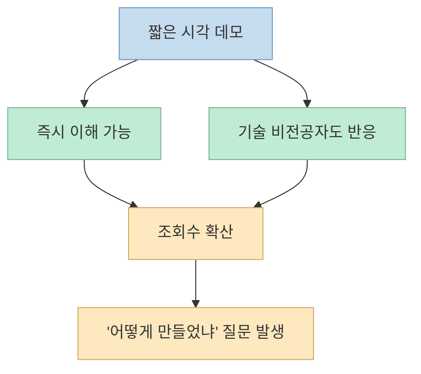
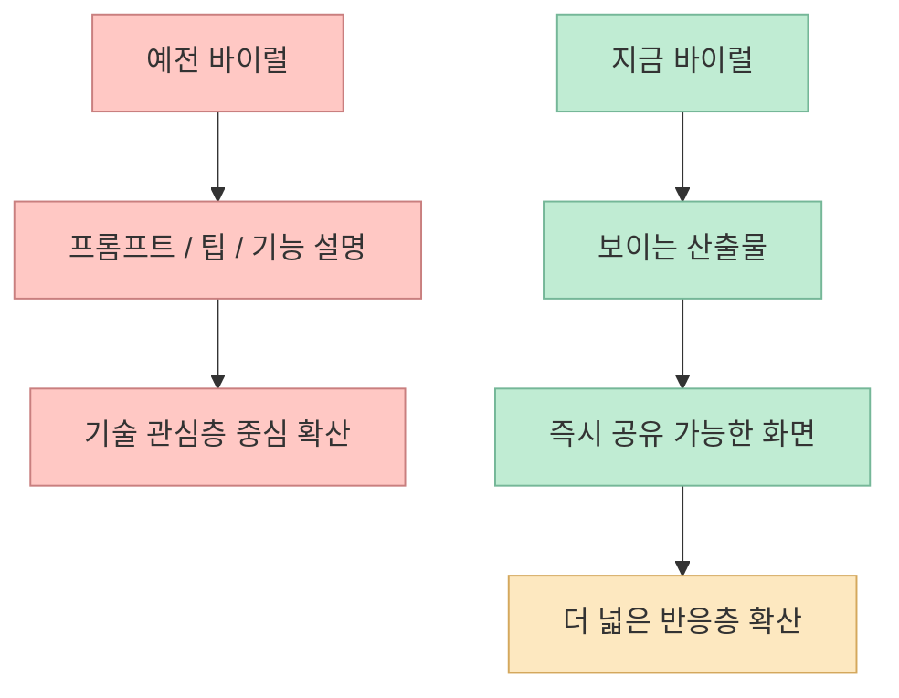

이번 Threads 공유 링크는 긴 설명이 아니라 거의 **반응 자체가 콘텐츠가 된 사례** 에 가깝습니다. 
공개 스레드로 확인되는 사실은 두 가지입니다. 첫째, `@ai_tusol`은 2026년 7월 24일경 **"못하는게 뭐야 클로드!!!!!!!"** 라는 짧은 데모성 포스트를 올렸고, 공개 미리보기 기준 **77.9K views** 를 기록했습니다. 둘째, 2026년 7월 27일 후속 글에서는 이걸 **"7만명이 관심가져준 이 홈페이지"** 라고 다시 부르며, 어떻게 만들었는지 이야기하려는 흐름을 시작했습니다. <https://www.threads.com/share/_mrVt6D-4/> <https://www.threads.com/@ai_tusol/post/DbKVxzljuR3> <https://www.threads.com/@ai_tusol/post/DbSXERbDyha>

중요한 건 여기서 아직 **정확한 구현 스택은 공개되지 않았다** 는 점입니다. 
그래서 이 글은 "이걸 Claude가 어떻게 만들었는지"를 단정하지 않습니다. 대신 공개 스레드로 확인 가능한 반응과, Claude Code 공식 Artifacts 문서를 바탕으로 **왜 이런 시각적 데모가 큰 반응을 얻는지** 를 정리합니다. <https://code.claude.com/docs/en/artifacts>

<!--more-->

## Sources

- <https://www.threads.com/share/_mrVt6D-4/>
- <https://www.threads.com/@ai_tusol/post/DbSXERbDyha>
- <https://www.threads.com/@ai_tusol/post/DbKVxzljuR3>
- <https://code.claude.com/docs/en/artifacts>

## 1. 공개 스레드로 확인되는 사실: 짧은 데모 하나가 반응을 압도했다

우선 확실히 말할 수 있는 것부터 정리해 보겠습니다.

공개 Threads 미리보기 기준으로:

- 2026년 7월 24일경 `@ai_tusol`은 **"못하는게 뭐야 클로드!!!!!!!"** 라는 포스트를 올렸습니다.
- 이 포스트는 공개 미리보기에서 **77.9K views** 로 표시됩니다.
- 2026년 7월 27일 후속 포스트에서는 **"7만명이 관심가져준 이 홈페이지 어떻게 만들었냐면요"** 라는 문장으로 같은 작업물을 다시 언급합니다.

즉, 공개적으로 확인되는 최소 사실만 놓고 봐도 이건:

- 긴 튜토리얼도 아니고
- 구현 후기 스레드도 아니며
- 복잡한 아키텍처 설명도 아닌

**짧고 강한 시각적 결과물** 이 먼저 퍼진 케이스입니다. <https://www.threads.com/@ai_tusol/post/DbKVxzljuR3> <https://www.threads.com/@ai_tusol/post/DbSXERbDyha>

댓글과 반응도 이 점을 뒷받침합니다.

- "이걸 진짜 클로드가 만들었어요?"
- "내 프론트는 왜케 구리지"
- "나는 방금 내 직업을 잃었다"
- "선거 개표방송미 있네"

같은 반응이 붙어 있습니다. 이는 사용자가 구현 세부보다 **결과물의 시각적 완성도와 즉시성** 에 먼저 반응했다는 뜻입니다. <https://www.threads.com/@ai_tusol/post/DbKVxzljuR3>

이 단계에서 중요한 건, 기술적으로 무엇을 썼는지보다 **무엇을 느끼게 했는가** 입니다.

## 2. 왜 이런 결과물이 퍼지는가: 텍스트보다 '보이는 산출물'이 훨씬 강하기 때문이다

Claude Code 공식 Artifacts 문서는 이 현상을 꽤 잘 설명해 줍니다. 
공식 문서에 따르면 artifact는 Claude Code 세션에서 만들어 공개 가능한 **live, interactive web page** 입니다. 그리고 Anthropic은 artifact를 써야 하는 경우를 "terminal text가 잘못된 매체일 때"라고 설명합니다. 즉 텍스트로 길게 읽는 것보다, **페이지로 보는 편이 더 빠르게 이해되는 결과물** 을 위해 존재하는 기능입니다. <https://code.claude.com/docs/en/artifacts>

이 관점에서 보면, 이번 Threads 포스트가 큰 반응을 얻은 이유도 비슷합니다.

사람들은 대체로:

- "이 프롬프트가 어땠는지"
- "어떤 루프로 고쳤는지"
- "컴포넌트 구조가 어떤지"

보다

- "와, 이게 지금 AI로 나온 거야?"
- "내가 바로 써보고 싶다"
- "이 정도 퀄리티가 정말 몇 분 만에 나오는 거야?"

에 먼저 반응합니다.

Artifacts 문서가 말하는 핵심도 같습니다. 텍스트로 설명하면 몇 문단이 필요한 것을 **한 페이지가 즉시 전달할 수 있다** 는 것입니다. <https://code.claude.com/docs/en/artifacts>

## 3. 이 사례가 보여주는 것: 이제 바이럴 포인트는 '설명'보다 '표면 품질' 이다

이 포스트는 기술 튜토리얼로 퍼진 게 아닙니다. 
오히려 "겉으로 보이는 산출물의 퀄리티"가 곧 메시지가 된 사례입니다.

특히 반응들을 보면 사람들이 감탄한 건 기능 목록이 아닙니다.

- 홈페이지처럼 보이는 화면
- 영상처럼 소비되는 움직임
- 프론트엔드 결과물의 밀도
- 사람이 만든 것처럼 느껴지는 완성도

입니다.

즉 바이럴 포인트가 바뀌고 있습니다.

예전에는:

- "이 프롬프트 공유합니다"
- "이 워크플로가 신기합니다"
- "이 모델이 더 똑똑합니다"

가 중심이었다면,

이제는:

- "결과물이 바로 소비된다"
- "스크린샷 한 장으로 성능이 전달된다"
- "짧은 영상 한 개가 전체 설명을 대신한다"

가 더 강하게 작동합니다.

이번 스레드는 이 변화가 꽤 선명하게 드러난 예시입니다.

## 4. 구현 세부보다 중요한 질문: 왜 '홈페이지 같은 한 장면' 이 설득력이 큰가

공식 Artifacts 문서는 artifact가 **single HTML page** 라고 설명합니다. 즉 복잡한 백엔드 애플리케이션이 아니라도, HTML·CSS·inline JavaScript만으로도 충분히 "보여 줄 가치가 있는 산출물"을 만들 수 있다는 뜻입니다. <https://code.claude.com/docs/en/artifacts>

이건 실무적으로 꽤 중요합니다.

왜냐하면 사람들의 인식은 종종 이렇게 움직이기 때문입니다.

- 실제 복잡도보다 **겉보기 복잡도**
- 내부 아키텍처보다 **즉시 전달력**
- 코드 양보다 **시각적 밀도**

에 더 빨리 반응합니다.

그래서 "홈페이지 한 장"은 생각보다 강한 매체입니다.

그 안에:

- 타이포그래피
- 레이아웃
- 애니메이션
- 시각적 리듬
- 정보 계층

이 동시에 들어가고, 사람은 그걸 몇 초 안에 읽어 버립니다.

즉 이번 사례는 단순히 "Claude가 뭘 만들었다"가 아니라, 
**AI 산출물의 평가 기준이 점점 코드 설명에서 시각적 전달력으로 이동하고 있다** 는 신호로도 읽을 수 있습니다.

## 5. 이 사례를 너무 과장하면 안 되는 이유: 아직 확인되지 않은 것도 많다

여기서 조심해야 할 점도 분명합니다.

현재 공개 스레드만으로는 다음을 확정할 수 없습니다.

- 정확히 Claude Code만 사용했는지
- 별도 디자인 툴이나 영상 툴이 섞였는지
- 단일 HTML/Artifact였는지
- 이후 수작업 편집이 있었는지
- 어떤 프롬프트나 워크플로를 썼는지

댓글 중에는 "줄바꿈이 불편하다", "클로드는 이미지 생성을 못하는데 영상은 어떻게 했냐" 같은 질문도 보입니다. 이는 오히려 공개 시점 기준으로 **구현 설명이 아직 충분히 열리지 않았다** 는 뜻입니다. <https://www.threads.com/@ai_tusol/post/DbKVxzljuR3>

따라서 이번 글의 핵심은:

- "이걸 이렇게 만들었다"는 재현 가이드가 아니라
- "왜 이런 결과물이 사람들을 멈춰 세우는가"에 대한 해석

입니다.

## 6. 실전적으로 얻을 수 있는 교훈: 앞으로는 '보이는 데모'가 곧 포트폴리오다

이 스레드가 주는 가장 현실적인 교훈은 이것입니다.

AI 시대에는 설명보다 **즉시 체감 가능한 데모** 가 훨씬 강합니다.

특히 Claude Code나 유사한 에이전트 도구를 쓰는 사람에게는:

- 긴 결과 보고서보다
- 짧고 완성도 있는 단일 웹 데모가
- 더 빠르게 실력을 증명하고
- 더 넓게 공유되며
- 더 많은 후속 질문을 유도합니다.

Artifacts 문서가 말하는 "terminal text가 wrong medium일 때 페이지를 써라"는 조언은 단순 UX 팁이 아니라, 사실상 **현대 AI 결과물 포장 전략** 에 가깝습니다. <https://code.claude.com/docs/en/artifacts>

즉 앞으로 중요한 질문은:

- "무슨 모델을 썼나?"만이 아니라
- "그 결과를 사람들이 3초 안에 이해하게 만들었나?"

가 됩니다.

## 핵심 요약

- 공개 스레드로 확인되는 사실은 `@ai_tusol`의 짧은 Claude 데모성 포스트가 2026년 7월 24일경 77.9K 조회를 기록했고, 7월 27일 후속 글에서 7만 명이 관심을 보인 홈페이지라고 다시 언급됐다는 점이다.
- 현재 공개 자료만으로는 정확한 구현 스택을 단정할 수 없으므로, 이 사례는 재현 가이드보다 **반응 구조 분석** 으로 보는 편이 안전하다.
- Claude Code Artifacts 공식 문서는 텍스트보다 페이지가 더 적합한 산출물 유형을 분명히 설명하며, 이는 이번 사례가 강하게 퍼진 이유와 맞물린다.
- 사람들이 반응한 것은 내부 코드보다 **즉시 소비 가능한 시각적 완성도** 였다.
- 앞으로 AI 작업물의 설득력은 설명 길이보다 **보이는 데모의 밀도와 전달 속도** 에 더 크게 좌우될 가능성이 높다.

## 결론

이번 Threads 사례는 "Claude가 뭘 어디까지 만들었는가" 못지않게, **AI 결과물이 어떤 형식으로 보여질 때 가장 강하게 퍼지는가** 를 잘 보여줍니다. 
짧은 데모, 시각적 완성도, 즉시 이해 가능한 화면. 이 세 가지가 결합하면 긴 설명보다 훨씬 강한 반응을 만들 수 있습니다.

그래서 앞으로는 단순히 잘 만드는 것만으로는 부족할 수 있습니다. 
**잘 보이게 만드는 것**, 그리고 **3초 안에 가치를 전달하는 데모로 압축하는 것** 이 점점 더 중요한 역량이 될 가능성이 큽니다.
