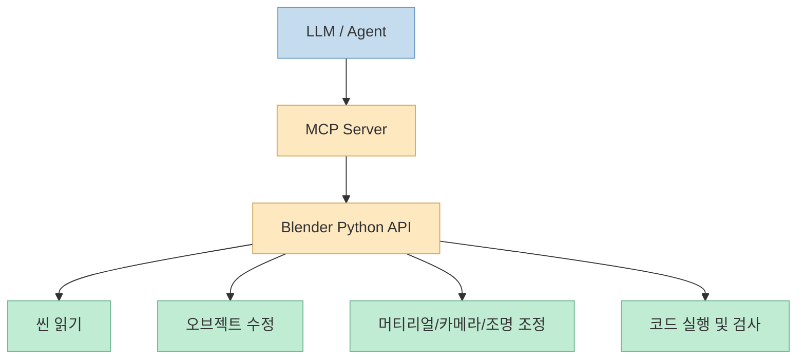
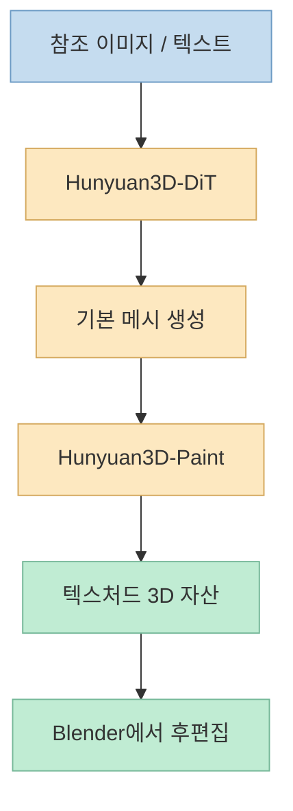
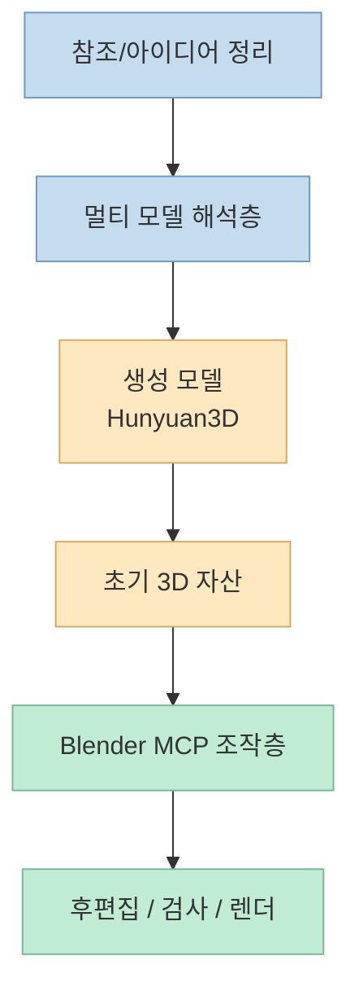

이번 X 포스트는 아주 짧지만, 요즘 3D 워크플로가 어떻게 바뀌고 있는지를 압축해서 보여줍니다. 
중국어 본문을 그대로 옮기면 대략 이런 뜻입니다. **"누군가 Blender에 MCP를 연결해 2주 정도 만져 봤더니, AI가 거의 어떤 3D 모델이든 구축하는 데 도움을 줄 수 있다는 걸 발견했다. 그 사람은 Blender, Tencent Hunyuan3D, Gemini, ChatGPT를 써서 건담 모델을 만들었다."** <https://x.com/i/status/2081648617157525854>

포스트 자체는 소개 수준이라 구현 세부를 다 공개하지는 않습니다. 
하지만 공식 문서들을 붙여 보면 이 조합의 역할은 꽤 자연스럽게 해석됩니다. **Blender MCP는 3D 툴을 제어하는 인터페이스**, **Hunyuan3D는 이미지/텍스트 조건에서 메시와 텍스처를 만드는 3D 생성기**, 그리고 **Gemini·ChatGPT 같은 다중 모델은 계획·분석·참조 해석 같은 바깥층을 분담하는 보조 두뇌** 로 보는 것이 가장 합리적입니다. <https://www.blender.org/lab/mcp-server/> <https://github.com/Tencent-Hunyuan/Hunyuan3D-2> <https://github.com/ahujasid/blender-mcp>

<!--more-->

## Sources

- <https://x.com/i/status/2081648617157525854>
- <https://www.blender.org/lab/mcp-server/>
- <https://github.com/Tencent-Hunyuan/Hunyuan3D-2>
- <https://github.com/ahujasid/blender-mcp>

## 1. X 포스트가 실제로 말하는 것: Blender MCP + Hunyuan3D + 멀티 모델 조합

우선 X 본문에서 직접 확인되는 사실은 많지 않지만 핵심은 분명합니다.

- Blender에 MCP를 연결했다.
- 약 2주간 이 흐름을 탐색했다.
- AI가 거의 어떤 3D 모델이든 만드는 데 도움을 줄 수 있다고 느꼈다.
- 실제 예시로는 건담 모델을 만들었다.
- 사용된 툴로는 Blender, Tencent Hunyuan3D, Gemini, ChatGPT가 언급된다.

이건 단일 모델 데모가 아니라 **도구 조합 데모** 입니다. 
즉 "어떤 모델이 제일 똑똑하냐"보다, **어떤 생성기와 어떤 편집기와 어떤 에이전트 인터페이스를 엮었느냐** 가 더 중요하다는 뜻입니다. <https://x.com/i/status/2081648617157525854>

다만 여기서 조심할 점도 있습니다. 
X 포스트는 소개형 문장이라서:

- 각 모델이 정확히 무슨 역할을 맡았는지
- 건담의 어느 단계가 자동 생성이고 어느 단계가 수작업인지
- Blender 내부 편집을 얼마나 깊게 시켰는지

까지는 드러나지 않습니다. 따라서 이 글에서는 **직접 확인되는 사실** 과 **공식 문서 기반의 합리적 추론** 을 구분해서 설명하겠습니다.

## 2. Blender MCP의 역할: "생성"이 아니라 "조작과 검사"의 인터페이스

Blender MCP를 이해할 때 가장 중요한 건, 이건 3D 생성 모델이 아니라 **Blender를 LLM이 다룰 수 있게 해 주는 연결층** 이라는 점입니다.

Blender 공식 MCP Server 소개 페이지는 이를 **"Blender의 Python API에 대한 자연어 인터페이스"** 라고 설명합니다. 그리고 문서 탐색, 복잡한 셋업 이해, 씬 분석 같은 활용을 강조합니다. 즉 Blender MCP의 본질은 "모델을 알아서 그린다"가 아니라, **Blender라는 거대한 제작 툴을 LLM이 탐색하고 조작할 수 있게 만드는 것** 입니다. <https://www.blender.org/lab/mcp-server/>

공개 저장소 `ahujasid/blender-mcp`도 비슷한 방향을 보여 줍니다. 이 프로젝트는:

- 씬과 오브젝트 정보 읽기
- 오브젝트 생성/수정/삭제
- 머티리얼 적용
- Blender 안에서 Python 코드 실행
- Poly Haven 자산 다운로드
- Hyper3D나 Hunyuan3D 같은 외부 생성기 연결

을 기능으로 내세웁니다. 즉 MCP는 3D 생성기의 대체재가 아니라 **생성기에서 나온 자산을 실제 DCC 툴(Blender) 안으로 가져와 수정·배치·검사·렌더링하는 운영 계층** 입니다. <https://github.com/ahujasid/blender-mcp>

즉 Blender MCP는 **3D 생성기** 가 아니라 **3D 편집기의 제어 인터페이스** 입니다.

## 3. Hunyuan3D의 역할: 메시와 텍스처를 빠르게 만드는 생성기

Tencent Hunyuan3D-2 공식 저장소를 보면, 이 시스템의 역할은 꽤 명확합니다. 
Hunyuan3D 2.0은 고해상도 텍스처드 3D 자산 생성을 위한 시스템이고, 구조적으로는:

- **shape generation model**: Hunyuan3D-DiT
- **texture synthesis model**: Hunyuan3D-Paint

두 축으로 나뉩니다. 저장소는 이를 **2-stage generation pipeline** 으로 설명하며, 먼저 bare mesh를 만들고 그다음 texture map을 합성한다고 적고 있습니다. <https://github.com/Tencent-Hunyuan/Hunyuan3D-2>

즉 Hunyuan3D의 강점은:

- 텍스트/이미지 조건에서 초기 메시를 빠르게 얻고
- 거기에 텍스처를 합성하고
- Blender나 다른 툴로 가져갈 수 있는 형태로 뽑아내는 것

입니다.

공식 저장소는 또:

- 로컬 코드 실행
- Gradio 앱
- API 서버
- Blender Addon
- 공식 사이트

같은 진입점을 모두 제공합니다. 특히 **API Server** 와 **Blender Addon** 이 있다는 것은, 이 생성기가 단순 연구 모델이 아니라 실제 제작 파이프라인 안에 끼워 넣기 쉬운 구조로 설계됐다는 뜻입니다. <https://github.com/Tencent-Hunyuan/Hunyuan3D-2>

그래서 X 포스트에서 Blender와 Hunyuan3D가 같이 언급된 것은 자연스럽습니다. 
**Hunyuan3D가 "초기 3D 자산 생성"을 맡고, Blender MCP가 "그 자산을 실제 작업물로 다듬는 조작 인터페이스"를 맡는 구조** 로 읽는 것이 가장 합리적입니다.

## 4. 건담 모델 같은 결과물이 나오는 이유: 생성과 편집을 분리했기 때문이다

3D에서 가장 비싼 단계는 종종 "맨땅에서 전부 수작업" 하는 구간입니다. 
특히 건담처럼:

- 부품이 많고
- 대칭 구조가 많고
- 실루엣은 분명하지만 세부 기계 디테일도 필요한

대상은 초기 블로킹과 세부 편집의 부담이 모두 큽니다.

이때 AI 기반 파이프라인이 강한 이유는, 전체 작업을 한 번에 해결하려 하지 않고 **생성과 편집을 분리** 하기 때문입니다.

가능한 흐름을 보수적으로 재구성하면 대략 이렇습니다.

1. ChatGPT나 Gemini로 참조 구조, 파츠 설명, 프롬프트/이미지 전략 정리
2. Hunyuan3D로 초기 메시 또는 텍스처드 자산 생성
3. Blender로 가져오기
4. MCP를 통해 Blender 안에서 오브젝트 정리, 메시 조정, 시점/카메라/재질 수정
5. 필요 시 다시 생성기로 돌아가거나 Blender에서 수동 보정

이 방식은 "AI가 모든 걸 완벽하게 해 준다"와는 다릅니다. 
오히려 **AI가 가장 느린 초기 자산 생성과 반복 조작을 줄여 주고, Blender가 최종 품질 통제를 맡는 구조** 입니다.

영상 프레임을 보면 실제로 Blender 뷰포트 안에서 건담 형태의 모델이 로드되어 있고, 와이어프레임 수준까지 들여다보며 일부 파츠를 선택하는 장면이 보입니다. 이건 적어도 **최종 산출물이 Blender 안에서 후편집되고 있었다** 는 근거로 볼 수 있습니다. 이 부분은 영상 프레임 기반 관찰입니다.

## 5. 왜 Gemini와 ChatGPT까지 같이 쓰는가: 3D 파이프라인은 단일 모델보다 역할 분담이 잘 맞는다

X 본문은 Blender와 Hunyuan3D 외에도 Gemini와 ChatGPT를 함께 언급합니다. 
정확한 배치는 공개되지 않았지만, 멀티 모델 조합이 자연스러운 이유는 분명합니다.

3D 작업은 한 종류의 지능만으로 잘 안 풀립니다.

- 참조 이미지 해석
- 파츠 구조 설명
- 프롬프트 개선
- 단계 분해
- Blender 조작 코드 생성
- 결과 확인과 반복 수정

이 서로 다른 작업은 각기 강한 모델이 다를 수 있습니다.

예를 들어 일반적으로는:

- 이미지/시각 참조 해석은 Gemini류가 강할 수 있고
- 대화형 프롬프트 재구성은 ChatGPT가 편할 수 있으며
- 실제 툴 제어와 코드 기반 조작은 Claude/에이전트 계열이 편할 수 있습니다.

물론 이번 포스트에서 그 역할 분담을 단정할 수는 없습니다. 
하지만 **3D 파이프라인은 멀티 모델 오케스트레이션이 특히 잘 맞는 영역** 이라는 해석은 충분히 설득력 있습니다.

핵심은, 한 모델이 전 과정을 책임지는 게 아니라 **계획층, 생성층, 편집층이 분리** 된다는 점입니다.

## 6. 하지만 장점만 있는 건 아니다: 보안과 신뢰성 이슈도 크다

이 조합은 강력하지만, 공식 문서를 읽으면 리스크도 명확합니다.

Blender 공식 MCP Server 페이지는 아주 강한 보안 경고를 붙입니다. LLM이 생성한 코드를 Blender 안에서 **가드 없이 실행할 수 있으므로**, 데이터 삭제나 외부 전송 같은 위험이 있고, 민감한 데이터가 없는 시스템이나 VM 사용을 권장합니다. <https://www.blender.org/lab/mcp-server/>

또 `ahujasid/blender-mcp` 저장소도 비슷하게:

- arbitrary Python code execution 가능
- 복잡한 작업은 작은 단계로 나누는 편이 안전
- 프로덕션 환경에서는 주의 필요

를 분명히 적습니다. <https://github.com/ahujasid/blender-mcp>

즉 Blender MCP는 "AI가 Blender를 알아서 잘 다룬다"는 마법이 아니라, 
**매우 강한 권한을 가진 자동화 인터페이스** 입니다.

여기에 Hunyuan3D 같은 생성기를 얹으면 속도는 빨라지지만, 동시에:

- 잘못된 메시 구조
- 엉뚱한 텍스처
- 과도한 폴리곤
- Blender 코드 실행 리스크

같은 문제가 따라옵니다.

그래서 이 워크플로의 핵심은 단순 자동화가 아니라 **검사 가능한 자동화** 여야 합니다.

## 핵심 요약

- 이번 X 포스트는 Blender MCP, Tencent Hunyuan3D, Gemini, ChatGPT를 조합해 건담 3D 모델을 만든 워크플로를 짧게 소개한다.
- 공식 문서를 보면 Blender MCP의 본질은 3D 생성기가 아니라 **Blender 제어 인터페이스** 이고, Hunyuan3D의 본질은 **메시와 텍스처 생성기** 다.
- 두 도구를 합치면 "초기 자산 생성"과 "실제 툴 안에서의 후편집"을 분리할 수 있어 3D 작업 속도가 빨라진다.
- Gemini와 ChatGPT 같은 다중 모델 언급은 계획·참조 해석·프롬프트 개선 같은 바깥층 분업이 들어갔을 가능성을 시사한다.
- 다만 공개 포스트만으로 각 모델의 정확한 역할은 단정할 수 없고, Blender MCP는 코드 실행형 인터페이스라 보안상 매우 강한 주의가 필요하다.

## 결론

이번 사례가 흥미로운 이유는 "AI가 건담을 만들었다"는 자극적인 표면보다, **3D 제작 파이프라인이 생성기와 편집기와 에이전트 인터페이스의 조합으로 재구성되고 있다** 는 점을 보여 주기 때문입니다.

이제 3D 작업에서 중요한 질문은 "어떤 모델이 최고냐" 하나가 아닙니다. 
오히려 **어떤 생성기로 초기 자산을 뽑고, 어떤 MCP 인터페이스로 Blender를 조작하며, 어떤 모델에게 어떤 단계의 판단을 맡길 것인가** 가 더 중요해지고 있습니다. 
바로 그 조합의 감각이, 앞으로 3D AI 워크플로의 생산성을 가를 가능성이 큽니다.
