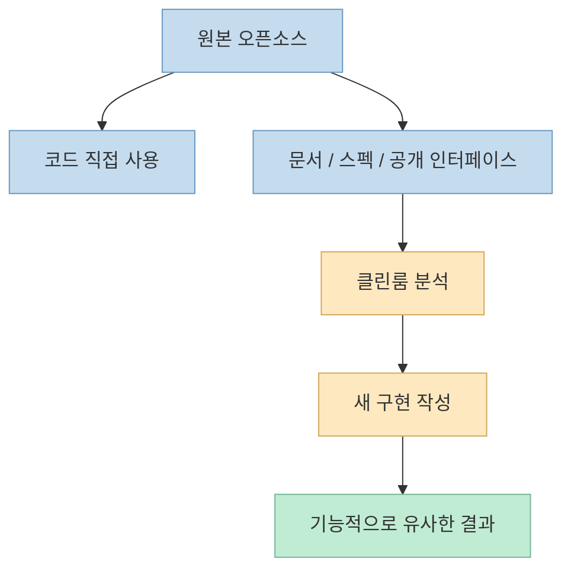
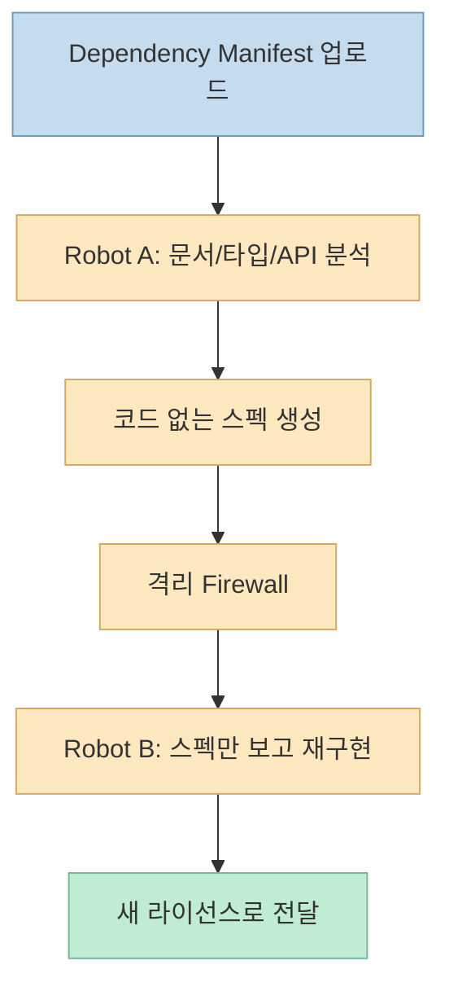
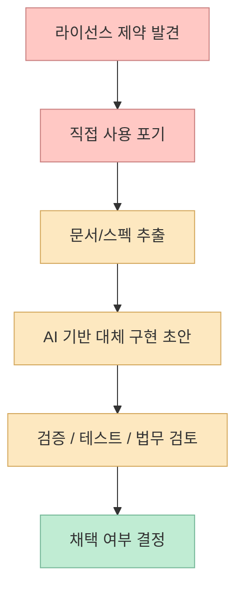

이 쇼츠가 말하는 핵심은 서비스 추천이 아닙니다. 
영상의 제목은 **"오픈소스 라이선스를 없애버리는 클린룸 기법 아시나요? malus.sh"** 이지만, 실제 메시지는 **클린룸(clean room) 재구현이라는 개념을 알아두라** 는 쪽에 가깝습니다. 발표자는 `malus.sh`를 예시로 들면서, AI 에이전트가 원본 코드를 보지 않고 공식 문서와 스펙만으로 기능적으로 유사한 구현을 다시 만들면 라이선스 리스크를 줄일 수 있다는 발상을 설명합니다. 다만 본인도 영상 말미에 **"정확히 제대로 잘 동작하는지 모르겠다"** 고 선을 긋습니다. <https://youtu.be/5hjMxHksHGQ?t=0>

이건 중요한 태도입니다. 
왜냐하면 `malus.sh`는 단순 제품 페이지가 아니라, 공개적으로도 **풍자(satire)적 톤이 매우 강한 사례** 로 받아들여졌기 때문입니다. Simon Willison은 이 사이트를 "vibe-porting license washing"에 대한 **brutal satire** 라고 불렀고, 404 Media는 이 서비스가 **풍자이면서도 실제로 동작한다** 고 보도했습니다. 따라서 이 주제는 "요즘 AI로 이런 편법이 가능하다더라" 수준의 가벼운 팁이 아니라, **기술·라이선스·윤리 문제가 같이 걸린 논쟁적 영역** 으로 봐야 합니다. <https://simonwillison.net/2026/Mar/12/malus/> <https://www.404media.co/this-ai-tool-rips-off-open-source-software-without-violating-copyright/>

<!--more-->

## Sources

- <https://youtube.com/shorts/5hjMxHksHGQ?si=SE0su41dkU6I9NTa>
- <https://malus.sh/>
- <https://malus.sh/blog.html>
- <https://simonwillison.net/2026/Mar/12/malus/>
- <https://www.404media.co/this-ai-tool-rips-off-open-source-software-without-violating-copyright/>

## 1. 영상이 실제로 말하는 것: `malus.sh`보다 중요한 것은 "클린룸" 이라는 개념이다

자막을 그대로 따라가면 발표자의 요지는 꽤 명확합니다.

- 오픈소스는 무조건 가져다 쓰면 안 된다
- 라이선스는 꼭 확인해야 한다
- GPL, AGPL 같은 라이선스는 downstream 의무를 만들 수 있다
- 그래서 AI 시대에는 "클린룸 재구현"이라는 선택지가 생겼다

특히 발표자는 **AI 에이전트가 대상 오픈소스의 코드를 절대로 보면 안 되고, 문서와 스펙만으로 동일 기능을 재창조해야 한다** 는 점을 여러 번 강조합니다. 즉 이 영상은 법률 해설이라기보다, **원본 코드 접근을 차단한 상태에서 기능적 동등물을 다시 만드는 개발 프로세스** 를 설명하고 있습니다. <https://youtu.be/5hjMxHksHGQ?t=31> <https://youtu.be/5hjMxHksHGQ?t=56>

여기서 핵심은 "라이선스를 지운다"는 말이 마치 마법처럼 들리지만, 실제로는:

- 코드 재사용이 아니라
- 문서/스펙 기반 분석
- 별도 구현
- 기능적 동등성 확보

라는 **개발 프로세스** 를 가리킨다는 점입니다.

그래서 이 영상을 "malus.sh 써라"로 읽으면 오해이고, **AI 시대에는 클린룸 구현이 다시 실용적인 옵션으로 떠오른다** 는 문제제기로 읽는 편이 맞습니다.

## 2. `malus.sh`는 무엇을 주장하나: 문서만 읽고 새 코드로 다시 만든다는 이야기

`malus.sh` 메인 페이지는 대단히 노골적인 표현을 씁니다. 
스스로를 **"Clean Room as a Service"** 라고 부르고, "open source license obligations"로부터 해방시켜 준다고 주장합니다. 메인 페이지 설명에 따르면 그들의 AI 시스템은 원본 소스코드를 보지 않고 **documentation, API specs, public interfaces** 만 분석해 기능적으로 동등한 소프트웨어를 다시 만든다고 합니다. <https://malus.sh/>

블로그 글은 이 프로세스를 좀 더 자세히 설명합니다.

- 사용자가 `package.json`, `requirements.txt`, `Cargo.toml` 같은 manifest를 올리면
- 첫 번째 AI 에이전트 집합이 공개 문서와 타입 정의를 읽고
- 코드 없는 상세 스펙을 만든 뒤
- 완전히 분리된 두 번째 AI 집합이 그 스펙만 보고 새 구현을 만든다고 적습니다

즉 이들이 말하는 구조는 전통적인 clean room engineering을 AI 버전으로 자동화한 것입니다. <https://malus.sh/blog.html>

이 발상 자체는 완전히 새로운 건 아닙니다. 
핵심적으로 새로운 부분은 **이 과정을 AI 에이전트로 대규모 자동화하려 한다** 는 점입니다.

## 3. 왜 AI 시대에 이 개념이 다시 뜨는가: 클린룸 비용이 급격히 낮아졌기 때문이다

전통적 클린룸은 원래 비용이 많이 드는 작업이었습니다.

- 한 팀이 문서만 읽고 스펙을 정리하고
- 다른 팀이 원본 코드와 분리된 상태에서 구현하며
- 그 분리와 독립성을 입증해야 했기 때문입니다

그래서 이론상 가능해도, 실제 현업에서는 느리고 비쌌습니다.

그런데 AI 시대에는 이 비용 구조가 바뀝니다.

- 문서 읽기와 스펙 정리
- API surface 요약
- 인터페이스 유도
- 테스트 케이스 초안 생성
- 대체 구현 초안 작성

같은 노동 집약적인 단계를 에이전트가 크게 줄일 수 있기 때문입니다.

ZeroCho 영상도 바로 이 점을 강조합니다. 요즘 AI 에이전트가 충분히 똑똑해졌기 때문에, 라이선스 때문에 못 쓰는 오픈소스가 있다면 **클린룸이라는 전략을 옵션으로 갖고 있으라** 는 식으로 말합니다. <https://youtu.be/5hjMxHksHGQ?t=97>

즉 AI가 만든 변화는 "클린룸이 갑자기 합법이 됐다"가 아니라, **클린룸의 실행 비용이 내려갔다** 는 데 더 가깝습니다.

## 4. 하지만 `malus.sh`는 왜 논쟁적인가: 법적·윤리적 선을 동시에 건드리기 때문이다

이 지점부터는 기술보다 맥락이 더 중요합니다.

Simon Willison은 `malus.sh`를 보고 "농담인지 확인하는 데 잠깐 걸렸다. 너무 노골적이다"라고 적었습니다. 즉 사이트 자체가:

- attribution을 귀찮은 것으로 묘사하고
- copyleft를 "contamination"처럼 말하고
- maintainers에게 credit을 주지 않는 태도를 과장해 드러내며

매우 풍자적인 어조를 씁니다. <https://simonwillison.net/2026/Mar/12/malus/>

404 Media는 한 걸음 더 나가, 이 사이트가 **풍자이지만 기능적으로도 실제 서비스처럼 운영되고 있다** 고 설명합니다. 즉 이건 단순 농담 사이트가 아니라, 실제로 오픈소스와 AI 재구현의 경계를 밀어붙이는 문제제기라는 것입니다. <https://www.404media.co/this-ai-tool-rips-off-open-source-software-without-violating-copyright/>

여기서 논쟁이 생기는 이유는 두 층입니다.

### 법적 층

- 문서와 스펙만 보고 다시 만든 구현이 정말 충분히 독립적인가?
- API·행동·구조의 유사성이 어디까지 허용되는가?
- jurisdiction마다 clean room 해석이 같은가?

### 윤리적 층

- 법적으로 문제없더라도 공동체 기여를 우회하는 것이 정당한가?
- maintainers의 노동을 "문서만 읽고 복제"하는 것이 어떤 생태계를 만드는가?

즉 기술적으로 가능하다는 것과, **실무에서 안전하게 권할 수 있다** 는 것은 전혀 다른 이야기입니다.

## 5. 영상이 조심스러운 이유도 여기 있다: 이건 '서비스 추천'이 아니라 '전략 옵션' 이다

ZeroCho 영상이 의외로 좋은 점은, `malus.sh`를 과장 추천하지 않는다는 것입니다. 
발표자는:

- 자신도 정확히 잘 동작하는지 모르겠고
- 요금 체계도 독특하며
- 이걸 쓰라고 말하는 게 아니라
- "클린룸이라는 개념을 알아두라"

고 선을 긋습니다. <https://youtu.be/5hjMxHksHGQ?t=79> <https://youtu.be/5hjMxHksHGQ?t=95>

이 태도가 중요한 이유는, 현시점에서 이 주제는 툴 소개보다 **리스크 관리 전략** 에 가깝기 때문입니다.

실무적으로 보면 이 개념은 보통 이런 상황에서 떠오를 수 있습니다.

- 특정 GPL/AGPL 라이브러리를 제품에 직접 포함하기 어렵고
- 하지만 기능적으로 비슷한 구현이 꼭 필요하며
- 공개 문서/사양이 충분하고
- 별도 구현 비용을 감당할 가치가 있을 때

즉 클린룸은 "오픈소스 공짜 탈출 버튼"이 아니라, **규모 있고 민감한 팀이 법무·엔지니어링 비용을 비교하며 검토할 수 있는 우회적 재구현 전략** 으로 보는 편이 맞습니다.

## 6. 기술적으로 봤을 때 진짜 흥미로운 부분: AI가 법무 경계선까지 확장되기 시작했다

이 사례가 정말 흥미로운 이유는 단순히 라이선스 회피 담론 때문이 아닙니다. 
더 본질적으로는 AI 에이전트가 이제:

- 코드 작성
- 테스트 작성
- 문서 분석
- 인터페이스 복원

을 넘어서, **소프트웨어 법무/컴플라이언스 경계와 직접 맞닿는 영역** 까지 들어오고 있다는 점입니다.

전에는 라이선스 문제를 해결하는 방식이 대개:

- 법무 검토
- 대체 라이브러리 탐색
- 직접 클린 구현

같은 느린 인간 중심 절차였습니다.

이제는 AI가:

- 공개 문서를 읽고
- 행동 명세를 추출하고
- 대체 구현 초안을 만들고
- 테스트까지 붙일 수 있기 때문에

라이선스 리스크 대응의 속도 자체가 달라질 수 있습니다.

그래서 이 주제는 단순한 밈이 아니라, 앞으로 OSS 사용 전략과 기업 컴플라이언스 전략을 다시 흔들 수 있는 신호이기도 합니다.

## 핵심 요약

- 영상의 핵심은 `malus.sh` 서비스 추천이 아니라, **클린룸 재구현** 이라는 개념 소개다.
- `malus.sh`는 공개적으로 문서·API·타입 정의만 읽고 별도 AI 집합이 새 구현을 만든다고 주장한다.
- AI 시대에는 이 클린룸 프로세스의 실행 비용이 낮아져, 예전보다 현실적인 옵션처럼 보이기 시작했다.
- 다만 `malus.sh`는 풍자적 성격이 강하고, 외부 보도도 이를 satire이면서 실제로 동작하는 논쟁적 사례로 다룬다.
- 따라서 이 주제는 서비스 사용 팁보다, **오픈소스 라이선스 리스크에 대응하는 AI 기반 재구현 전략이 기술적으로 가능해지고 있다** 는 흐름으로 이해하는 편이 안전하다.

## 결론

이 영상이 흥미로운 이유는 "라이선스를 없앤다"는 자극적인 문구 때문이 아닙니다. 
진짜 중요한 건, AI가 이제 코드 생성뿐 아니라 **문서 기반 재구현과 컴플라이언스 우회 전략** 같은 민감한 영역까지 밀고 들어오고 있다는 점입니다.

그래서 앞으로 중요한 질문은 "이 툴이 되냐 안 되냐"보다, **AI가 가능하게 만든 새 개발 프로세스를 우리 팀은 어디까지 허용하고 어디서 멈출 것인가** 가 될 가능성이 큽니다. 
클린룸은 이제 법무의 언어만이 아니라, AI 에이전트 시대의 실전 개발 전략 언어가 되기 시작하고 있습니다.
