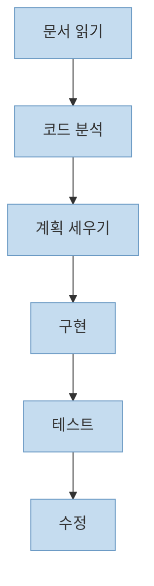
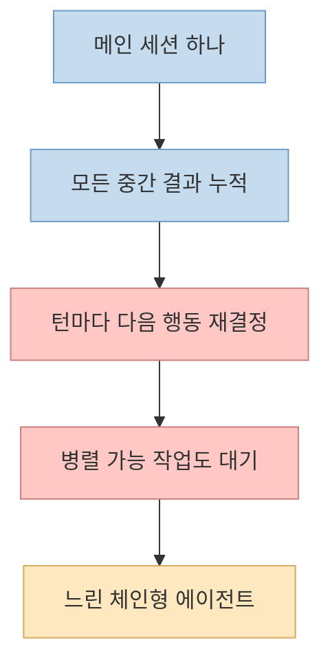
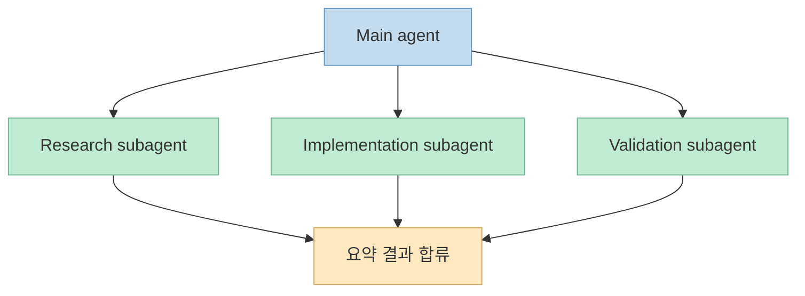

이번 X 포스트는 본문 텍스트 대신 X Article 링크만 올려 둔 형태였지만, 제목과 미리보기만으로도 메시지는 매우 분명합니다. 
제목은 **"Graph Engineering: How to Stop Building AI Agents That Wait in Line"** 이고, 미리보기는 **"agent systems as graphs, not chains"** 라는 표현을 씁니다. 즉 멀티스텝 AI 에이전트의 가장 흔한 실패는 일을 여러 개 시키는 데 있는 것이 아니라, **결국 모든 일을 줄 세워 기다리게 만드는 체인형 구조** 에 있다는 뜻입니다. <https://x.com/i/status/2081603616570212372>

원문 전체는 2026년 7월 28일 현재 X 로그인/접근 제한 때문에 직접 열리지 않았습니다. 
그래도 제목, 미리보기, 그리고 Claude Code 공식 문서의 subagents / workflows 설명을 함께 읽으면 이 글이 겨냥하는 문제는 충분히 해석할 수 있습니다. 핵심은 단순합니다. **한 agent가 한 컨텍스트 안에서 모든 중간 결과를 붙들고 turn-by-turn으로 다음 행동을 결정하는 구조는, 규모가 커질수록 병목이 된다** 는 것입니다. <https://code.claude.com/docs/en/sub-agents> <https://code.claude.com/docs/en/workflows>

<!--more-->

## Sources

- <https://x.com/i/status/2081603616570212372>
- <https://code.claude.com/docs/en/sub-agents>
- <https://code.claude.com/docs/en/workflows>
- <https://code.claude.com/docs/en/overview>

## 1. 제목만으로도 드러나는 문제의식: 많은 에이전트가 사실상 '대기열' 이다

이 글의 제목에서 가장 중요한 단어는 `wait in line` 입니다. 
대부분의 사람은 멀티스텝 agent를 만들 때 이렇게 시작합니다.

1. 문서를 읽어라
2. 코드를 분석해라
3. 계획을 세워라
4. 구현해라
5. 테스트해라
6. 수정해라

언뜻 보면 단계가 많아서 agentic해 보이지만, 실제로는 자주 이런 구조가 됩니다.

- 모든 작업이 한 메인 세션에서 순서대로 처리되고
- 다음 단계는 이전 단계가 끝날 때까지 기다리며
- 독립적인 작업도 병렬화되지 않고
- 중간 산출물은 전부 같은 컨텍스트 창 안에 누적됩니다

이렇게 되면 멀티스텝처럼 보이지만 사실상 **긴 직선형 큐** 에 가깝습니다. 
즉 "일을 여러 개 시킨다"와 "그래프처럼 설계했다"는 전혀 다른 말입니다.

이 구조에서는 각 단계가 반드시 필요해서 기다리는 것이 아니라, **설계가 그렇게 돼 있어서 기다리는 경우** 가 많습니다.

## 2. 왜 체인형 구조가 느려지는가: 병목은 모델 성능보다 orchestration에 있다

Claude Code 공식 workflows 문서는 subagents, skills, agent teams, workflows의 차이를 아주 명확하게 설명합니다. 
그중 핵심은 **누가 다음에 무엇을 실행할지 결정하느냐** 입니다. subagent나 skill에서는 Claude가 turn-by-turn으로 계속 다음 액션을 결정합니다. 반면 workflow는 **스크립트가 loop, branching, intermediate results를 직접 들고** 실행합니다. <https://code.claude.com/docs/en/workflows>

이 차이가 중요한 이유는 체인형 병목이 대부분 여기서 생기기 때문입니다.

체인형 구조에서는:

- Claude가 매 턴마다 다음 행동을 다시 판단해야 하고
- 중간 산출물이 전부 메인 컨텍스트에 들어오며
- 작업 분해보다 대화 순서가 우선되고
- 독립적인 사이드 태스크도 같은 창 안에서 처리됩니다

반면 graph형 orchestration에서는:

- 어떤 작업이 병렬 가능한지 미리 코드로 명시할 수 있고
- 중간 결과는 script variable이나 별도 agent context에 격리되며
- 메인 컨텍스트는 최종 답변 중심으로 유지될 수 있습니다

즉 병목은 단순히 "모델이 느리다"가 아니라, **조정 방식이 매번 대화형이고 일회적이어서 생긴다** 는 것입니다.

그래서 graph engineering은 모델 위에 더 큰 프롬프트를 올리는 기술이 아니라, **기다릴 필요가 없는 작업을 기다리지 않게 만드는 orchestration 기술** 에 가깝습니다.

## 3. subagent가 중요한 이유: '작업'을 역할 단위로 분리할 수 있기 때문이다

Claude Code 공식 subagents 문서는 subagent를 **specific types of tasks를 처리하는 specialized assistant** 로 설명합니다. 각각은:

- own context window
- custom system prompt
- specific tool access
- independent permissions

를 가질 수 있습니다. <https://code.claude.com/docs/en/sub-agents>

이건 graph engineering 관점에서 매우 중요합니다. 
왜냐하면 그래프의 노드를 "Step 1, Step 2" 같은 번호가 아니라 **역할 기반 작업자** 로 만들 수 있기 때문입니다.

예를 들면:

- research agent
- implementation agent
- validation agent
- docs agent

처럼 나눌 수 있습니다.

이렇게 되면 어떤 효과가 생기냐면:

- 사이드 태스크가 메인 컨텍스트를 오염시키지 않고
- 결과는 요약만 메인으로 돌아오며
- 각 역할이 자기 책임과 툴 경계를 가집니다

즉 subagent는 단순히 "에이전트를 더 많이 띄우는 기능"이 아니라, **일을 역할 단위로 분해해 대기열을 끊는 수단** 입니다.

체인형 agent가 "한 사람이 모든 일을 순서대로 다 하는 것"이라면, subagent 기반 graph는 "역할별로 나눠 처리한 뒤 결과만 합치는 것"에 더 가깝습니다.

## 4. workflow가 중요한 이유: 계획을 모델의 머릿속이 아니라 코드로 옮기기 때문이다

공식 workflows 문서는 한 줄로 핵심을 말합니다. 
**A dynamic workflow is a JavaScript script that orchestrates subagents at scale.** <https://code.claude.com/docs/en/workflows>

여기서 중요한 건 "at scale"보다 **script** 입니다.

왜냐하면 workflow는:

- loop를 script가 들고
- branching도 script가 들고
- intermediate result도 script variable이 들고
- Claude의 메인 컨텍스트는 최종 답변 중심으로만 유지되기 때문입니다

공식 문서는 이 차이를 표로도 설명합니다.

- subagent: Claude가 다음 실행 대상을 계속 결정
- workflow: script가 다음 실행 대상을 결정
- intermediate result: Claude context가 아니라 script variable에 보관

즉 graph engineering의 실전 구현은 종종 "더 많은 prompt"가 아니라 **plan을 code로 승격시키는 것** 입니다.

이게 왜 `wait in line` 문제를 줄이냐면, 스크립트는 처음부터:

- 병렬 fan-out
- 조건 분기
- 합류 후 검증
- 실패 시 특정 노드 재시도

를 구조로 표현할 수 있기 때문입니다.

체인에서는 "다음에 뭘 하지?"를 매번 모델이 생각해야 하지만, 
workflow에서는 "다음에 무엇이 가능한가?"가 코드로 이미 적혀 있습니다.

## 5. graph engineering은 '많이 띄우기'가 아니라 '위상 설계' 다

이 주제에서 자주 생기는 오해가 있습니다. 
graph engineering을 단순히 "subagent를 여러 개 쓰는 것"으로 이해하는 것입니다.

하지만 진짜 핵심은 agent 수가 아니라 **topology** 입니다.

질문은 이런 쪽이어야 합니다.

- 어떤 작업은 서로 독립적인가?
- 어떤 작업은 반드시 앞 단계 결과가 필요한가?
- 어떤 결과는 합류 후 검증이 필요한가?
- 어떤 실패는 전체 재시도가 아니라 부분 재시도로 충분한가?

즉 graph engineering은 더 화려한 orchestration이 아니라, **작업의 의존성과 병렬성, 합류점과 되돌림 지점을 설계하는 일** 입니다.

그래서 같은 5개 노드를 써도:

- 직선형 chain이면 느린 대기열이 되고
- 분기/합류가 명시된 graph면 훨씬 다른 시스템이 됩니다

## 6. 이 글이 실제로 시사하는 것: 이제 병목은 모델보다 구조에서 더 자주 온다

Claude Code overview 문서를 보면, Claude Code는 이미:

- terminal
- IDE
- desktop
- web

여러 surface에서 같은 엔진을 공유하고, subagents, workflows, routines, remote control까지 갖춘 플랫폼으로 확장돼 있습니다. <https://code.claude.com/docs/en/overview>

이 말은 곧, 이제 병목이 더 이상 "모델이 기능을 못 한다"보다 **그 기능을 어떤 구조로 묶었느냐** 쪽으로 이동하고 있다는 뜻입니다.

모델이 충분히 좋아지면:

- 한 번의 코드 수정
- 한 번의 분석
- 한 번의 검색

보다

- 그걸 어떤 순서로 묶는지
- 무엇을 동시에 시키는지
- 중간 결과를 어디에 저장하는지
- 어떤 노드가 메인을 더럽히지 않게 분리되는지

가 훨씬 더 중요해집니다.

이번 X Article 제목이 강한 이유도 바로 여기 있습니다. 
문제는 AI가 일을 못해서가 아니라, **우리가 아직도 AI에게 줄을 서게 만들고 있기 때문** 입니다.

## 핵심 요약

- X Article의 제목과 미리보기는 graph engineering의 핵심 문제를 "wait in line"으로 요약한다.
- 많은 멀티스텝 에이전트는 실제로는 그래프가 아니라 긴 직선형 체인이라서 병렬 가능한 작업도 순차 대기하게 만든다.
- Claude Code 공식 문서 기준으로 subagent는 역할 기반 분리를, workflow는 orchestration의 코드화를 가능하게 한다.
- graph engineering의 본질은 agent 수를 늘리는 것이 아니라, 의존성·병렬성·합류·재시도 지점을 설계하는 topology 작업이다.
- 따라서 최신 에이전트 시스템의 병목은 모델 성능보다 구조 설계에서 더 자주 발생한다.

## 결론

이 글이 말하는 "줄 서는 AI 에이전트"는 단순한 비유가 아닙니다. 
실제로 많은 agent 시스템이 병렬화할 수 있는 일을 하나의 메인 세션 안에 가둔 채, 차례대로 처리하게 만들고 있습니다.

그래서 graph engineering은 유행어라기보다, **에이전트가 정말 여러 일을 동시에 처리할 수 있게 만드는 구조 설계** 에 가깝습니다. 
앞으로 중요한 질문은 "모델이 얼마나 똑똑한가?" 하나가 아니라, **우리가 그 모델에게 아직도 줄을 서게 만들고 있지는 않은가?** 가 될 가능성이 큽니다.
