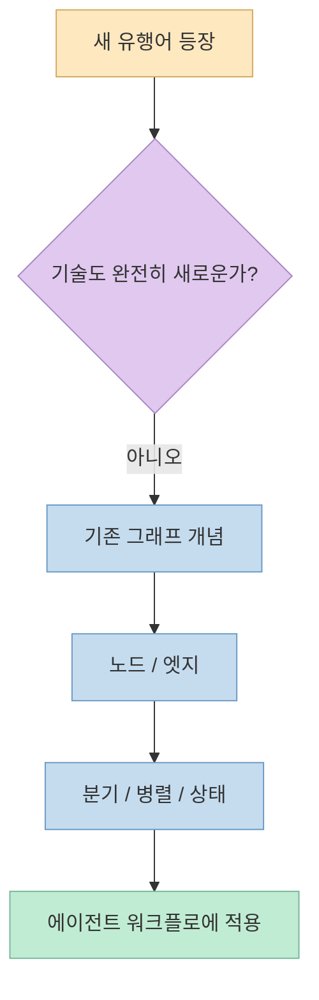
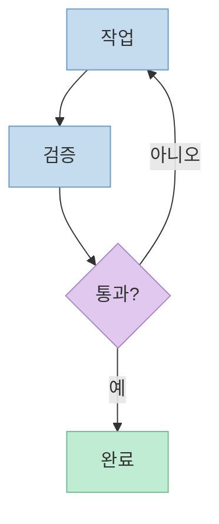
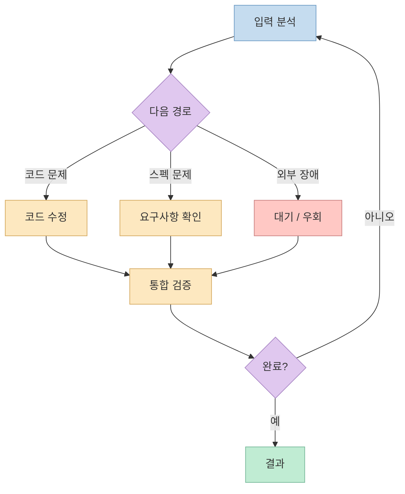
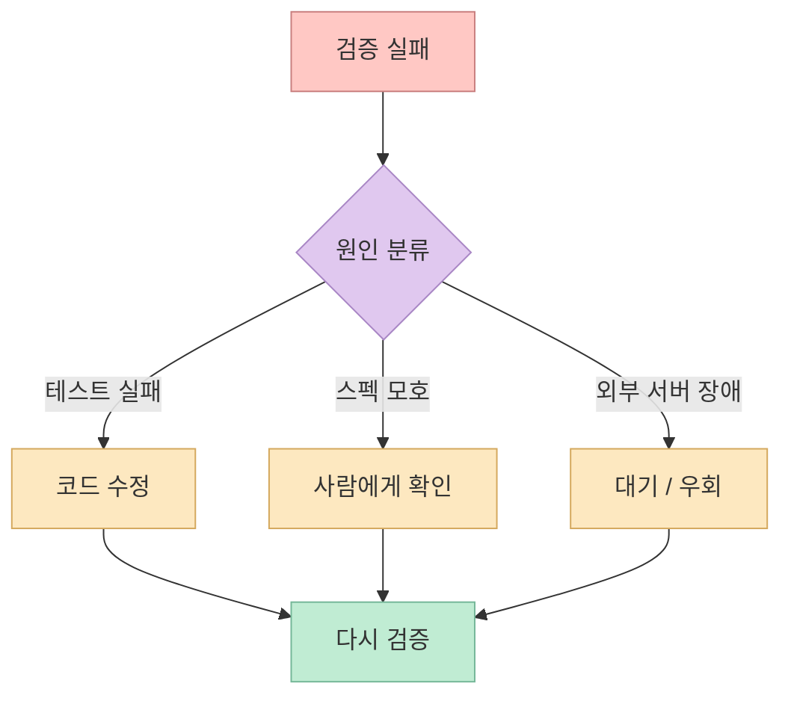
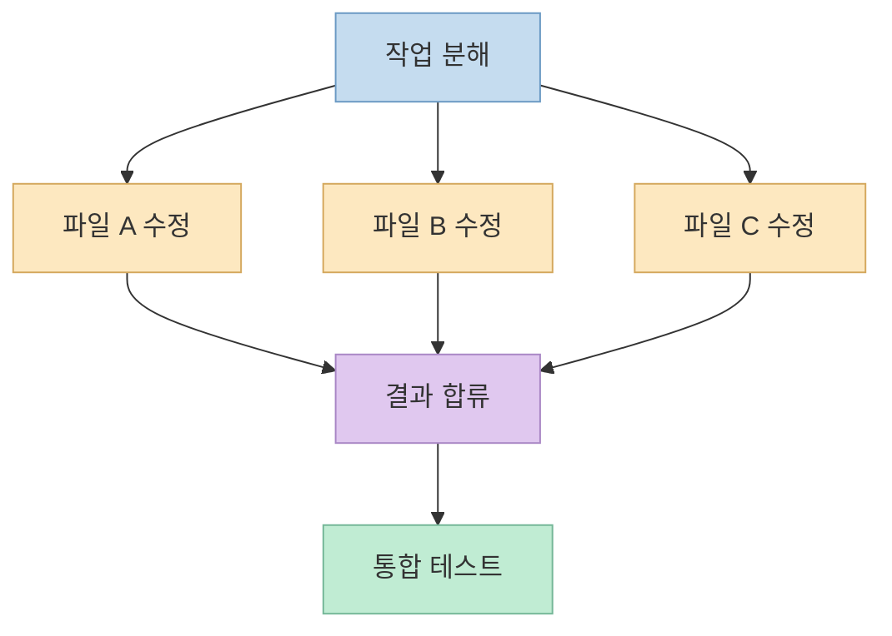
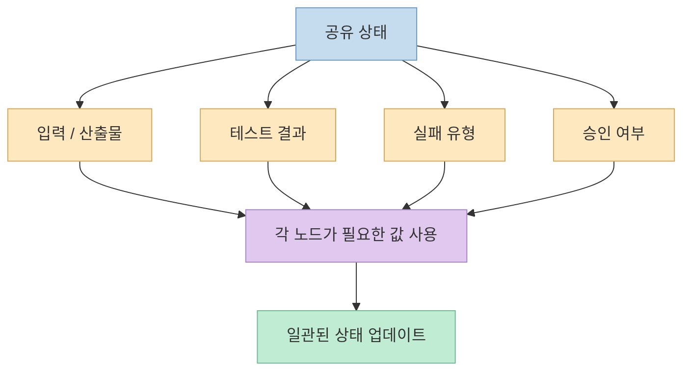
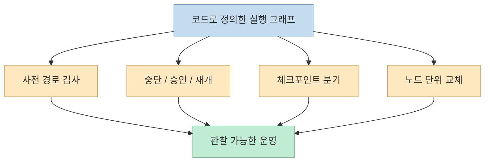
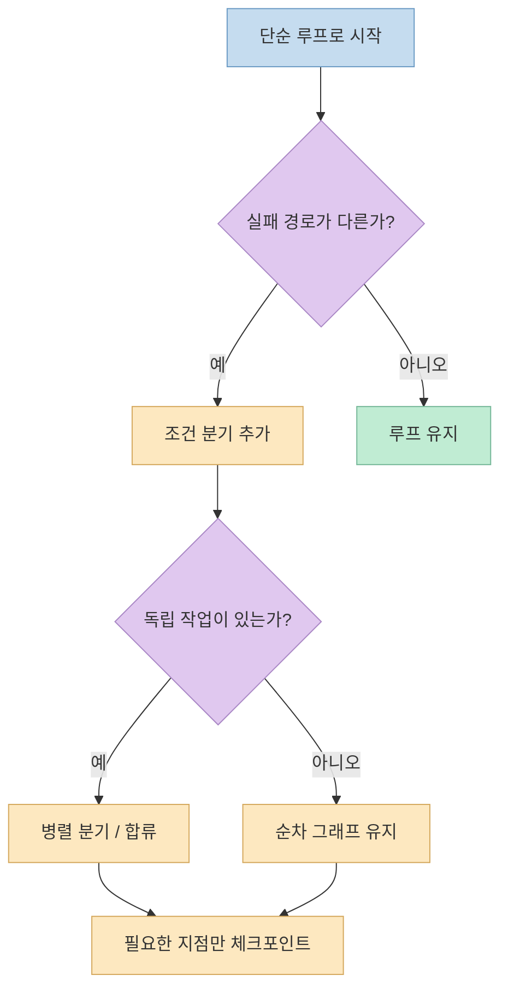

`루프 엔지니어링`이라는 말이 퍼진 지 얼마 되지 않았는데 벌써 `그래프 엔지니어링`이라는 새 표현이 등장했습니다. 하지만 이번 영상의 핵심은 새 유행어로 옮겨 타라는 데 있지 않습니다. 오히려 **루프도 원래 그래프의 한 종류이며, 작업이 복잡해질 때 루프에 분기·병렬 처리·공유 상태를 더해 명시적인 실행 그래프로 확장해야 한다** 는 설명에 가깝습니다. [영상 0:32](https://youtu.be/x_03uspytIk?t=32)

중요한 변화는 도형이 원에서 복잡한 그림으로 바뀐다는 것이 아닙니다. 작업 절차를 노드와 엣지로 코드에 고정하면 실행 전에 경로를 검사하고, 중간에 멈췄다가 재개하고, 과거 상태에서 다른 갈래를 시험하고, 특정 단계만 교체할 수 있습니다. 즉 그래프 엔지니어링의 실질은 새로운 이름보다 **복잡한 에이전트 워크플로를 관찰하고 복구할 수 있는 실행 구조로 만드는 것** 에 있습니다. [영상 2:17](https://youtu.be/x_03uspytIk?t=137)

<!--more-->

## Sources

- [원본 YouTube Shorts](https://youtube.com/shorts/x_03uspytIk?si=8ZMqrouSocAzjL5Y)
- [LangGraph Graph API](https://docs.langchain.com/oss/python/langgraph/graph-api)
- [LangGraph Persistence](https://docs.langchain.com/oss/python/langgraph/persistence)
- [LangGraph Interrupts](https://docs.langchain.com/oss/python/langgraph/interrupts)
- [LangGraph Time Travel](https://docs.langchain.com/oss/python/langgraph/use-time-travel)

## 1. 새 세대의 선언보다 먼저 봐야 할 것: 이름은 농담에서 시작됐다

영상은 `그래프 엔지니어링`이라는 표현이 `루프 엔지니어링`을 밀어낼 다음 세대처럼 퍼졌지만, 이를 확산시킨 두 사람의 발언은 진지한 세대교체 선언이 아니라 “몇 주마다 이름을 바꾸는 일을 그만하자”는 취지의 농담이었다고 설명합니다. 발표자도 새 이름을 계속 만드는 흐름에는 피로감을 드러냅니다. [영상 0:04](https://youtu.be/x_03uspytIk?t=4) [영상 0:11](https://youtu.be/x_03uspytIk?t=11)

이 대목은 기술적 정의와 유행어의 전파를 분리해서 봐야 한다는 경고로 읽는 편이 좋습니다. 영상은 농담을 퍼뜨린 인물이나 원문을 제시하지 않으므로 그 기원 자체를 독립적으로 검증할 수는 없습니다. 다만 이후 설명하는 노드, 엣지, 조건 분기, 병렬 실행, 상태, 체크포인트는 오래전부터 워크플로 엔진과 에이전트 프레임워크에서 사용해 온 실제 설계 요소입니다. 따라서 `그래프 엔지니어링`은 완전히 새로운 기술명이라기보다, **복잡한 에이전트 실행 흐름을 그래프로 다루는 기존 실무를 강조하는 표현** 으로 받아들이는 것이 안전합니다. [영상 0:15](https://youtu.be/x_03uspytIk?t=15) [LangGraph Graph API](https://docs.langchain.com/oss/python/langgraph/graph-api)

## 2. 루프와 그래프 사이에는 선명한 경계가 없다

영상은 이전에 설명한 루프 그림을 다시 보여 주며 “이것이 루프인가, 그래프인가?”라고 묻습니다. 답은 둘 다입니다. 작업을 나타내는 노드와 이동 관계를 나타내는 엣지가 있고, 마지막 결과가 다시 앞 단계로 돌아가므로 형식적으로 이미 그래프입니다. **루프는 자신 또는 앞선 노드로 되돌아오는 경로를 가진 그래프** 이기 때문에 “여기까지는 루프, 여기서부터는 그래프”라고 자를 수 없습니다. [영상 0:32](https://youtu.be/x_03uspytIk?t=32) [영상 0:41](https://youtu.be/x_03uspytIk?t=41)

이 관계를 이해하면 “루프 엔지니어링이 끝나고 그래프 엔지니어링이 시작됐다”는 식의 설명이 왜 부정확한지 알 수 있습니다. 그래프는 루프를 없애는 상위 버전이 아닙니다. 단일 반복 경로로 충분했던 작업에 더 많은 노드와 분기, 합류점이 필요해지면서 **같은 실행 구조를 더 일반적인 그래프 관점으로 표현하는 것** 입니다. [영상 0:46](https://youtu.be/x_03uspytIk?t=46) [영상 0:54](https://youtu.be/x_03uspytIk?t=54)

### 단순한 루프

### 분기와 합류를 포함한 그래프

두 번째 그림에도 루프는 그대로 남아 있습니다. 달라진 것은 반복 여부가 아니라 **실패 원인과 의존성에 따라 실행 경로를 선택할 수 있도록 구조가 명시되었다는 점** 입니다.

## 3. 첫 번째 신호: 실패 원인마다 돌아갈 곳이 다르다

단순한 루프에서는 검증에 실패하면 대개 직전의 작업 단계로 돌아갑니다. 하지만 실무의 실패는 한 종류가 아닙니다. 영상은 테스트 실패, 모호한 스펙, 외부 서버 장애를 예로 듭니다. 서버가 죽었는데 코드를 다섯 번 다시 고치는 것은 문제의 원인과 복구 행동이 맞지 않습니다. **실패를 분류한 뒤 원인마다 다른 노드로 보내야 할 때** 단일 루프만으로는 흐름을 설명하고 제어하기 어려워집니다. [영상 1:26](https://youtu.be/x_03uspytIk?t=86) [영상 1:34](https://youtu.be/x_03uspytIk?t=94)

이때 필요한 것은 재시도 횟수를 무작정 늘리는 것이 아니라 라우팅 규칙을 명시하는 일입니다. 테스트가 깨졌다면 구현 노드로, 스펙이 모호하다면 요구사항 확인이나 사람 승인 노드로, 외부 서버가 응답하지 않는다면 지수 백오프·대기·대체 서비스 같은 복구 노드로 보내야 합니다. 영상은 이 차이를 “원인마다 갈 곳이 달라야 한다”고 요약합니다. [영상 1:39](https://youtu.be/x_03uspytIk?t=99)

그래프 관점의 이점은 실패가 났다는 사실보다 **어디에서 어떤 종류의 실패가 발생했는지** 를 실행 경로에 남길 수 있다는 데 있습니다. 다만 원인 분류가 틀리면 잘못된 노드로 이동하므로, 라우터의 판단 기준과 예외 처리 역시 테스트해야 합니다.

## 4. 두 번째 신호: 독립 작업을 동시에 실행한 뒤 합쳐야 한다

영상의 두 번째 예는 여러 파일 수정입니다. 서로 독립적인 다섯 파일을 반드시 하나씩 고치면 전체 시간은 각 작업 시간의 합에 가까워집니다. 반대로 의존성이 없다면 작업을 여러 갈래로 펼쳐 동시에 처리한 뒤 마지막에 결과를 합칠 수 있습니다. 그래프에서는 이를 `fan-out`과 `fan-in` 구조로 표현합니다. [영상 1:45](https://youtu.be/x_03uspytIk?t=105) [영상 1:52](https://youtu.be/x_03uspytIk?t=112)

병렬화는 “에이전트를 많이 띄우면 무조건 빠르다”는 뜻이 아닙니다. 같은 파일이나 같은 상태를 동시에 수정하면 충돌이 생길 수 있고, 합류 단계에서는 결과의 순서와 중복, 실패한 가지의 처리 규칙이 필요합니다. LangGraph 공식 문서도 병렬 노드를 같은 `super-step`에서 실행하고, 여러 결과를 하나의 상태에 합칠 때 reducer 규칙을 사용한다고 설명합니다. 즉 병렬화의 전제는 **작업 독립성, 합류 규칙, 실패 격리** 입니다. [영상 1:58](https://youtu.be/x_03uspytIk?t=118) [LangGraph Graph API](https://docs.langchain.com/oss/python/langgraph/graph-api)

## 5. 세 번째 신호: 노드 사이에서 같은 형식의 상태를 공유해야 한다

노드가 늘어나면 각 노드가 다음 노드에 데이터를 넘겨야 합니다. 영상은 노드마다 읽고 쓰는 데이터의 모양이 모두 다르면 연결이 어려워지므로, 통일된 형식으로 상태를 관리해야 한다고 설명합니다. [영상 1:58](https://youtu.be/x_03uspytIk?t=118) [영상 2:04](https://youtu.be/x_03uspytIk?t=124)

여기서 상태는 단순한 대화 기록만 뜻하지 않습니다. 현재 작업 식별자, 입력 파일, 생성된 산출물, 테스트 결과, 실패 유형, 승인 여부, 재시도 횟수처럼 다음 노드가 의사결정에 사용할 값을 포함할 수 있습니다. 상태 스키마가 명확하면 노드는 전체 시스템을 알 필요 없이 자신에게 필요한 필드를 읽고 업데이트할 수 있습니다. 반대로 자유 형식 문자열만 계속 넘기면 노드 간 계약이 암묵적이 되어, 한 단계의 출력 변경이 뒤쪽 여러 단계를 깨뜨릴 수 있습니다. [영상 2:07](https://youtu.be/x_03uspytIk?t=127) [LangGraph Graph API](https://docs.langchain.com/oss/python/langgraph/graph-api)

상태를 통일한다는 것은 모든 정보를 하나의 거대한 객체에 넣는다는 뜻도 아닙니다. 노드가 필요로 하는 최소 필드와 갱신 책임을 정하고, 병렬 노드가 같은 필드를 수정할 때 어떻게 합칠지 규칙을 두는 것이 핵심입니다. 상태가 커질수록 저장 비용과 디버깅 부담도 늘어나므로, **관찰과 복구에 필요한 정보만 명시적으로 남기는 설계** 가 필요합니다.

## 6. 그래프를 코드로 정의하면 생기는 네 가지 운영 능력

영상은 그래프 엔지니어링의 결정적인 차이를 “모든 절차를 미리 노드와 엣지로 연결해 코드로 작성하는 것”이라고 설명합니다. 한 번의 긴 프롬프트에 절차를 적어 두면 실행 도중 멈췄을 때 중간 상태가 남지 않아 처음부터 다시 시작하기 쉽습니다. 반면 코드로 정의한 그래프와 체크포인트가 있으면 현재 어느 노드까지 실행됐는지 알 수 있습니다. [영상 2:17](https://youtu.be/x_03uspytIk?t=137) [영상 2:22](https://youtu.be/x_03uspytIk?t=142)

첫째, **실행 전에 경로를 검사할 수 있습니다.** 노드와 엣지가 명시되어 있으면 도달할 수 없는 노드, 종료점이 없는 경로, 무한히 돌 가능성이 있는 분기를 실행 전에 검토할 수 있습니다. 영상은 이를 눈으로 절차를 검사하고 막다른 길을 제거하는 능력으로 설명합니다. [영상 2:35](https://youtu.be/x_03uspytIk?t=155)

둘째, **사람의 승인이 필요한 지점에서 멈췄다가 이어갈 수 있습니다.** 예를 들어 배포, 결제, 데이터 삭제처럼 되돌리기 어려운 행동 앞에서 상태를 저장하고 며칠 뒤 승인받은 지점부터 재개할 수 있습니다. LangGraph의 `interrupt`도 체크포인터에 상태를 저장하고 외부 입력이 올 때까지 실행을 정지하는 방식으로 이 패턴을 구현합니다. [영상 2:42](https://youtu.be/x_03uspytIk?t=162) [LangGraph Interrupts](https://docs.langchain.com/oss/python/langgraph/interrupts)

셋째, **과거 체크포인트에서 다른 갈래로 다시 실행할 수 있습니다.** 전체 작업을 처음부터 반복하지 않고 이전 상태를 불러와 입력이나 상태 일부를 바꾼 뒤 대안 경로를 시험할 수 있습니다. 공식 문서에서 이를 `replay`와 `fork`로 구분하며, 이미 완료된 앞 단계는 재사용하고 이후 노드만 다시 실행할 수 있다고 설명합니다. [영상 2:47](https://youtu.be/x_03uspytIk?t=167) [LangGraph Time Travel](https://docs.langchain.com/oss/python/langgraph/use-time-travel)

넷째, **전체 시스템을 다시 만들지 않고 특정 노드만 교체할 수 있습니다.** 검색 노드의 모델을 바꾸거나 검증 노드를 더 엄격한 구현으로 교체하는 식입니다. 단, 노드의 입출력 상태 계약이 안정적이어야 교체가 국소적인 변경으로 끝납니다. [영상 2:49](https://youtu.be/x_03uspytIk?t=169)

이 네 가지는 그래프를 그렸다는 사실만으로 자동 제공되지 않습니다. 실제 중단·재개에는 내구성 있는 저장소와 실행 식별자가 필요하고, 외부 API 호출처럼 부작용이 있는 노드는 재개 시 중복 실행되어도 안전하도록 멱등성을 고려해야 합니다. 그래프는 복잡성을 없애는 도구가 아니라, **복잡성을 보이게 만들고 제어 지점을 제공하는 도구** 입니다. [LangGraph Persistence](https://docs.langchain.com/oss/python/langgraph/persistence) [LangGraph Interrupts](https://docs.langchain.com/oss/python/langgraph/interrupts)

## 7. 실전 적용 포인트: 처음부터 거대한 그래프를 만들 필요는 없다

영상의 설명을 실무 판단 기준으로 바꾸면, 다음 질문 중 하나라도 반복해서 “예”가 나올 때 그래프 도입을 검토할 수 있습니다.

- 실패 원인에 따라 서로 다른 복구 절차가 필요한가? 
- 서로 독립적으로 실행한 뒤 합칠 수 있는 작업이 있는가? 
- 여러 단계가 공유해야 할 상태 스키마가 필요한가? 
- 사람 승인 때문에 실행을 오래 멈췄다가 재개해야 하는가? 
- 전체 재실행 대신 특정 체크포인트나 노드부터 다시 실행하고 싶은가? 
- 한 단계를 독립적으로 교체하고 평가해야 하는가?

반대로 작업이 짧고, 실패하면 같은 단계만 다시 실행하면 되며, 중간 상태를 보존할 필요가 없다면 단순 루프가 더 낫습니다. 노드와 엣지, 상태 저장, 분기 테스트, 관찰 도구를 추가하면 구현과 운영 비용도 함께 늘어납니다. **복잡한 그림을 그리는 것이 목적이 아니라, 실제로 존재하는 복잡성을 코드에 드러내는 것이 목적** 이어야 합니다. [영상 2:15](https://youtu.be/x_03uspytIk?t=135)

시작할 때는 전체 업무를 한 번에 그래프로 옮기기보다, 가장 자주 잘못 재시도되는 실패 한 종류를 조건 분기로 분리하는 편이 안전합니다. 그다음 독립성이 분명한 작업만 병렬화하고, 마지막으로 중단·재개가 필요한 경계에 체크포인트를 추가할 수 있습니다. 이렇게 하면 단순 루프의 장점을 유지하면서도 실제 병목이 확인된 부분부터 그래프로 확장할 수 있습니다. [영상 1:26](https://youtu.be/x_03uspytIk?t=86) [영상 1:45](https://youtu.be/x_03uspytIk?t=105)

## 핵심 요약

- `그래프 엔지니어링`이라는 이름의 확산은 세대교체 선언보다 유행어를 풍자한 농담에서 시작됐다는 것이 영상의 설명입니다. 
- 루프는 그래프와 반대되는 개념이 아니라, 앞 단계로 되돌아오는 경로를 가진 그래프의 한 형태입니다. 
- 실패별 복구 경로, 병렬 fan-out/fan-in, 노드 사이의 공유 상태가 필요해질 때 단순 루프를 명시적인 그래프로 확장할 이유가 생깁니다. 
- 워크플로를 노드와 엣지로 코드화하면 사전 검사, 중단·재개, 체크포인트 분기, 노드 단위 교체가 가능해집니다. 
- 그래프는 복잡성을 없애지 않습니다. 이미 존재하는 복잡성을 관찰하고 테스트하고 복구할 수 있는 형태로 드러냅니다. 
- 처음부터 거대한 그래프를 만들기보다, 잘못된 재시도가 반복되는 분기 한 곳부터 확장하는 편이 안전합니다.

## 결론

그래프 엔지니어링은 루프 엔지니어링을 폐기하는 다음 유행이 아닙니다. **루프가 복잡해졌을 때 그 안의 작업, 분기, 합류, 상태를 코드로 명시하는 확장된 설계 관점** 입니다.

따라서 중요한 질문은 “이제 루프 대신 그래프를 써야 하는가?”가 아닙니다. 실패 원인마다 돌아갈 곳이 달라졌는지, 동시에 실행할 독립 작업이 생겼는지, 중간 상태에서 멈추고 다시 시작해야 하는지를 먼저 물어야 합니다. 그 질문에 답하는 순간, 그래프는 멋진 그림이 아니라 **에이전트 시스템을 실제로 운영하기 위한 실행 계약** 이 됩니다.
