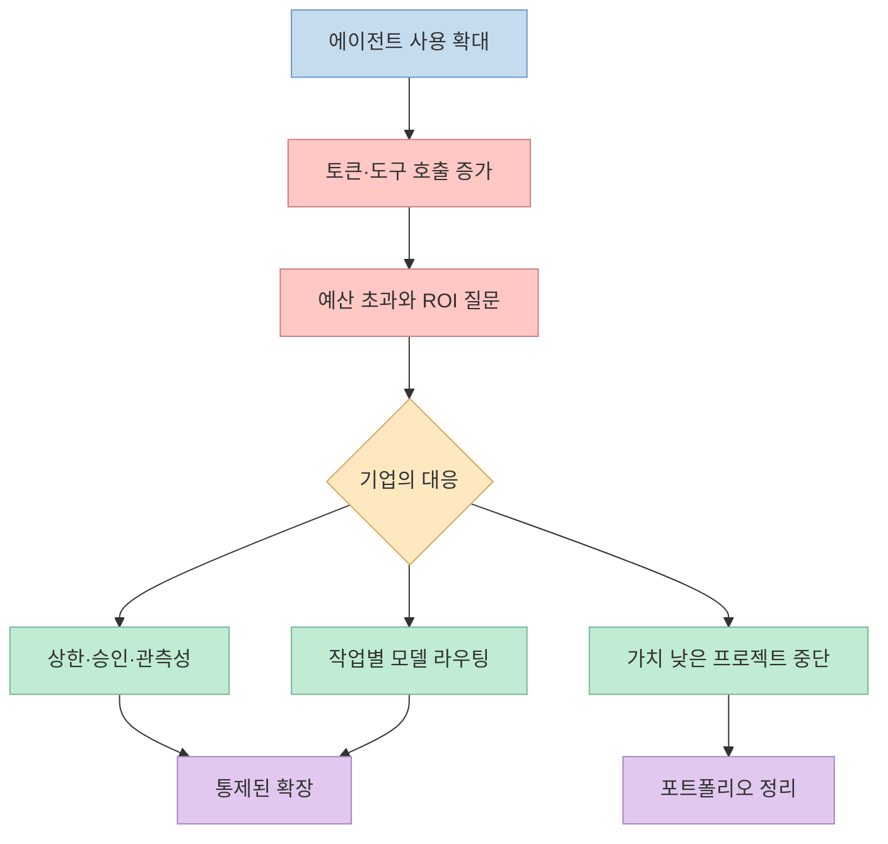
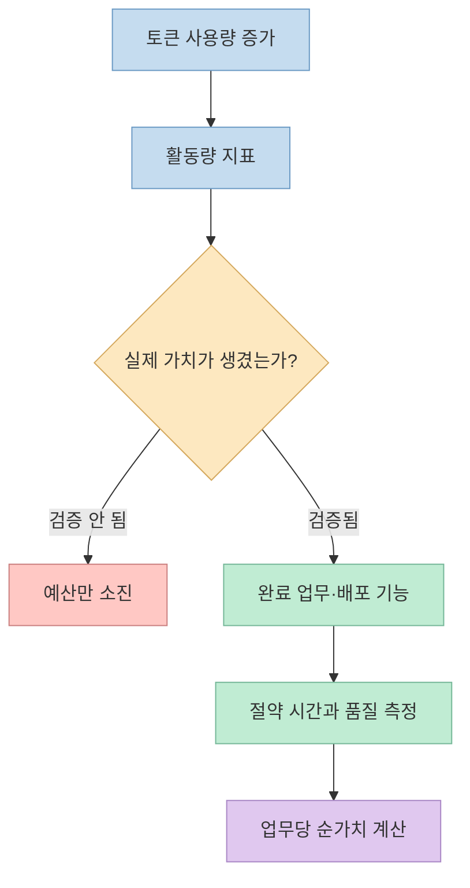
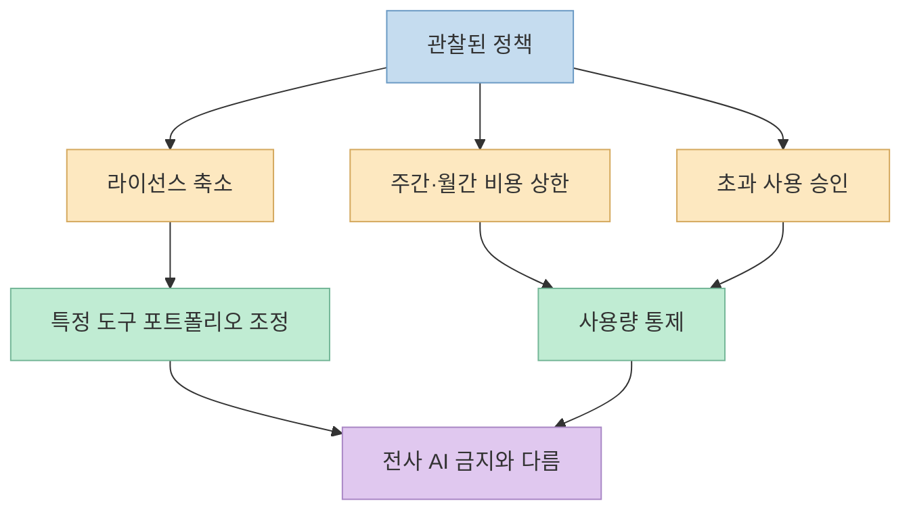
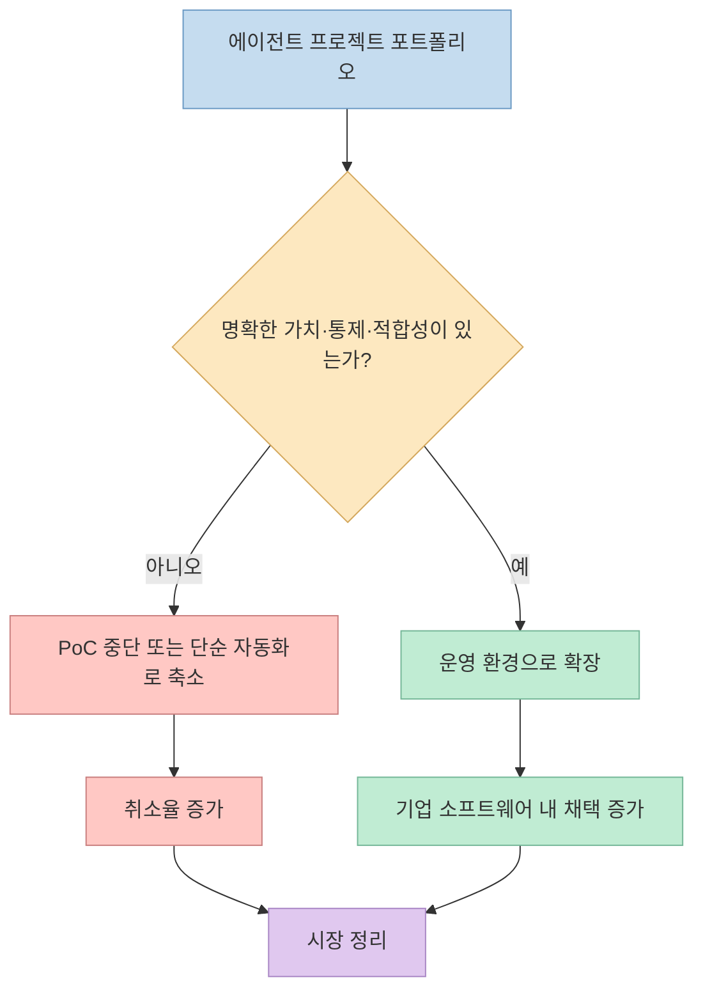
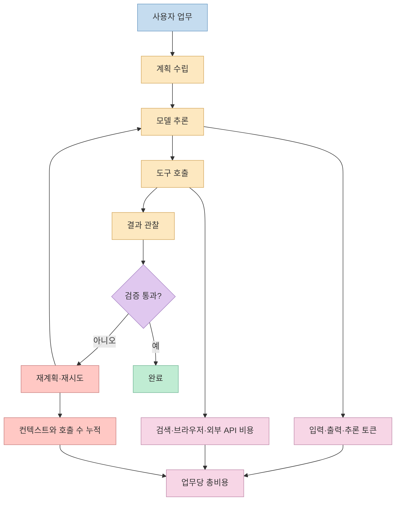
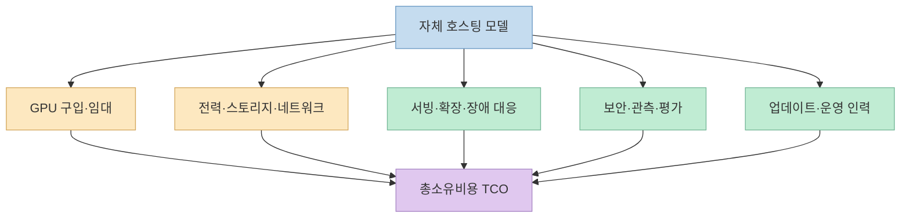
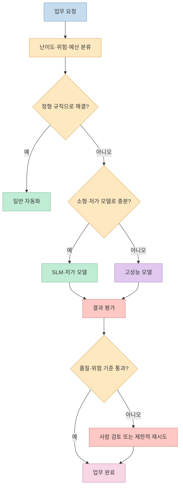

기업들이 에이전트 AI를 앞다퉈 도입했다가 비용을 감당하지 못해 사용을 금지하고 있다는 주장이 나왔습니다. 영상은 Uber가 연간 AI 예산을 4개월 만에 소진했고, Microsoft와 Tesla도 사용을 제한했으며, 결국 기업들이 상용 LLM API에서 로컬 소형 모델로 이동할 것이라고 설명합니다. [영상 0:00](https://youtu.be/nKFB9dic_0I?t=0) [영상 3:09](https://youtu.be/nKFB9dic_0I?t=189)

사례의 일부는 실제 보도와 조사에 근거합니다. 그러나 **비용 상한 도입** 과 **에이전트 AI 철수**, **특정 도구의 라이선스 축소** 와 **모든 AI 사용 금지** 는 같은 말이 아닙니다. 비용 문제가 산업 전체의 몰락이나 데이터센터 수요 붕괴를 곧바로 증명하는 것도 아닙니다.

이 글은 영상의 주장을 세 범주로 나눕니다. 확인된 사실은 그대로 인정하고, 범위가 과장된 부분은 원문의 맥락을 복원하며, 출처가 확인되지 않은 수치와 투자 전망은 사실과 분리합니다.

<!--more-->

## Sources

- [원본 YouTube 영상](https://youtu.be/nKFB9dic_0I)
- [TechCrunch: Uber caps employee AI spending after blowing through budget in 4 months](https://techcrunch.com/2026/06/02/uber-caps-employee-ai-spending-after-blowing-through-budget-in-four-months/)
- [Los Angeles Times: Uber caps staff use of AI coding tools](https://www.latimes.com/business/story/2026-06-02/uber-caps-staff-use-of-ai-coding-tools-after-blowing-its-budget)
- [Axios: AI sticker shock hits corporate America](https://www.axios.com/2026/05/28/ai-spending-roi-enterprise-costs)
- [Electrek: Tesla caps employee AI spending at $200/week](https://electrek.co/2026/07/02/tesla-caps-employee-ai-spending-200-week/)
- [McKinsey: Is that AI agent worth it?](https://www.mckinsey.com/capabilities/quantumblack/our-insights/is-that-ai-agent-worth-it-agentic-economics-and-the-modern-operating-model)
- [Gartner: Over 40% of Agentic AI Projects Will Be Canceled by End of 2027](https://www.gartner.com/en/newsroom/press-releases/2025-06-25-gartner-predicts-over-40-percent-of-agentic-ai-projects-will-be-canceled-by-end-of-2027)
- [OpenAI: Prompt Caching in the API](https://openai.com/index/api-prompt-caching/)
- [Cloudflare AI Gateway: Spend limits](https://developers.cloudflare.com/ai-gateway/features/spend-limits/)

## 1. 결론부터: 비용 위기는 사실이지만 “몰락”은 과장이다

영상의 중심 문제 제기는 유효합니다. 에이전트는 한 번 질문하고 한 번 답하는 챗봇과 달리 계획, 도구 호출, 결과 검증, 재시도를 반복합니다. 같은 업무라도 호출 횟수와 컨텍스트가 누적되어 비용이 빠르게 커질 수 있습니다. 영상도 오류가 반복되거나 긴 대화 이력이 계속 입력되면 토큰 사용량이 증가한다고 설명합니다. [영상 9:48](https://youtu.be/nKFB9dic_0I?t=588)

실제 기업들도 무제한 사용을 그대로 두지 않고 예산 상한, 승인 절차, 대시보드, 저렴한 모델 라우팅을 도입하고 있습니다. 하지만 이것은 보통 **도입 철회가 아니라 비용 거버넌스의 시작** 입니다. Uber는 상한을 넘는 예외 승인 절차를 남겼고, 회사 대변인은 이 정책을 전사적 도입과 실험을 책임 있게 확대하기 위한 방법이라고 설명했습니다. [Los Angeles Times](https://www.latimes.com/business/story/2026-06-02/uber-caps-staff-use-of-ai-coding-tools-after-blowing-its-budget)

따라서 더 정확한 표현은 “에이전트 AI가 몰락했다”가 아니라 **사용량 경쟁이 끝나고 단위 경제성을 검증하는 단계로 이동했다** 입니다.

## 2. Uber: 예산 소진과 상한 도입은 확인되지만 철수는 아니다

영상은 Uber가 직원들에게 에이전트 AI 사용을 장려하고 리더보드까지 운영한 뒤, 연간 예산을 4개월 만에 모두 써 버려 프로젝트별·팀별 쿼터를 도입했다고 말합니다. [영상 3:09](https://youtu.be/nKFB9dic_0I?t=189)

보도로 확인되는 핵심 사실은 다음과 같습니다.

- Uber는 2026년 연간 AI 예산을 4월 무렵 이미 소진했다고 밝혔습니다. 
- 이후 직원 한 명이 에이전틱 코딩 도구 하나에 쓸 수 있는 월간 토큰 비용을 1,500달러로 제한했습니다. 
- 이 제한은 Cursor와 Claude Code 같은 코딩 도구에 적용되며, 다른 AI 사용 전체를 금지한 조치는 아닙니다. 
- 직원은 대시보드에서 사용량을 확인하고, 필요하면 상한 초과 승인을 요청할 수 있습니다. 
- COO는 AI 사용량과 고객에게 전달되는 새 기능 사이의 인과관계를 아직 명확히 연결하기 어렵다고 말했습니다. 

[TechCrunch](https://techcrunch.com/2026/06/02/uber-caps-employee-ai-spending-after-blowing-through-budget-in-four-months/) [Los Angeles Times](https://www.latimes.com/business/story/2026-06-02/uber-caps-staff-use-of-ai-coding-tools-after-blowing-its-budget)

여기서 중요한 지표는 “토큰을 얼마나 많이 썼는가”가 아닙니다. 비용을 투입해 **성공적으로 완료한 업무**, **배포된 기능**, **절약한 시간**, **사람이 다시 고친 비율** 을 측정해야 합니다.

Uber 사례는 에이전트가 쓸모없다는 증거라기보다, 사용을 장려한 리더보드가 가치가 아닌 소비량을 최적화할 수 있다는 경고에 가깝습니다.

## 3. Microsoft와 Tesla: “전면 금지”가 아니라 도구·비용 정책 변경이다

영상은 Microsoft가 Claude Code 라이선스를 모두 취소하고 자사 모델만 쓰게 했다고 설명합니다. [영상 4:21](https://youtu.be/nKFB9dic_0I?t=261) 그러나 공개 보도에서 확인되는 표현은 더 제한적입니다. Axios는 Microsoft가 비용 문제 등을 이유로 Claude Code 라이선스의 **대부분** 을 취소했다고 보도했습니다. 이 사실만으로 Microsoft 전 직원의 Claude Code가 모두 취소됐거나 외부 AI 사용이 전면 금지됐다고 단정할 수는 없습니다. [Axios](https://www.axios.com/2026/05/28/ai-spending-roi-enterprise-costs)

Tesla의 주당 200달러 제한도 내부 메모를 인용한 2차 보도로 확인됩니다. 보도에 따르면 2026년 7월 6일부터 직원의 AI 지출에 주당 200달러 상한을 적용하고, 초과 사용에는 승인을 요구했습니다. 다만 xAI 베타 제품은 계산에서 제외됐습니다. 이는 비용 통제와 자사 도구 유도라는 두 목적을 함께 읽어야 하는 사례입니다. [영상 5:23](https://youtu.be/nKFB9dic_0I?t=323) [Electrek](https://electrek.co/2026/07/02/tesla-caps-employee-ai-spending-200-week/)

비용 정책은 기술 평가만으로 결정되지 않습니다. 공급업체 통합, 데이터 보안, 기존 계약, 자사 제품 전략도 함께 작용합니다. 특정 라이선스 축소를 모델 성능이나 산업 수요 전체의 붕괴로 해석하면 인과관계를 과도하게 확장하게 됩니다.

## 4. McKinsey의 93%: 방향은 맞지만 표본 범위를 봐야 한다

영상은 McKinsey 조사를 인용해 기업의 AI 지출이 4배 늘었고 93%가 예산을 초과했으며, 20%가 비용 때문에 사용을 제한했다고 말합니다. [영상 11:25](https://youtu.be/nKFB9dic_0I?t=685)

McKinsey 원문의 수치는 조금 다릅니다.

- 2025년 말까지 12개월 동안 기업 LLM 지출이 **3배** 로 증가했다는 수치는 Menlo Ventures 자료를 인용한 것입니다. 
- 예산을 초과했다는 **93%** 는 2026년 5월 Enterprise AI FinOps Survey의 적격 응답자 75명에 대한 결과입니다. 참여자는 120명이었고, 적격 응답자는 5개 주요 산업에 걸쳐 있었습니다. 
- AI 운영비 때문에 사용을 제한했다는 **약 20%** 는 별도의 2026 State of AI 조사 응답 1,719명에서 나온 결과입니다. 

[McKinsey](https://www.mckinsey.com/capabilities/quantumblack/our-insights/is-that-ai-agent-worth-it-agentic-economics-and-the-modern-operating-model)

93%라는 숫자는 비용 통제의 시급성을 보여 주지만 “세계 모든 기업의 93%”로 일반화할 수는 없습니다. 서로 다른 조사와 표본에서 나온 93%와 20%를 하나의 동일한 모집단 결과처럼 묶어서도 안 됩니다.

McKinsey가 강조하는 결론도 “토큰을 줄이면 끝”이 아닙니다. 결과의 정확성, 사람의 감독과 수정 비용, 추론 컴퓨팅, 완료된 업무의 가치까지 포함해 **전체 운영 비용보다 산출 가치가 큰지**를 물어야 한다는 것입니다.

## 5. Gartner의 40%: 취소 전망과 성장 전망이 동시에 존재한다

영상은 Gartner가 2027년 말까지 에이전트 AI 프로젝트의 40% 이상이 취소될 것이라고 전망했다고 소개합니다. [영상 12:11](https://youtu.be/nKFB9dic_0I?t=731) 이 수치는 Gartner의 2025년 6월 공식 발표와 일치합니다. Gartner는 비용 상승, 불명확한 사업 가치, 불충분한 위험 통제를 취소 원인으로 들었습니다. [Gartner](https://www.gartner.com/en/newsroom/press-releases/2025-06-25-gartner-predicts-over-40-percent-of-agentic-ai-projects-will-be-canceled-by-end-of-2027)

그러나 같은 발표의 나머지 전망을 함께 봐야 합니다.

- 2028년에는 일상적인 업무 의사결정의 최소 15%가 에이전트 AI로 자율 수행될 것으로 전망했습니다. 
- 기업용 소프트웨어 애플리케이션 중 에이전트 AI를 포함하는 비율이 2024년 1% 미만에서 2028년 33%로 증가할 것으로 전망했습니다. 
- 단순 검색은 어시스턴트, 정형 업무는 자동화, 의사결정이 필요한 업무는 에이전트로 구분하라고 권고했습니다. 

따라서 Gartner 자료는 “에이전트 AI가 사라진다”가 아니라 **잘못 고른 프로젝트가 대거 정리되는 동시에 적합한 사용처는 확산된다**는 전망입니다.

취소되는 프로젝트의 수와 살아남은 프로젝트의 사용량은 동시에 증가할 수 있습니다. 프로젝트 개수만으로 API 수요나 데이터센터 매출을 곧바로 추론하기 어려운 이유입니다.

## 6. 에이전트 비용이 폭증하는 구조

영상은 에이전트가 답을 찾지 못할 때 비슷한 질문을 반복하고, 긴 컨텍스트를 매번 다시 보내 비용을 키운다고 설명합니다. [영상 9:48](https://youtu.be/nKFB9dic_0I?t=588) 이 메커니즘은 타당하지만, 비용은 단순히 “질문 횟수 × 입력 토큰”만으로 결정되지 않습니다.

비용을 키우는 주요 요인은 다음과 같습니다.

1. **다단계 실행**: 계획, 실행, 검증이 각각 모델 호출을 만듭니다. 
2. **재시도 루프**: 실패 횟수와 최대 반복 수를 제한하지 않으면 호출이 계속 누적됩니다. 
3. **긴 컨텍스트**: 저장소, 문서, 대화 이력을 매번 넣으면 입력 토큰이 커집니다. 
4. **병렬 fan-out**: 여러 하위 에이전트가 동시에 같은 문제를 풀면 벽시계 시간은 줄어도 총소비는 늘 수 있습니다. 
5. **도구 비용**: 검색, 브라우저, 데이터베이스, 외부 API도 별도 비용과 지연을 만듭니다. 
6. **사람의 복구 비용**: 잘못된 결과를 검토하고 되돌리는 시간까지 포함해야 합니다. 

영상은 캐시된 입력 토큰의 가격이 원래 입력의 10% 수준이라고 단정합니다. [영상 10:39](https://youtu.be/nKFB9dic_0I?t=639) 하지만 할인율과 조건은 공급자·모델·시점에 따라 다릅니다. OpenAI가 Prompt Caching을 처음 발표했을 때 지원 모델의 할인율은 50%였으며, 일정 길이 이상의 공통 접두사가 재사용되어야 했습니다. 따라서 하나의 비율을 전체 LLM API의 보편 법칙으로 사용하면 안 됩니다. [OpenAI Prompt Caching](https://openai.com/index/api-prompt-caching/)

## 7. “오픈소스 모델이면 API 비용 0원”이라는 함정

영상은 기업이 오픈소스 또는 오픈 웨이트 모델을 내려받아 사내 서버에서 실행하면 API 비용이 0원이 된다고 설명합니다. [영상 12:34](https://youtu.be/nKFB9dic_0I?t=754) 외부 공급자에게 내는 **건당 API 청구액** 은 없어질 수 있지만, 총비용이 0원이 되는 것은 아닙니다.

자체 호스팅과 상용 API 중 어느 쪽이 싼지는 호출량, 모델 크기, 지연 시간 목표, GPU 이용률, 보안 요구, 운영 인력에 따라 달라집니다. 사용량이 작거나 변동이 크면 종량제 API가 유리할 수 있고, 일정한 대규모 작업과 충분한 운영 역량이 있으면 자체 호스팅이 유리할 수 있습니다. 작은 모델을 정형 업무에 쓰는 전략은 합리적이지만, **모든 업무를 로컬 모델로 옮기는 것이 자동으로 최적해가 되지는 않습니다**.

## 8. 영상에서 독립 검증되지 않은 주장

영상은 Ford가 3개월 만에 예산을 소진했다는 사례, Duolingo가 기초 업무를 소형 모델로 전환했다는 사례, Expedia의 에이전트 상담 한 건당 API 비용이 사람보다 몇 배 높았다는 사례를 제시합니다. [영상 6:45](https://youtu.be/nKFB9dic_0I?t=405) [영상 7:46](https://youtu.be/nKFB9dic_0I?t=466) [영상 8:40](https://youtu.be/nKFB9dic_0I?t=520)

이번 검증에서는 이 세부 수치와 정책 변화를 뒷받침하는 해당 기업의 공식 발표나 신뢰할 만한 원문을 찾지 못했습니다. 또한 다음 주장도 영상 안에서 계산 근거나 출처가 제시되지 않습니다.

- 에이전트 API 비용이 같은 업무의 인건비보다 10~20배 높다는 수치 
- 에이전트가 같은 질문을 반복해도 오답일 확률이 약 30%라는 수치 
- 기업들이 2027년부터 상용 LLM API 사용을 급격히 줄일 것이라는 예측 
- 그 결과 LLM 기업과 데이터센터의 매출 논리가 무너진다는 투자 결론 

이 주장들이 반드시 거짓이라는 뜻은 아닙니다. 다만 **검증 가능한 사실로 인용하기에는 근거가 부족하다**는 뜻입니다. 특히 개별 기업의 내부 실험 결과를 시장 전체의 매출 전망으로 연결하려면 API 사용량, 모델 가격 하락, 추론 효율, 신규 사용처, 자체 호스팅의 인프라 수요까지 함께 분석해야 합니다.

## 9. 실전 적용 포인트: 토큰이 아니라 성공한 업무를 예산화하라

기업이 취할 현실적인 해법은 “전면 금지”와 “무제한 사용” 사이에 있습니다.

### 9.1 업무당 예산을 둔다

사용자·팀·프로젝트별 월간 상한만으로는 부족합니다. 한 건의 업무가 사용할 수 있는 최대 토큰, 도구 호출 수, 재시도 횟수, 벽시계 시간을 함께 제한해야 합니다. Cloudflare AI Gateway처럼 실제 요청 비용을 기준으로 모델·공급자·사용자·애플리케이션 단위의 지출 한도를 거는 방식도 사용할 수 있습니다. [Cloudflare Spend limits](https://developers.cloudflare.com/ai-gateway/features/spend-limits/)

### 9.2 모델을 업무 난이도에 맞춰 라우팅한다

분류, 추출, 형식 변환처럼 정형화된 업무는 규칙 기반 자동화나 작은 모델부터 시도합니다. 복잡한 추론이 필요한 경우에만 고성능 모델로 승격합니다. 가장 비싼 모델을 모든 단계에 고정하는 설계를 피해야 합니다.

### 9.3 종료 조건과 실패 예산을 명시한다

에이전트가 같은 오류를 무한 반복하지 않도록 최대 단계 수, 동일 오류 허용 횟수, 비용 상한을 둡니다. 실패하면 더 비싼 모델로 한 번 승격하거나 사람에게 넘기되, 이 경로도 사전에 정의합니다.

### 9.4 전체 비용을 기록한다

모델 비용뿐 아니라 검색 API, 브라우저, 벡터 데이터베이스, GPU, 관측 도구, 사람의 검토·복구 시간을 한 업무 ID에 연결합니다. 그래야 API가 싸졌는데도 전체 운영비가 오른 이유를 설명할 수 있습니다.

### 9.5 성공 기준을 먼저 만든다

다음 지표를 함께 봐야 합니다.

- 성공적으로 완료한 업무당 총비용 
- 사람의 수정 없이 통과한 비율 
- 실패 후 복구에 든 시간과 비용 
- 기존 방식 대비 처리 시간·품질 변화 
- 실제 배포·매출·비용 절감으로 연결된 비율 

토큰 소비량은 활동 지표일 뿐 성과 지표가 아닙니다.

## 핵심 요약

- Uber의 연간 AI 예산 조기 소진과 월 1,500달러 상한은 보도로 확인됩니다. 다만 대상은 에이전틱 코딩 도구이며 예외 승인도 가능하므로 전면 철수가 아닙니다. 
- Microsoft의 사례는 공개 보도상 Claude Code 라이선스 **대부분** 의 취소입니다. 전 직원의 모든 라이선스 취소로 확대하면 범위를 벗어납니다. 
- Tesla의 주당 200달러 상한은 내부 메모를 인용한 2차 보도로 확인되지만, 자사 xAI 베타 제품은 제외됐습니다. 
- McKinsey의 93% 예산 초과 수치는 적격 응답자 75명의 FinOps 조사 결과입니다. 20% 사용 제한 수치는 별도 조사에서 나왔습니다. 
- Gartner는 2027년 말까지 40% 이상의 프로젝트 취소를 전망하는 동시에, 2028년 기업 소프트웨어의 33%가 에이전트 AI를 포함할 것으로 전망했습니다. 
- 로컬·오픈 웨이트 모델은 외부 API 청구를 줄일 수 있지만 GPU, 서빙, 보안, 평가, 운영 인력이 필요하므로 총비용이 0원은 아닙니다. 
- Ford·Duolingo·Expedia의 영상 속 세부 수치와 “인건비의 10~20배” 같은 주장은 이번 검증에서 신뢰할 만한 원문을 확인하지 못했습니다. 

## 결론

영상은 기업이 에이전트 AI 비용을 통제하기 시작했다는 중요한 변화를 포착했습니다. 에이전트의 반복 호출, 긴 컨텍스트, 도구 사용이 작은 단가를 큰 청구서로 바꿀 수 있다는 경고도 타당합니다.

그러나 상한 도입은 금지가 아니고, 가치가 낮은 프로젝트의 취소는 기술 전체의 소멸이 아닙니다. Gartner의 취소 전망과 채택 확대 전망이 동시에 성립하듯, 시장은 **무제한 토큰 소비를 장려하는 실험기에서 비용·품질·위험을 함께 관리하는 운영기로 이동**하고 있습니다.

앞으로의 승자는 가장 많은 토큰을 쓰는 조직도, 모든 업무를 가장 작은 모델로 옮기는 조직도 아닙니다. **업무마다 필요한 자율성 수준을 고르고, 성공한 결과당 총비용을 측정하며, 실패 루프를 통제하는 조직** 입니다.
