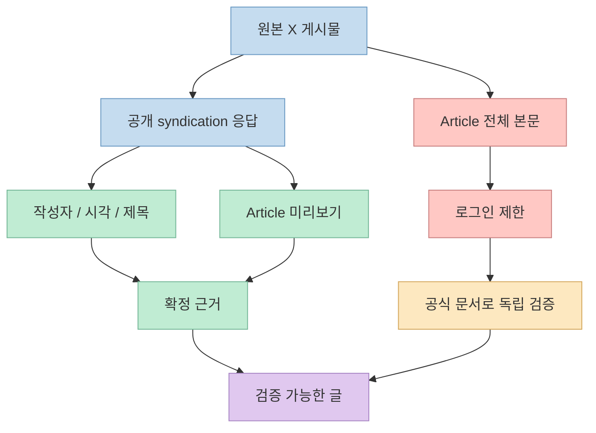
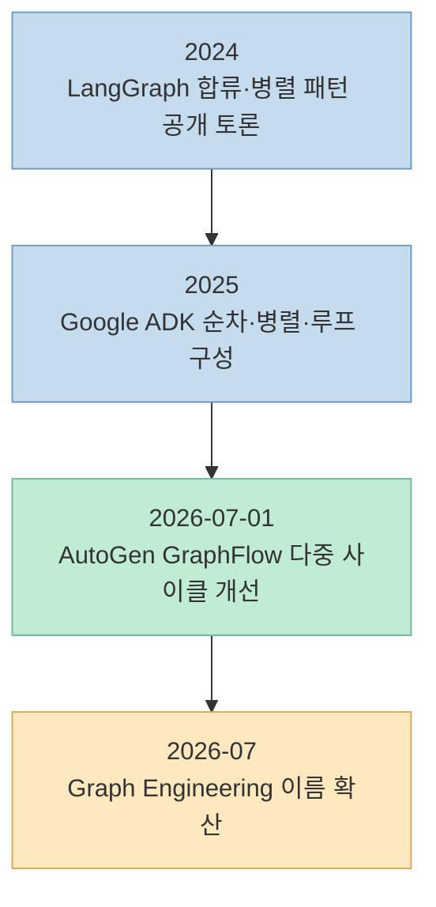
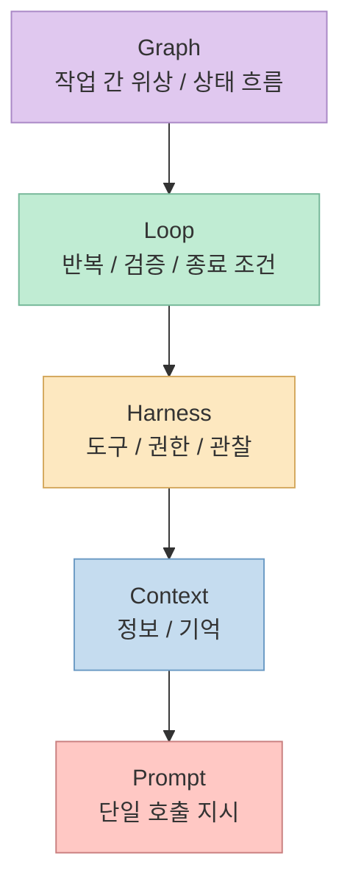
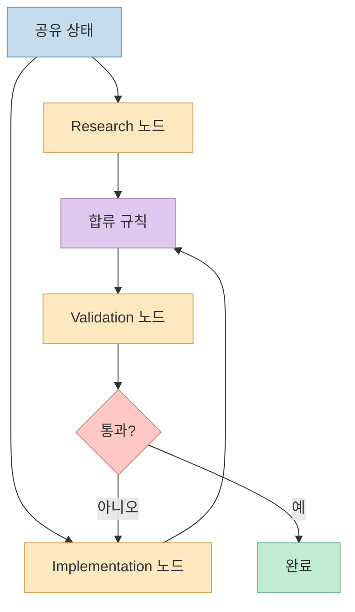
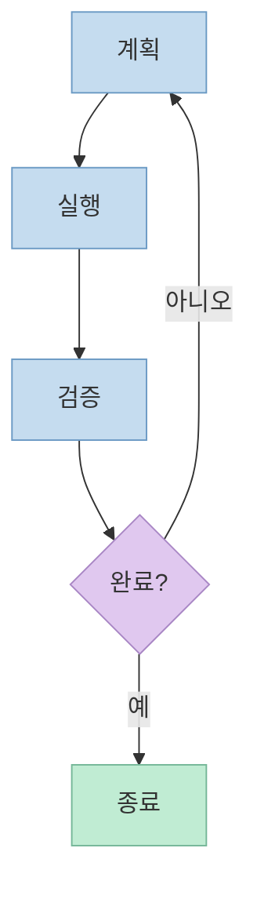
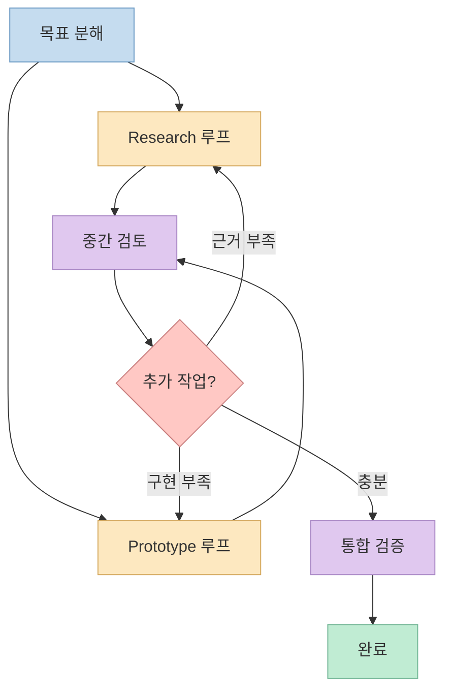
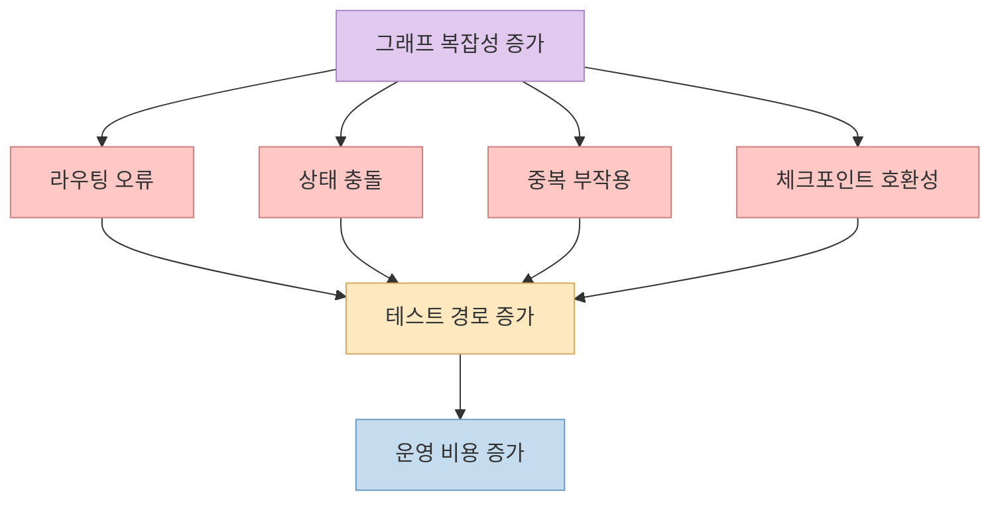
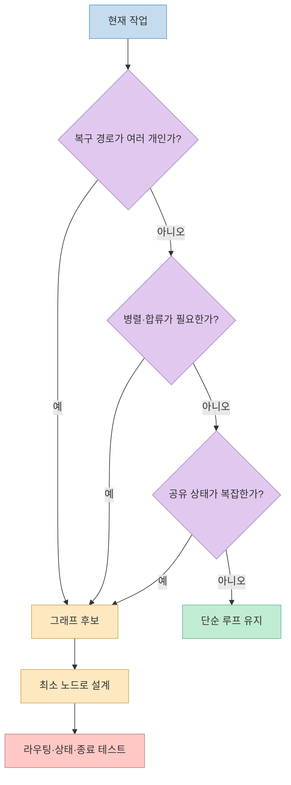

2026년 7월, AI 에이전트 담론에 `Graph Engineering`이라는 이름이 빠르게 등장했습니다. 이번 X 게시물이 연결하는 Article의 제목도 그대로 **"Graph Engineering"** 이며, 공개 미리보기는 `"Loop Engineering is dead. Long live Graph Engineering!"`이라는 선언이 퍼졌다고 소개합니다. [원본 X 게시물](https://x.com/i/status/2079417235370872872)

그런데 이름이 새롭다는 사실과 기술이 새롭다는 사실은 다릅니다. LangGraph, Microsoft AutoGen, Google ADK의 공식 자료를 보면 상태·노드·엣지·조건 분기·병렬 실행·루프를 조합하는 구조는 이미 제품과 문서에 구현되어 있습니다. 따라서 확인해야 할 질문은 “그래프가 루프를 죽였는가?”가 아니라, **기존 그래프 오케스트레이션에 왜 지금 `Engineering`이라는 이름이 붙었으며 무엇을 새 설계 대상으로 강조하는가** 입니다. [LangGraph Graph API](https://docs.langchain.com/oss/python/langgraph/graph-api) [AutoGen GraphFlow](https://microsoft.github.io/autogen/dev/user-guide/agentchat-user-guide/graph-flow.html)

<!--more-->

## Sources

- [원본 X 게시물](https://x.com/i/status/2079417235370872872)
- [연결된 X Article](https://x.com/i/article/2079412885164322816)
- [LangGraph Graph API](https://docs.langchain.com/oss/python/langgraph/graph-api)
- [LangGraph 공식 저장소 릴리스](https://github.com/langchain-ai/langgraph/releases)
- [AutoGen GraphFlow](https://microsoft.github.io/autogen/dev/user-guide/agentchat-user-guide/graph-flow.html)
- [AutoGen 공식 저장소 릴리스](https://github.com/microsoft/autogen/releases)
- [Google ADK 공식 저장소](https://github.com/google/adk-python)
- [Anthropic: Building Effective Agents](https://www.anthropic.com/engineering/building-effective-agents)
- [Anthropic: Trustworthy Agents in Practice](https://www.anthropic.com/research/trustworthy-agents)

## 1. 먼저 확인할 것: 이 X Article은 전체 본문이 공개 수집되지 않았다

X의 공개 syndication 응답에서 확인되는 사실은 명확합니다. 게시물 작성자는 `율무커피 YulmuCoffee(@yulmu_coffee)`이고, 게시 시각은 2026년 7월 21일입니다. 게시물 자체는 외부 문장 없이 X Article 링크만 포함하며, Article 제목은 **"Graph Engineering"** 입니다. 공개 미리보기는 “Loop Engineering 이후 AI를 다루는 법”을 설명하겠다고 밝히고, 2026년 7월 관련 선언이 빠르게 퍼졌다고 소개합니다. [원본 X 게시물](https://x.com/i/status/2079417235370872872) [연결된 X Article](https://x.com/i/article/2079412885164322816)

반면 Article 전체 본문은 비로그인 브라우저에서 로그인 화면으로 이동했고, 일반 HTML 응답에는 오류 화면만 들어 있었습니다. 따라서 이 글은 원문 전체를 읽었다고 가장하지 않습니다. **Article의 제목·미리보기에서 확인되는 중심 주장만 출발점으로 삼고, 기술적 내용은 각 프레임워크의 공식 문서와 릴리스 기록으로 독립 검증** 합니다.

이 제한은 중요한 구분을 만듭니다. Article 작성자가 세부적으로 어떤 사례와 도구를 들었는지는 확인할 수 없으므로 대신 추정하지 않습니다. 다만 제목과 미리보기가 제기하는 핵심 질문, 즉 **Graph Engineering이 Loop Engineering을 대체하는 새 단계인가** 는 공개된 기술 자료만으로도 검증할 수 있습니다.

## 2. 판정 1: 이름은 새롭지만 그래프 실행 구조는 새롭지 않다

LangGraph 공식 문서는 에이전트 워크플로를 `State`, `Nodes`, `Edges` 세 요소로 설명합니다. 상태는 애플리케이션의 현재 스냅샷이고, 노드는 작업을 수행하며, 엣지는 다음에 실행할 노드를 결정합니다. 엣지는 고정 전환뿐 아니라 조건 분기와 여러 목적지로의 병렬 실행도 지원합니다. [LangGraph Graph API](https://docs.langchain.com/oss/python/langgraph/graph-api)

이 구조가 2026년 7월의 새 선언과 함께 갑자기 생긴 것은 아닙니다. LangGraph의 공개 저장소에는 2024년 6월부터 `StateGraph`, 합류 엣지, 병렬 노드 결과를 다루는 이슈와 토론 기록이 남아 있습니다. 최소한 “노드와 엣지로 에이전트 실행을 제어한다”는 기술 자체는 `Graph Engineering`이라는 표현이 유행하기 훨씬 전부터 실제로 사용되고 있었습니다. [LangGraph 합류 엣지 토론](https://github.com/langchain-ai/langgraph/discussions/744) [LangGraph 병렬 노드 토론](https://github.com/langchain-ai/langgraph/discussions/1403)

Microsoft AutoGen도 `GraphFlow`를 “directed graph execution”을 따르는 멀티에이전트 워크플로로 정의합니다. 공식 문서는 순차 실행, 병렬 fan-out, 조건 분기, 안전한 종료 조건을 가진 루프를 모두 그래프 구성 요소로 열거합니다. 2026년 7월 1일 공개된 AutoGen `python-v0.6.2` 릴리스에도 다중 사이클 GraphFlow와 self-loop 수정 내역이 보입니다. 즉 현재의 유행어와 별개로 그래프 실행 엔진은 독립적인 제품 진화를 계속하고 있었습니다. [AutoGen GraphFlow](https://microsoft.github.io/autogen/dev/user-guide/agentchat-user-guide/graph-flow.html) [AutoGen 릴리스](https://github.com/microsoft/autogen/releases)

따라서 첫 번째 판정은 **기술 발명이라기보다 기존 실행 구조에 새로 붙은 실무 이름에 가깝다** 입니다. 새로운 것은 그래프 자료구조가 아니라, 모델이나 프롬프트보다 그래프의 위상과 상태 계약을 독립적인 엔지니어링 대상으로 전면에 내세우는 관점입니다.

## 3. 판정 2: Prompt에서 Graph까지는 교체 순서가 아니라 설계 범위의 확장이다

`Prompt → Context → Harness → Loop → Graph`라는 순서는 이해하기 쉽지만, 이전 층이 사라지고 다음 층으로 교체되는 발전 단계로 읽으면 틀립니다. 그래프의 각 노드 안에는 여전히 프롬프트가 있고, 노드는 입력 컨텍스트를 받으며, 파일·도구·권한을 제공하는 하네스 안에서 실행됩니다. 노드 내부나 노드 사이에는 검증과 재시도 루프도 남습니다. [LangGraph Graph API](https://docs.langchain.com/oss/python/langgraph/graph-api) [Anthropic: Building Effective Agents](https://www.anthropic.com/engineering/building-effective-agents)

각 용어가 다루는 설계 범위는 다음처럼 바깥으로 넓어집니다.

- **Prompt Engineering** 은 한 번의 모델 호출에 어떤 지시를 줄지 다룹니다. 
- **Context Engineering** 은 그 호출에 어떤 정보와 기억을 보여 줄지 다룹니다. 
- **Harness Engineering** 은 모델이 사용할 도구, 파일, 권한, 관찰 장치를 다룹니다. 
- **Loop Engineering** 은 계획·실행·관찰·검증을 어떤 종료 조건까지 반복할지 다룹니다. 
- **Graph Engineering** 은 여러 작업 단위와 루프를 어떤 순서로 분기·병렬화·합류시키고 상태를 전달할지 다룹니다.

Anthropic은 에이전트를 목표를 달성할 때까지 계획하고, 행동하고, 결과를 관찰하고, 조정하는 자기주도적 루프로 설명합니다. 동시에 서브에이전트가 여러 작업을 병렬로 넘겨받기 시작하면 사용자가 전체 흐름을 이해하고 개입하기 어려워지는 새로운 문제가 생긴다고 지적합니다. 이 설명은 루프가 죽는 것이 아니라, **여러 루프를 조정하고 관찰하는 바깥 제어면이 필요해진다** 는 해석을 뒷받침합니다. [Anthropic: Trustworthy Agents in Practice](https://www.anthropic.com/research/trustworthy-agents)

## 4. 판정 3: Graph Engineering의 실제 추가분은 '에이전트 수'가 아니라 위상과 상태 계약이다

그래프를 쓴다는 말은 에이전트를 많이 실행한다는 뜻이 아닙니다. 하나의 에이전트와 여러 결정론적 함수만으로도 그래프를 만들 수 있고, 여러 에이전트를 모두 순차 실행할 수도 있습니다. 핵심은 **어떤 노드가 어떤 상태를 읽고 쓰며, 어떤 조건에서 어느 엣지를 타고, 어디에서 실행이 끝나는지 명시하는 것** 입니다. [LangGraph Graph API](https://docs.langchain.com/oss/python/langgraph/graph-api)

LangGraph에서 상태 스키마는 모든 노드와 엣지가 공유하는 데이터 계약입니다. 여러 노드가 같은 상태 채널을 갱신할 때 reducer가 업데이트 결합 방식을 정합니다. 노드가 여러 outgoing edge를 가지면 다음 super-step에서 목적지 노드들이 병렬 실행될 수 있습니다. 따라서 그래프 설계자는 모델 프롬프트만이 아니라 상태 스키마, 합류 규칙, 조건 라우터, 종료점을 함께 책임져야 합니다. [LangGraph Graph API](https://docs.langchain.com/oss/python/langgraph/graph-api)

Google ADK도 `SequentialAgent`, `ParallelAgent`, `LoopAgent`를 별도 실행 구성 요소로 제공합니다. 이 부품들을 조합할 때 중요해지는 것은 “AI를 몇 개 띄웠는가”보다 각 작업의 의존성, 병렬 가능성, 종료 조건입니다. Google의 공식 저장소는 복잡한 에이전틱 아키텍처를 단순 작업부터 복합 워크플로까지 조율하는 것을 ADK의 목표로 설명합니다. [Google ADK 공식 저장소](https://github.com/google/adk-python) [Google ADK 구성 요소](https://github.com/google/adk-python/blob/main/AGENTS.md)

## 5. 루프와 그래프의 관계: 대체가 아니라 포함이다

단순 루프는 하나의 작업 단위가 결과를 검증하고 실패하면 다시 시도하는 구조입니다. 이 구조는 목표가 하나이고, 실패 후 돌아갈 위치가 같으며, 공유 상태가 작을 때 가장 이해하기 쉽습니다.

### 단순 루프

그래프는 이 루프를 없애지 않습니다. 서로 다른 전문 작업, 조건별 복구, 병렬 실행, 합류가 필요할 때 루프를 노드 또는 부분 그래프로 포함합니다. AutoGen 공식 문서도 GraphFlow가 순차·병렬·조건·looping behavior를 모두 지원한다고 명시합니다. [AutoGen GraphFlow](https://microsoft.github.io/autogen/dev/user-guide/agentchat-user-guide/graph-flow.html)

### 여러 루프를 포함한 그래프

이 때문에 `"Loop Engineering is dead"`는 기술적 정의라기보다 관심을 끌기 위한 수사에 가깝습니다. 그래프가 순환 경로를 허용하는 순간 루프는 그래프 안에 그대로 존재합니다. 정확한 표현은 “루프 다음에 그래프가 왔다”보다 **단일 루프를 잘 만드는 문제에서 여러 루프의 관계를 설계하는 문제로 관심 범위가 확장됐다** 입니다.

## 6. 판정 4: 그래프는 신뢰성을 자동으로 높이지 않고 새로운 실패면을 만든다

그래프는 실행 경로를 명시해 관찰과 테스트를 쉽게 만들 수 있지만, 구조를 추가하는 순간 새로운 실패 유형도 생깁니다. 조건 라우터가 잘못된 노드를 선택할 수 있고, 병렬 노드가 같은 상태를 충돌하게 갱신할 수 있으며, 합류점이 일부 결과를 기다리지 않거나 같은 작업을 두 번 실행할 수도 있습니다. LangGraph의 과거 토론에도 합류 엣지를 잘못 정의해 종료 노드가 두 번 실행된 사례가 남아 있습니다. [LangGraph 합류 엣지 토론](https://github.com/langchain-ai/langgraph/discussions/744)

상태 스키마 변경도 운영 문제입니다. LangGraph 공식 문서는 중단된 실행에서 노드를 제거하거나 이름을 바꾸면 다음 실행 지점을 찾지 못할 수 있고, 상태 키의 이름이나 타입을 바꾸면 기존 체크포인트와 호환성 문제가 생길 수 있다고 설명합니다. 그래프가 오래 실행될수록 코드 배포는 단순 함수 교체가 아니라 **실행 중인 상태와 토폴로지의 마이그레이션** 문제가 됩니다. [LangGraph Graph Migrations](https://docs.langchain.com/oss/python/langgraph/graph-api#graph-migrations)

AutoGen 문서의 권고도 보수적입니다. 대화형 흐름만으로 충분하면 `RoundRobinGroupChat`이나 `SelectorGroupChat` 같은 단순한 팀부터 시작하고, 실행 순서를 엄격히 통제하거나 결과에 따라 다음 단계가 달라질 때 GraphFlow로 전환하라고 합니다. GraphFlow 자체도 현재 실험적 기능으로 표시되어 API와 동작이 바뀔 수 있습니다. [AutoGen GraphFlow](https://microsoft.github.io/autogen/dev/user-guide/agentchat-user-guide/graph-flow.html)

Anthropic 역시 효과적인 에이전트를 만들 때 가장 단순한 해법부터 시작하고, 성능 개선이 복잡성 증가를 정당화할 때만 구조를 추가하라고 권합니다. 복잡한 그래프는 더 멋진 다이어그램을 주지만, 노드 수만큼 프롬프트·상태 계약·실패 경로·평가 케이스도 함께 늘립니다. [Anthropic: Building Effective Agents](https://www.anthropic.com/engineering/building-effective-agents)

## 7. 실전 적용 포인트: 이름보다 설계 필요성을 먼저 증명하라

Graph Engineering이라는 말을 도입하기 전에 현재 작업이 정말 그래프를 요구하는지 확인해야 합니다.

- 한 루프 안에서 서로 다른 전문 역할이 컨텍스트를 다투고 있는가? 
- 실패 원인에 따라 돌아가야 할 단계가 달라지는가? 
- 독립 작업을 병렬 실행한 뒤 명시적으로 합쳐야 하는가? 
- 여러 노드가 공유할 상태 스키마와 갱신 규칙이 필요한가? 
- 중간 승인, 중단·재개, 체크포인트 분기가 필요한가? 
- 실행 경로를 감사하거나 특정 노드만 교체해야 하는가?

이 질문 대부분에 “아니오”라면 단순 루프가 더 나은 설계일 가능성이 큽니다. 반대로 여러 질문에 반복해서 “예”가 나오면, 이미 사람이나 메인 에이전트가 머릿속에서 암묵적인 그래프를 관리하고 있다는 신호입니다. 그때 노드·엣지·상태·종료 조건을 코드로 외부화하면 Graph Engineering이라는 이름이 실제 효용을 갖습니다. [AutoGen GraphFlow](https://microsoft.github.io/autogen/dev/user-guide/agentchat-user-guide/graph-flow.html)

가장 안전한 전환 순서는 “거대한 멀티에이전트 조직도”를 먼저 만드는 것이 아닙니다. 한 개의 잘 작동하는 루프를 만들고, 실제로 충돌하는 역할 하나를 별도 노드로 분리한 뒤, 조건 분기나 병렬화가 필요한 경계만 추가해야 합니다. 이 방식은 새 유행어를 따라가는 대신 **관찰된 병목이 구조 확장을 정당화하도록 만드는 접근** 입니다. [Anthropic: Building Effective Agents](https://www.anthropic.com/engineering/building-effective-agents)

## 핵심 요약

- 원본 X 게시물은 `Graph Engineering`이라는 X Article을 연결하며, 공개 미리보기는 2026년 7월 관련 선언이 빠르게 퍼졌다고 소개합니다. 
- Article 전체 본문은 비로그인 접근이 제한되어, 이 글은 제목·미리보기에서 확인되는 주장만 사용하고 기술 내용은 공식 문서로 독립 검증했습니다. 
- LangGraph, AutoGen, Google ADK에는 이미 상태·노드·엣지·조건 분기·병렬 실행·루프 구성 요소가 구현되어 있습니다. 
- 따라서 Graph Engineering은 완전히 새로운 기술 발명보다, 여러 루프의 위상·상태 계약·종료 조건을 독립적인 설계 대상으로 강조하는 새 이름에 가깝습니다. 
- Prompt, Context, Harness, Loop, Graph는 서로를 폐기하는 세대가 아니라 안쪽에서 바깥쪽으로 넓어지는 설계 범위입니다. 
- 그래프는 루프를 포함하며, 신뢰성을 자동 보장하지 않습니다. 라우팅 오류, 상태 충돌, 중복 부작용, 체크포인트 호환성이라는 새 실패면을 만듭니다. 
- 한 루프로 충분하다면 루프를 유지하고, 분기·병렬·합류·공유 상태가 실제 병목이 될 때만 최소 그래프로 확장해야 합니다.

## 결론

`Graph Engineering`이라는 이름은 새롭지만, 그 안의 기술 부품은 새롭지 않습니다. 그래프 기반 워크플로는 이미 여러 프레임워크에서 구현되고 운영되어 왔습니다. 다만 이름이 붙으면서 관심의 중심이 한 에이전트의 반복 능력에서 **여러 작업 단위의 관계와 상태 흐름을 설계하는 능력** 으로 이동한 것은 분명합니다.

그래서 이 유행어를 가장 정확하게 받아들이는 방법은 “루프는 죽었다”고 선언하는 것이 아닙니다. **루프를 먼저 제대로 만들고, 하나의 루프로 감당할 수 없는 복잡성이 증명될 때 그래프로 승격하는 것** 입니다. 이름보다 구조가 먼저이고, 구조보다 실제 병목이 먼저입니다.
