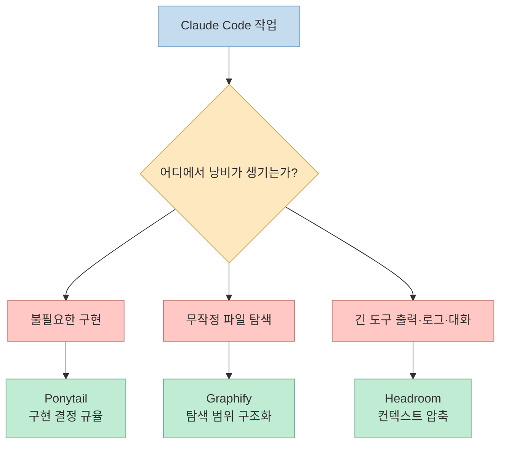
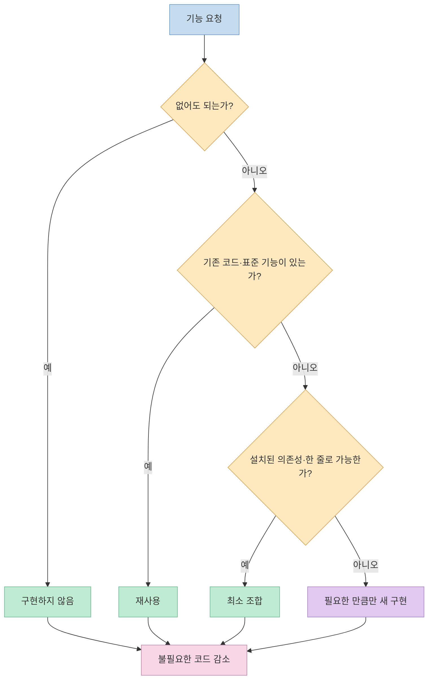
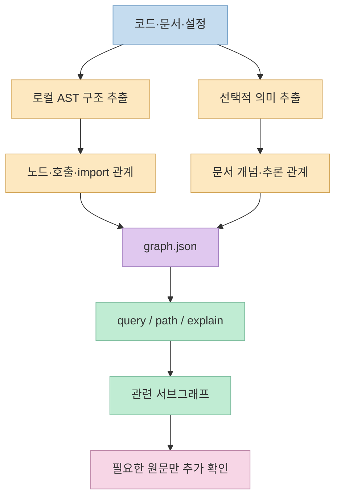
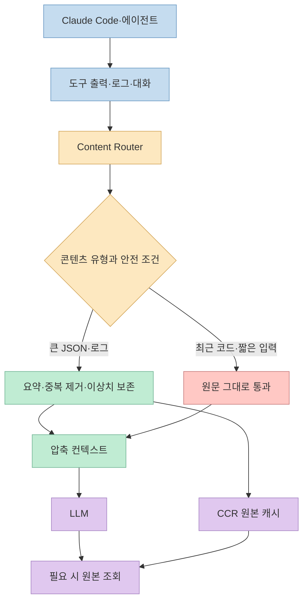
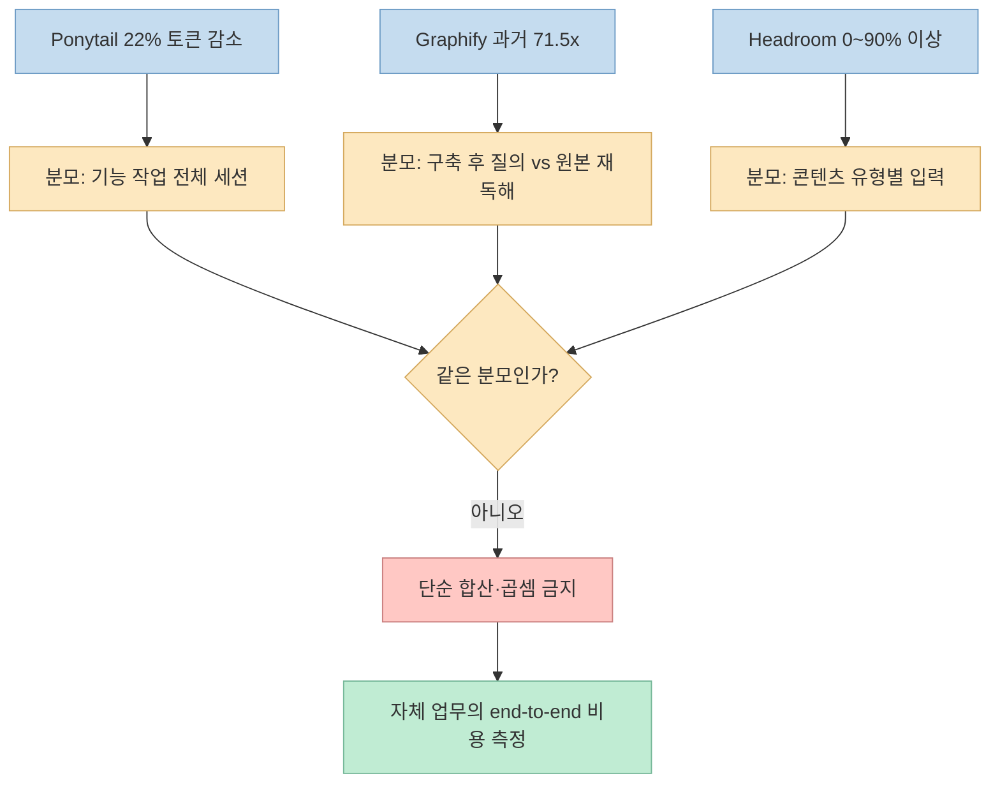
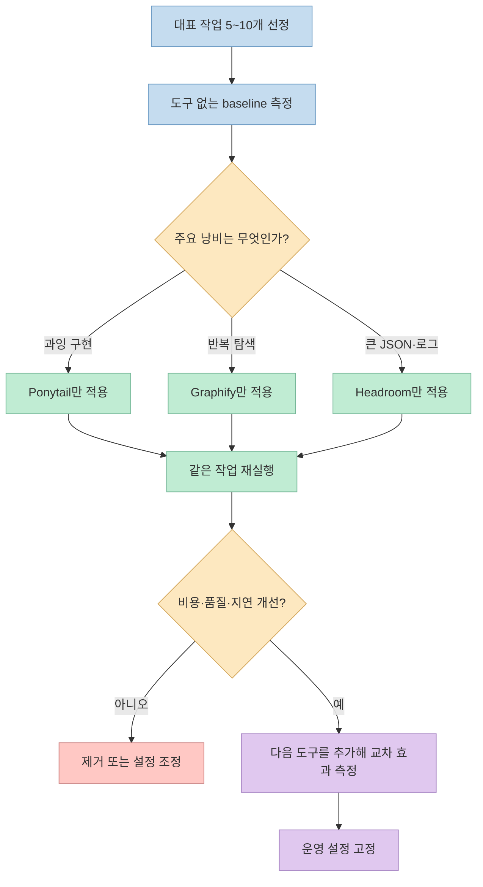
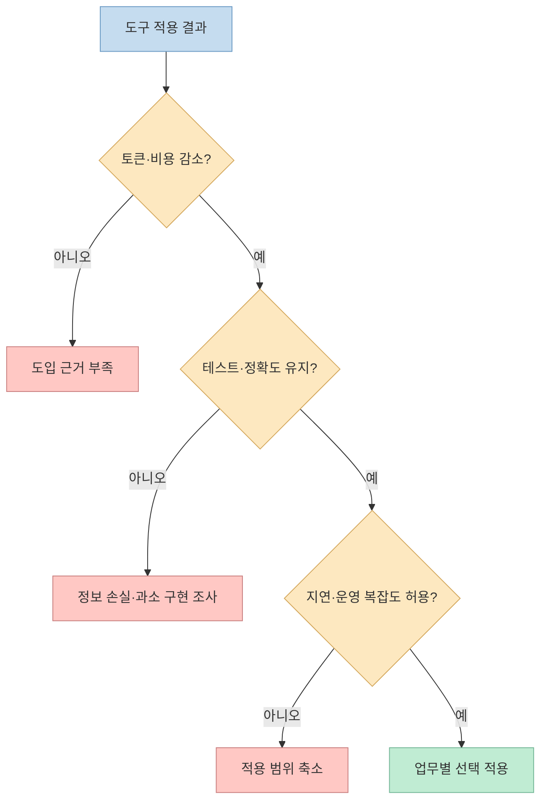

35초짜리 Shorts는 Ponytail, Graphify, Headroom을 함께 설치하면 Claude 사용량을 크게 줄일 수 있다고 소개합니다. Ponytail은 출력을 최적화해 50% 이상, Graphify는 코드베이스를 그래프로 만들어 70%, Headroom은 요청과 결과에서 불필요한 줄을 제거한다고 설명합니다. [영상 0:05](https://youtu.be/Ha-An1nsvX8?t=5)

방향은 흥미롭지만 세 도구는 같은 것을 압축하지 않습니다. **Ponytail은 구현 결정을, Graphify는 탐색 범위를, Headroom은 모델로 들어가는 컨텍스트를 줄입니다.** 따라서 절감률을 단순히 더할 수도 없고, 모든 Claude Code 작업에서 같은 효과가 난다고 말할 수도 없습니다.

공식 저장소의 최신 벤치마크로 확인하면 영상의 Ponytail 수치는 코드량과 토큰량을 혼동했고, Graphify의 수치는 현재 README에서 사라졌으며, Headroom은 데이터 형식에 따라 0%에서 90% 이상까지 편차가 큽니다. 세 도구가 유용하지 않다는 뜻이 아니라, **무엇을 측정한 숫자인지 구분해야 제대로 쓸 수 있다**는 뜻입니다.

<!--more-->

## Sources

- [원본 YouTube Shorts](https://youtube.com/shorts/Ha-An1nsvX8?si=2F7xkflvBuA7lJLQ)
- [Ponytail 공식 저장소](https://github.com/DietrichGebert/ponytail)
- [Ponytail agentic benchmark](https://github.com/DietrichGebert/ponytail/blob/main/benchmarks/results/2026-06-18-agentic.md)
- [Graphify 공식 저장소](https://github.com/Graphify-Labs/graphify)
- [Graphify v8 README](https://github.com/Graphify-Labs/graphify/blob/v8/README.md)
- [Graphify v4 README](https://github.com/Graphify-Labs/graphify/blob/v4/README.md)
- [Headroom 공식 저장소](https://github.com/headroomlabs-ai/headroom)
- [Headroom 공식 벤치마크](https://headroom-docs.vercel.app/docs/benchmarks)
- [Headroom 공식 한계 문서](https://headroom-docs.vercel.app/docs/limitations)

## 1. 영상의 주장부터 판정하기

영상은 "사람들이 전부 Claude 구독을 취소하고 있다"는 과장된 문장으로 시작합니다. [영상 0:00](https://youtu.be/Ha-An1nsvX8?t=0) 하지만 영상 안에는 구독 취소율, 조사 표본, Anthropic 실적 같은 근거가 제시되지 않습니다. 세 오픈소스 도구의 인기가 곧 Claude 구독 취소를 의미하지도 않습니다. 이 문장은 사실 주장이라기보다 주의를 끌기 위한 도입으로 읽어야 합니다.

반면 Ponytail의 GitHub 별이 9만 개를 넘었다는 말은 확인됩니다. 2026년 8월 1일 GitHub API 기준 저장소는 93,274 stars를 기록했습니다. 다만 별 개수는 계속 변하므로 이는 글 작성 시점의 스냅샷입니다. [영상 0:06](https://youtu.be/Ha-An1nsvX8?t=6) [GitHub API](https://api.github.com/repos/DietrichGebert/ponytail)

"세 개의 플러그인이 무료로 공개됐다"는 표현은 절반만 정확합니다. 세 저장소 모두 공개 소스이고 Ponytail은 MIT, Graphify와 Headroom은 Apache-2.0 라이선스입니다. 그러나 배포 형태는 서로 다릅니다.

- **Ponytail** 은 Claude Code와 Codex에서 실제 플러그인으로 설치할 수 있는 스킬·훅 묶음입니다.<br>
- **Graphify** 는 Python CLI를 먼저 설치한 뒤 AI 코딩 도구에 `/graphify` 스킬을 등록합니다.<br>
- **Headroom** 은 Python 라이브러리, 로컬 프록시, 에이전트 wrapper, MCP 서버를 함께 제공하는 컨텍스트 압축 계층입니다.<br>

[Ponytail README](https://github.com/DietrichGebert/ponytail) [Graphify v8 README](https://github.com/Graphify-Labs/graphify/blob/v8/README.md) [Headroom README](https://github.com/headroomlabs-ai/headroom)



이 구분이 이후의 모든 수치를 해석하는 기준입니다.

## 2. Ponytail: 50% 토큰 절감이 아니라 54% 코드량·22% 토큰 감소

영상은 Ponytail이 Claude Code의 출력을 최적화해 "사용량을 50% 넘게" 줄인다고 말합니다. [영상 0:08](https://youtu.be/Ha-An1nsvX8?t=8) 제목이 토큰 절감을 강조하므로 50%를 토큰 수치로 받아들이기 쉽지만, 최신 공식 벤치마크는 다른 결과를 보여 줍니다.

Ponytail은 모델 출력 문자열을 압축하는 도구가 아닙니다. 새 코드를 쓰기 전에 다음 순서로 멈출 지점을 찾도록 에이전트에 규율을 주는 스킬입니다.

1. 이 기능이 정말 필요한가?<br>
2. 코드베이스에 이미 있는가?<br>
3. 표준 라이브러리로 가능한가?<br>
4. 브라우저나 운영체제가 이미 제공하는가?<br>
5. 설치된 의존성을 재사용할 수 있는가?<br>
6. 한 줄로 끝낼 수 있는가?<br>
7. 그래도 필요할 때만 최소 구현을 작성한다.<br>

[Ponytail README](https://github.com/DietrichGebert/ponytail)



공식 agentic benchmark는 실제 Claude Code `2.1.177`과 Haiku 4.5를 사용해 FastAPI·React 저장소에서 12개 기능 작업을 수행했습니다. 각 작업과 조건을 4회 실행하고, 스킬을 쓰지 않은 동일 에이전트와 비교했습니다. 결과는 다음과 같습니다. [Ponytail benchmark](https://github.com/DietrichGebert/ponytail/blob/main/benchmarks/results/2026-06-18-agentic.md)

- 추가된 코드 라인: **54% 감소**<br>
- 전체 토큰: **22% 감소**<br>
- 비용: **20% 감소**<br>
- 실행 시간: **27% 감소**<br>
- 별도의 6개 안전성 과제: 알려진 가드 유지율 **100%**<br>

따라서 영상의 "50% 이상"은 **토큰이 아니라 코드 라인 감소율 54%와 가까운 숫자** 입니다. 실제 토큰 감소는 이 실험에서 22%였습니다. 더구나 효과는 작업마다 달랐습니다. 네이티브 날짜 입력으로 대체할 수 있는 작업은 코드가 94% 줄었지만, 이미 최소인 백엔드 CRUD에서는 거의 차이가 없었습니다.

벤치마크 자체도 한계를 공개합니다. 사용 모델은 Haiku 4.5 하나이고 `n=4`이며, 안전성 평가는 알려진 공격 입력에 대한 결정적 테스트이지 보안 증명이 아닙니다. 저장소는 이전의 80~94% 단일 응답 벤치마크가 말이 많은 baseline 때문에 Ponytail에 유리했다고 인정하고, 현재 수치를 더 방어 가능한 결과로 제시합니다. [Ponytail benchmark limitations](https://github.com/DietrichGebert/ponytail/blob/main/benchmarks/results/2026-06-18-agentic.md#limitations-so-this-cant-be-the-next-thing-someone-debunks)

핵심은 Ponytail의 목표가 "가장 적은 토큰"이 아니라는 점입니다. 저장소도 안전·검증·접근성을 잘라내지 않고 필요한 코드만 쓰는 것이 규칙이며, 비용 절감은 그 결과라고 명시합니다. 이미 간결한 코드나 더 오래 숙고하는 추론 모델에서는 토큰이 기대만큼 줄지 않을 수 있습니다.

## 3. Graphify: 코드 그래프는 맞지만 “70% 절감”의 현재 근거는 불명확하다

영상은 Graphify가 모든 코드 파일을 그래프로 연결하고 빠르게 검색해 이전보다 토큰을 70% 덜 쓴다고 설명합니다. [영상 0:14](https://youtu.be/Ha-An1nsvX8?t=14) 코드베이스를 그래프로 만든다는 설명은 맞지만 절감 수치는 현재 문서와 일치하지 않습니다.

Graphify v8은 코드의 클래스, 함수, import, 호출 관계를 tree-sitter AST로 로컬에서 추출합니다. 그 결과 `graph.html`, `GRAPH_REPORT.md`, `graph.json`을 만들고, 에이전트는 모든 원본 파일을 처음부터 grep하는 대신 `query`, `path`, `explain` 명령으로 필요한 부분을 좁힐 수 있습니다. 코드 자체는 LLM 없이 처리할 수 있지만 문서·PDF·이미지·영상의 의미 추출에는 설정한 모델이나 API가 필요합니다. [Graphify v8 README](https://github.com/Graphify-Labs/graphify/blob/v8/README.md)



과거 `v4` README에는 혼합 자료 모음에서 원본 파일을 매번 읽는 것과 비교해 "질의당 71.5배 적은 토큰"이라는 자체 측정이 있었습니다. 이는 70% 감소와 전혀 다른 단위입니다. 71.5배 적다면 산술상 약 98.6% 감소에 해당하지만, 최초 그래프 구축 비용을 지불한 뒤 반복 질의에서 얻는 절감이었습니다. [Graphify v4 README](https://github.com/Graphify-Labs/graphify/blob/v4/README.md)

더 중요한 변화는 최신 기본 브랜치 `v8`의 README에서 `71.5x`, `70%`, `tokens per query` 문구를 찾을 수 없다는 점입니다. 현재 문서는 LOCOMO·LongMemEval의 기억 검색 정확도와 로컬 그래프 구축 같은 다른 지표를 제시합니다. [Graphify v8 benchmarks](https://github.com/Graphify-Labs/graphify/blob/v8/README.md#benchmarks)

따라서 영상의 70%는 다음 중 무엇을 뜻하는지 확정할 수 없습니다.

- 과거 `71.5x` 표현을 70%로 잘못 옮긴 것인지<br>
- 특정 영상 제작자의 별도 테스트인지<br>
- 검색 단계의 입력 토큰만 계산한 것인지<br>
- 그래프 구축 비용까지 포함한 전체 세션 비용인지<br>

이 불확실성 때문에 Graphify의 가치는 고정 절감률보다 **반복해서 탐색하는 큰 저장소에서 사전 인덱스 비용을 회수할 수 있는가**로 판단하는 편이 정확합니다. 작은 저장소나 한 번만 묻는 작업에서는 그래프 구축이 오히려 추가 작업이 될 수 있습니다.

## 4. Headroom: 압축 계층은 맞지만 모든 줄을 지우는 도구는 아니다

영상은 Headroom이 요청과 결과에서 불필요한 줄을 압축·제거하고 필요한 부분만 통과시켜 같은 결과를 더 적은 토큰으로 낸다고 설명합니다. [영상 0:20](https://youtu.be/Ha-An1nsvX8?t=20) 큰 방향은 맞지만 기본 동작과 적용 범위를 더 세밀하게 구분해야 합니다.

Headroom의 중심 경로는 모델 호출 **이전** 입니다. 도구 출력, JSON, 로그, 파일, RAG 조각, 대화 이력을 분류해 압축한 뒤 LLM에 전달합니다. 원본은 CCR 캐시에 두고 필요하면 다시 가져올 수 있습니다. Python 라이브러리로 앱에 넣거나, 로컬 프록시로 요청을 가로채거나, `headroom wrap claude`로 Claude Code를 실행하거나, MCP 서버로 연결할 수 있습니다. [Headroom README](https://github.com/headroomlabs-ai/headroom)



출력 토큰도 줄일 수 있지만 별도 기능입니다. Headroom의 output shaper는 장황한 머리말, 코드 재출력, 단순 단계의 과도한 추론을 억제하도록 프록시 요청을 조정합니다. 이 기능은 기본적으로 꺼져 있으며 `HEADROOM_OUTPUT_SHAPER=1`을 설정해야 합니다. 그러므로 "요청과 결과를 항상 자동 압축한다"고 요약하면 기본 동작보다 넓은 주장입니다. [Headroom output reduction](https://github.com/headroomlabs-ai/headroom#output-token-reduction-cut-what-the-model-writes-back)

공식 벤치마크는 콘텐츠에 따라 효과가 크게 다름을 보여 줍니다.

- JSON 배열 100개: 3,163 → 297 tokens, **90.6% 감소**<br>
- 빌드 로그 200줄: 2,412 → 148 tokens, **93.9% 감소**<br>
- grep 결과 150개: **0% 감소**<br>
- Python 소스 약 480줄: **0% 감소**<br>
- 2026년 3~4월 5만 회 이상 프록시 세션의 압축률 중앙값: **4.8%**<br>
- 긴 도구 사용 세션: 문서가 제시하는 일반 범위 **40~80%**<br>

[Headroom benchmarks](https://headroom-docs.vercel.app/docs/benchmarks)

소스 코드와 grep 결과를 압축하지 않은 것은 실패가 아니라 안전 정책입니다. 최근 4개 메시지의 코드는 보호되고, 사용자가 `analyze`, `review`, `fix`, `debug` 같은 의도를 보이면 대화의 코드를 그대로 둡니다. 300 tokens보다 짧은 메시지와 작은 JSON 배열도 오버헤드가 더 클 수 있어 통과시킵니다. [Headroom limitations](https://headroom-docs.vercel.app/docs/limitations)

"같은 결과" 역시 모든 입력에 대한 수학적 보장은 아닙니다. 공식 JSON 테스트에서는 치명적 오류를 찾는 네 질문에 baseline과 Headroom이 모두 4/4 정답을 냈고, 일부 QA 평가에서도 정확도를 유지했습니다. 그러나 이는 해당 데이터셋과 설정에서의 결과입니다. 압축은 정보를 선택하는 과정이므로 실제 업무에서는 식별자, 오류 줄, 코드 문맥이 보존되는지 별도 회귀 테스트가 필요합니다.

## 5. 세 절감률을 더하거나 곱하면 안 되는 이유

세 도구의 숫자는 분모가 다릅니다.

- Ponytail은 한 기능 작업 전체에서 생성 코드 라인, 세션 토큰, 비용, 시간을 측정합니다.<br>
- Graphify의 과거 주장은 그래프 구축 후 한 번의 질의가 원본 전체 재독해보다 얼마나 작은지를 비교했습니다.<br>
- Headroom은 특정 도구 출력의 압축률과 전체 프록시 세션의 실측 압축률을 따로 제공합니다.<br>



겹치는 부분도 있습니다. Ponytail이 도구 호출과 생성 코드를 줄이면 Headroom이 압축할 입력 자체가 작아질 수 있습니다. Graphify가 grep 호출을 줄이면 Headroom의 로그 압축 기회도 줄어듭니다. 반대로 Graphify가 만든 보고서와 서브그래프가 새 컨텍스트로 들어오면 Headroom이 이를 다시 처리할 수 있습니다.

즉 함께 쓸 때의 절감은 독립 확률처럼 곱해지지 않습니다. **앞 단계가 제거한 낭비는 뒷 단계가 다시 제거할 수 없고**, 각 도구의 추가 지시문·훅·프록시·그래프 구축 비용도 생깁니다.

## 6. 세 도구를 함께 쓸 때 생기는 운영 비용과 위험

영상은 세 도구를 한 번에 설치하도록 준비했다고 말하고 댓글에 "토큰"을 남기라고 안내합니다. [영상 0:27](https://youtu.be/Ha-An1nsvX8?t=27) 하지만 공개 자막과 oEmbed 메타데이터에는 그 묶음 설치 파일이나 정확한 명령이 없습니다. 따라서 이 글은 해당 번들의 내용·권한·버전을 검증했다고 주장하지 않습니다.

공식 설치 경로는 각각 독립되어 있습니다.

```text
Ponytail: Claude Code plugin + lifecycle hooks
Graphify: Python CLI + coding-agent skill
Headroom: Python package + local proxy / wrapper / MCP
```

세 가지를 동시에 넣으면 다음 운영 표면이 늘어납니다.

1. **지시 충돌**: Ponytail의 최소 구현 규칙과 Graphify의 탐색 지시, 프로젝트의 기존 `CLAUDE.md`가 동시에 컨텍스트를 차지합니다.<br>
2. **훅 신뢰**: Ponytail은 lifecycle hook을 사용하므로 설치 후 `/hooks`에서 내용을 확인해야 합니다.<br>
3. **데이터 경로 변경**: Headroom wrapper는 로컬 프록시를 통해 모델 요청을 전달합니다. 로컬 우선 설계라도 인증·로그·원본 캐시 위치를 확인해야 합니다.<br>
4. **외부 전송 조건**: Graphify의 코드 AST 추출은 로컬이지만 문서·PDF·이미지 의미 추출은 선택한 AI 공급자로 전송될 수 있습니다.<br>
5. **업데이트 위험**: 세 저장소 모두 빠르게 변하고 있습니다. Graphify가 `v4`에서 `v8`로 바뀌며 대표 수치를 교체한 것처럼 설치법과 기본값도 달라질 수 있습니다.<br>
6. **원인 분석 어려움**: 한 번에 모두 켜면 어느 도구가 비용·품질·지연에 영향을 줬는지 알기 어렵습니다.<br>

무료 오픈소스라는 사실은 운영비 0원이나 무위험을 뜻하지 않습니다. 프록시 실행, 그래프 생성, 로컬 모델 다운로드, 추가 컨텍스트, 유지보수 시간이 새 비용으로 들어옵니다.

## 7. 실전 적용 포인트: 한 번에 설치하지 말고 층별로 검증하라

가장 안전한 도입 방법은 세 도구를 동시에 설치하는 것이 아니라 현재 병목에 맞춰 하나씩 검증하는 것입니다.



### 7.1 baseline을 먼저 남긴다

동일한 저장소와 모델에서 대표 작업을 정하고 다음 값을 기록합니다.

- 입력·출력·캐시·추론 토큰<br>
- 총비용과 완료 시간<br>
- 도구 호출 수와 읽은 파일 수<br>
- 추가·삭제된 코드 라인<br>
- 테스트 통과율과 사람의 수정 시간<br>

구독형 Claude Code에서 정확한 비용이 보이지 않으면 최소한 `/cost`·세션 로그·작업 시간·diff 크기를 같은 조건으로 비교합니다.

### 7.2 현재 병목에 맞는 첫 도구를 고른다

- 간단한 요구에도 UI와 추상화를 과도하게 만들면 **Ponytail** 을 먼저 시험합니다.<br>
- 큰 모노레포에서 같은 파일을 반복해서 grep하고 구조를 잊는다면 **Graphify** 를 시험합니다.<br>
- 테스트 로그, API 응답, 데이터베이스 행이 컨텍스트 대부분을 차지하면 **Headroom** 을 시험합니다.<br>

작은 CRUD 수정에 Graphify를 먼저 넣거나, 코드만 오가는 짧은 세션에 Headroom을 넣으면 추가 복잡도보다 절감이 작을 수 있습니다.

### 7.3 공식 경로로 하나씩 설치하고 권한을 확인한다

Ponytail의 Claude Code 공식 설치는 marketplace 추가와 plugin 설치의 두 단계입니다.

```text
/plugin marketplace add DietrichGebert/ponytail
/plugin install ponytail@ponytail
```

설치 후 `/hooks`에서 lifecycle hook을 검토하고 새 세션을 시작합니다. [Ponytail install](https://github.com/DietrichGebert/ponytail#install)

Graphify는 패키지 이름이 `graphifyy`, 실행 명령이 `graphify`라는 점에 주의합니다.

```bash
uv tool install graphifyy
graphify install
```

그다음 AI 코딩 도구에서 `/graphify .`를 실행합니다. 민감한 저장소라면 코드만 로컬 AST로 처리하고, 문서·미디어용 backend 설정과 데이터 전송 범위를 먼저 확인합니다. [Graphify install](https://github.com/Graphify-Labs/graphify/blob/v8/README.md#get-started-30-seconds)

Headroom은 CLI가 필요한 경우 Python 패키지를 사용합니다. npm 패키지는 TypeScript SDK이며 `headroom` CLI를 제공하지 않습니다.

```bash
uv tool install --python 3.13 "headroom-ai[all]"
headroom wrap claude
headroom doctor
headroom perf
```

프록시가 어떤 endpoint와 캐시 디렉터리를 사용하는지 확인하고, 처음에는 output shaper를 켜지 않은 기본 상태로 입력 압축 효과부터 측정합니다. [Headroom install](https://github.com/headroomlabs-ai/headroom#install)

### 7.4 성공 조건은 토큰 하나가 아니다

토큰이 줄어도 테스트 실패와 사람의 수정 시간이 늘면 총비용은 악화됩니다. 다음 조건을 함께 통과해야 합니다.



Ponytail에는 누락된 요구사항, Graphify에는 오래된 그래프와 잘못 연결된 관계, Headroom에는 압축 과정에서 사라진 세부 정보가 대표적인 실패 신호입니다. 각 도구의 대시보드나 결과 파일만 보지 말고 실제 테스트와 코드 리뷰로 검증해야 합니다.

## 핵심 요약

- Shorts의 "Claude 구독을 모두 취소한다"는 도입은 근거가 없는 과장입니다.<br>
- Ponytail의 최신 공식 실험은 12개 기능 작업에서 코드 라인 54%, 토큰 22%, 비용 20%, 시간 27% 감소를 보고했습니다. 영상의 50%를 토큰 절감률로 읽으면 틀립니다.<br>
- Graphify는 코드와 문서를 지식 그래프로 바꾸고 질의 범위를 좁히는 도구입니다. 과거 `v4`의 71.5배 질의 토큰 주장은 최신 `v8` README에서 제거됐으며 영상의 70% 근거는 확인되지 않습니다.<br>
- Headroom은 JSON·로그에서 큰 압축률을 내지만 코드와 grep 결과는 안전을 위해 통과시킬 수 있습니다. 실제 프록시 세션의 압축률 중앙값은 4.8%였습니다.<br>
- Ponytail은 플러그인, Graphify는 CLI+스킬, Headroom은 라이브러리·프록시·MCP이므로 모두 같은 종류의 플러그인이 아닙니다.<br>
- 세 도구는 분모와 작동 층이 달라 절감률을 합산할 수 없습니다.<br>
- 한 번에 설치하지 말고 baseline을 남긴 뒤 현재 병목에 맞는 도구를 하나씩 추가해야 합니다.<br>

## 결론

이 Shorts가 소개한 세 프로젝트는 모두 실제로 존재하며, Claude Code 비용을 줄일 수 있는 유효한 아이디어를 담고 있습니다. 다만 "세 플러그인을 깔면 같은 결과를 훨씬 적은 토큰으로 얻는다"는 한 문장으로 묶으면 각 도구의 목적과 측정 조건이 사라집니다.

Ponytail은 **덜 만들게 하고**, Graphify는 **덜 헤매게 하며**, Headroom은 **덜 보내게 합니다**. 가장 좋은 조합은 세 개를 무조건 모두 켜는 것이 아니라, 내 세션에서 어느 낭비가 가장 큰지 측정한 뒤 그 층에만 개입하는 조합입니다.

결국 토큰 절감의 핵심은 도구 개수가 아니라 **측정 가능한 baseline, 명확한 적용 범위, 테스트로 확인한 품질** 입니다.
