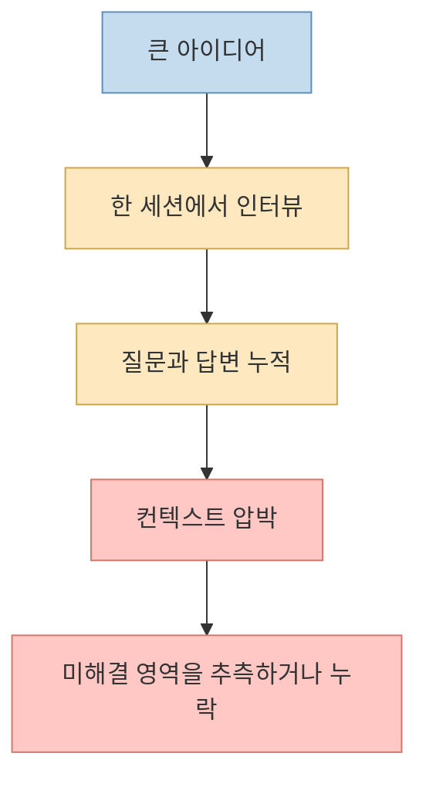
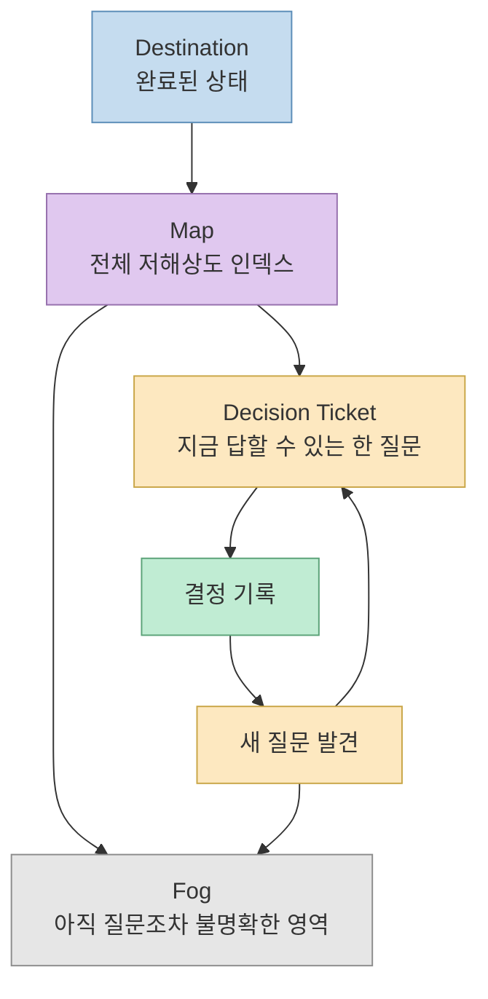
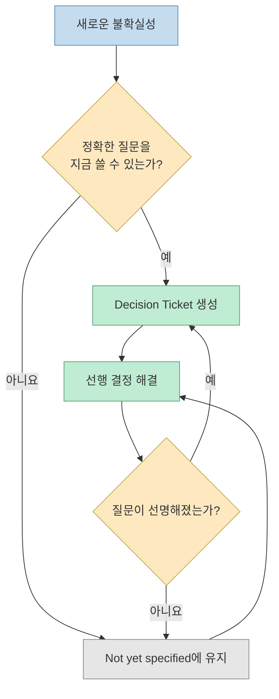
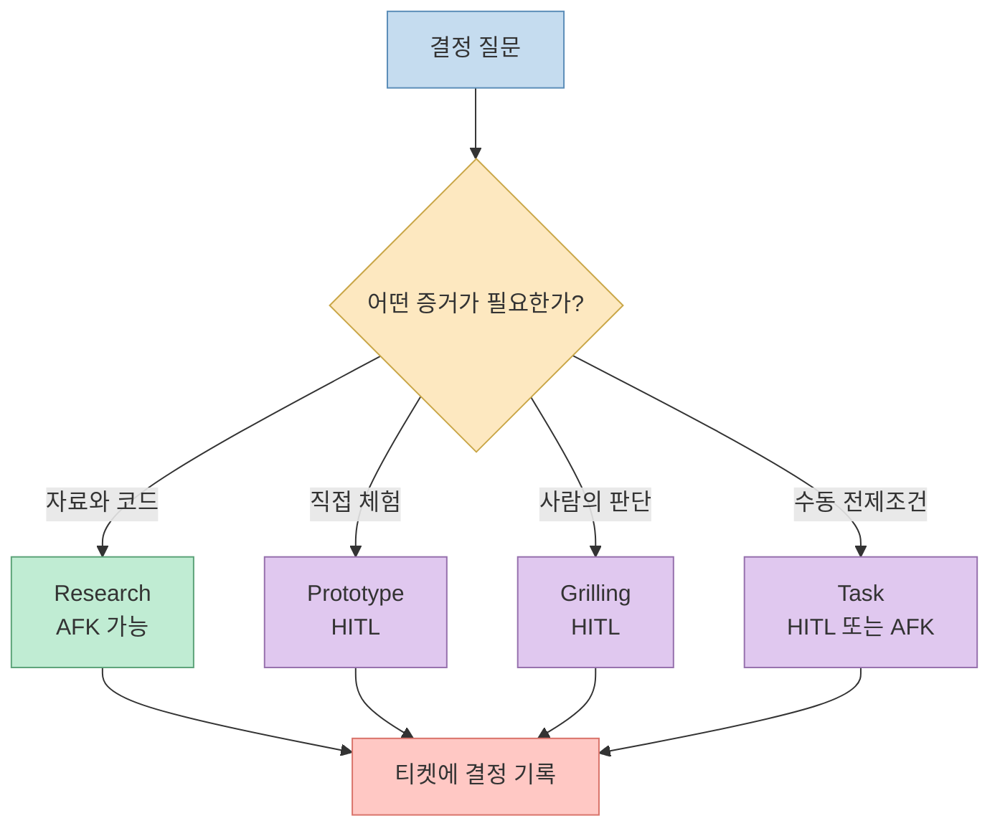
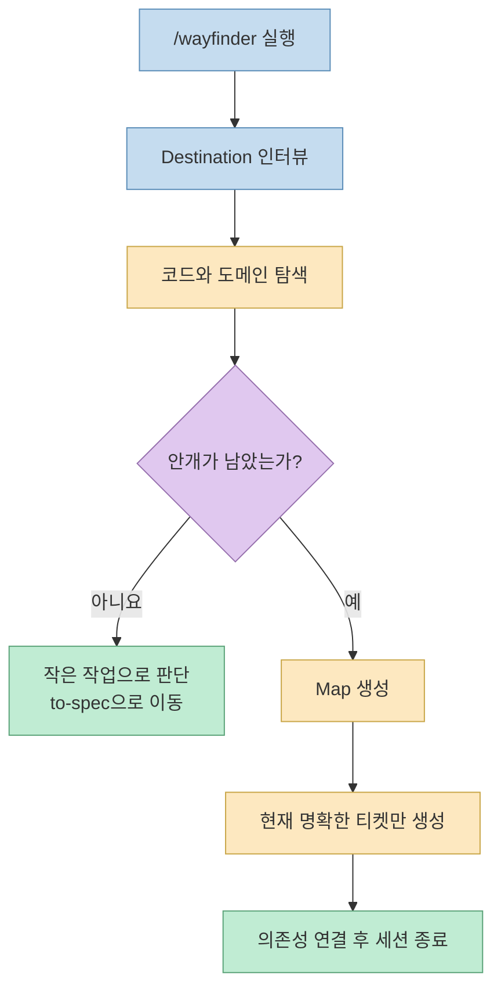
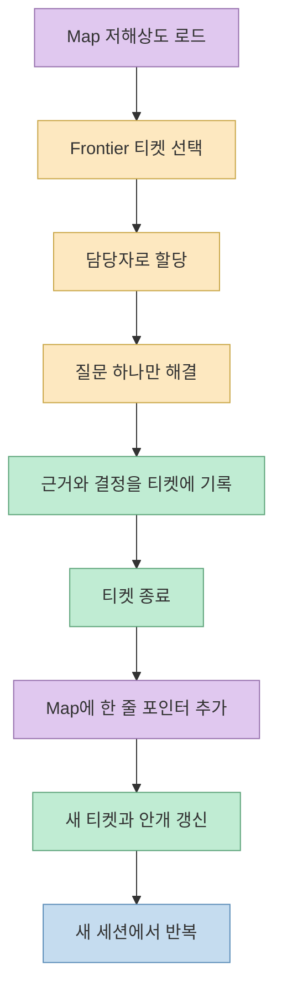
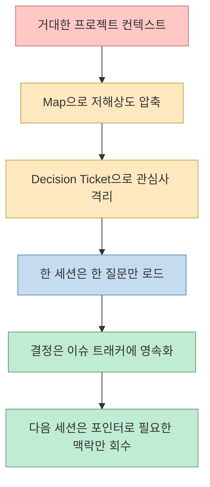
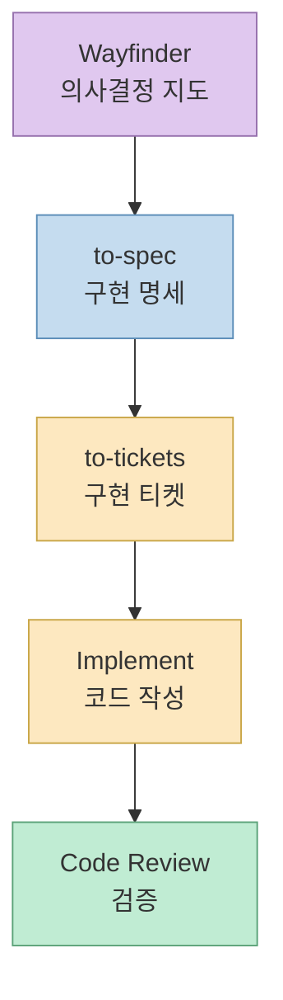
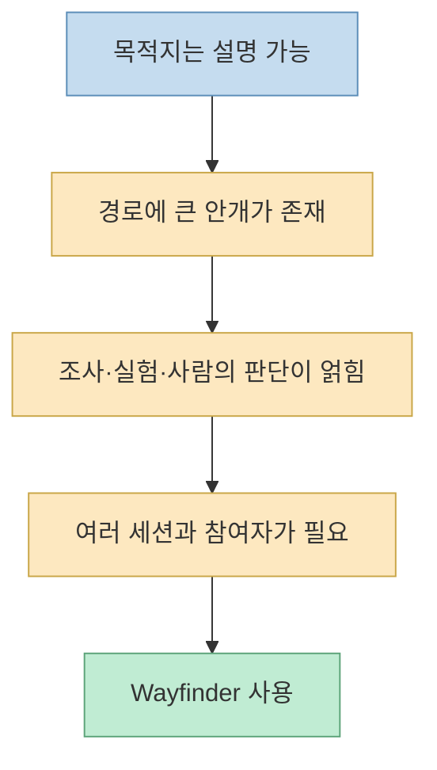
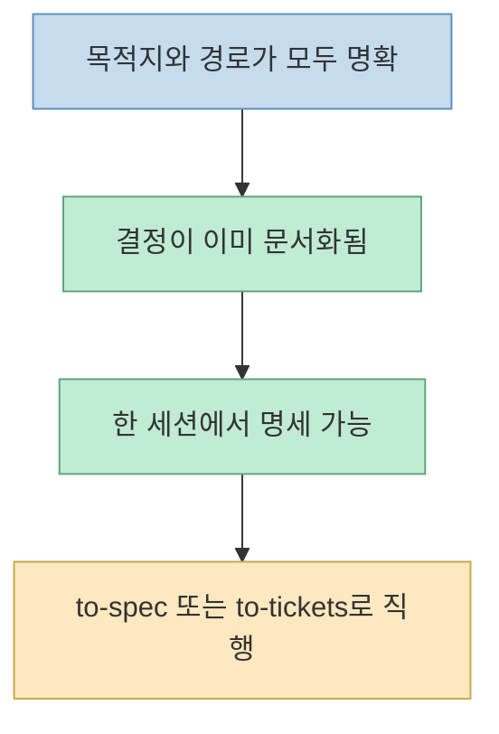

[Threads 원문](https://www.threads.com/share/BAN0qiWZz_/)은 Matt Pocock이 공개한 `wayfinder`를 “작업 규모의 한계를 없애는” 새 스킬로 소개합니다. 출발점과 목적지만 정하고, 그 사이가 안개처럼 불분명한 거대한 작업을 여러 세션에 걸쳐 조사·프로토타이핑·질문·작업 티켓으로 풀어 간다는 설명입니다. [원문의 정규 주소](https://www.threads.com/@takepage_/post/DbfViFuj1lh)와 [공식 Wayfinder 문서](https://github.com/mattpocock/skills/blob/main/docs/engineering/wayfinder.md)를 함께 읽으면 큰 방향은 맞지만, 표현은 조금 다듬을 필요가 있습니다.

Wayfinder가 모델의 컨텍스트 윈도우를 무한하게 만들거나 복잡성 자체를 제거하는 것은 아닙니다. 대신 **한 세션에 담기 어려운 의사결정을 이슈 트래커의 지도와 티켓으로 외부화** 하고, 각 세션이 한 가지 질문만 해결하도록 만듭니다. 즉 한계를 없애는 기술이 아니라, 한계를 전제로도 계속 전진할 수 있게 만드는 **컨텍스트 엔지니어링 프로토콜** 에 가깝습니다.
<!--more-->

## Sources

- [Threads 공유 링크](https://www.threads.com/share/BAN0qiWZz_/)
- [Threads 원문 정규 주소](https://www.threads.com/@takepage_/post/DbfViFuj1lh)
- [Matt Pocock의 skills 저장소](https://github.com/mattpocock/skills)
- [Wayfinder 스킬 원문](https://github.com/mattpocock/skills/blob/main/skills/engineering/wayfinder/SKILL.md)
- [Wayfinder 공식 문서](https://github.com/mattpocock/skills/blob/main/docs/engineering/wayfinder.md)
- [to-spec 스킬 원문](https://github.com/mattpocock/skills/blob/main/skills/engineering/to-spec/SKILL.md)
- [to-spec 공식 문서](https://github.com/mattpocock/skills/blob/main/docs/engineering/to-spec.md)
- [grill-me 공식 문서](https://github.com/mattpocock/skills/blob/main/docs/productivity/grill-me.md)
- [grill-with-docs 공식 문서](https://github.com/mattpocock/skills/blob/main/docs/engineering/grill-with-docs.md)
- [skills 변경 기록](https://github.com/mattpocock/skills/blob/main/CHANGELOG.md)

## 1. 기존 인터뷰형 스킬은 왜 큰 작업에서 멈추는가

Matt Pocock의 [`grill-me`](https://github.com/mattpocock/skills/blob/main/docs/productivity/grill-me.md)는 사용자의 아이디어를 한 번에 하나의 질문으로 집요하게 파고드는 스킬입니다. [`grill-with-docs`](https://github.com/mattpocock/skills/blob/main/docs/engineering/grill-with-docs.md)는 여기에 코드베이스의 공유 언어와 ADR을 더합니다. 요구사항을 선명하게 만드는 데는 강력하지만, 공식 문서는 두 스킬 모두 기본적으로 **현재 대화 안에서 인터뷰를 끝내는 방식** 이라고 설명합니다.

작업의 전체 경로가 이미 보인다면 이것으로 충분합니다. 그러나 인증 체계를 교체하면서 권한 모델, 데이터 마이그레이션, 외부 연동, 롤백 정책까지 다시 설계해야 하는 프로젝트처럼 “무엇을 물어야 할지도 아직 모르는” 작업은 다릅니다. 처음부터 모든 질문을 나열하려 하면 추측으로 티켓을 만들게 되고, 한 세션에서 끝까지 인터뷰하려 하면 컨텍스트가 먼저 소진됩니다.



Wayfinder는 이 문제를 “더 긴 프롬프트”로 해결하지 않습니다. 계획 자체를 여러 세션이 공유할 수 있는 외부 구조로 바꿉니다.

## 2. Wayfinder의 핵심 모델: 목적지, 지도, 티켓, 안개

[공식 스킬 문서](https://github.com/mattpocock/skills/blob/main/skills/engineering/wayfinder/SKILL.md)는 먼저 **Destination**, 즉 도착 상태를 고정하라고 요구합니다. “인증 리팩터링”처럼 활동을 적는 것이 아니라 “기존 세션을 중단하지 않고 새 권한 모델로 전환되며, 되돌리는 절차까지 검증된 상태”처럼 완료된 세계를 정의하는 것입니다. 이 목적지가 작업 범위의 기준선이 됩니다.

그다음 하나의 이슈를 **Map** 으로 만들고, 해결해야 할 질문을 자식 이슈인 **Decision Ticket** 으로 분리합니다. 아직 질문을 정확히 말할 수 없는 영역은 억지로 티켓화하지 않고 **Fog**, 즉 `Not yet specified`에 둡니다. 선행 질문이 해결되어 정확한 질문으로 표현할 수 있게 될 때만 안개에서 티켓으로 승격합니다.



여기서 중요한 규칙은 **지도는 저장소가 아니라 인덱스** 라는 점입니다. 지도에는 목적지, 지금까지 확정된 결정, 아직 구체화하지 못한 영역, 범위 밖 항목을 짧게 유지합니다. 결정의 상세 근거와 결과는 각각의 티켓에 한 번만 기록하고, 지도에는 그 티켓을 가리키는 한 줄짜리 컨텍스트 포인터만 추가합니다. 전체 내용을 매 세션에 다시 읽히지 않는 것이 핵심입니다.

## 3. “안개”를 인정하는 것이 오히려 계획의 정확도를 높인다

일반적인 계획 문서는 시작 시점에 작업 목록을 완성하려 합니다. 경로가 불분명할수록 그 목록은 사실이 아니라 추측에 가까워집니다. Wayfinder는 정확한 질문을 지금 말할 수 있는지를 경계로 삼습니다.

- 질문은 정확하지만 답을 모른다 → 티켓
- 무엇을 질문해야 할지 아직 모른다 → 안개
- 목적지에 필요하지 않다 → 범위 밖



이 방식은 “미정”을 계획 실패로 취급하지 않습니다. 선행 결정이 뒤의 질문을 바꿀 수 있다는 사실을 모델에 포함합니다. 따라서 처음부터 수십 개의 가짜 정밀도 티켓을 만드는 대신, 현재 보이는 최전선까지만 계획합니다.

## 4. 네 가지 티켓은 서로 다른 불확실성을 처리한다

Threads 원문과 공식 문서는 티켓을 네 종류로 나눕니다. 이름만 다른 것이 아니라 사람의 참여 방식과 산출물이 다릅니다.

### Research

문서, 코드, 외부 시스템을 조사해야 답할 수 있는 질문입니다. 공식 문서는 `/research` 서브에이전트를 사용해 백그라운드에서 진행할 수 있는 AFK 작업으로 봅니다. 단, 조사 결과는 목적지 구현물이 아니라 **의사결정에 필요한 증거** 여야 합니다.

### Prototype

말로는 판단하기 어려워 실제 감각을 얻어야 할 때 쓰는 거친 실험입니다. 사용자가 직접 보고 판단해야 하므로 HITL 작업입니다. 프로토타입은 증거를 만들기 위한 일회용 산출물이지, 운영 코드로 자연스럽게 승격되는 구현물이 아닙니다.

### Grilling

선호, 정책, 제품 의도처럼 사람에게 물어야만 답할 수 있는 질문입니다. 한 번에 한 질문씩 인터뷰하며, 역시 HITL입니다.

### Task

다른 결정을 가능하게 만드는 수동 선행 작업입니다. 네 유형 중 실제로 무언가를 수행하는 유형이지만, 목적지 자체를 구현하는 태스크는 아닙니다. 예를 들어 샘플 데이터 확보나 접근 권한 승인처럼 결정의 전제조건을 해결합니다.



## 5. Wayfinder는 두 가지 모드로 움직인다

### 모드 1: 지도를 그린다

처음 `/wayfinder`를 실행하면 목적지를 인터뷰하고, 코드베이스와 도메인을 넓게 훑으며 첫 지도를 만듭니다. 이미 경로가 명확해 안개가 없다면 공식 문서는 조기에 종료하고 `to-spec`으로 넘어가라고 안내합니다. Wayfinder를 모든 작업의 기본 절차로 강제하지 않는다는 뜻입니다.

안개가 남아 있다면 현재 정확히 말할 수 있는 질문만 티켓으로 만들고, 선행 관계를 연결합니다. 조사 티켓은 병렬 서브에이전트로 보낼 수 있지만, **지도 작성 세션에서는 티켓을 해결하지 않고 멈춥니다.** 계획과 해결을 한 세션에 섞지 않기 위한 경계입니다.



### 모드 2: 최전선 티켓 하나를 해결한다

다음 세션에서는 전체 지도를 저해상도로 읽고 **Frontier** 를 찾습니다. Frontier는 열려 있고, 선행 티켓에 막히지 않았으며, 아직 다른 세션이 맡지 않은 자식 이슈입니다. 세션은 첫 최전선 티켓을 자신에게 할당해 충돌을 막고, 그 질문 하나만 해결합니다.

결정이 끝나면 티켓에 근거를 남기고 닫습니다. 지도에는 상세 내용을 복사하지 않고 한 줄짜리 포인터를 추가합니다. 그 결정으로 새 질문이 보이면 티켓을 추가하고, 기존 안개가 선명해졌다면 티켓으로 승격합니다. 공식 문서는 Research를 제외하면 한 세션에서 두 개 이상의 티켓을 해결하지 말라고 명시합니다.



## 6. 컨텍스트 한계를 “제거”하는 대신 “격리”한다

공식 문서에서 가장 중요한 숫자는 각 티켓을 **하나의 100K 토큰 에이전트 세션에 들어갈 크기** 로 제한한다는 규칙입니다. 이것은 무한 컨텍스트가 생긴다는 말과 정반대입니다. 각 세션의 한계를 인정하고, 큰 문제를 독립적인 결정 단위로 격리합니다.

한 세션이 읽어야 하는 것은 전체 프로젝트의 모든 대화가 아닙니다.

1. 짧은 목적지와 지도
2. 지금 맡은 티켓의 질문
3. 이 질문을 막고 있던 선행 결정의 포인터
4. 필요한 코드와 외부 자료



따라서 Wayfinder의 확장성은 모델이 모든 것을 기억해서 나오지 않습니다. **동시에 기억할 필요가 없도록 작업 그래프를 설계** 한 데서 나옵니다. 이슈 할당으로 병렬 세션의 충돌을 막고, 네이티브 의존성으로 막힌 티켓을 표시하며, 결정의 원본 위치를 하나로 제한해 드리프트를 줄입니다.

## 7. Wayfinder는 구현기가 아니라 사양의 상류 단계다

공식 문서는 Wayfinder의 기본 원칙을 “Plan, don't do”라고 표현합니다. 목적지 구현물을 만드는 것이 아니라, 구현 전에 내려야 할 결정이 더 이상 없을 때 지도가 완성됩니다. 이후에는 [`to-spec`](https://github.com/mattpocock/skills/blob/main/docs/engineering/to-spec.md)이 지도와 대화, 코드베이스를 하나의 명세로 합성하고, `to-tickets`가 구현 단위로 쪼갭니다.



Threads 원문에는 구현이 끝나면 Wayfinder의 스펙이나 이슈를 지워도 된다는 취지의 설명이 있습니다. 그러나 **현재 공식 Wayfinder·to-spec 문서에서는 이 삭제 정책을 확인할 수 없습니다.** 오히려 현재 문서는 결정이 각 티켓에 존재하고 지도가 그 위치를 가리킨다고 설명합니다. 따라서 삭제 주장은 원문 작성자의 해석, 다른 버전의 동작, 또는 별도 운영 방침일 가능성이 있으며 공식 기능으로 단정하면 안 됩니다.

또한 Threads에서 언급된 “GitHub 글자 제한을 넘긴 실제 스펙”도 원문 사례로는 볼 수 있지만, 연결된 공식 문서만으로 해당 사례의 크기와 결과를 독립적으로 검증할 수는 없습니다. 이 글에서는 Wayfinder의 구조를 설명하는 근거로 사용하지 않았습니다.

## 8. 언제 쓰고, 언제 쓰지 않아야 하나

Wayfinder는 복잡한 작업을 멋지게 보이게 만드는 장식이 아닙니다. [공식 문서의 안내](https://github.com/mattpocock/skills/blob/main/docs/engineering/wayfinder.md)처럼 목적지는 알지만 경로 사이에 안개가 많고, 한 세션으로 결정을 끝낼 수 없을 때 쓰는 상황형 진입로입니다.

### Wayfinder가 맞는 작업



- 대규모 마이그레이션처럼 선행 결정이 다음 질문을 바꾸는 작업
- 기술 조사, 프로토타입, 제품 판단이 동시에 필요한 신규 시스템
- 여러 에이전트나 사람이 같은 불확실성 그래프를 공유해야 하는 프로젝트
- 코딩을 넘어 조직 개편, 출시 전략처럼 결정 경로가 긴 프로젝트

### Wayfinder가 과한 작업



- 재현 절차와 수정 범위가 명확한 버그
- 요구사항과 설계가 이미 합의된 작은 기능
- 독립적인 할 일 목록으로 바로 나눌 수 있는 작업
- 이슈 트래커 운영비가 실제 불확실성보다 더 큰 작업

## 9. 설치와 실전 운영

공식 저장소의 빠른 설치 명령은 다음과 같습니다.

```bash
npx skills add mattpocock/skills --skill=wayfinder
```

업데이트는 다음 명령을 사용합니다.

```bash
npx skills update wayfinder
```

Wayfinder는 먼저 `/setup-matt-pocock-skills`를 통해 이슈 트래커를 설정하도록 요구합니다. 현재 문서는 GitHub, GitLab, 로컬 Markdown 트래커를 지원하며, 설정이 없다면 로컬 Markdown으로 폴백한다고 설명합니다. 실제 시작 프롬프트는 구현 방법이 아니라 목적지를 중심으로 쓰는 편이 좋습니다.

```text
/wayfinder

기존 사용자의 로그인 세션을 중단하지 않고 새 권한 모델로 전환하고,
데이터 마이그레이션과 롤백 절차가 검증된 상태에 도달하고 싶다.
```

운영할 때는 다음 규칙을 지키는 것이 중요합니다.

1. 목적지를 활동이 아니라 검증 가능한 완료 상태로 쓴다.
2. 지도에는 상세 내용을 복사하지 않고 결정 티켓 링크만 남긴다.
3. 질문이 불명확하면 가짜 티켓을 만들지 말고 안개에 둔다.
4. 티켓을 시작하기 전에 담당자를 할당해 병렬 충돌을 막는다.
5. Research 외에는 세션당 하나의 티켓만 해결한다.
6. 프로토타입을 운영 코드로 착각하지 않는다.
7. 결정이 모두 끝난 뒤에만 `to-spec`으로 구현 명세를 만든다.

기존에 `grill-with-docs`로 공유 언어와 ADR을 관리하고 있다면 둘은 경쟁 관계가 아닙니다. [이전 글에서 정리한 `grill-with-docs`](/post/2026/06/2026-06-03-grill-with-docs-context-adr-shared-language/)가 한 세션의 인터뷰 결과를 코드베이스 문서에 고정한다면, Wayfinder는 여러 세션에 걸친 **미해결 의사결정의 위치와 순서** 를 이슈 트래커에 고정합니다.

## 10. 도입 전에 알아야 할 비용과 위험

Wayfinder는 규모의 상한을 공짜로 없애지 않습니다. 컨텍스트 비용을 운영 비용으로 교환합니다.

- **트래커 위생**: 티켓 상태, 담당자, 선행 관계가 낡으면 Frontier 판단도 틀립니다.
- **중복 진실**: 결정을 지도와 티켓 양쪽에 자세히 복사하면 어느 쪽이 최신인지 알 수 없습니다.
- **사람 병목**: Grilling과 Prototype은 사람의 판단을 피할 수 없습니다. AFK 자동화로 위장하면 중요한 제품 결정이 모델의 추측으로 바뀝니다.
- **조사 신뢰도**: Research 티켓은 출처와 불확실성을 기록해야 합니다. 자동 조사 결과가 곧 결정은 아닙니다.
- **프로세스 과잉**: 경로가 선명한 작은 작업에 쓰면 이슈 관리가 구현보다 커집니다.
- **권한과 보안**: 에이전트가 이슈를 만들고 수정하며 담당자를 배정하려면 트래커 권한과 감사 기준이 필요합니다.

따라서 성공 지표는 티켓 수가 아닙니다. 새 세션이 전체 역사를 다시 읽지 않고도 현재 질문, 선행 결정, 완료 조건을 정확히 복원할 수 있는지가 더 중요합니다.

## 실전 적용 포인트

처음부터 조직 전체에 도입하기보다, 한 세션을 넘긴 실제 프로젝트 하나에 시험하는 편이 좋습니다.

1. 과거에 컨텍스트 손실로 반복 설명이 많았던 프로젝트를 고른다.
2. 도착 상태를 한 문단으로 작성하고 이해관계자와 합의한다.
3. 첫 지도에는 정확히 말할 수 있는 질문만 넣는다.
4. 티켓 하나를 다른 사람이 이어받아도 해결 가능한지 확인한다.
5. 결정 티켓을 닫은 뒤 지도에는 한 줄 요약과 링크만 남긴다.
6. 매주 `Not yet specified`가 티켓으로 자연스럽게 승격되는지 점검한다.
7. 명세가 완성된 뒤 재설명 시간, 중복 질문, 충돌 티켓이 실제로 줄었는지 측정한다.

이 실험에서 지도와 티켓을 유지하는 시간이 재설명 비용보다 크다면 Wayfinder를 쓰지 않는 것이 맞습니다. 반대로 새 세션의 온보딩 시간이 줄고, 미해결 질문의 위치가 명확해진다면 그때 더 큰 작업으로 확장하면 됩니다.

## 핵심 요약

- Wayfinder는 컨텍스트 윈도우를 무한하게 만들지 않는다.
- 큰 작업을 목적지, 지도, 결정 티켓, 안개로 나눠 여러 세션에 걸쳐 탐색한다.
- 지도는 상세 저장소가 아니라 결정 위치를 가리키는 저해상도 인덱스다.
- Research, Prototype, Grilling, Task 티켓이 서로 다른 불확실성을 처리한다.
- 질문을 아직 정확히 말할 수 없다면 억지로 티켓을 만들지 않고 안개에 둔다.
- 기본 원칙은 계획이지 구현이 아니며, 결정이 끝난 뒤 `to-spec`과 구현 흐름으로 넘어간다.
- Threads의 “구현 후 스펙·이슈 삭제” 설명은 현재 공식 문서로 확인되지 않으므로 운영 정책으로 단정하면 안 된다.

## 결론

Wayfinder의 진짜 아이디어는 “AI에게 거대한 작업을 한 번에 맡긴다”가 아닙니다. **거대한 작업을 한 번에 이해할 필요가 없는 의사결정 시스템으로 바꾼다** 는 데 있습니다. 목적지는 고정하되 경로의 안개를 인정하고, 현재 보이는 질문 하나만 해결하며, 결정의 근거를 외부 트래커에 남깁니다.

이 구조가 잘 작동하면 각 에이전트 세션은 짧은 기억을 가진 채로도 긴 프로젝트에 참여할 수 있습니다. 하지만 지도와 티켓이 저절로 정확해지는 것은 아닙니다. 담당자, 의존성, 출처, 사람의 판단을 꾸준히 관리해야 합니다. 그래서 Wayfinder는 규모의 한계를 제거하는 마법이라기보다, **제한된 컨텍스트를 전제로 거대한 불확실성을 다루는 운영 규율** 이라고 보는 편이 정확합니다.
