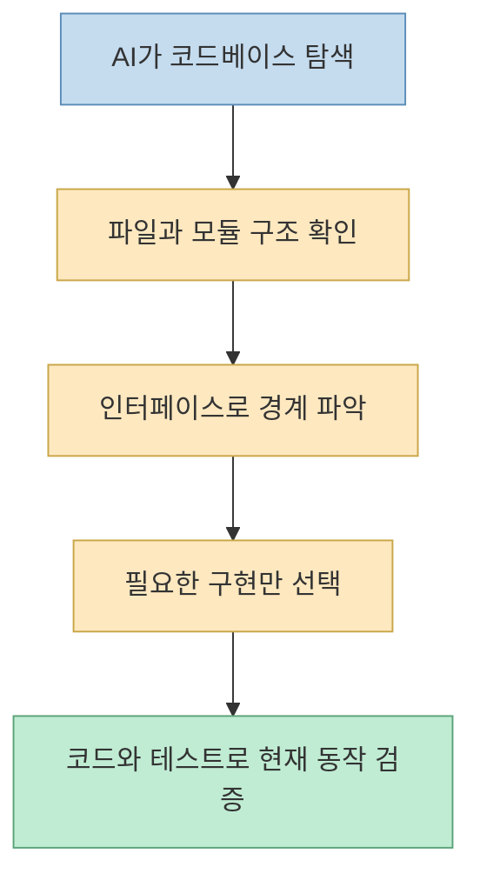
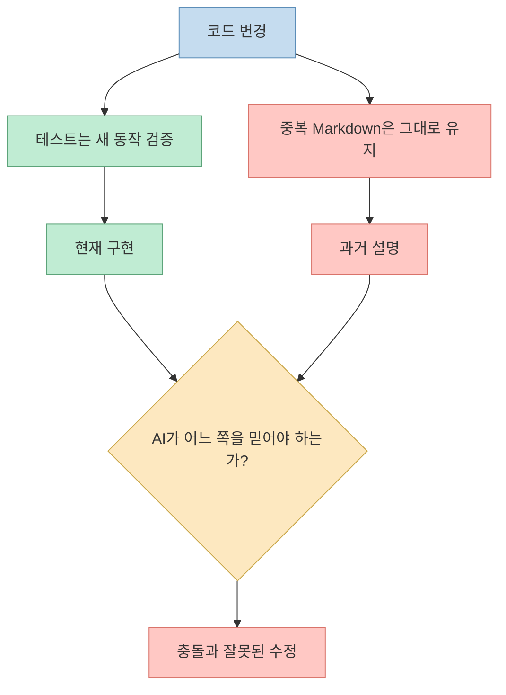
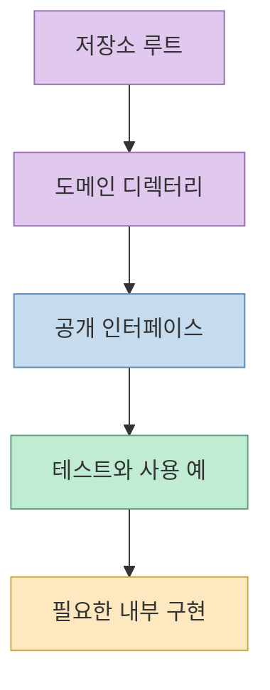
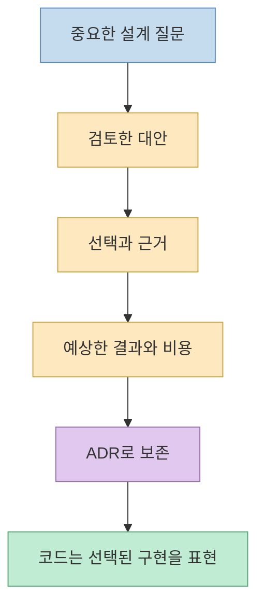
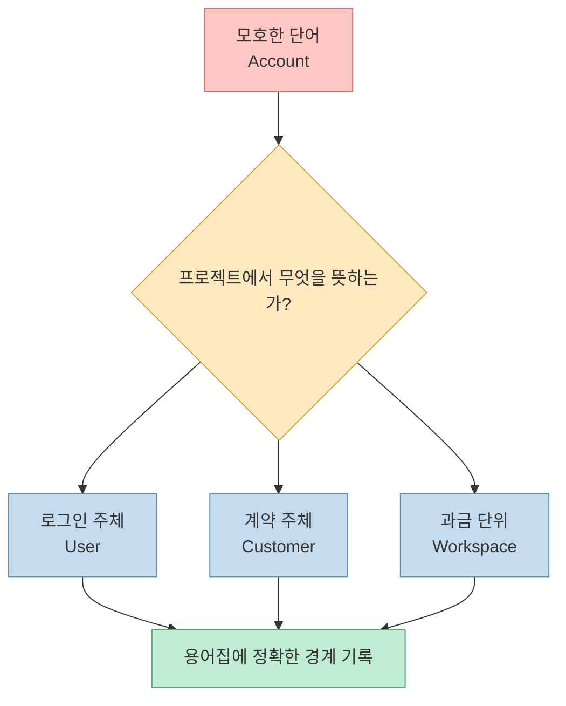
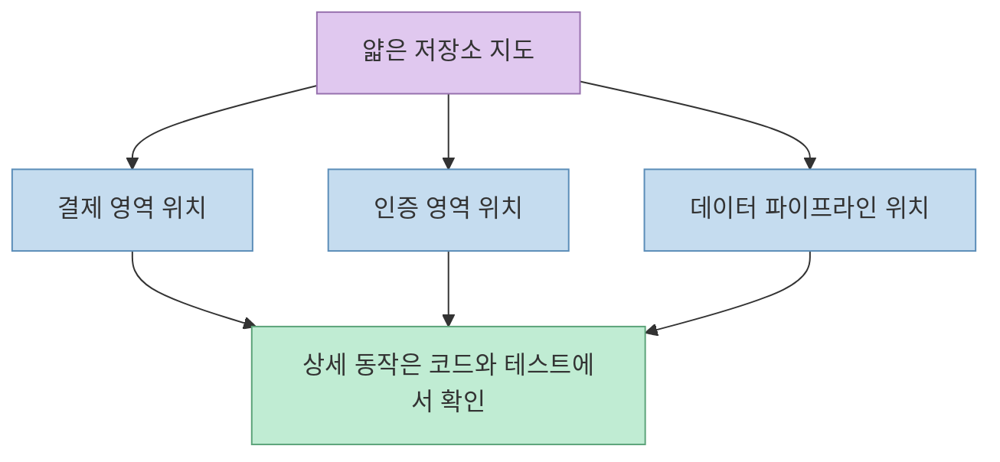
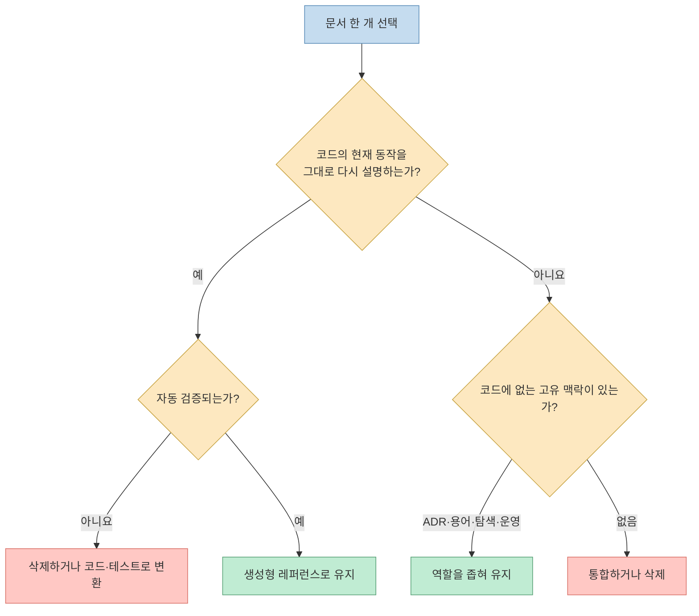
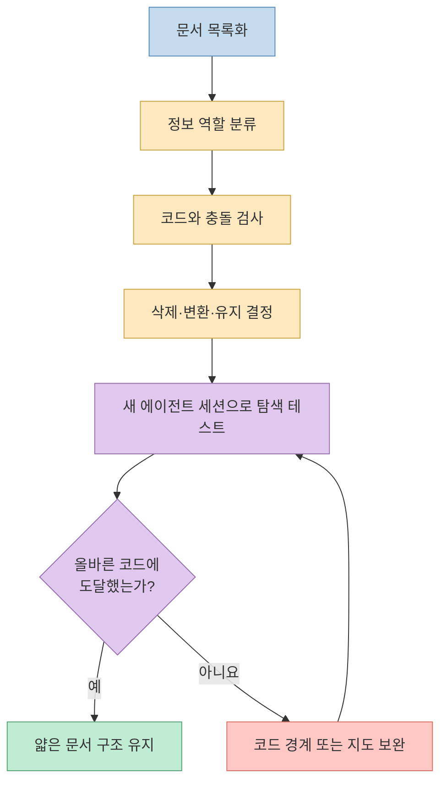

Matt Pocock의 Shorts 제목은 도발적입니다. **“Delete (most of) your docs.”** 하지만 영상의 결론은 문서를 전부 지우라는 것이 아닙니다. AI가 코드를 이해하도록 돕겠다며 구현 내용을 Markdown으로 다시 적으면, 코드와 문서가 서로 다른 두 개의 진실이 될 수 있다는 경고입니다. [영상 0:00](https://youtu.be/Fj8DKMbdIzU?t=0) [영상 0:39](https://youtu.be/Fj8DKMbdIzU?t=39)

대안은 문서가 하던 일을 전부 코드에 우겨 넣는 것도 아닙니다. **현재 동작은 코드와 테스트로, 선택의 이유는 ADR로, 도메인 언어는 용어집으로, 탐색 경로는 얇은 내비게이션 문서로** 나누는 것입니다. 문서의 양보다 중요한 것은 각 정보에 하나의 권위 있는 위치를 부여하는 일입니다. [영상 1:16](https://youtu.be/Fj8DKMbdIzU?t=76) [영상 1:25](https://youtu.be/Fj8DKMbdIzU?t=85) [영상 1:49](https://youtu.be/Fj8DKMbdIzU?t=109)
<!--more-->

## Sources

- [YouTube Shorts 원본](https://youtube.com/shorts/Fj8DKMbdIzU?si=DSTypvyU-HO_bOm4)
- [Matt Pocock의 domain-modeling 스킬](https://github.com/mattpocock/skills/blob/main/skills/engineering/domain-modeling/SKILL.md)
- [Google Cloud의 ADR 개요](https://docs.cloud.google.com/architecture/architecture-decision-records)
- [AWS의 ADR 프로세스](https://docs.aws.amazon.com/prescriptive-guidance/latest/architectural-decision-records/adr-process.html)

## 1. 문제는 문서가 아니라 “코드의 복사본”이다

영상에서 Matt는 AI가 코드베이스를 탐색할 때 가장 먼저 의존해야 할 정보는 코드 자체라고 말합니다. 코드는 파일과 모듈로 나뉘고, 인터페이스와 구현이 분리되며, 이름과 구조를 통해 관계를 드러내야 합니다. 이런 구조가 갖춰져 있으면 에이전트는 필요한 범위만 선택적으로 읽을 수 있습니다. [영상 0:09](https://youtu.be/Fj8DKMbdIzU?t=9) [영상 0:22](https://youtu.be/Fj8DKMbdIzU?t=22)

반대로 구현을 설명하는 별도의 Markdown 계층을 만들고 AI가 그 문서를 우선 읽게 하면 문제가 생깁니다. 일반 Markdown은 실행되지 않고 코드에 맞춰 자동으로 실패하지도 않습니다. 구현은 바뀌었는데 설명이 그대로 남으면, 문서는 과거의 동작을 현재 사실처럼 말합니다. [영상 0:39](https://youtu.be/Fj8DKMbdIzU?t=39) [영상 0:48](https://youtu.be/Fj8DKMbdIzU?t=48)

핵심은 문서 파일의 존재가 아니라 **동일한 사실을 여러 곳에서 수동으로 유지하는 구조** 입니다. 코드와 문서가 모두 현재 구현을 설명하면서 서로 다르게 말하면 AI는 권위의 순서를 추측해야 합니다. Matt가 “두 개의 source of truth”를 큰 안티패턴이라고 부르는 이유입니다. [영상 0:57](https://youtu.be/Fj8DKMbdIzU?t=57) [영상 1:04](https://youtu.be/Fj8DKMbdIzU?t=64)

## 2. 좋은 코드는 AI를 위한 탐색 인터페이스다

이 주장을 “주석을 쓰지 말라”거나 “짧은 함수만 만들라”는 규칙으로 축소하면 안 됩니다. 영상이 강조하는 것은 AI가 전체 저장소를 한 번에 읽지 않고도 필요한 범위를 찾게 만드는 구조입니다. 일관된 파일 위치, 책임이 분명한 모듈, 안정적인 인터페이스, 구현과 계약의 구분이 탐색 비용을 줄입니다. [영상 0:22](https://youtu.be/Fj8DKMbdIzU?t=22) [영상 0:30](https://youtu.be/Fj8DKMbdIzU?t=30)

AI 관점에서 좋은 코드 구조는 일종의 **점진적 공개** 입니다.

1. 디렉터리 이름으로 관심 영역을 찾는다.
2. 공개 인터페이스로 모듈의 책임을 파악한다.
3. 관련 테스트로 기대 동작과 예외를 확인한다.
4. 필요한 경우에만 내부 구현을 읽는다.

여기서 테스트는 문서와 다른 중요한 속성을 가집니다. 구현과 어긋나면 실패할 수 있다는 점입니다. 물론 테스트가 모든 의도를 설명하지는 못하고 테스트 자체도 잘못될 수 있습니다. 그래도 “현재 동작”을 서술하는 수동 문서보다 코드 변화에 연결된 검증 장치가 드리프트를 더 빨리 드러냅니다. 영상이 Markdown을 “실행할 수도, 코드에 맞춰 테스트할 수도 없다”고 비판하는 맥락도 여기에 있습니다. [영상 0:48](https://youtu.be/Fj8DKMbdIzU?t=48)

## 3. 그래도 코드만으로는 설명할 수 없는 것이 있다

Matt는 영상 후반부에서 자신의 주장이 “저장소에는 코드만 있어야 한다”는 뜻이 아니라고 선을 긋습니다. 코드는 최종적으로 선택한 구현을 보여 줄 수 있지만, 어떤 대안을 검토했고 왜 현재 방식을 골랐는지는 알려 주지 못합니다. 이런 정보는 코드의 복사본이 아니라 코드 바깥에만 존재하는 맥락입니다. [영상 1:16](https://youtu.be/Fj8DKMbdIzU?t=76) [영상 1:25](https://youtu.be/Fj8DKMbdIzU?t=85)

영상이 남겨야 한다고 제시하는 문서는 세 종류입니다.

### ADR: 선택의 이유와 대안

ADR은 중요한 아키텍처 결정의 맥락, 검토한 선택지, 결정, 결과를 기록합니다. Google Cloud도 ADR을 코드와 함께 읽는 결정 배경으로 설명하고, AWS는 구현 방법보다 **왜 그 결정을 내렸는지** 보존하는 데 의미가 있다고 안내합니다. 이는 영상이 “코드가 설명할 수 없는 대안”을 ADR에 남기라고 한 주장과 일치합니다. [영상 1:28](https://youtu.be/Fj8DKMbdIzU?t=88) [Google Cloud ADR](https://docs.cloud.google.com/architecture/architecture-decision-records) [AWS ADR](https://docs.aws.amazon.com/prescriptive-guidance/latest/architectural-decision-records/adr-process.html)

Matt의 최신 [`domain-modeling` 스킬](https://github.com/mattpocock/skills/blob/main/skills/engineering/domain-modeling/SKILL.md)은 ADR을 남기는 조건을 더 좁게 잡습니다. 되돌리기 어렵고, 배경을 모르면 놀라운 선택이며, 실제 대안 사이의 트레이드오프가 있었을 때만 제안합니다. 셋 중 하나라도 빠지면 ADR을 만들지 않습니다. 이 기준은 “무엇이든 문서화”하는 습관이 다시 문서 과잉으로 돌아가는 것을 막습니다.

### 용어집: 코드만 봐서는 확정하기 어려운 도메인 언어

`Order`, `Account`, `Workspace` 같은 단어는 프로젝트마다 의미가 다릅니다. 클래스가 존재한다고 해서 그 개념의 경계, 다른 용어와의 차이, 비즈니스가 사용하는 정확한 뜻이 자동으로 드러나는 것은 아닙니다. 영상은 이를 보완하기 위해 glossary가 매우 유용하다고 말합니다. [영상 1:38](https://youtu.be/Fj8DKMbdIzU?t=98) [영상 1:45](https://youtu.be/Fj8DKMbdIzU?t=105)

Matt의 `domain-modeling` 스킬은 `CONTEXT.md`를 구현 문서가 아니라 **용어집만을 위한 파일** 로 제한합니다. 구현 세부사항, 스펙, 임시 메모를 넣지 않고, 용어가 실제로 합의될 때만 느리게 생성합니다. 또한 문서와 코드가 충돌하면 어느 쪽이 맞는지 즉시 드러내도록 요구합니다. [domain-modeling](https://github.com/mattpocock/skills/blob/main/skills/engineering/domain-modeling/SKILL.md)

### 얇은 내비게이션: 어디를 읽어야 하는가

세 번째 예외는 코드의 주요 영역을 빠르게 찾게 해 주는 얇은 탐색 문서입니다. 목적은 각 모듈의 동작을 다시 서술하는 것이 아니라, 저장소의 큰 영역과 진입점을 가리키는 것입니다. Matt는 이런 얇은 계층이 AI의 코드 탐색 속도를 높일 수 있다고 말합니다. [영상 1:49](https://youtu.be/Fj8DKMbdIzU?t=109) [영상 1:56](https://youtu.be/Fj8DKMbdIzU?t=116)

좋은 내비게이션 문서는 짧고 링크 중심입니다. “결제는 `src/billing`에 있다”, “공개 API 계약은 이 스키마에서 관리한다”, “중요한 결정은 이 ADR 인덱스에 있다” 정도면 충분합니다. 동작을 긴 문장으로 복제하기 시작하면 다시 드리프트 위험이 커집니다. 이 구분은 영상이 허용한 “main aspects를 돌아다니기 위한 thin layer”에서 직접 이어집니다. [영상 1:49](https://youtu.be/Fj8DKMbdIzU?t=109)

## 4. “문서를 삭제하라”를 적용하면 안 되는 영역

영상의 범위는 **AI가 저장소 내부 구현을 이해하도록 만든 중복 문서** 입니다. 외부 사용자를 위한 API 계약, 운영 장애 대응 절차, 보안·규제 증빙, 제품 요구사항까지 없애라고 말하지 않습니다. 실제로 영상도 모든 문서에 반대한다는 해석을 명시적으로 부정합니다. [영상 1:16](https://youtu.be/Fj8DKMbdIzU?t=76)

따라서 “코드가 source of truth”라는 말은 정보 유형별로 적용해야 합니다.

- 현재 프로그램의 실행 동작 → 코드와 테스트
- 외부에 약속한 인터페이스 → 검증 가능한 API 스키마와 계약 테스트
- 선택의 이유와 대안 → ADR
- 프로젝트 고유의 도메인 의미 → 용어집
- 저장소의 큰 진입점 → 얇은 내비게이션
- 장애 시 사람이 수행할 절차 → 실제 훈련과 갱신 주기가 있는 런북

마지막 세 항목 중 API 계약과 런북은 영상이 직접 다루지 않은 실무 보완입니다. 코드만으로 소비자와의 호환성 약속이나 장애 상황의 사람 행동을 충분히 전달하기 어렵기 때문에, 이 글에서는 “모든 정보의 진실을 코드 하나에 몰아넣지 말고 정보 유형별 권위 위치를 정한다”는 원칙으로 확장했습니다.

## 5. 삭제·유지·변환을 결정하는 기준

문서 파일을 발견했다고 바로 삭제하면 안 됩니다. 먼저 그 문서가 어떤 고유 정보를 갖는지 묻습니다.

### 삭제 후보

- 함수와 클래스의 동작을 문장으로 다시 적은 수동 API 레퍼런스
- 이미 코드 구조로 드러나는 폴더별 장문의 설명
- 구현이 바뀌어도 실패하지 않는 예제 출력
- 과거 설계를 현재 구조처럼 설명하는 문서
- 같은 규칙을 README, 위키, `AGENTS.md`에 반복한 내용

이 목록은 영상의 드리프트 논리를 실무 점검 항목으로 바꾼 것입니다. 문서가 실행·테스트되지 않고 코드를 반복할수록 두 번째 진실이 될 위험이 커집니다. [영상 0:44](https://youtu.be/Fj8DKMbdIzU?t=44) [영상 0:57](https://youtu.be/Fj8DKMbdIzU?t=57)

### 유지 후보

- 중요한 대안과 트레이드오프를 담은 ADR
- 구현 세부사항이 없는 도메인 용어집
- 링크 중심의 짧은 저장소 지도
- 코드에서 파생되어 자동 갱신되는 API 문서
- 테스트 또는 정기 훈련으로 유효성을 확인하는 운영 절차

앞의 세 항목은 영상과 Matt의 공식 스킬이 직접 지지합니다. 뒤의 두 항목은 문서 드리프트를 줄이는 같은 원리를 적용한 실무 확장입니다. 중요한 차이는 “문서이기 때문에 유지”하는 것이 아니라, **코드가 담지 못하는 고유 정보가 있거나 자동 검증 경로가 있기 때문에 유지** 한다는 점입니다. [영상 1:25](https://youtu.be/Fj8DKMbdIzU?t=85) [영상 1:38](https://youtu.be/Fj8DKMbdIzU?t=98) [영상 1:49](https://youtu.be/Fj8DKMbdIzU?t=109)

## 6. 문서를 줄이기 전에 코드를 고쳐야 한다

문서를 지웠더니 AI가 코드를 더 이해하지 못한다면, 기존 문서가 나빴다는 뜻만은 아닙니다. 코드 구조가 탐색 가능한 정보를 충분히 제공하지 않았다는 신호일 수 있습니다. 영상도 코드가 잘 포맷되고, 올바른 파일 구조에 있으며, 합리적인 단위로 조직되고, 인터페이스와 구현이 분리되어야 한다고 전제합니다. [영상 0:22](https://youtu.be/Fj8DKMbdIzU?t=22) [영상 0:32](https://youtu.be/Fj8DKMbdIzU?t=32)

문서 삭제보다 먼저 다음을 확인해야 합니다.

1. 디렉터리 이름만 보고도 도메인 경계를 찾을 수 있는가?
2. 모듈의 공개 인터페이스와 내부 구현이 구분되는가?
3. 테스트가 핵심 동작과 실패 조건을 보여 주는가?
4. 같은 개념이 파일마다 다른 이름으로 불리지 않는가?
5. 오래된 호환 계층과 현재 경로가 명확히 구분되는가?

코드가 이 질문에 답하지 못한다면 장문의 설명서를 추가하기보다 먼저 구조를 개선하는 편이 낫습니다. 그래야 사람과 AI가 같은 실제 시스템을 보고 판단합니다. 다만 리팩터링 비용이 즉시 감당되지 않는 레거시 저장소에서는 얇은 내비게이션 문서를 임시 교량으로 사용할 수 있습니다. 이 경우에도 문서가 상세 동작을 복제하지 않도록 범위를 제한해야 합니다. [영상 1:49](https://youtu.be/Fj8DKMbdIzU?t=109)

## 실전 적용 포인트

저장소의 모든 Markdown을 한꺼번에 정리하지 말고, 다음 순서로 문서 감사를 진행하는 것이 안전합니다.

1. AI 에이전트가 기본적으로 읽는 `README.md`, `AGENTS.md`, `CONTEXT.md`, `docs/`를 목록화한다.
2. 각 문단에 `현재 동작`, `선택 이유`, `도메인 의미`, `탐색 경로`, `운영 절차` 중 하나의 역할을 붙인다.
3. 현재 동작을 반복하는 문장은 실제 코드와 비교해 이미 드리프트했는지 확인한다.
4. 동작 설명은 테스트·타입·스키마·생성 문서로 옮길 수 있는지 검토한다.
5. ADR은 되돌리기 어렵고 놀라우며 실제 트레이드오프가 있는 결정만 남긴다.
6. 용어집에서 구현 세부사항과 임시 계획을 제거한다.
7. 내비게이션 문서는 상세 설명 대신 권위 있는 코드·테스트·ADR로 연결한다.
8. 삭제 후 새 세션의 에이전트가 올바른 진입점을 찾는지 검증한다.

성공 지표는 Markdown 파일 수가 줄었는지가 아닙니다. 새 에이전트가 오래된 설명에 속지 않고, 적은 컨텍스트로 올바른 코드와 결정 근거를 찾으며, 변경 후 검증까지 수행하는지가 중요합니다. 이는 영상이 비판한 “문서를 먼저 읽어 코드를 이해하는 구조”를 “얇은 지도를 통해 검증 가능한 원본으로 이동하는 구조”로 바꾸는 과정입니다. [영상 0:44](https://youtu.be/Fj8DKMbdIzU?t=44) [영상 1:49](https://youtu.be/Fj8DKMbdIzU?t=109)

## 핵심 요약

- 영상이 삭제하라고 말하는 대상은 모든 문서가 아니라 **코드의 현재 동작을 수동으로 복제한 문서 계층** 이다.
- 실행·테스트할 수 없는 중복 문서는 코드와 드리프트해 AI에게 두 개의 진실을 제공할 수 있다.
- 현재 동작은 코드와 테스트, 선택 이유는 ADR, 도메인 언어는 용어집에 둔다.
- 저장소 내비게이션 문서는 상세 동작을 반복하지 않고 권위 있는 위치를 가리키는 얇은 지도여야 한다.
- 문서를 줄이기 전에 파일 구조, 모듈 경계, 인터페이스, 테스트가 AI가 탐색할 만큼 명확한지 점검해야 한다.
- 외부 계약과 운영 절차처럼 영상이 직접 다루지 않은 문서는 별도 검증·갱신 체계를 갖춰 유지해야 한다.

## 결론

“Delete (most of) your docs”의 핵심은 문서 혐오가 아니라 **중복된 진실의 제거** 입니다. 코드를 다시 설명하는 문서는 유지비를 늘리고, 드리프트하면 사람과 AI를 동시에 잘못된 방향으로 이끕니다. 반면 코드가 말할 수 없는 선택의 이유, 도메인의 정확한 언어, 저장소의 진입점은 여전히 문서가 맡아야 합니다. [영상 1:16](https://youtu.be/Fj8DKMbdIzU?t=76) [영상 1:59](https://youtu.be/Fj8DKMbdIzU?t=119)

좋은 문서 전략은 많이 쓰거나 적게 쓰는 것이 아닙니다. **각 정보가 가장 잘 검증되는 단 하나의 위치를 정하고, 나머지 문서는 그 위치를 가리키게 만드는 것** 입니다. AI 코딩 시대의 문서화는 설명의 양을 늘리는 작업보다 코드·테스트·ADR·용어집 사이의 권위를 설계하는 작업에 가깝습니다.
