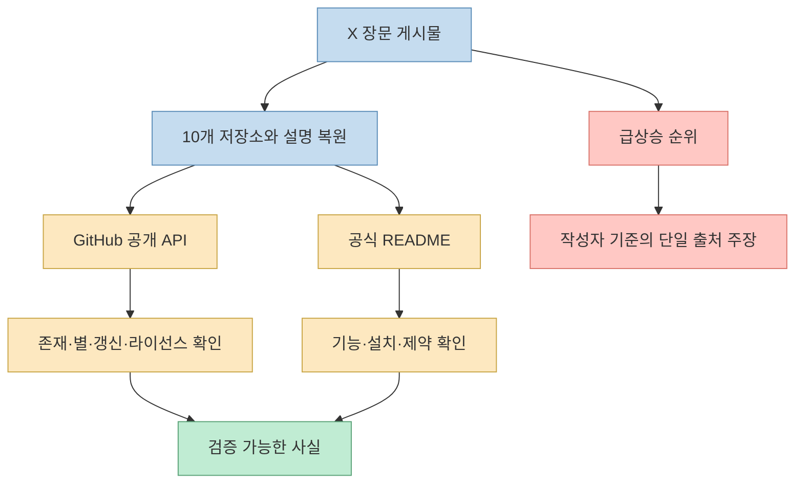
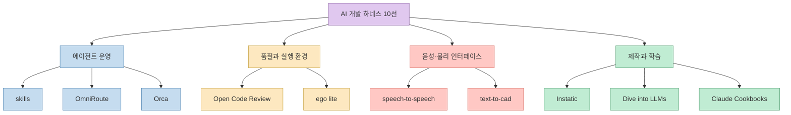
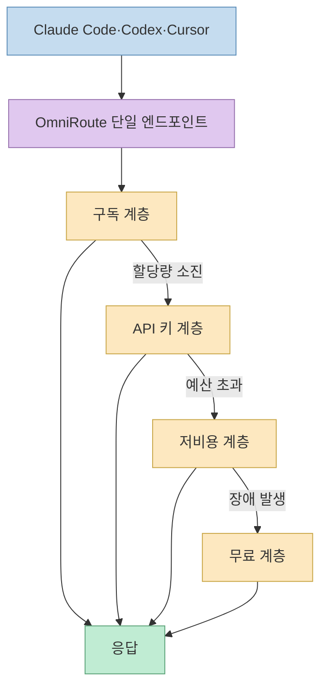
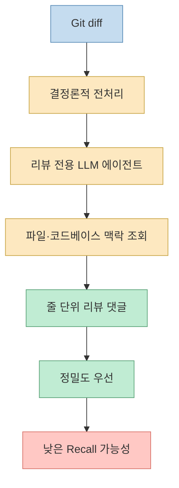
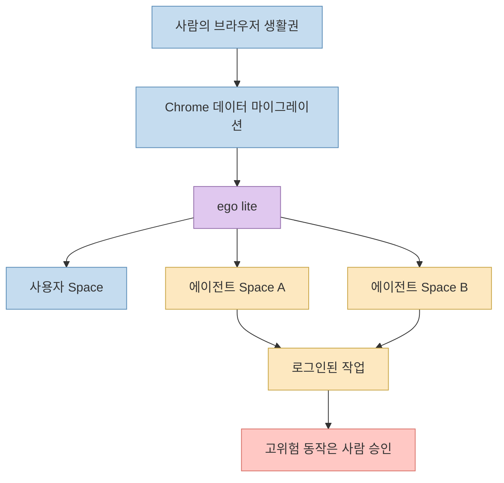
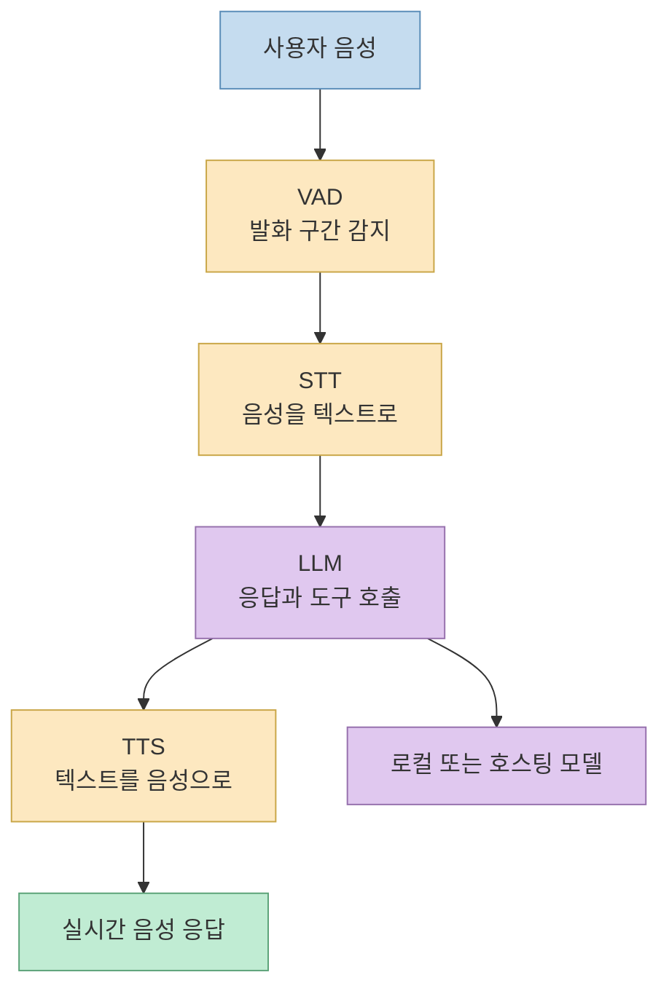
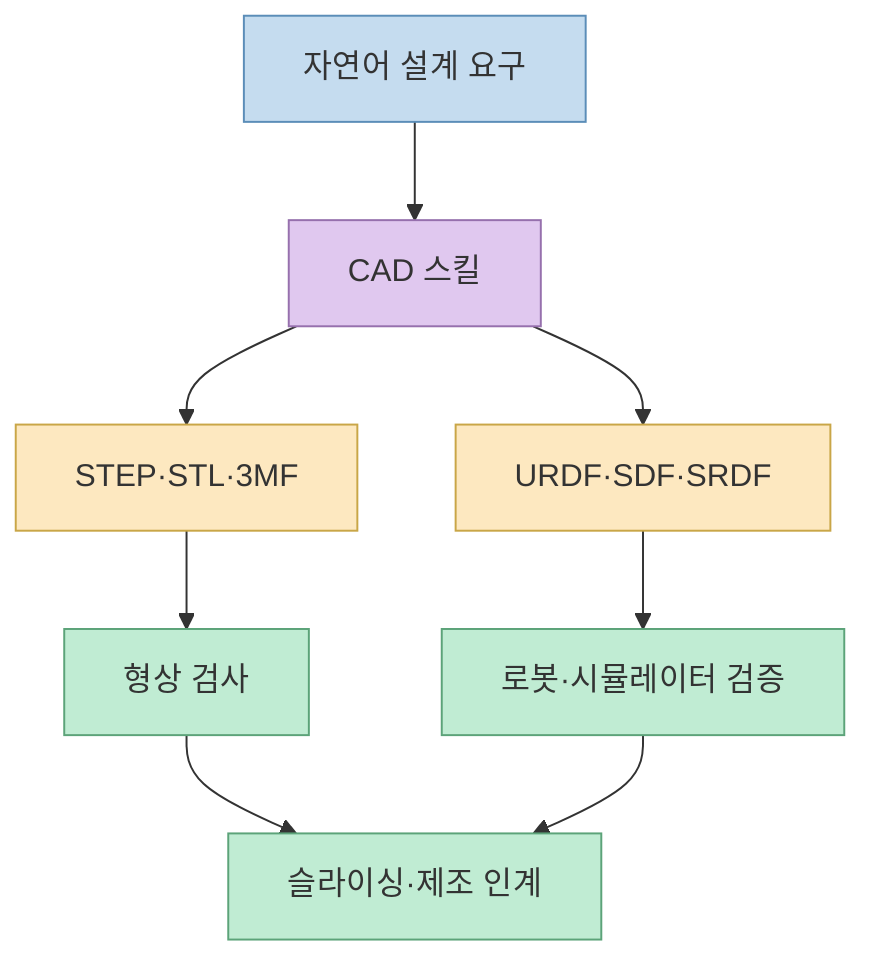
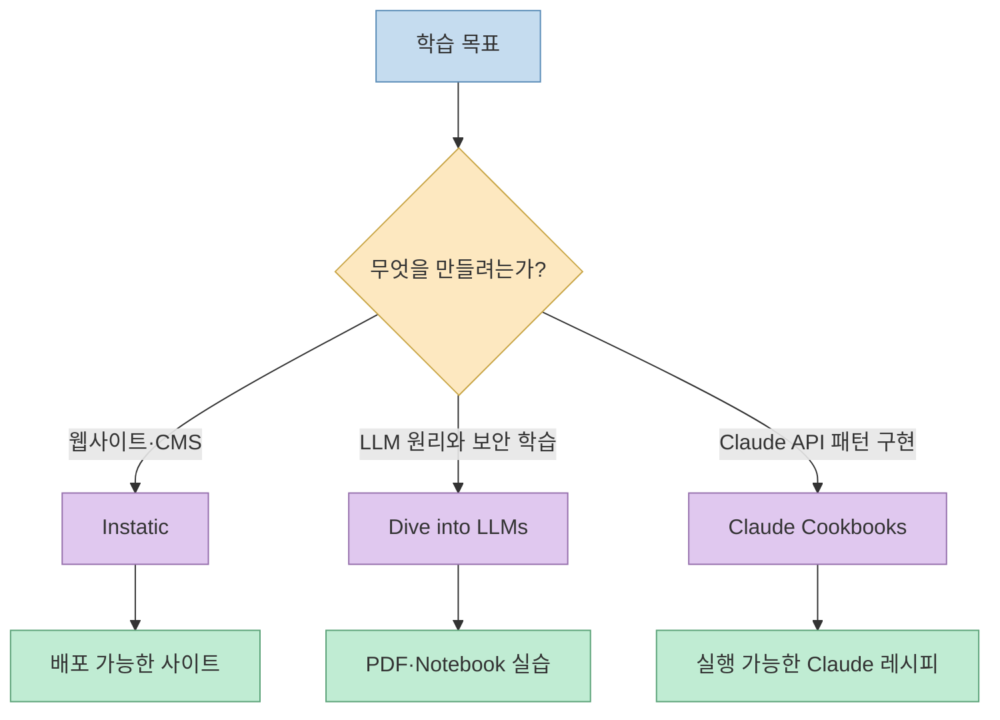
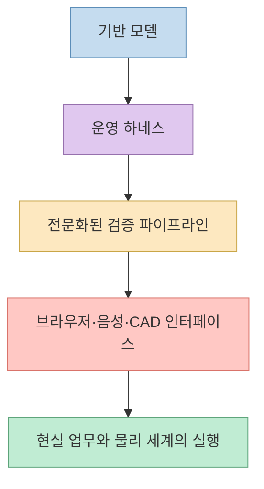
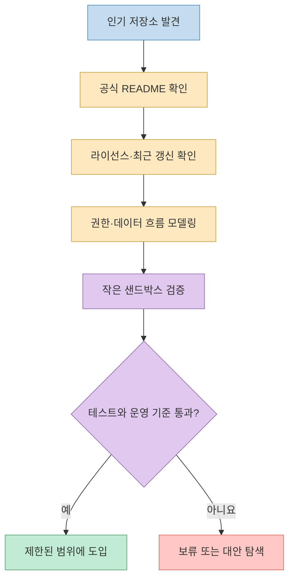

[X 원문](https://x.com/i/status/2084114545690423407)은 “이번 주 GitHub에서 급상승한 AI 저장소 10선”을 소개합니다. 코딩 에이전트용 스킬부터 AI 게이트웨이, 병렬 에이전트 환경, 코드 리뷰, 에이전트 브라우저, 음성 대화, CAD, CMS, LLM 교재, Claude 레시피까지 범위가 넓습니다.

목록을 공식 GitHub 저장소와 교차검증해 보니 프로젝트의 핵심 기능은 대체로 정확했습니다. 다만 “급상승”의 순위와 기간은 X 작성자의 큐레이션 기준이며, 같은 시점의 GitHub Trending 순위를 독립적으로 재현할 데이터는 제시되지 않았습니다. 따라서 이 글은 **순위표가 아니라 2026년 AI 개발 도구가 어느 계층으로 확장되고 있는지 보여 주는 기술 지도** 로 읽습니다.
<!--more-->

## Sources

- [X 원문](https://x.com/i/status/2084114545690423407)
- [mattpocock/skills](https://github.com/mattpocock/skills)
- [diegosouzapw/OmniRoute](https://github.com/diegosouzapw/OmniRoute)
- [stablyai/orca](https://github.com/stablyai/orca)
- [alibaba/open-code-review](https://github.com/alibaba/open-code-review)
- [citrolabs/ego-lite](https://github.com/citrolabs/ego-lite)
- [huggingface/speech-to-speech](https://github.com/huggingface/speech-to-speech)
- [CoreBunch/Instatic](https://github.com/CoreBunch/Instatic)
- [earthtojake/text-to-cad](https://github.com/earthtojake/text-to-cad)
- [Lordog/dive-into-llms](https://github.com/Lordog/dive-into-llms)
- [anthropics/claude-cookbooks](https://github.com/anthropics/claude-cookbooks)

## 1. 먼저 검증 범위부터: “10개 목록”과 “급상승 순위”는 다른 주장이다

X 게시물은 일본어 장문 노트 형식입니다. 공개 `tweet-result` 응답에서는 첫 번째 항목과 두 번째 항목의 시작 부분만 노출됐지만, 공개 웹 렌더링에서는 10개 전체 본문과 GitHub 링크를 확인할 수 있었습니다. 작성자는 `@so_ainsight`이며 게시 시각은 2026년 8월 3일 03:10 UTC입니다. [X 원문](https://x.com/so_ainsight/status/2084114545690423407)

각 저장소의 존재, 설명, 라이선스 메타데이터, 별 수, 최근 푸시 시각은 2026년 8월 5일 GitHub 공개 API로 확인했습니다. 기능 설명은 각 공식 README를 우선했습니다. 이 방식으로 “무엇을 하는 프로젝트인가”는 높은 신뢰도로 검증할 수 있지만, “이번 주 몇 위로 급상승했는가”는 별도 추세 데이터가 없으므로 검증 범위 밖입니다.

별 수는 저장소의 현재 관심도를 보여 주지만 품질이나 적합성을 보장하지 않습니다. 아래 숫자는 모두 **2026년 8월 5일 조회 스냅샷** 이며 시간이 지나면 달라집니다.

## 2. 열 개를 한눈에 보면 “모델”보다 “하네스”가 많다

이번 목록에는 새로운 파운데이션 모델이 하나도 없습니다. 대신 이미 존재하는 모델과 에이전트를 실제 작업에 연결하는 하네스가 중심입니다.

이 구성이 보여 주는 변화는 분명합니다. 경쟁의 초점이 “어떤 모델이 더 똑똑한가”에서 “여러 모델을 어떻게 고르고, 격리하고, 검증하며, 현실 세계의 작업으로 연결하는가”로 이동하고 있습니다.

## 3. 에이전트 운영 계층: `skills`, `OmniRoute`, `Orca`

### 1) `mattpocock/skills`: 실패 패턴을 작은 작업 규율로 바꾼다

`mattpocock/skills`는 코딩 에이전트를 위한 엔지니어링 스킬 모음입니다. X 원문은 요구사항을 집요하게 확인하는 `grill-me`를 대표 예로 들고, Claude Code 공식 마켓플레이스 또는 `npx`로 설치할 수 있다고 설명합니다. 공식 README도 Claude Code 플러그인과 `npx skills@latest add mattpocock/skills` 두 설치 경로를 안내합니다. [X 원문](https://x.com/i/status/2084114545690423407) [공식 README](https://github.com/mattpocock/skills)

2026년 8월 5일 기준 약 20만 2,900개의 별을 받아 목록에서 가장 큰 관심을 받고 있습니다. 하지만 핵심은 숫자보다 방향입니다. 거대한 프레임워크 하나가 전체 프로세스를 소유하는 대신, 요구사항 정렬·도메인 모델링·진단·리뷰 같은 실패 지점을 작은 스킬로 분리합니다. 프로젝트의 전체 구조는 [기존 심층 글](/post/2026/04/2026-04-29-matt-pocock-skills-real-engineering/)에서 자세히 다뤘습니다.

**적합한 경우**: 이미 Claude Code나 Codex를 쓰고 있지만 요구사항 누락, 과도한 추측, 리뷰 편차를 줄이고 싶을 때입니다. **주의할 점**: 스킬을 많이 설치한다고 품질이 자동으로 오르지는 않습니다. 현재 작업에 필요한 스킬만 선택하고, 서로 중복되는 규칙과 호출 조건을 정리해야 합니다.

### 2) `OmniRoute`: 모델보다 라우팅 정책을 선택한다

`diegosouzapw/OmniRoute`는 여러 AI 제공자를 하나의 로컬 엔드포인트 뒤에 묶는 MIT 라이선스 게이트웨이입니다. 공식 저장소 설명은 290개 이상 제공자, 90개 이상 무료 계층, 500개 이상 모델을 내세웁니다. 요청은 단일 OpenAI 호환 엔드포인트로 받고, 할당량 소진·장애·비용 조건에 따라 다음 제공자로 폴백하도록 설계됐습니다. [공식 README](https://github.com/diegosouzapw/OmniRoute)

2026년 8월 5일 기준 약 3만 9,400개의 별을 기록했습니다. 이 프로젝트의 가치는 모델 선택을 각 코딩 도구에 흩어 놓지 않고, 라우팅 전략과 할당량 정책을 중앙에서 관리하는 데 있습니다.

**적합한 경우**: 여러 공급자의 무료·유료 할당량을 함께 쓰고, 장애 시 수동 모델 교체를 줄이고 싶을 때입니다. **주의할 점**: 무료 계층의 한도와 약관은 변합니다. README도 일부 제공자에 약관 검토가 필요하다고 표시합니다. API 키, 프롬프트 데이터, 로그가 통과하는 중앙 게이트웨이이므로 보안 경계와 공급자별 데이터 정책도 확인해야 합니다.

### 3) `Orca`: 에이전트 함대를 독립 worktree에서 운영한다

`stablyai/orca`는 Codex, Claude Code, OpenCode, Pi 같은 코딩 에이전트를 병렬 실행하는 ADE입니다. 하나의 프롬프트를 여러 에이전트에 보내되 각각 독립된 Git worktree에서 작업하게 하고, 결과를 비교해 선택할 수 있습니다. 공식 README는 데스크톱뿐 아니라 iOS·Android 모바일 동반 앱도 안내합니다. [공식 README](https://github.com/stablyai/orca)

2026년 8월 5일 기준 약 3만 7,300개의 별을 받았습니다. `skills`가 개별 에이전트의 작업 규율을 다루고 `OmniRoute`가 모델 연결을 다룬다면, Orca는 여러 실행 세션과 브랜치를 한곳에서 조정하는 운영면을 담당합니다. 병렬 worktree와 모바일 운영의 의미는 [Orca 심층 글](/post/2026/06/2026-06-26-orca-parallel-agent-ade/)에서 더 자세히 설명했습니다.

**적합한 경우**: 같은 요구사항을 여러 에이전트에 시켜 결과를 비교하거나, 장시간 작업을 여러 worktree에서 동시에 운영할 때입니다. **주의할 점**: 병렬 실행은 충돌을 없애는 것이 아니라 격리합니다. 최종 병합, 테스트, 비용 통제, 어떤 결과를 채택할지는 여전히 사람의 책임입니다.

## 4. 품질과 실행 환경: `open-code-review`, `ego-lite`

### 4) `alibaba/open-code-review`: 범용 에이전트보다 좁은 리뷰 파이프라인

Alibaba의 `open-code-review`는 Git diff를 읽고 줄 단위 리뷰 댓글을 생성하는 AI 코드 리뷰 CLI입니다. 결정론적 파이프라인과 도구 사용형 LLM 에이전트를 결합하며, 전체 파일 읽기·코드 검색·변경 파일 간 맥락 확인을 지원합니다. 공식 README는 Alibaba 내부에서 2년간 수만 명의 개발자에게 사용됐고 수백만 건의 결함을 식별한 뒤 오픈소스화했다고 설명합니다. 이는 프로젝트 측의 자체 보고입니다. [공식 README](https://github.com/alibaba/open-code-review)

2026년 8월 5일 기준 약 1만 8,700개의 별을 기록했습니다. 저장소가 공개한 자체 벤치마크에서는 같은 기반 모델을 쓴 범용 에이전트보다 Precision과 F1이 높고 토큰은 약 1/9을 사용했다고 주장합니다. 중요한 단서도 있습니다. Recall은 범용 에이전트보다 낮으며, 더 많은 문제를 찾기보다 거짓 양성을 줄이는 정밀도 중심의 의도적 선택이라고 밝힙니다. [벤치마크 설명](https://github.com/alibaba/open-code-review#benchmark)

**적합한 경우**: PR마다 반복 가능한 저소음 리뷰를 붙이고, 모델 비용을 일정하게 통제하고 싶을 때입니다. **주의할 점**: 자체 벤치마크 수치를 독립 검증 결과로 받아들이면 안 됩니다. 보안·정합성 문제가 누락될 수 있으므로 정적 분석, 테스트, 사람 리뷰를 대체하지 말고 추가 게이트로 사용해야 합니다.

### 5) `ego-lite`: 로그인 상태를 공유하되 작업 공간은 분리한다

`citrolabs/ego-lite`는 사람과 AI 에이전트가 병렬로 사용하는 브라우저입니다. 첫 실행에서 동의하면 Chrome의 로그인, 쿠키, 확장, 북마크를 마이그레이션하고, 각 에이전트는 독립된 Space에서 뒤로 작업합니다. 사용자의 탭과 에이전트의 탭이 충돌하지 않도록 브라우저 자체를 작업 환경으로 만든 접근입니다. [공식 README](https://github.com/citrolabs/ego-lite)

2026년 8월 5일 기준 약 8,300개의 별을 받았습니다. Playwright 같은 자동화 라이브러리와의 차이는 [ego lite 심층 글](/post/2026/07/2026-07-26-ego-lite-agent-browser-task-space/)에서 다뤘습니다.

**적합한 경우**: 인증된 SaaS를 반복 조작해야 하지만 일상 브라우저 탭을 에이전트에게 빼앗기고 싶지 않을 때입니다. **주의할 점**: 로그인과 쿠키를 상속한다는 장점은 곧 권한 위험입니다. 에이전트 전용 계정, 최소 권한, 결제·삭제 같은 고위험 동작의 사람 승인, 로컬 데이터 보관 정책을 먼저 설계해야 합니다.

## 5. 음성과 물리 세계: `speech-to-speech`, `text-to-cad`

### 6) `huggingface/speech-to-speech`: 교체 가능한 실시간 음성 에이전트 파이프라인

Hugging Face의 `speech-to-speech`는 VAD, STT, LLM, TTS를 연결하는 저지연 모듈형 음성 에이전트 파이프라인입니다. 각 구성요소를 교체할 수 있고 OpenAI Realtime 호환 WebSocket API를 제공합니다. LLM은 호스팅 공급자뿐 아니라 vLLM이나 `llama.cpp`를 통한 로컬 서버에도 연결할 수 있습니다. [공식 README](https://github.com/huggingface/speech-to-speech)

공식 README는 이 파이프라인이 수천 대의 Reachy Mini 로봇 대화 백엔드에서 운영된다고 설명합니다. 이 역시 프로젝트 측 설명이지만, 단순 데모가 아니라 실제 로봇 상호작용을 염두에 둔 구조라는 점은 분명합니다. 2026년 8월 5일 기준 약 1만 900개의 별을 기록했습니다.

**적합한 경우**: 음성 모델을 하나의 폐쇄형 API에 고정하지 않고 STT·LLM·TTS를 독립 교체하거나 로컬 실행해야 할 때입니다. **주의할 점**: 실제 품질은 각 모델의 지연, 끼어들기 처리, 잡음 환경, 언어 지원, GPU 자원에 좌우됩니다. 저장소가 파이프라인을 제공한다고 해서 모든 조합의 실시간성이 보장되는 것은 아닙니다.

### 8) `earthtojake/text-to-cad`: 에이전트 스킬이 제조 파일까지 내려간다

`text-to-cad`는 CAD·CAE·CAM 및 로봇 설계를 위한 에이전트 스킬 라이브러리입니다. 공식 README는 STEP·STL·3MF 내보내기, URDF·SDF·SRDF 로봇 설명, CAD 검사와 슬라이싱 워크플로를 제공합니다. X 원문이 말한 자연어 기반 CAD와 G-code 단계는 이 스킬 묶음의 전체 흐름을 요약한 것입니다. [공식 README](https://github.com/earthtojake/text-to-cad)

2026년 8월 5일 기준 약 1만 2,800개의 별을 기록했습니다. 이 프로젝트는 에이전트 스킬이 문서·코드를 넘어 물리적 형상과 제조 아티팩트를 다루기 시작했다는 점에서 중요합니다.

**적합한 경우**: CAD와 로봇 파일 생성·검사 절차를 반복 가능한 에이전트 워크플로로 만들고 싶을 때입니다. **주의할 점**: 생성된 형상이 곧 제조 가능하거나 안전하다는 뜻은 아닙니다. 공차, 재료, 하중, 충돌, 장비 설정은 전문 도구와 사람의 검증을 통과해야 합니다.

## 6. 제작과 학습: `Instatic`, `Dive into LLMs`, `Claude Cookbooks`

### 7) `CoreBunch/Instatic`: 편집기부터 게시까지 한 Bun 서버에 둔다

`Instatic`은 비주얼 편집기, 콘텐츠 엔진, 미디어, 인증, 폼, 플러그인, 게시기를 하나의 Bun 서버에 묶은 셀프호스팅 CMS입니다. SQLite 또는 PostgreSQL을 사용할 수 있으며 결과 페이지는 프레임워크 런타임과 편집기용 속성을 남기지 않는 시맨틱 HTML과 작은 CSS를 목표로 합니다. [공식 README](https://github.com/CoreBunch/Instatic)

2026년 8월 5일 기준 약 7,500개의 별을 받았습니다. Webflow·Framer의 시각적 편집 경험과 정적 사이트의 단순한 출력을 한 프로젝트에서 제공하려는 접근입니다.

**적합한 경우**: 콘텐츠 편집자가 비주얼 도구를 필요로 하지만 호스팅과 데이터 소유권은 직접 통제하고 싶을 때입니다. **주의할 점**: “한 서버에 모두 포함”은 운영 단순성과 결합도를 함께 높입니다. 백업, 인증 업데이트, 플러그인 신뢰, 장애 범위를 사전에 검토해야 합니다.

### 9) `Lordog/dive-into-llms`: 11장짜리 실습형 LLM 교재

`Dive into LLMs`는 상하이교통대학교의 자연어 처리·AI 보안 강의 자료에서 확장된 중국어 실습 교재입니다. 공식 README에는 파인튜닝과 배포, 프롬프트와 Chain of Thought, 지식 편집, 수학 추론, 워터마킹, 탈옥, 스테가노그래피, 멀티모달, GUI 에이전트, 에이전트 보안, RLHF 안전 정렬까지 11개 장이 정리돼 있습니다. 각 장은 PDF, 설명 문서, Jupyter Notebook을 함께 제공합니다. [공식 README](https://github.com/Lordog/dive-into-llms)

2026년 8월 5일 기준 약 4만 7,600개의 별을 기록했습니다. 다만 GitHub API상 마지막 푸시는 2025년 10월이며, 라이선스 식별자도 자동 확인되지 않았습니다. 인기와 최신성은 같은 지표가 아니며, 자료 재사용·번역·배포 전에는 저장소의 실제 라이선스 조건을 별도로 확인해야 합니다.

**적합한 경우**: LLM을 API 사용법이 아니라 학습·보안·에이전트까지 넓은 실습 과정으로 공부하고 싶을 때입니다. **주의할 점**: 중국어 강의 자료이고 일부 실습은 특정 시점의 라이브러리와 모델에 의존할 수 있으므로 환경 버전을 확인해야 합니다.

### 10) `anthropics/claude-cookbooks`: Claude 공식 예제를 실행 가능한 노트북으로 본다

Anthropic의 `claude-cookbooks`는 Claude 활용 패턴을 Jupyter Notebook 레시피로 제공합니다. 공식 README는 분류, RAG, 요약, Tool Use, SQL, 벡터 데이터베이스 연동, Vision, 서브에이전트, PDF 처리, 프롬프트 캐싱 등을 안내합니다. [공식 README](https://github.com/anthropics/claude-cookbooks)

2026년 8월 5일 기준 약 5만 1,000개의 별을 기록했습니다. 블로그 글보다 실행 가능한 노트북을 중심으로 학습할 수 있고, Anthropic이 직접 관리한다는 점이 장점입니다.

**적합한 경우**: 공식 Claude API 기능을 작은 실행 예제부터 확인하고 싶을 때입니다. **주의할 점**: Cookbooks는 학습 예제입니다. 노트북의 인증·오류 처리·비용 통제·관측성·보안 설정을 그대로 운영 코드 수준으로 간주하면 안 됩니다.

## 7. 이 목록에서 읽히는 2026년의 세 가지 흐름

### 첫째, 모델 선택이 아니라 모델 운영이 제품이 된다

`OmniRoute`는 모델과 공급자 라우팅을, `Orca`는 병렬 작업 세션을, `skills`는 개별 에이전트의 행동 규율을 다룹니다. 모델 호출 위에 정책·격리·작업 절차를 쌓는 하네스가 독립 제품군으로 성장하고 있습니다.

### 둘째, 범용 에이전트보다 좁은 목적의 파이프라인이 다시 중요해진다

`open-code-review`는 범용 에이전트에 코드 리뷰를 시키는 대신 리뷰 전용 프롬프트·도구·파이프라인을 설계합니다. `speech-to-speech`와 `text-to-cad`도 각각 음성과 제조 도메인의 명시적 단계를 제공합니다. 모델이 강해져도 도메인별 검증 구조는 사라지지 않습니다.

### 셋째, 에이전트는 코드 에디터 밖으로 이동한다

`ego-lite`는 로그인된 브라우저, `speech-to-speech`는 실시간 음성, `text-to-cad`는 물리적 설계 파일을 작업면으로 만듭니다. AI 개발 도구의 경계가 소스 코드 생성에서 웹 업무·대화·로봇·제조로 넓어지고 있습니다.

## 8. 인기 목록을 도입 목록으로 착각하지 않는 법

별 수가 빠르게 늘어나는 저장소는 탐색 후보가 될 수 있지만, 바로 도입할 근거는 아닙니다. 특히 이 목록은 권한과 데이터 경계가 큰 프로젝트를 다수 포함합니다.

- `OmniRoute`: 여러 공급자의 API 키와 프롬프트가 통과한다.
- `Orca`: 여러 에이전트가 동시에 브랜치와 worktree를 만든다.
- `open-code-review`: 비공개 소스 코드가 모델 엔드포인트로 전달될 수 있다.
- `ego-lite`: 로그인 세션과 쿠키에 접근한다.
- `speech-to-speech`: 음성 데이터와 실시간 모델 호출을 처리한다.
- `text-to-cad`: 결과가 실제 제조와 로봇 동작으로 이어질 수 있다.

또한 README의 성능·비용 수치는 대부분 프로젝트 제작자가 선택한 조건에서 측정한 값입니다. 독립 벤치마크가 없다면 “검증된 일반 성능”이 아니라 “프로젝트가 보고한 결과”로 읽어야 합니다.

## 실전 적용 포인트

열 개를 모두 설치하기보다 현재 병목 하나에서 시작하는 편이 좋습니다.

1. **요구사항과 작업 규율이 흔들린다** → `mattpocock/skills`에서 필요한 스킬 하나만 시험한다.
2. **모델 할당량과 공급자 장애가 잦다** → `OmniRoute`를 비민감 테스트 프로젝트에 붙인다.
3. **여러 코딩 에이전트를 병렬 운영한다** → `Orca`에서 worktree 병합 비용까지 측정한다.
4. **PR 리뷰의 거짓 양성을 줄이고 싶다** → `open-code-review`를 기존 정적 분석 뒤에 추가한다.
5. **로그인된 웹 업무를 자동화한다** → `ego-lite`를 전용 계정과 최소 권한으로 검증한다.
6. **음성 에이전트를 조립한다** → `speech-to-speech`에서 STT·LLM·TTS 지연을 각각 측정한다.
7. **셀프호스팅 비주얼 CMS가 필요하다** → `Instatic`의 백업·업그레이드 절차를 먼저 시험한다.
8. **CAD·로봇 파일을 생성한다** → `text-to-cad` 출력물을 전문 도구와 사람 검토로 검증한다.
9. **LLM 전반을 체계적으로 학습한다** → `Dive into LLMs`의 환경 버전과 라이선스를 확인한다.
10. **Claude API 예제가 필요하다** → `Claude Cookbooks`를 운영 코드가 아닌 실험 출발점으로 사용한다.

파일 수나 별 수보다 중요한 평가지표는 현재 병목이 실제로 줄었는지입니다. 도입 전후의 작업 시간, 실패율, 모델 비용, 사람 검토 시간, 권한 사고 가능성을 함께 기록해야 합니다.

## 핵심 요약

- X 원문에서 10개 저장소와 설명은 모두 복원됐지만 “이번 주 급상승 순위”는 단일 출처 주장이다.
- 10개 중 다수는 새 모델이 아니라 모델을 운영·격리·검증하는 하네스다.
- `skills`, `OmniRoute`, `Orca`는 각각 행동 규율, 공급자 라우팅, 병렬 세션 운영을 담당한다.
- `open-code-review`의 약 1/9 토큰·높은 Precision/F1은 프로젝트 자체 벤치마크이며 낮은 Recall이라는 대가가 있다.
- `ego-lite`, `speech-to-speech`, `text-to-cad`는 에이전트의 작업면을 브라우저·음성·물리 설계로 넓힌다.
- 별 수는 관심도 지표일 뿐 품질 보증이 아니므로 라이선스, 최근 갱신, 데이터 경계, 독립 검증을 확인해야 한다.

## 결론

이번 10개 저장소를 관통하는 키워드는 “더 큰 모델”이 아니라 **더 나은 연결 구조** 입니다. 모델에 작업 규율을 붙이고, 여러 공급자를 라우팅하고, 세션을 격리하고, 결과를 검증하며, 브라우저·음성·CAD 같은 실제 인터페이스로 연결하는 프로젝트가 주목받고 있습니다.

따라서 이 목록의 가장 좋은 활용법은 별 순서대로 설치하는 것이 아닙니다. 현재 워크플로의 병목을 먼저 정의하고, 그 병목을 겨냥한 저장소 하나를 작은 권한과 작은 데이터로 검증하는 것입니다. 인기 목록은 탐색의 시작점일 수 있지만, 도입 결정은 언제나 자신의 테스트와 운영 기준에서 끝나야 합니다.
