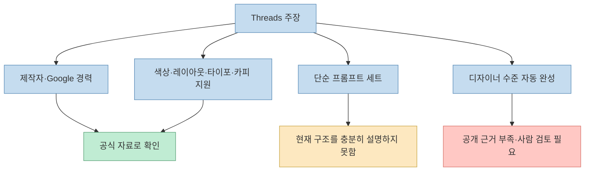
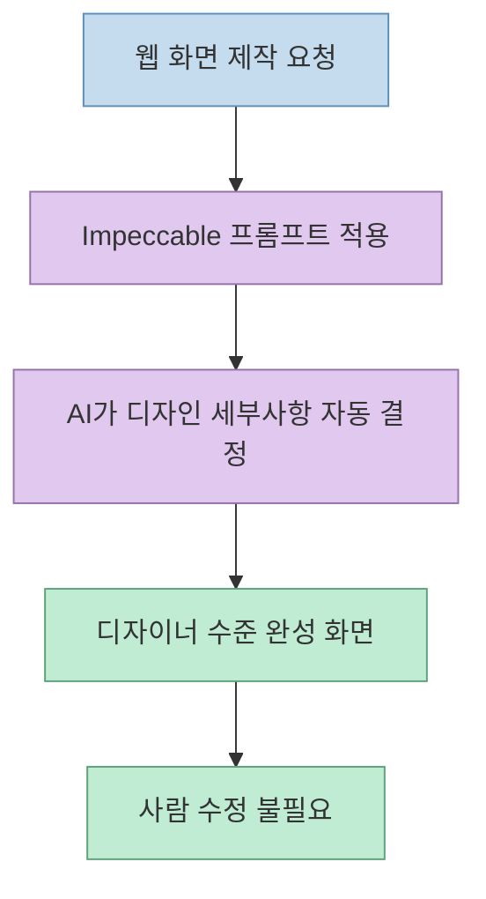
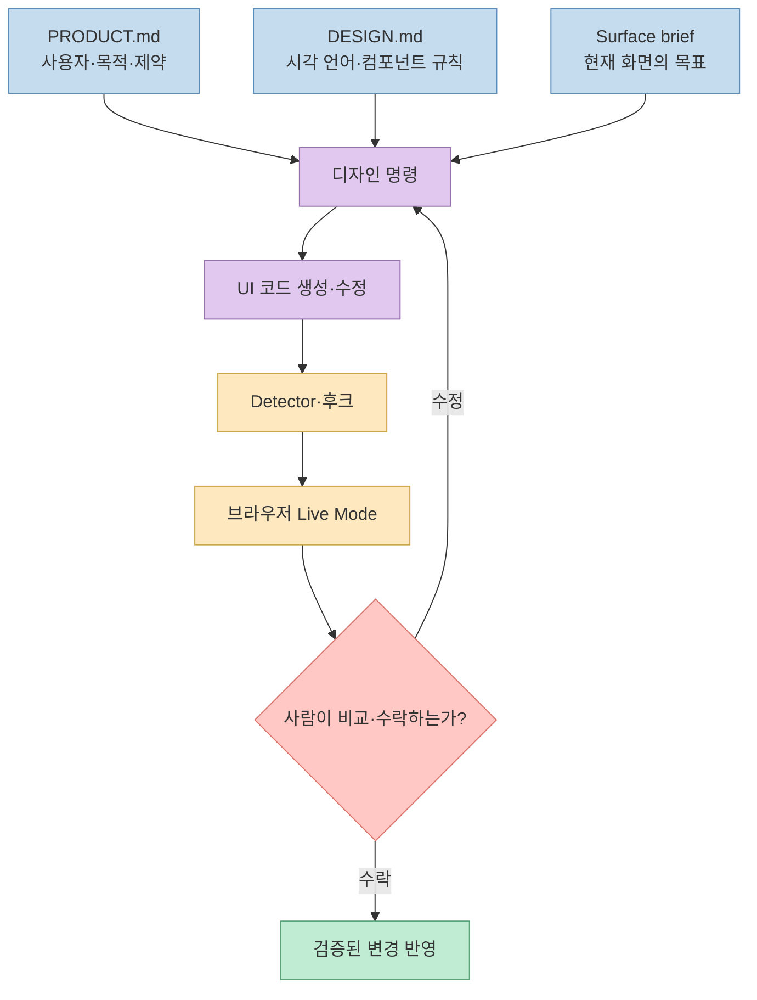
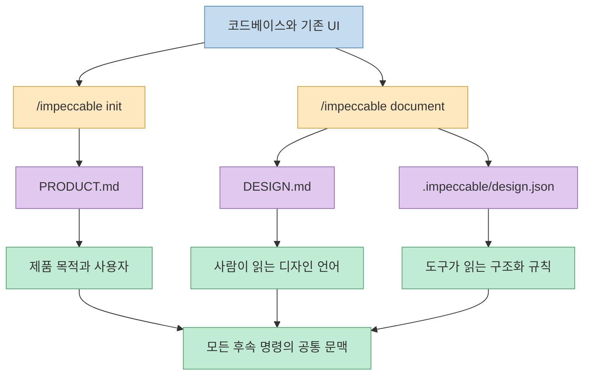
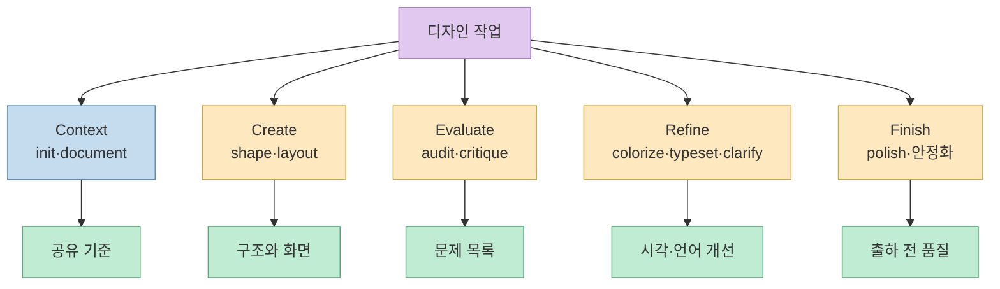
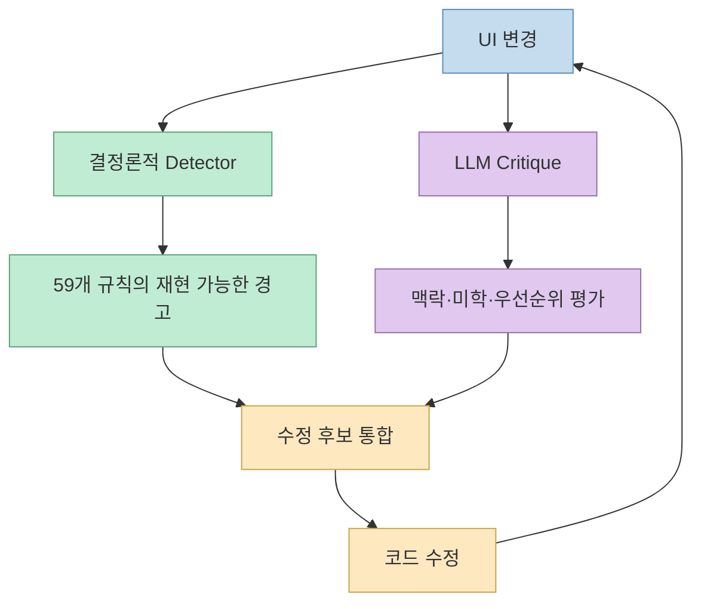
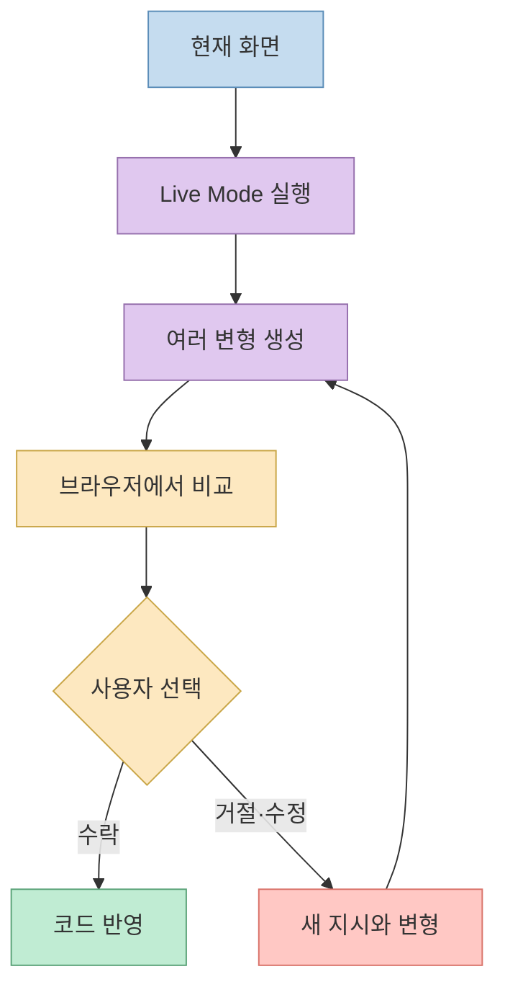
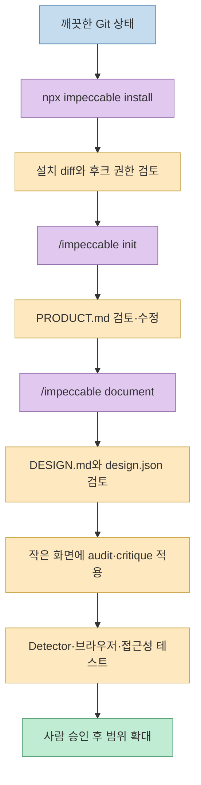
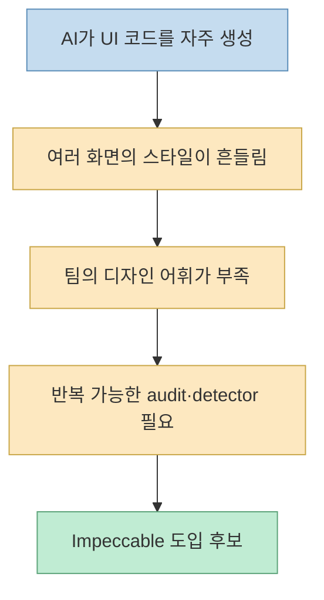
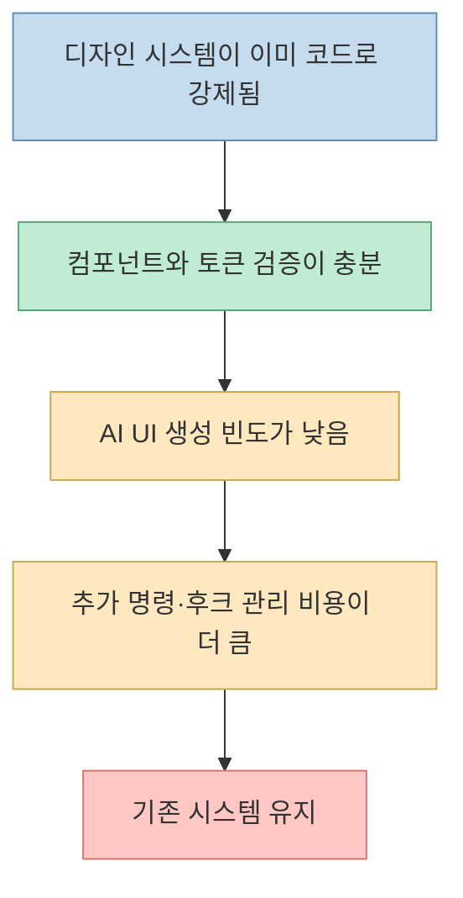

[Threads 원문](https://www.threads.com/share/_ulNZBK4I/)은 Paul Bakaus의 `Impeccable`을 “AI를 위한 전용 디자인 시스템이자 프롬프트 세트”로 소개합니다. 색상, 레이아웃, 타이포그래피, 마이크로카피까지 가이드해 개발자가 일일이 고치지 않아도 디자이너 수준의 결과를 만든다는 설명입니다. [정규 Threads 주소](https://www.threads.com/@h2smusic/post/DbnAn71E4bv)

공식 문서와 비교하면 앞부분은 맞지만 결론은 과장됐습니다. Impeccable은 AI를 디자이너로 바꾸는 자동 완성 프롬프트가 아닙니다. **프로젝트 컨텍스트를 기록하고, 디자인 명령으로 코드를 수정하고, 결정론적 규칙으로 안티패턴을 검출하고, 브라우저에서 사람이 결과를 선택하게 만드는 디자인 가드레일** 에 가깝습니다. [공식 저장소](https://github.com/pbakaus/impeccable) [Context 문서](https://impeccable.style/docs/context/)
<!--more-->

## Sources

- [입력 Threads 공유 링크](https://www.threads.com/share/_ulNZBK4I/)
- [Threads 정규 게시물](https://www.threads.com/@h2smusic/post/DbnAn71E4bv)
- [Impeccable 공식 저장소](https://github.com/pbakaus/impeccable)
- [공식 README](https://github.com/pbakaus/impeccable/blob/main/README.md)
- [공식 Context 문서](https://impeccable.style/docs/context/)
- [공식 Init 문서](https://impeccable.style/docs/init/)
- [공식 Document 문서](https://impeccable.style/docs/document/)
- [공식 Live Mode 문서](https://impeccable.style/docs/impeccable/)
- [공식 릴리스](https://github.com/pbakaus/impeccable/releases)
- [package.json](https://github.com/pbakaus/impeccable/blob/main/package.json)
- [Apache-2.0 LICENSE](https://github.com/pbakaus/impeccable/blob/main/LICENSE)
- [Google Developers의 Paul Bakaus 프로필](https://developers.google.com/events/gdd-europe/speakers)

## 1. Threads 원문의 주장, 어디까지 맞나

원문 작성자는 H2S SOUND(`@h2smusic`)이며 2026년 8월 4일 07:18 UTC에 게시했습니다. 연속 게시물이나 원본 첨부 미디어는 없고, `pbakaus/impeccable` GitHub 링크 카드만 포함합니다. 공개 Threads 응답이 장문 본문을 충분히 주지 않아 렌더링된 브라우저 DOM에서 본문과 시각을 확인했습니다. [Threads 원문](https://www.threads.com/@h2smusic/post/DbnAn71E4bv)

핵심 주장별 판정은 다음과 같습니다.

- **Paul Bakaus가 공개했다 — 확인됨.** 공식 README와 `package.json`이 제작자를 Paul Bakaus로 명시합니다. [README](https://github.com/pbakaus/impeccable/blob/main/README.md) [package.json](https://github.com/pbakaus/impeccable/blob/main/package.json)
- **Google 출신이다 — 확인됨.** Google Developers의 과거 행사 프로필은 그를 당시 Google Web Developer Advocate로 소개합니다. 현재 직함이 아니라 과거 이력으로 표현해야 정확합니다. [Google Developers](https://developers.google.com/events/gdd-europe/speakers)
- **오픈소스다 — 확인됨.** 저장소는 Apache License 2.0으로 공개돼 있습니다. [LICENSE](https://github.com/pbakaus/impeccable/blob/main/LICENSE)
- **색상·레이아웃·타이포그래피·마이크로카피를 다룬다 — 확인됨.** `colorize`, `layout`, `typeset`, `clarify` 같은 명령과 디자인 컨텍스트가 이 영역을 다룹니다. [README](https://github.com/pbakaus/impeccable/blob/main/README.md) [Context](https://impeccable.style/docs/context/)
- **단순 프롬프트 세트다 — 불완전한 설명.** 현재 프로젝트는 스킬과 명령 외에도 프로젝트 컨텍스트, 결정론적 detector, 후크, CLI, 브라우저 기반 Live Mode를 포함합니다. [README](https://github.com/pbakaus/impeccable/blob/main/README.md)
- **수동 수정 없이 디자이너 수준 결과를 보장한다 — 확인되지 않음.** 공식 문서는 생성된 컨텍스트를 검토·수정하고, Live Mode에서 변형을 비교한 뒤 사람이 수락하도록 요구합니다. 공개된 독립 벤치마크도 확인되지 않습니다. [Context](https://impeccable.style/docs/context/) [Live Mode](https://impeccable.style/docs/impeccable/)



## 2. 기존 글 이후 무엇이 달라졌나

이 블로그는 이미 Impeccable을 두 차례 자세히 다뤘습니다. [2026년 3월 글](/post/2026/03/2026-03-23-impeccable-design-language-ai-harnesses/)은 1개 스킬과 20개 명령, 다중 AI 하네스 빌드 구조를 분석했고, [2026년 4월 글](/post/2026/04/2026-04-13-impeccable-ai-slop-frontend/)은 18개 명령 시기의 안티패턴·감사·개선 루프를 다뤘습니다.

2026년 8월 5일 공식 README 기준 구조는 더 커졌습니다.

- 1개의 핵심 디자인 스킬
- 23개의 사용자 명령
- 59개의 결정론적 detector 규칙
- UI 파일 편집 시 검출 결과를 돌려주는 provider-native 후크
- `PRODUCT.md`, `DESIGN.md`, `.impeccable/design.json` 기반 프로젝트 컨텍스트
- 브라우저에서 여러 변형을 비교하고 선택하는 Live Mode
- 설치·업데이트·검출을 담당하는 CLI

[공식 README](https://github.com/pbakaus/impeccable/blob/main/README.md) [Context](https://impeccable.style/docs/context/)

이 변화가 중요한 이유는 Impeccable의 중심이 “좋은 디자인 프롬프트”에서 **디자인 의사결정의 전체 피드백 루프**로 이동했기 때문입니다. 생성 지침뿐 아니라 프로젝트 맥락, 정적 검출, 브라우저 확인, 사람 선택을 한 흐름에 넣습니다.

## 3. 원문이 기대하게 만드는 사용 방식

Threads 설명만 읽으면 다음처럼 이해하기 쉽습니다.



이 흐름은 매력적이지만 공식 문서의 실제 사용법과 다릅니다. 좋은 디자인은 프로젝트 목적과 브랜드 제약을 입력하고, 수정 결과를 검출하고, 브라우저에서 비교하며, 사람이 선택하는 반복 과정으로 만들어집니다. [Context](https://impeccable.style/docs/context/) [Live Mode](https://impeccable.style/docs/impeccable/)

## 4. 실제 Impeccable의 흐름



이 구조에서 Impeccable은 “정답을 내는 디자이너”보다 **판단 기준을 기억하고 반복 가능한 검토 절차를 제공하는 디자인 파트너**입니다. 공식 Context 문서도 컨텍스트가 판단을 대체하지 않으며, 생성된 `PRODUCT.md`와 `DESIGN.md`가 실제 제품과 다르면 사람이 편집해야 한다고 설명합니다. [Context](https://impeccable.style/docs/context/)

## 5. 첫 번째 축: 프로젝트 컨텍스트를 파일로 고정한다

`/impeccable init`은 코드베이스를 살펴보고 제품의 사용자, 목적, 핵심 행동, 증거, 브랜드 제약을 `PRODUCT.md`에 정리합니다. 이 파일은 “무엇을 만들고 누구를 설득해야 하는가”를 저장하는 제품 컨텍스트입니다. [Init](https://impeccable.style/docs/init/)

`/impeccable document`는 현재 UI에서 시각 체계를 추출해 `DESIGN.md`와 구조화된 `.impeccable/design.json`을 만듭니다. 색상, 타이포그래피, 컴포넌트, 반경, 반복 규칙을 이후 명령이 공유하게 합니다. [Document](https://impeccable.style/docs/document/)



이 접근은 세션마다 “세련되게 만들어 줘”라고 다시 설명하는 문제를 줄입니다. 반면 컨텍스트 파일이 오래되면 AI가 일관되게 **과거의 기준**을 적용할 수 있습니다. 제품 방향이나 디자인 시스템이 바뀌면 문서를 다시 생성하는 데 그치지 말고 diff를 검토해 실제 의도와 맞는지 확인해야 합니다.

## 6. 두 번째 축: 디자인 작업을 명령 단위로 분리한다

Impeccable의 23개 명령은 하나의 거대한 “예쁘게 만들기” 프롬프트를 역할별 작업으로 분해합니다. 공식 README에서 확인되는 대표적인 명령은 다음과 같습니다. [README](https://github.com/pbakaus/impeccable/blob/main/README.md)

- **초기화·문서화**: `init`, `document`
- **생성·구조화**: `shape`, `layout`
- **평가**: `audit`, `critique`
- **표현 개선**: `colorize`, `typeset`, `clarify`, `polish`
- **단순화·안정화**: 복잡성을 줄이고 반응형·접근성·견고성을 점검하는 명령군



명령 분리의 장점은 실패를 좁힐 수 있다는 점입니다. 타이포그래피만 고칠 때 전체 화면을 다시 생성하지 않고 `typeset`을 사용하고, 문제를 먼저 보고 싶다면 코드를 수정하는 명령 대신 `audit`이나 `critique`로 진단합니다.

## 7. 세 번째 축: LLM 판단과 결정론적 검출을 분리한다

LLM은 구성과 맥락 판단에는 강하지만 같은 코드에서도 평가가 흔들릴 수 있습니다. Impeccable의 detector는 59개 결정론적 규칙으로 반복되는 안티패턴을 찾습니다. CLI에서는 다음과 같이 소스 디렉터리, HTML 파일, URL을 검사하거나 JSON 결과를 받을 수 있습니다. [README](https://github.com/pbakaus/impeccable/blob/main/README.md)

```bash
npx impeccable detect src/
npx impeccable detect index.html
npx impeccable detect https://example.com
npx impeccable detect src/ --json
```

후크를 지원하는 하네스에서는 UI 파일이 편집될 때 detector 결과가 에이전트 흐름으로 돌아갑니다. 즉 “회색 텍스트를 컬러 배경 위에 사용”, “카드 안에 카드를 중첩”, “과도하게 흔한 AI 패턴” 같은 검출 가능한 문제는 확률적 비평만 기다리지 않고 규칙으로 잡습니다. [README](https://github.com/pbakaus/impeccable/blob/main/README.md)



두 검사는 경쟁 관계가 아닙니다. detector는 같은 입력에 같은 경고를 내는 기계적 안전망이고, LLM critique는 규칙으로 표현하기 어려운 위계·브랜드 적합성·전체 인상을 판단하는 층입니다.

## 8. 네 번째 축: Live Mode에서도 마지막 결정은 사람에게 남는다

Live Mode는 브라우저에서 화면을 보며 여러 디자인 변형을 시도하고 비교할 수 있게 합니다. 사용자는 결과를 보고 수락하거나 다시 수정합니다. 이 구조 자체가 “개발자가 일일이 볼 필요가 없다”는 원문 설명과 반대입니다. **사람의 선택을 더 빠르고 구체적으로 만드는 것**이지 선택을 제거하지 않습니다. [Live Mode](https://impeccable.style/docs/impeccable/)



Impeccable가 제안하는 미학은 의도적으로 강합니다. 따라서 브랜드 고유성이나 산업 규제, 사용자 연구 결과가 프로젝트 컨텍스트에 충분히 들어 있지 않으면 “일관된 화면”은 만들 수 있어도 “우리 제품에 맞는 화면”은 보장할 수 없습니다.

## 9. 설치와 안전한 실전 흐름

현재 공식 README의 기본 설치 명령은 다음과 같습니다. [README](https://github.com/pbakaus/impeccable/blob/main/README.md)

```bash
npx impeccable install
```

업데이트는 다음 명령을 사용합니다.

```bash
npx impeccable update
```

`package.json`은 Node.js `>=22.18.0`을 요구합니다. 설치기는 선택한 AI 하네스의 스킬 폴더와 후크 설정을 수정할 수 있으므로, 깨끗한 Git 상태에서 실행하고 설치 후 diff를 검토하는 편이 안전합니다. Codex처럼 후크 승인이 필요한 환경에서는 설치만으로 자동 활성화됐다고 가정하지 말고 도구별 안내를 확인해야 합니다. [package.json](https://github.com/pbakaus/impeccable/blob/main/package.json) [README](https://github.com/pbakaus/impeccable/blob/main/README.md)



처음부터 전체 제품을 다시 디자인하지 말고 한 화면을 고르는 것이 좋습니다. 먼저 `audit`과 `critique`로 진단하고, `typeset`, `layout`, `clarify`, `polish`처럼 목적이 좁은 명령을 하나씩 적용하면 어떤 규칙이 어떤 변화를 만들었는지 추적하기 쉽습니다.

## 10. 빠른 버전 변화가 만드는 주의점

Impeccable은 빠르게 변하고 있습니다. 2026년 7월 30일 공개된 4.0.4 릴리스는 기존 `craft` 명령을 deprecated 처리하고, 화면 목적을 Persuade·Operate·Read·Experience 같은 모드로 구분하는 방향을 설명합니다. 반면 README 일부에는 이전 명령과 컨텍스트 표현이 남아 있어 최신 릴리스와 문서 사이에 전환기 흔적이 보입니다. [공식 릴리스](https://github.com/pbakaus/impeccable/releases) [README](https://github.com/pbakaus/impeccable/blob/main/README.md)

따라서 블로그 글이나 오래된 튜토리얼의 명령을 그대로 복사하기보다 다음 순서로 확인해야 합니다.

1. 현재 설치된 CLI와 스킬 버전을 확인한다.
2. 최신 릴리스에서 deprecated 명령을 확인한다.
3. 공식 문서가 현재 설치 결과와 일치하는지 본다.
4. `PRODUCT.md`, `DESIGN.md`, 후크 설정을 버전 관리한다.
5. 업데이트 후 detector 결과와 실제 UI diff를 다시 검증한다.

이 블로그의 3월·4월 글에서 언급한 18개 또는 20개 명령도 당시에는 맞았지만, 현재의 23개 명령 구조를 설명하지는 못합니다. 디자인 지식뿐 아니라 **스킬 공급망 자체도 버전이 있는 소프트웨어**로 다뤄야 합니다.

## 11. 언제 잘 맞고, 언제 과한가

### 잘 맞는 경우



- Claude Code, Codex, Cursor 등 여러 하네스에서 같은 디자인 기준을 공유할 때
- AI가 반복 생성하는 카드 중첩, 과도한 그라데이션, 약한 위계를 체계적으로 줄일 때
- 디자이너가 모든 변경을 직접 만들 수는 없지만 최종 방향은 검토할 수 있을 때
- 프로젝트 목적과 디자인 규칙을 파일로 유지할 준비가 됐을 때

### 과하거나 위험한 경우



- 강한 컴포넌트 라이브러리와 디자인 토큰, 시각 회귀 테스트가 이미 있는 팀
- 브랜드 원칙을 문서화하거나 검토할 담당자가 없는 프로젝트
- 설치 스크립트와 후크가 수정하는 파일을 감사할 수 없는 환경
- “한 번 실행하면 전문 디자이너 없이 완성된다”는 기대만으로 도입하는 경우

## 실전 적용 포인트

1. 원문처럼 “디자이너 비서”로 기대하기보다 **디자인 lint + 작업 명령 + 컨텍스트 메모리**로 정의한다.
2. 설치 전 Git 상태를 깨끗하게 만들고, 설치 후 스킬·후크 diff를 검토한다.
3. `/impeccable init`이 만든 `PRODUCT.md`를 실제 사용자·제품 목표와 대조한다.
4. `/impeccable document`가 만든 `DESIGN.md`와 `design.json`을 현재 UI와 비교한다.
5. 한 화면에서 `audit → critique → 목적별 수정 → detector → 브라우저 검토` 순서를 시험한다.
6. 접근성, 반응형, 실제 상호작용은 별도의 테스트와 사람 검토로 확인한다.
7. 업데이트 전 릴리스 노트에서 deprecated 명령과 Node 요구사항을 확인한다.
8. 디자인 컨텍스트가 오래되지 않도록 제품·브랜드 변경 시 함께 갱신한다.

성공 지표는 “더 예뻐 보인다” 하나로 끝나면 안 됩니다. AI 기본 패턴의 반복 감소, 토큰·간격·타입 체계의 일관성, detector 경고 수, 접근성 오류, 사람의 재수정 시간, 브라우저 검토에서의 승인률을 함께 봐야 합니다.

## 핵심 요약

- Impeccable은 Paul Bakaus가 만든 Apache-2.0 오픈소스 프로젝트이며, 그의 Google 경력도 공식 자료로 확인된다.
- 현재 구조는 단순 프롬프트 세트가 아니라 1개 스킬, 23개 명령, 59개 규칙, 후크, CLI, 컨텍스트 파일, Live Mode를 포함한다.
- `PRODUCT.md`는 제품 목적을, `DESIGN.md`와 `design.json`은 시각 언어를 후속 명령에 제공한다.
- detector는 재현 가능한 안티패턴을, LLM critique는 맥락과 미학 판단을 담당한다.
- “수정 없이 디자이너 수준 결과”는 공개 근거가 없으며 공식 흐름도 사람의 검토·선택을 요구한다.
- 프로젝트 변화가 빨라 README·릴리스·설치 버전이 일치하는지 매번 확인해야 한다.

## 결론

Impeccable의 가치는 AI에게 미적 감각을 마법처럼 주입하는 데 있지 않습니다. **좋은 디자인을 말할 수 있는 언어, 프로젝트가 기억할 컨텍스트, 반복 가능한 작업 명령, 기계적으로 검사할 규칙, 사람이 선택할 브라우저 피드백 루프**를 한 시스템으로 연결한 데 있습니다.

그래서 가장 정확한 표현은 “AI 디자이너”가 아니라 **AI 코딩 에이전트를 위한 디자인 가드레일**입니다. 가드레일은 방향을 잡고 실수를 줄이지만 운전자를 없애지 않습니다. Impeccable도 마찬가지입니다. 제품과 사용자를 이해하고, 결과를 비교하고, 최종 결정을 내리는 역할은 여전히 사람에게 남습니다.
