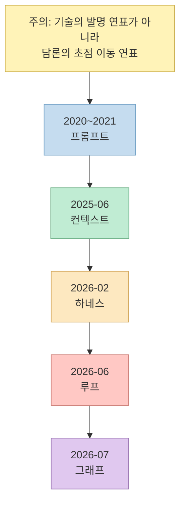
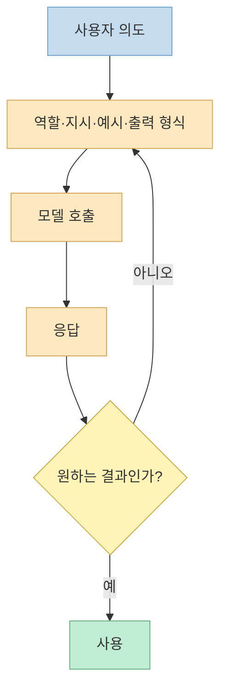
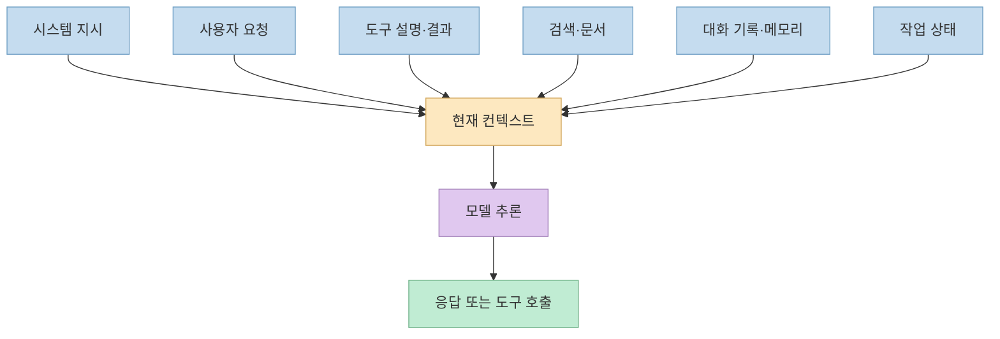
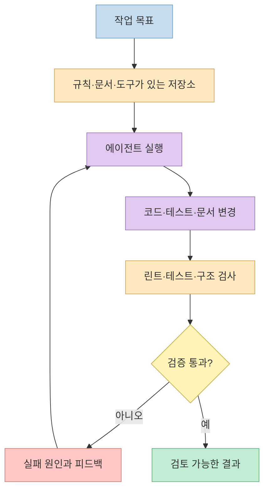
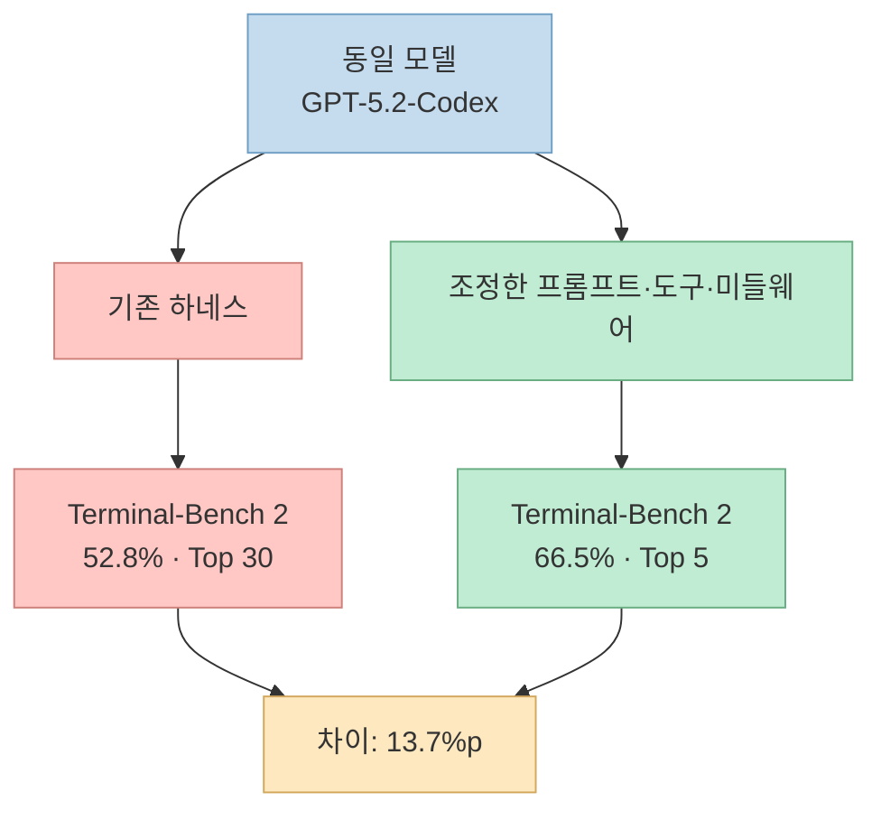
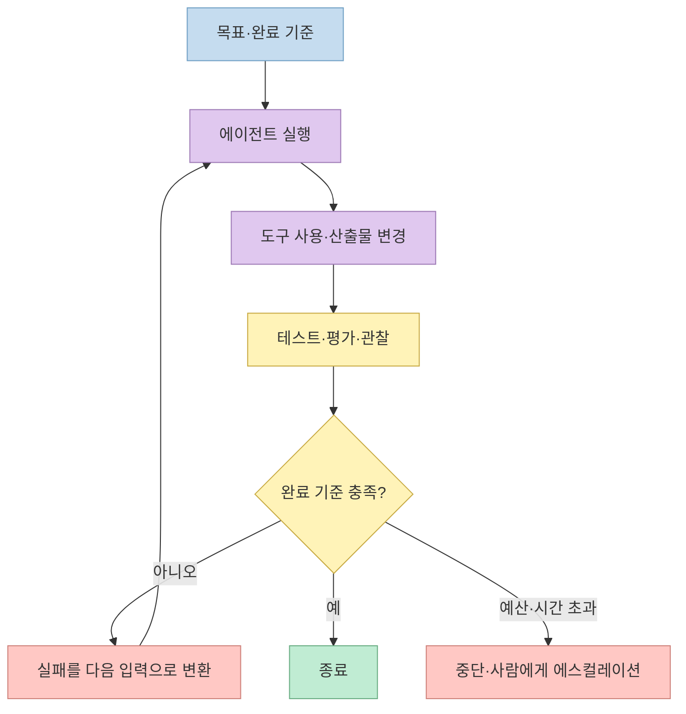
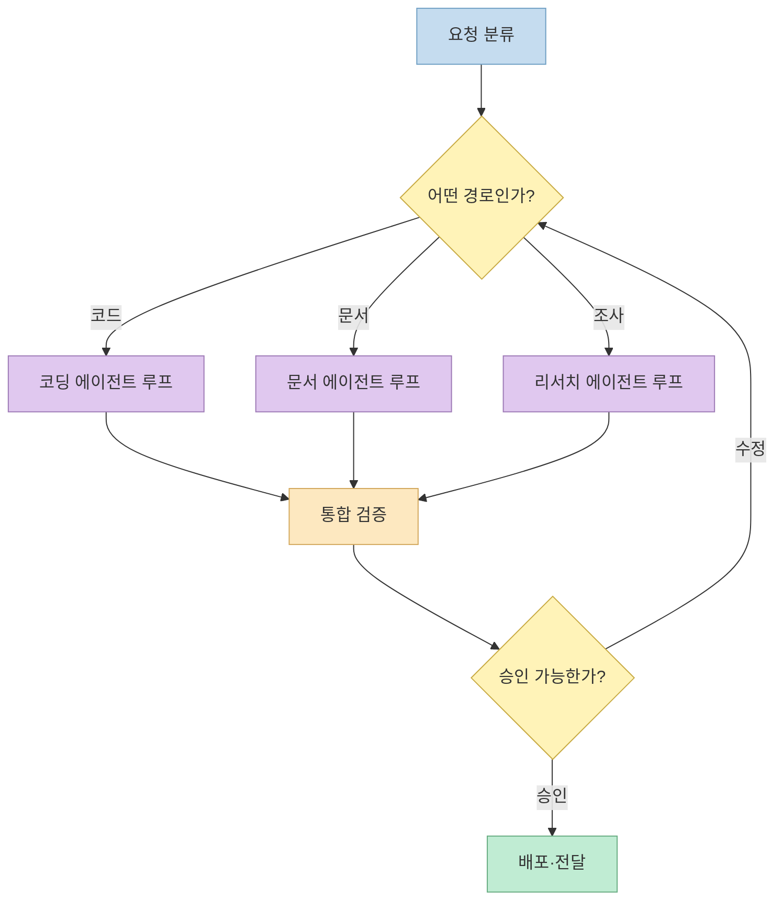
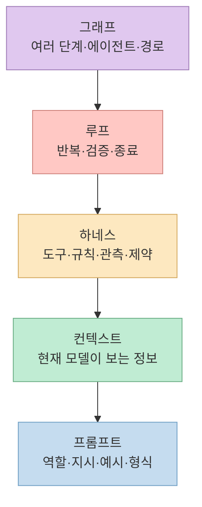
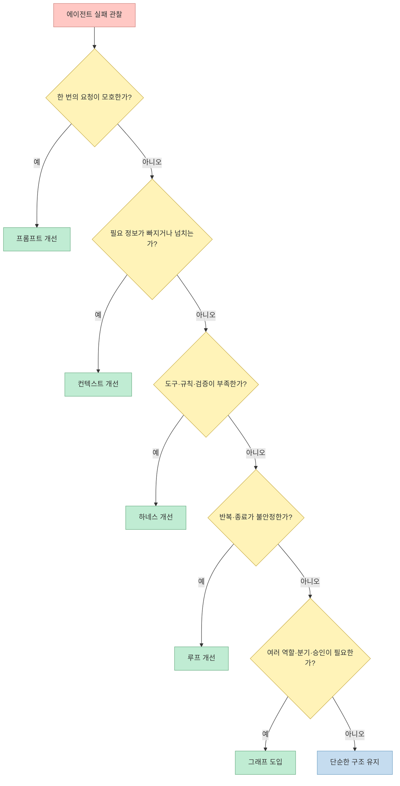

AI 에이전트 분야에는 새로운 `~ Engineering` 용어가 너무 빨리 등장합니다. 이번 영상은 프롬프트에서 그래프까지 다섯 용어를 한 계보로 묶고, 2026년 7월 18일의 농담 한 줄이 불과 11일 만에 `Graph Engineering`이라는 신조어가 됐다고 소개합니다. [영상 0:00](https://youtu.be/7OKBukpWPtk?t=0) [영상 0:19](https://youtu.be/7OKBukpWPtk?t=19)

하지만 **이름이 퍼진 날**, **표현이 처음 관찰된 날**, **기술이 생긴 날**은 서로 다릅니다. 공식 자료와 원문을 교차 확인하면 다섯 용어는 앞 단계를 폐기하는 유행어 계단이 아니라, 모델 밖에서 설계해야 할 범위가 점점 넓어진 과정을 설명하는 서로 겹치는 관점에 가깝습니다.

<!--more-->

## Sources

- [원본 YouTube Shorts](https://youtube.com/shorts/7OKBukpWPtk?si=R43XUygOuKC5ukw_)
- [Anthropic: Effective context engineering for AI agents](https://www.anthropic.com/engineering/effective-context-engineering-for-ai-agents)
- [Mitchell Hashimoto: My AI Adoption Journey](https://mitchellh.com/writing/my-ai-adoption-journey)
- [OpenAI: Harness engineering—leveraging Codex in an agent-first world](https://openai.com/index/harness-engineering/)
- [LangChain: New in Deep Agents v0.6](https://www.langchain.com/blog/deep-agents-0-6)
- [Addy Osmani: Loop Engineering](https://addyosmani.com/blog/loop-engineering/)
- [Peter Steinberger의 2026년 7월 18일 X 게시물](https://x.com/steipete/status/2078277297791189132)
- [LangChain: 3 Years of Graph Engineering with LangGraph](https://www.langchain.com/blog/3-years-of-graph-engineering-with-langgraph)
- [EMNLP 2021: What Changes Can Large-scale Language Models Bring?](https://aclanthology.org/2021.emnlp-main.274/)

## 1. 영상의 주장을 먼저 정확히 복원하기

영상은 다섯 용어에 다음 날짜를 붙입니다. 프롬프트 엔지니어링은 2020~2021년, 컨텍스트 엔지니어링은 2025년 6월 19일, 하네스 엔지니어링은 2026년 2월 5일, 루프 엔지니어링은 2026년 6월 7일, 그래프 엔지니어링은 2026년 7월 18일입니다. 또한 영상 제작 기준일인 2026년 7월 29일에는 루프가 52일, 그래프가 11일 된 표현이라고 계산합니다. [영상 0:26](https://youtu.be/7OKBukpWPtk?t=26) [영상 0:38](https://youtu.be/7OKBukpWPtk?t=38)

이 연표는 **각 표현이 크게 주목받은 계기**를 기억하기에는 유용합니다. 다만 ‘탄생일’이라고 읽으면 과장됩니다. 프롬프트 엔지니어링에는 단일 발명자가 없고, 그래프로 에이전트를 표현하는 기술은 2026년 7월보다 훨씬 앞서 구현돼 있었습니다. 루프라는 구조도 표현이 유행하기 전부터 에이전트의 기본 실행 형태였습니다.

검증에는 또 하나의 한계가 있습니다. 이 글이 확보한 한국어 자동 자막은 약 2분 39초 지점에서 문장 중간에 끝납니다. 따라서 영상이 실제로 들려준 범위는 빠짐없이 다루되, 자막 뒤에 있었을 법한 루프·그래프 설명을 추측해 복원하지 않습니다. 대신 그 부분은 공개된 원문과 공식 자료로 독립 설명합니다.

## 2. 프롬프트 엔지니어링: 지시문을 설계하는 층

영상은 프롬프트 엔지니어링을 “AI에게 무엇을 어떻게 하라고 쓸지”를 다루는 기술로 설명합니다. 그리고 정확한 최초 사용자를 특정하기 어렵지만 2020~2021년 무렵 용어가 굳었고, 2021년 학술 논문에도 등장했다고 말합니다. [영상 0:54](https://youtu.be/7OKBukpWPtk?t=54) [영상 1:02](https://youtu.be/7OKBukpWPtk?t=62)

이 설명은 대체로 타당합니다. 예를 들어 EMNLP 2021의 HyperCLOVA 논문은 `prompt engineering pipeline`과 대화형 프롬프트 엔지니어링 인터페이스를 명시적으로 언급합니다. 그렇다고 이 논문이 용어를 발명했다는 뜻은 아닙니다. 2020년 GPT-3 이후 자연어 지시·예시를 조정하는 실무가 빠르게 확산하면서 여러 연구와 제품에서 표현이 함께 정착한 것으로 보는 편이 안전합니다.

프롬프트는 뒤의 네 층이 등장했다고 사라지지 않습니다. 컨텍스트 안에는 여전히 시스템 지시와 사용자 메시지가 있고, 하네스도 모델에 전달할 프롬프트를 구성하며, 루프와 그래프의 각 단계도 모델 호출 때 지시문을 사용합니다.

## 3. 컨텍스트 엔지니어링: 모델이 지금 볼 수 있는 전체를 설계하는 층

영상은 Shopify의 Tobi Lütke가 2025년 6월 19일 X에서 `Context Engineering`을 사용했고, Andrej Karpathy가 6월 25일 이를 확산했으며, Anthropic이 9월 29일 공식 블로그 제목으로 채택했다고 설명합니다. [영상 1:09](https://youtu.be/7OKBukpWPtk?t=69) [영상 1:16](https://youtu.be/7OKBukpWPtk?t=76)

이번 조사에서 독립적으로 확정할 수 있는 지점은 Anthropic의 글입니다. 실제 게시일은 2025년 9월 29일이고, Anthropic은 컨텍스트 엔지니어링을 프롬프트 엔지니어링의 자연스러운 발전으로 정의합니다. 반면 Tobi Lütke와 Karpathy의 정확한 ‘최초’ 날짜는 영상의 설명 외에 안정적으로 열람 가능한 원게시물 기록을 확보하지 못했습니다. 그러므로 두 날짜는 **영상이 제시한 확산 연표**로 인용하되, 최초 명명 사실로 단정하지 않습니다.

컨텍스트는 단순한 지시문보다 넓습니다. 시스템 프롬프트, 도구 설명, MCP 결과, 검색 자료, 대화 기록, 메모리와 현재 상태 등 추론 시점에 모델이 받는 모든 토큰이 포함됩니다. Anthropic이 강조하는 핵심도 “많이 넣기”가 아니라 제한된 주의 예산 안에서 **가장 작은 고신호 토큰 집합**을 유지하는 것입니다.

영상이 “프롬프트는 죽지 않았고 컨텍스트의 부분집합이 됐다”고 정리한 이유가 여기에 있습니다. [영상 1:22](https://youtu.be/7OKBukpWPtk?t=82) 표현의 유행과 무관하게, 좋은 지시문과 적절한 정보 선별은 동시에 필요합니다.

## 4. 하네스 엔지니어링: 모델이 일하는 환경과 제약을 설계하는 층

영상은 하네스를 “모델을 제외한 모든 것”이라고 압축합니다. 에이전트가 실수했을 때 더 열심히 지시하는 대신 같은 실수를 반복하기 어렵도록 환경을 바꾸며, 규칙 파일·검증 스크립트·린터·관측 가능성을 모델 주위에 둔다는 설명입니다. [영상 1:32](https://youtu.be/7OKBukpWPtk?t=92) [영상 1:43](https://youtu.be/7OKBukpWPtk?t=103)

Mitchell Hashimoto의 2026년 2월 5일 글은 이 명명의 중요한 원자료입니다. 다만 본인도 업계에서 널리 합의된 용어가 있는지 모르겠으며 자신은 이를 `harness engineering`이라고 부르게 됐다고 썼습니다. 영상 역시 그가 더 좋은 용어가 나타나면 바꿀 수 있다고 말했다는 점을 소개합니다. [영상 1:58](https://youtu.be/7OKBukpWPtk?t=118) 따라서 2월 5일은 보편적 기술의 발명일보다 **영향력 있는 명명 사례가 공개된 날**로 보는 편이 정확합니다.

### 같은 모델인데 점수가 달라진 이유

영상은 LangChain이 모델을 `GPT-5.2-Codex`로 고정하고 시스템 프롬프트와 도구 미들웨어만 바꿔 Terminal-Bench 2 성능을 크게 올렸다고 말합니다. [영상 2:09](https://youtu.be/7OKBukpWPtk?t=129) 자동 자막은 뒤 숫자를 불분명하게 옮겼지만, LangChain의 공식 글에 기록된 값은 **52.8%에서 66.5%** 이며 순위는 Top 30에서 Top 5로 상승했습니다.

이 결과는 모델 가중치가 같아도 도구 호출 형식, 도구 설명, 기본 시스템 프롬프트와 턴별 미들웨어가 성능에 큰 영향을 줄 수 있음을 보여줍니다. 단, LangChain 자체 테스트의 특정 모델·벤치마크 결과이므로 모든 업무에서 13.7%포인트가 그대로 재현된다고 일반화해서는 안 됩니다.

### OpenAI의 “수동 작성 코드 0줄” 사례

영상 마지막 부분은 OpenAI가 2026년 2월 11일 공개한 사례를 언급합니다. 처음 세 명, 이후 일곱 명으로 늘어난 팀이 5개월 동안 사람이 직접 코드를 작성하지 않았다는 내용입니다. [영상 2:28](https://youtu.be/7OKBukpWPtk?t=148) 공식 글을 확인하면 빈 저장소에서 시작해 약 5개월 동안 애플리케이션·테스트·CI·문서·관측 도구를 포함한 약 100만 줄과 약 1,500개 PR을 Codex가 작성했고, 초기에 세 명이던 팀이 일곱 명으로 늘었다고 설명합니다.

여기서 “사람이 아무 일도 하지 않았다”로 읽으면 틀립니다. 사람은 우선순위, 의도, 수용 기준과 결과 검증을 맡았고 에이전트가 읽고 실행할 수 있는 저장소 구조, 문서, 린터, 테스트와 피드백 루프를 설계했습니다. OpenAI도 이 결과가 해당 저장소의 구조와 도구에 크게 의존하므로 비슷한 투자 없이 일반화해서는 안 된다고 밝힙니다.

## 5. 루프 엔지니어링: 반복과 종료 조건을 설계하는 층

Addy Osmani의 2026년 6월 7일 글은 루프 엔지니어링을 “에이전트에 프롬프트를 입력하는 사람 자신을 시스템으로 대체하는 것”이라고 정의합니다. 목적을 정하면 에이전트가 완료될 때까지 재귀적으로 작업하되, 비용과 안전 문제 때문에 아직 이른 개념이라는 경계도 함께 둡니다. 영상의 “52일 된 용어” 계산은 이 공개일을 기준으로 한 것으로 보입니다. [영상 0:42](https://youtu.be/7OKBukpWPtk?t=42)

하지만 6월 7일을 루프 구조 자체의 탄생일로 보면 안 됩니다. Anthropic은 2024년 말부터 에이전트를 “도구를 사용하는 LLM이 피드백을 받아 반복하는 구조”로 설명했고, 각종 코딩 에이전트도 이미 실행·관찰·수정 사이클을 사용했습니다. 새로워진 것은 반복 자체가 아니라 **무엇을 다음 입력으로 만들지, 무엇으로 성공을 판정할지, 언제 멈출지를 독립적인 설계 대상으로 강조한 이름**입니다.

좋은 루프에는 최대 반복 횟수, 비용·시간 예산, 검증 실패 시의 피드백 형식, 멱등성, 외부 부작용 승인과 인간 에스컬레이션이 필요합니다. 종료 조건 없이 “될 때까지 계속”만 구현하면 자율성이 아니라 무한 재시도와 비용 폭주를 자동화하게 됩니다.

## 6. 그래프 엔지니어링: 여러 단계와 루프의 연결을 설계하는 층

2026년 7월 18일 Peter Steinberger가 X에 올린 문장은 “아직 루프 얘기 중인가요, 아니면 벌써 그래프로 넘어갔나요?”라는 짧은 질문입니다. 영상은 이 농담이 계기가 돼 그래프 엔지니어링이 급속히 퍼졌고 LangChain이 계보를 정리했다고 소개합니다. [영상 0:00](https://youtu.be/7OKBukpWPtk?t=0) [영상 0:03](https://youtu.be/7OKBukpWPtk?t=3)

원게시물에는 `Graph Engineering`이라는 표현도, 새 기술을 발명했다는 주장도 없습니다. LangChain도 7월 22일 공식 글에서 그 주말에 표현이 부상했다고 설명하는 동시에, 자신들은 이미 3년 동안 LangGraph로 그래프 기반 에이전트를 구축해 왔다고 밝혔습니다. 즉 7월 18일은 **표현이 크게 증폭된 계기**이지 그래프 오케스트레이션의 탄생일이 아닙니다.

LangChain의 정의에서 노드는 결정론적 코드, 단일 모델 호출, 도구 호출 또는 내부 루프를 가진 완전한 에이전트일 수 있습니다. 엣지는 다음 단계를 정하고, 조건 분기와 공유 상태는 실행 경로를 통제합니다. 루프는 그래프의 반대말이 아니라 **사이클을 가진 단순 그래프**이며, 실제 에이전트 그래프도 재시도와 수정 때문에 대개 DAG가 아닙니다.

그래프가 언제나 더 좋은 것도 아닙니다. 고객 문의처럼 분류→조회→답변 또는 에스컬레이션이라는 알려진 경로에는 그래프가 적합합니다. 반대로 심층 조사처럼 실행 전에 필요한 단계와 분기 수를 알기 어려운 작업에 경로를 과도하게 고정하면 에이전트의 유연성을 없애고 오케스트레이션 비용만 늘릴 수 있습니다.

## 7. 다섯 용어는 교체 순서가 아니라 포함 관계다

영상도 후반 용어가 앞선 용어를 대체한 것이 아니라 관심의 중심이 이동했다고 명시합니다. [영상 0:49](https://youtu.be/7OKBukpWPtk?t=49) 실제 시스템에서는 다섯 층이 함께 작동합니다.

- **프롬프트** 는 한 번의 모델 호출에서 무엇을 요구할지 설계합니다.
- **컨텍스트** 는 그 호출에서 모델이 무엇을 볼지 설계합니다.
- **하네스** 는 모델이 어떤 도구·규칙·검증 환경에서 행동할지 설계합니다.
- **루프** 는 결과를 어떻게 평가하고 다음 시도로 연결하며 언제 멈출지 설계합니다.
- **그래프** 는 여러 단계·에이전트·루프가 어떤 상태와 경로로 연결될지 설계합니다.

이 관점에서 “이제 프롬프트는 끝났다” 또는 “루프는 죽고 그래프가 왔다”는 표현은 실무적으로 도움이 되지 않습니다. 설계 범위가 넓어져도 안쪽 층의 품질은 계속 바깥층의 성능을 제한합니다.

## 8. 계보를 실무 의사결정으로 바꾸는 방법

문제가 생겼을 때 최신 유행어부터 도입하지 말고 실패가 발생한 층을 찾는 것이 먼저입니다.

예를 들어 형식 오류는 먼저 프롬프트나 스키마를 고쳐야 합니다. 필요한 저장소 규칙을 못 찾는다면 컨텍스트 검색과 문서 구조의 문제일 가능성이 큽니다. 같은 실수를 반복한다면 린터·테스트·권한 같은 하네스를 강화해야 합니다. 완료를 판단하지 못하면 루프의 검증기와 종료 조건을 설계해야 하며, 여러 전문 역할과 승인 경로를 사람이 계속 중계하고 있다면 그때 그래프가 값을 냅니다.

더 넓은 역사와 구현 패턴은 [프롬프트에서 하네스로: AI 에이전틱 패턴이 4년 동안 세 번 바뀐 이유](/post/2026/05/2026-05-17-prompt-context-harness-agentic-patterns-history/), 각 층의 차이는 [하네스, 루프, 그래프 엔지니어링은 무엇이 다를까](/post/2026/07/2026-07-24-harness-loop-graph-engineering/), 그래프라는 표현의 기술적 새로움은 [Graph Engineering은 새 기술일까](/post/2026/07/2026-07-31-graph-engineering-buzzword-fact-check/)에서 더 자세히 다룹니다.

## 핵심 요약

- 영상의 연표는 **관심이 이동한 시점**을 기억하는 데 유용하지만 기술의 정확한 발명 연표는 아닙니다.
- 프롬프트 엔지니어링은 단일 발명자를 특정하기 어렵고, 2021년 학술 문헌에는 이미 명시적으로 등장합니다.
- Anthropic은 2025년 9월 29일 컨텍스트 엔지니어링을 프롬프트 엔지니어링의 자연스러운 발전으로 정의했습니다. 영상이 제시한 Tobi Lütke·Karpathy의 날짜는 이번 조사에서 원게시물까지 독립 확인하지 못했습니다.
- Mitchell Hashimoto의 2026년 2월 5일 글은 하네스 엔지니어링의 영향력 있는 명명 사례지만, 본인도 합의된 표준 용어라고 주장하지 않았습니다.
- LangChain의 공식 수치는 같은 `GPT-5.2-Codex`에서 하네스 변경만으로 Terminal-Bench 2가 **52.8% → 66.5%** 로 상승했다는 것입니다.
- OpenAI의 수동 작성 코드 0줄 사례는 사람의 역할이 사라진 것이 아니라 코딩에서 환경·검증·피드백 시스템 설계로 이동했음을 보여줍니다.
- 2026년 6월과 7월에 루프·그래프라는 표현이 크게 퍼졌지만, 반복 실행과 그래프 오케스트레이션 자체는 이전부터 존재했습니다.
- 다섯 용어는 교체 관계가 아니라 `프롬프트 ⊂ 컨텍스트 ⊂ 하네스 ⊂ 루프·그래프 오케스트레이션`으로 겹치는 설계 관점입니다.

## 결론

이 계보에서 진짜 변화는 이름의 유행보다 **개발자가 책임져야 할 시스템 경계가 모델 밖으로 넓어진 것**입니다. 좋은 문장 하나에서 출발해, 정보 선별·도구와 제약·검증 루프·다중 에이전트 경로까지 설계 범위가 확장됐습니다.

따라서 최신 용어를 따라가는 가장 좋은 방법은 “무엇이 끝났는가?”를 묻는 것이 아닙니다. 지금 실패가 어느 층에서 발생하며, 그 실패를 다음 실행에서 구조적으로 반복하지 않게 만들려면 무엇을 설계해야 하는지를 묻는 것입니다.
