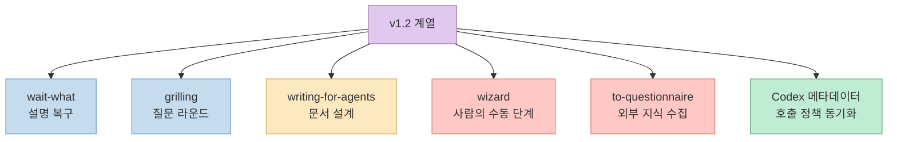
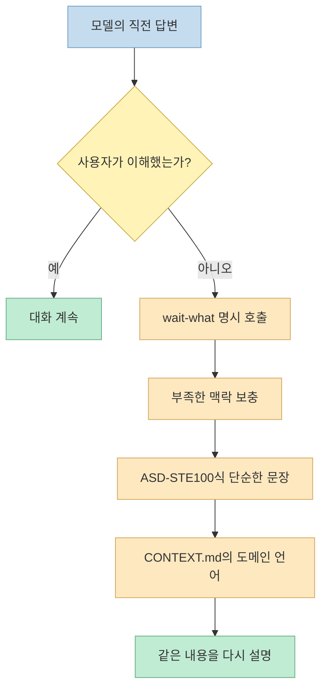
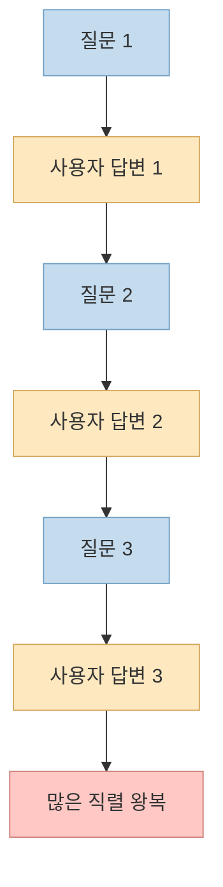
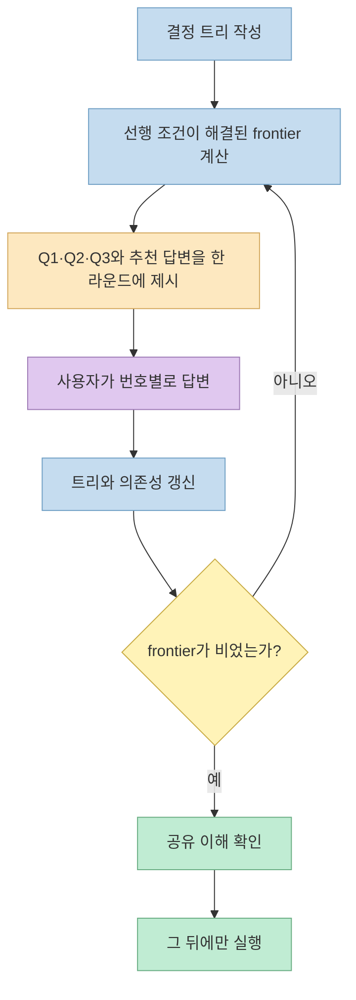
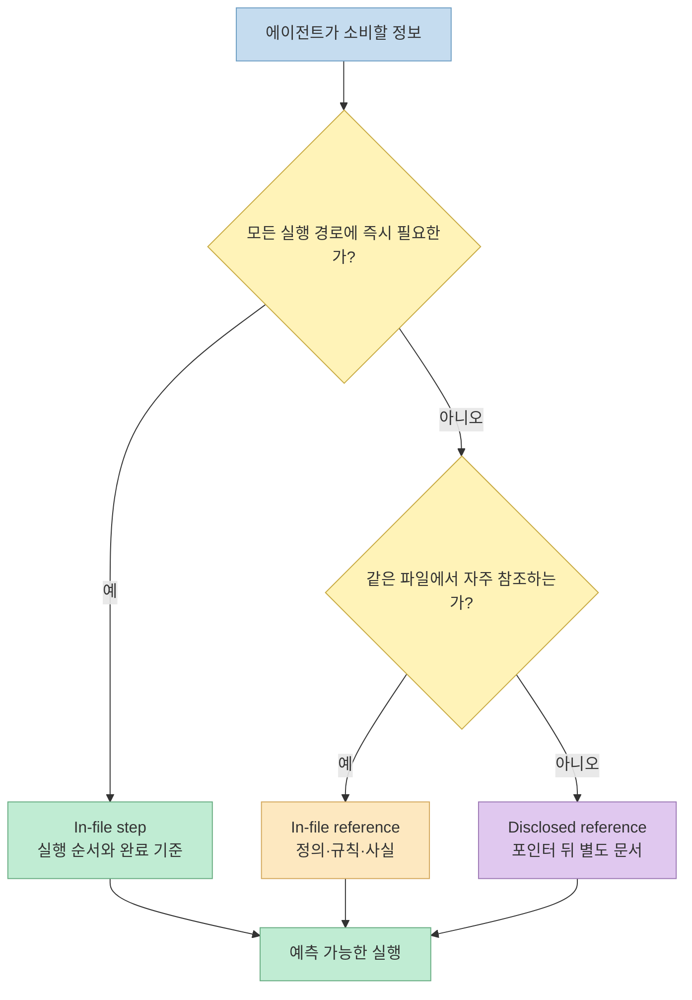
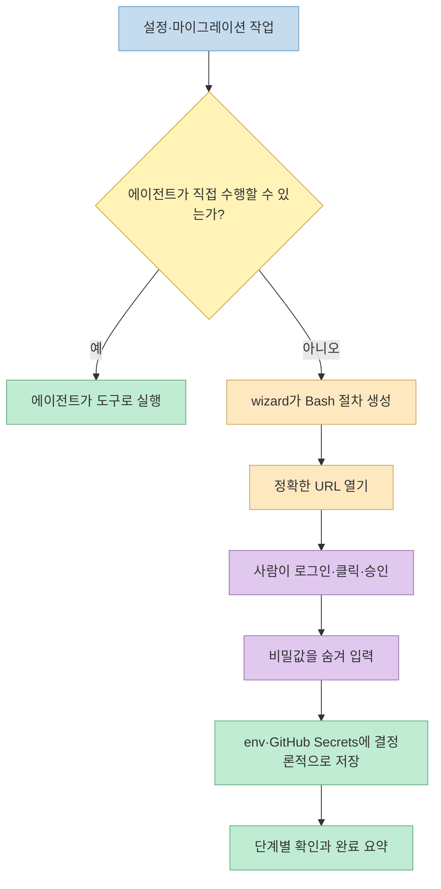
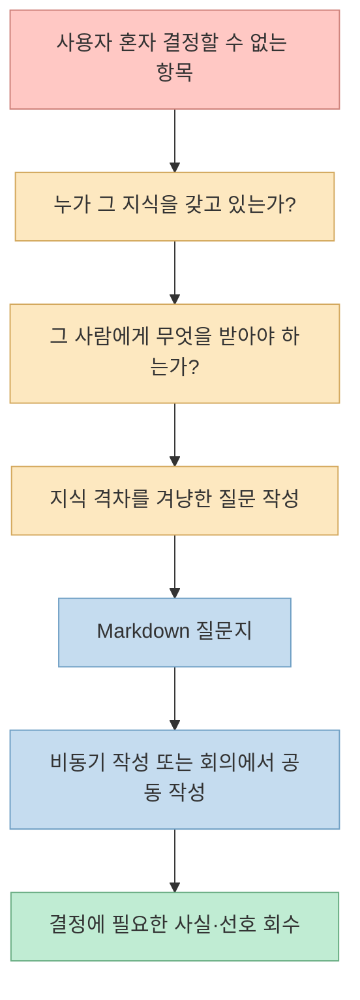
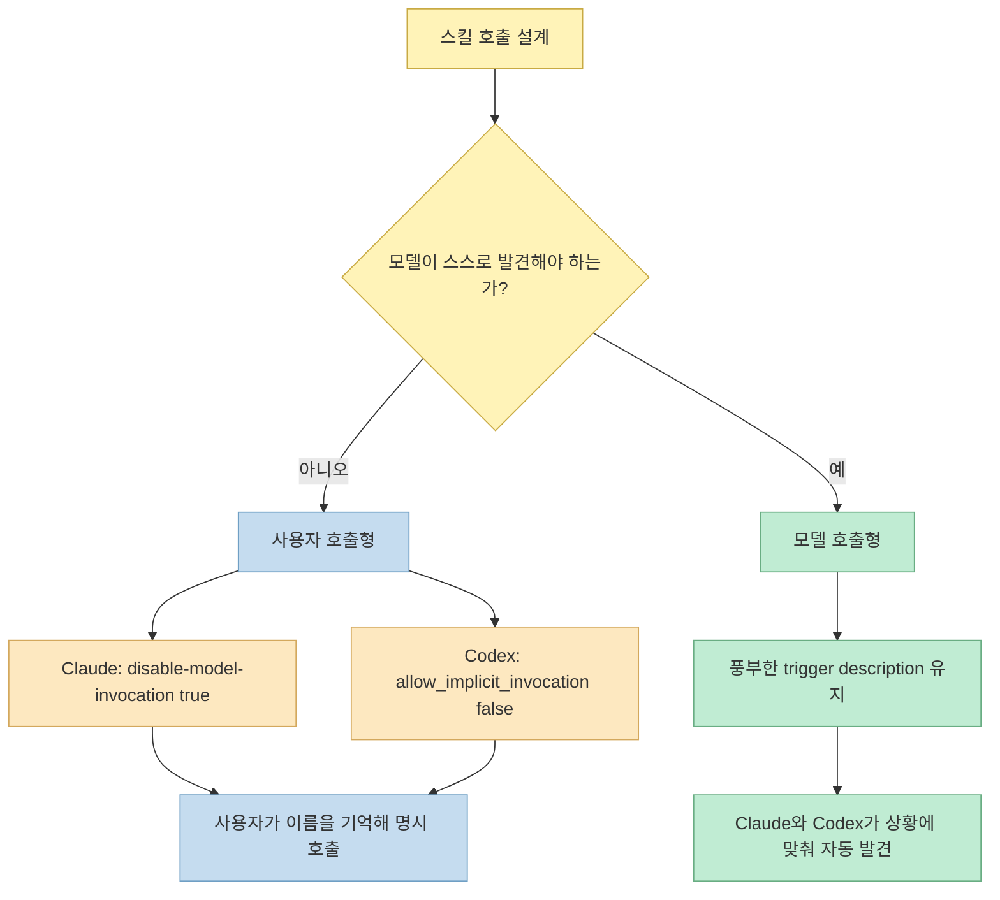
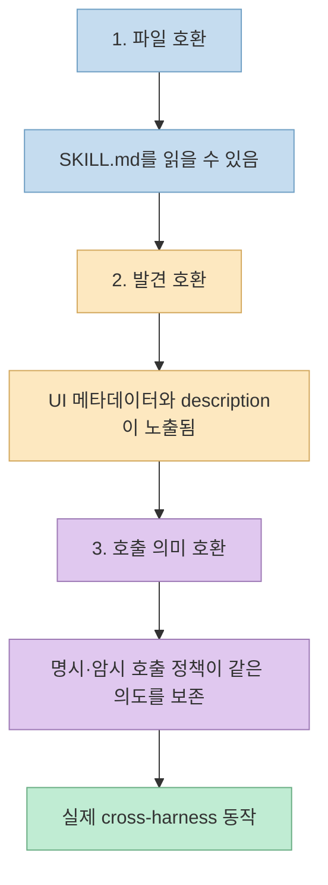
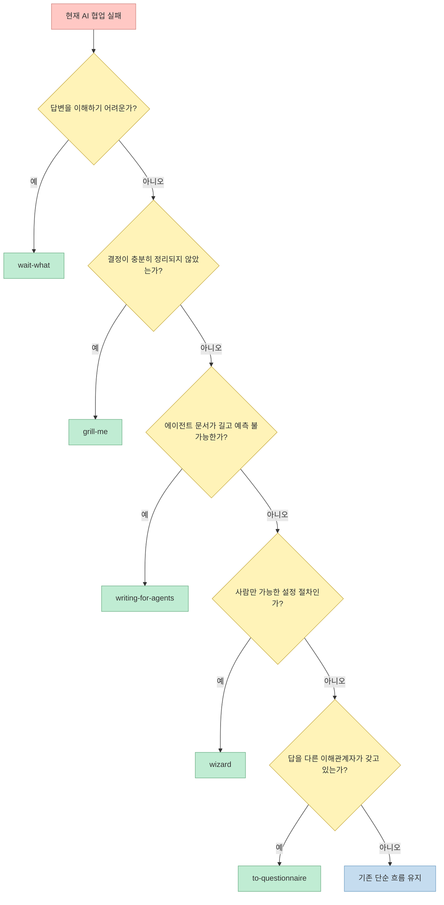

Matt Pocock의 `mattpocock/skills`가 v1.2 계열에서 큰 구조 변경을 내놓았습니다. 원본 Threads는 이를 다섯 스킬과 Codex 호환성 업데이트로 정리합니다. 이해하기 어려운 답변을 다시 설명시키는 `wait-what`, 질문을 의존성 라운드로 묶은 `grill-me`, 모든 에이전트 문서를 다루는 `writing-for-agents`, 사람만 할 수 있는 설정을 안내하는 `wizard`, 다른 이해관계자의 답을 받는 `to-questionnaire`입니다. [원본 Threads](https://www.threads.com/share/_cUPXXLKp/) [공식 CHANGELOG](https://github.com/mattpocock/skills/blob/main/CHANGELOG.md)

공식 `SKILL.md`, CHANGELOG와 병합 PR을 확인하면 Threads의 요약은 대체로 정확합니다. 다만 `grill-me`는 실제 질문 알고리즘이 아니라 `grilling`으로 들어가는 얇은 진입점이고, Codex 호환성은 단순 문구 수정이 아니라 **스킬별 OpenAI 메타데이터와 암시적 호출 정책을 Claude Code 규칙과 동기화한 것**입니다. 이 차이를 이해해야 다섯 파일을 복사하는 수준을 넘어 자신의 스킬 시스템을 설계할 수 있습니다.

<!--more-->

## Sources

- [원본 Threads 공유 URL](https://www.threads.com/share/_cUPXXLKp/)
- [Threads 정규 게시물 URL](https://www.threads.com/@takepage_/post/DbsnMSxE5if)
- [mattpocock/skills GitHub 저장소](https://github.com/mattpocock/skills)
- [AI Skills for Real Engineers 공식 가이드](https://www.aihero.dev/skills)
- [공식 CHANGELOG](https://github.com/mattpocock/skills/blob/main/CHANGELOG.md)
- [v1.2 Release PR #593](https://github.com/mattpocock/skills/pull/593)
- [Codex 메타데이터 PR #551](https://github.com/mattpocock/skills/pull/551)
- [`wait-what` 원본](https://github.com/mattpocock/skills/blob/main/skills/productivity/wait-what/SKILL.md)
- [`grill-me` 원본](https://github.com/mattpocock/skills/blob/main/skills/productivity/grill-me/SKILL.md)
- [`grilling` 원본](https://github.com/mattpocock/skills/blob/main/skills/productivity/grilling/SKILL.md)
- [`writing-for-agents` 원본](https://github.com/mattpocock/skills/blob/main/skills/productivity/writing-for-agents/SKILL.md)
- [`wizard` 원본](https://github.com/mattpocock/skills/blob/main/skills/engineering/wizard/SKILL.md)
- [`to-questionnaire` 원본](https://github.com/mattpocock/skills/blob/main/skills/productivity/to-questionnaire/SKILL.md)

> **수집 메모:** Threads 전용 `insane-search`가 유효한 본문을 반환하지 못해 `jina-reader`로 7개 게시물과 연결 링크를 추출했습니다. 기능과 변경 시점은 GitHub 원본 파일, CHANGELOG와 PR API로 교차검증했습니다.

## 1. 이번 업데이트는 다섯 기능 추가보다 협업 경계 재설계에 가깝다

공식 CHANGELOG의 v1.2.0에는 다섯 변화가 함께 들어 있습니다. `wait-what`은 새 스킬이며, `grilling`은 한 번에 한 질문을 묻던 구조에서 의존성 frontier 라운드로 바뀌었습니다. `writing-great-skills`는 `writing-for-agents`로 이름과 범위를 넓혔고, `wizard`와 `to-questionnaire`는 실험 영역에서 정식 분류로 승격됐습니다. [공식 CHANGELOG](https://github.com/mattpocock/skills/blob/main/CHANGELOG.md) [v1.2 Release PR #593](https://github.com/mattpocock/skills/pull/593)



공통 주제는 “에이전트가 더 많은 일을 하게 하자”가 아닙니다. 이해하지 못한 설명은 다시 말하게 하고, 서로 독립적인 결정만 한 라운드에 묶고, 에이전트용 문서의 정보 위치를 통제하며, 사람만 할 수 있는 단계는 사람에게 돌려주고, 사용자가 모르는 사실은 지식 보유자에게 질문하도록 만듭니다. 즉 **AI와 사람 사이의 책임 경계를 더 명시적으로 만드는 업데이트**입니다.

GitHub PR 기준 핵심 v1.2 변경은 2026년 8월 5일에 병합됐고, 이후 `writing-for-agents`의 Codex 암시 호출 수정과 `wizard`의 시간 예측 제거 같은 패치가 이어졌습니다. 2026년 8월 7일 조사 시점의 `package.json` 버전은 1.2.3입니다. [PR #593](https://github.com/mattpocock/skills/pull/593) [PR #766](https://github.com/mattpocock/skills/pull/766) [PR #783](https://github.com/mattpocock/skills/pull/783)

## 2. `wait-what`: 요약이 아니라 이해 실패를 복구하는 세 줄

`wait-what`의 본문은 사실상 한 문장입니다. 직전 답변을 이해하지 못했다고 선언하고, 약간의 맥락을 보충하며, ASD-STE100 Simplified Technical English와 프로젝트 `CONTEXT.md`의 고유 언어를 사용해 다시 설명하라고 요구합니다. 자동 호출이 비활성화된 사용자 호출형 스킬이므로, 모델이 스스로 결정하는 것이 아니라 사용자가 답변이 와닿지 않는 순간 명시적으로 실행합니다. [`wait-what` 원본](https://github.com/mattpocock/skills/blob/main/skills/productivity/wait-what/SKILL.md) [CHANGELOG의 PR #751](https://github.com/mattpocock/skills/pull/751)



`/tldr`이나 “짧게 말해”와 다른 점은 단순히 글자 수를 줄이지 않는다는 것입니다. 이해 실패에는 정보 과잉뿐 아니라 전제 부족과 낯선 용어도 포함됩니다. `wait-what`은 더 짧게 쓰면서도 빠진 맥락과 독자의 언어를 복원하도록 요구합니다. CHANGELOG도 이를 한 메시지를 수리하는 장치로 설명하며, 이후 모든 응답의 스타일을 영구 변경하는 치료법은 아니라고 선을 긋습니다. [공식 CHANGELOG](https://github.com/mattpocock/skills/blob/main/CHANGELOG.md)

한계도 명확합니다. `CONTEXT.md`가 없거나 그 안의 도메인 언어가 부정확하면 세 번째 축은 작동하지 않습니다. 또한 ASD-STE100은 항공우주 유지보수 문서에서 출발한 통제 언어이므로, 모든 창작·설득 문장에 적용하기보다 기술 설명을 다시 이해시키는 상황에 쓰는 편이 맞습니다.

## 3. `grill-me`: 질문을 하나씩 묻는 방식에서 frontier 라운드로 바뀌었다

Threads는 `grill-me`가 질문을 의존성 그래프로 취급한다고 설명합니다. 정확히는 `grill-me`의 본문은 `grilling` 세션을 실행하라는 두 줄짜리 래퍼이고, 실제 알고리즘은 공용 `grilling` 스킬에 있습니다. 이 분리는 `grill-with-docs`, `triage` 등 여러 상위 스킬이 같은 인터뷰 원리를 재사용하게 합니다. [`grill-me` 원본](https://github.com/mattpocock/skills/blob/main/skills/productivity/grill-me/SKILL.md) [`grilling` 원본](https://github.com/mattpocock/skills/blob/main/skills/productivity/grilling/SKILL.md)

기존 방식은 매 턴 한 질문만 던졌습니다. 단순하지만 서로 독립적인 결정까지 직렬화되어 왕복 횟수가 늘고, 세션 후반에는 이미 답을 예상할 수 있는 질문이 하나씩 나타나는 피로가 생겼습니다. CHANGELOG는 같은 13개 질문을 약 13번의 왕복으로 처리하던 문제를 예로 듭니다. [v1.2 Release PR #593](https://github.com/mattpocock/skills/pull/593)



새 `grilling`은 결정들을 design tree로 만들고, 선행 조건이 모두 해결된 결정의 집합을 **frontier**라고 부릅니다. 현재 frontier의 질문은 번호와 추천 답변을 붙여 한 라운드에 모두 제시합니다. 사용자의 답변으로 트리가 바뀌면 frontier를 다시 계산하고, 아직 열린 질문에 의존하는 항목은 다음 라운드로 미룹니다. [`grilling` 원본](https://github.com/mattpocock/skills/blob/main/skills/productivity/grilling/SKILL.md)



사실과 결정도 분리합니다. 코드베이스나 도구로 찾을 수 있는 사실은 사용자에게 묻지 않고 서브에이전트가 조사합니다. 조사 결과에 의존하는 질문만 기다리게 하고, 나머지 frontier는 먼저 묻습니다. 반대로 제품 방향이나 우선순위 같은 결정은 추천 답변을 제시하더라도 사용자가 확정합니다. 세션은 frontier가 비고 사용자가 공유 이해에 도달했다고 확인할 때 끝납니다.

## 4. `writing-for-agents`: 스킬 작성법을 모든 에이전트 문서의 설계법으로 확장했다

기존 `writing-great-skills`는 이름 그대로 스킬 작성에 초점을 뒀습니다. v1.2에서는 `writing-for-agents`로 이름을 바꾸고, `SKILL.md`, `AGENTS.md`, `CLAUDE.md`, 다른 문서가 포인터로 참조하는 자료까지 범위를 넓혔습니다. 이전 이름의 별칭은 남기지 않았기 때문에 업데이트 후에는 새 이름으로 다시 설치해야 합니다. [`writing-for-agents` 원본](https://github.com/mattpocock/skills/blob/main/skills/productivity/writing-for-agents/SKILL.md) [PR #763](https://github.com/mattpocock/skills/pull/763)

핵심은 정보를 무조건 짧게 쓰는 것이 아니라 **필요한 시점에 필요한 위치에서 읽히게 만드는 것**입니다. 원본은 에이전트 문서를 세 층으로 나눕니다. 실행 순서에 반드시 필요한 단계는 본문 앞에 두고, 같은 파일에서 필요할 때 확인할 규칙은 in-file reference로 두며, 특정 분기에서만 필요한 상세 자료는 context pointer 뒤의 별도 문서로 내립니다. [`writing-for-agents` 원본](https://github.com/mattpocock/skills/blob/main/skills/productivity/writing-for-agents/SKILL.md)



여기에는 두 비용이 있습니다. 늘 컨텍스트에 들어가는 설명은 매 턴 토큰과 주의를 소비하는 **context load**이고, 사용자가 어떤 문서와 명령이 있는지 기억해야 하는 부담은 **cognitive load**입니다. 자동 발견이 필요한 스킬은 모델이 읽을 설명을 상시 로드하는 대신 쉽게 호출되고, 명시적으로만 쓰는 스킬은 컨텍스트 비용을 없애는 대신 사람이 이름을 기억해야 합니다. 이 trade-off가 Codex 호출 정책과 직접 연결됩니다.

v1.2.0 직후 `writing-for-agents`의 Codex 메타데이터에 암시 호출 금지 정책이 남아 모델의 스킬 목록에서 빠지는 문제가 있었습니다. v1.2.2는 해당 정책을 제거해 문서 작성 상황에서 모델이 자동으로 이 스킬을 발견하게 고쳤습니다. 호환성은 파일이 존재하는 것으로 끝나지 않고, **호출 가능성이 실제 정책과 일치해야 완성**된다는 사례입니다. [PR #766](https://github.com/mattpocock/skills/pull/766) [공식 CHANGELOG](https://github.com/mattpocock/skills/blob/main/CHANGELOG.md)

## 5. `wizard`: 사람이 할 일을 에이전트에게 빼앗지 않고 결정론적 절차로 만든다

`wizard`는 인프라 프로비저닝, 자격 증명 설정, 익숙하지 않은 외부 대시보드, 일회성 마이그레이션처럼 사람이 직접 클릭·로그인·승인해야 하는 절차를 위한 모델 호출형 스킬입니다. 에이전트가 할 수 있는 작업에는 호출하지 말라는 비호출 조건도 description에 명시돼 있습니다. [`wizard` 원본](https://github.com/mattpocock/skills/blob/main/skills/engineering/wizard/SKILL.md) [PR #680](https://github.com/mattpocock/skills/pull/680)



중요한 점은 computer use로 AWS 화면을 대신 조작하는 스킬이 아니라는 것입니다. `template.sh`가 브라우저 열기, 단계 진행, 확인 게이트, 비밀 입력, `.env`의 멱등 업데이트, `gh secret`·`gh variable` 저장을 정해진 방식으로 처리하고, 에이전트는 프로젝트 설정을 읽어 필요한 단계만 작성합니다. UI 경로를 모르면 추측하지 않고 문서나 사용자에게 확인해야 합니다. [`wizard` 원본](https://github.com/mattpocock/skills/blob/main/skills/engineering/wizard/SKILL.md)

생성한 스크립트는 `bash -n`과 가능한 경우 `shellcheck`로 정적으로 검증하지만, 에이전트가 처음부터 끝까지 실행하지는 않습니다. 사람 입력을 기다리는 대화형 절차이기 때문입니다. v1.2.3에서는 부정확한 분 단위 시간 예측을 제거하고 전체 단계 수로만 진행률을 보여주도록 다시 다듬었습니다. [PR #783](https://github.com/mattpocock/skills/pull/783)

## 6. `to-questionnaire`: 내가 모르는 답을 나에게 계속 묻지 않게 한다

일반적인 grilling은 사용자의 결정을 끌어냅니다. 그러나 사용자도 모르는 운영 사실, 도메인 규칙, 이해관계자의 선호를 계속 사용자에게 물으면 인터뷰는 진전되지 않습니다. `to-questionnaire`는 이 상황을 다른 사람에게 전달할 Markdown 질문지로 바꿉니다. [`to-questionnaire` 원본](https://github.com/mattpocock/skills/blob/main/skills/productivity/to-questionnaire/SKILL.md) [PR #593](https://github.com/mattpocock/skills/pull/593)



원본이 강조하는 문장은 “주제가 아니라 전달을 grill하라”입니다. 사용자가 항상 답할 수 있는 수신자의 역할·전문성·관계와, 그 사람에게서 무엇을 받아야 하는지만 한 번씩 묻습니다. 이후 질문은 수신자가 가진 지식과 사용자가 필요한 결정 사이의 gap을 겨냥합니다. 질문지는 목적, 발신자·수신자, 맥락, 답변 방법, 중요도 순 질문, 답변 칸과 마지막 누락 확인 항목을 포함합니다.

Threads는 Matt Pocock이 아내의 사무실 계획을 세우다가 실제로 상의해야 할 상대가 AI가 아니라 아내라는 사실을 깨닫고 이 스킬을 만들었다고 소개합니다. 이 일화는 이번 조사에서 공식 CHANGELOG나 `SKILL.md`로 독립 확인하지 못했으므로 **Threads 단일 출처의 제작 배경**으로만 받아들여야 합니다. 공식 자료로 확인되는 것은 질문지를 한 사람에게 비동기 전달하거나 회의에서 함께 작성하도록 설계했다는 기능입니다. [원본 Threads](https://www.threads.com/@takepage_/post/DbsnMSxE5if) [`to-questionnaire` 원본](https://github.com/mattpocock/skills/blob/main/skills/productivity/to-questionnaire/SKILL.md)

## 7. Codex 호환성의 핵심은 설치보다 호출 정책이다

Codex 메타데이터 PR #551은 모든 `SKILL.md` 옆에 `agents/openai.yaml`을 추가했습니다. 이 파일에는 Codex UI의 `display_name`, `short_description`이 들어갑니다. 사용자 명시 호출형 스킬에는 `policy.allow_implicit_invocation: false`도 추가해 Claude Code의 `disable-model-invocation: true`와 같은 의미를 갖게 했습니다. [PR #551](https://github.com/mattpocock/skills/pull/551) [호출 정책 문서](https://github.com/mattpocock/skills/blob/main/.agents/invocation.md)



Codex에서는 사용자 호출형 스킬을 `$wait-what`처럼 명시적으로 부르고, 모델 호출형 스킬은 description의 trigger가 현재 작업과 맞으면 자동으로 선택될 수 있습니다. 저장소는 `AGENTS.md`를 `CLAUDE.md`로 연결해 두 하네스가 같은 저장소 규칙을 읽도록 했고, 다른 스킬을 호출할 때도 특정 도구 이름 대신 `/skill` 형태의 중립적인 문장으로 의존성을 표현합니다. [호출 정책 문서](https://github.com/mattpocock/skills/blob/main/.agents/invocation.md) [PR #781](https://github.com/mattpocock/skills/pull/781)

이 구조가 보여주는 일반 원칙은 호환성에 세 층이 있다는 것입니다.



파일을 복사했더라도 모델 목록에서 보이지 않거나, 사람만 호출해야 할 스킬이 자동 실행되거나, 자동 호출돼야 할 스킬이 명시 호출로만 남으면 호환은 불완전합니다. `writing-for-agents`의 v1.2.2 수정은 바로 두 번째와 세 번째 층의 버그를 고친 사례입니다.

## 8. 설치 방식: Claude Code는 구독형, Codex는 편집 가능한 복사본

공식 README는 Claude Code와 Codex의 설치 철학을 구분합니다. Claude Code는 공식 마켓플레이스의 네이티브 플러그인으로 전체 세트를 읽기 전용 관리 번들처럼 설치하고 업데이트를 받습니다.

```bash
claude plugins install mattpocock-skills
```

Codex와 다른 에이전트는 `skills.sh` 설치기를 사용합니다. 필요한 스킬과 설치 대상 에이전트를 선택하며, 파일은 프로젝트 안에서 직접 수정 가능한 복사본이 됩니다. 네이티브 Codex 플러그인은 공식 README 기준 아직 로드맵에 있습니다. [공식 README](https://github.com/mattpocock/skills#installation-30-second-setup)

```bash
npx skills@latest add mattpocock/skills
```

설치 후에는 `setup-matt-pocock-skills`를 포함해 이슈 트래커, triage 라벨, 생성 문서 위치를 저장소별로 설정합니다. 복사본 방식은 원본이 뒤에서 자동 변경되지 않는 대신 사용자가 업데이트 시점과 로컬 수정 충돌을 관리해야 합니다.

```bash
npx skills update
```

모든 스킬을 한꺼번에 설치할 필요는 없습니다. 이번 다섯 항목은 다음 실패 신호로 선택하는 편이 좋습니다.



## 9. “GitHub 역사 24위”는 맞지만 고정 순위가 아니다

Threads는 이 저장소를 GitHub 역사상 스타가 24번째로 많은 저장소라고 소개했습니다. 2026년 8월 7일 07:15 KST에 GitHub 공개 API로 확인한 스타 수는 **206,884개**였고, GitHub 검색 API에서 이보다 스타가 많은 저장소는 22개였습니다. 같은 방식으로 계산하면 조사 시점의 대략적인 순위는 23위입니다. [GitHub 저장소](https://github.com/mattpocock/skills)

이 차이는 Threads의 오류라기보다 빠르게 변하는 스냅샷의 성격을 보여줍니다. 게시물 추출 당시 화면에는 8,500회 조회와 게시 후 약 10시간이 표시됐고, GitHub 스타도 짧은 시간에 계속 늘었습니다. 검색 API의 포함 기준과 인덱싱 시차도 있으므로 “역대 23위”를 영구 사실로 사용해서는 안 됩니다. 정확한 표현은 **2026년 8월 7일 조사 시점 약 23위**입니다.

높은 스타 수는 관심과 배포 범위를 보여주지만 스킬의 정확성·보안·프로젝트 적합성을 보장하지 않습니다. 특히 `wizard`는 비밀값과 인프라 설정을 다루고, `writing-for-agents`는 항상 로드되는 전역 문서를 바꿀 수 있습니다. 설치 전 원본을 읽고, 프로젝트에 복사한 파일은 코드처럼 diff·review·versioning 해야 합니다.

기존 저장소 전체의 철학은 [Matt Pocock의 skills가 흥미로운 이유](/post/2026/04/2026-04-29-matt-pocock-skills-real-engineering/), 문서와 공유 언어의 관계는 [Matt Pocock이 /grill-me 대신 /grill-with-docs를 쓰는 이유](/post/2026/06/2026-06-03-grill-with-docs-context-adr-shared-language/), 대규모 계획은 [Wayfinder는 컨텍스트 한계를 없애지 않는다](/post/2026/08/2026-08-02-wayfinder-multi-session-decision-map/)에서 더 자세히 다룹니다.

## 핵심 요약

- `wait-what`은 답변을 단순히 줄이지 않고 맥락·단순 기술영어·프로젝트 도메인 언어로 직전 설명을 다시 구성합니다.
- `grill-me`는 얇은 사용자 진입점이며 실제 의존성 트리와 frontier 라운드는 공용 `grilling` 스킬이 담당합니다.
- 새 grilling은 현재 답할 수 있는 독립 질문을 추천 답변과 함께 한 라운드에 묶고, 의존 질문은 다음 라운드로 미룹니다.
- `writing-for-agents`는 스킬뿐 아니라 `AGENTS.md`, `CLAUDE.md`와 참조 문서까지 information hierarchy와 progressive disclosure로 설계합니다.
- `wizard`는 에이전트가 직접 할 수 없는 로그인·클릭·승인을 사람에게 맡기되, URL·입력·저장·확인을 결정론적 Bash 절차로 만듭니다.
- `to-questionnaire`는 사용자가 모르는 사실을 계속 캐묻지 않고 지식 보유자에게 전달할 Markdown 질문지로 바꿉니다.
- Codex 호환성은 `agents/openai.yaml`, UI 메타데이터, `allow_implicit_invocation` 정책과 중립적인 스킬 의존성 표현으로 구현됐습니다.
- Claude Code는 관리형 플러그인, Codex는 `skills.sh`를 통한 편집 가능한 복사본 방식이며 네이티브 Codex 플러그인은 아직 로드맵입니다.
- 2026년 8월 7일 07:15 KST 기준 GitHub API 스타는 206,884개, 검색 API 기반 대략적 순위는 23위이며 계속 변하는 수치입니다.

## 결론

이번 업데이트의 가장 큰 가치는 새로운 명령어 다섯 개가 아닙니다. 이해 실패, 결정 의존성, 문서의 정보 배치, 사람만 가능한 작업, 외부 이해관계자의 지식처럼 **AI 협업에서 반복해서 흐려지던 경계마다 작은 스킬을 하나씩 배치한 것**입니다.

Codex 호환 변경도 같은 철학을 따릅니다. 형식만 읽히게 만드는 것이 아니라 사람이 호출할 것과 모델이 자동 발견할 것을 두 하네스에서 같은 의미로 유지합니다. 좋은 스킬 시스템은 프롬프트 모음이 아니라, 누가 언제 무엇을 결정하고 어떤 정보가 그 순간 컨텍스트에 들어올지를 통제하는 협업 인터페이스입니다.
