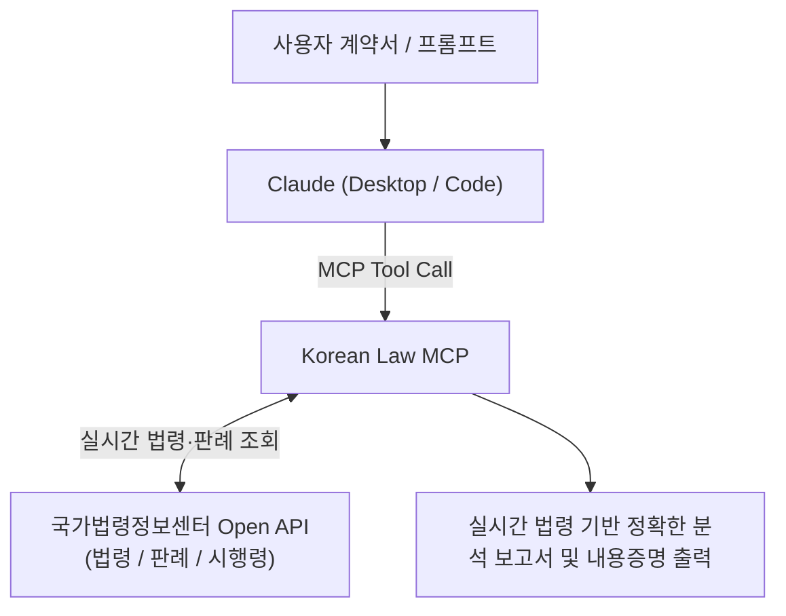

스타트업이나 프리랜서, 1인 사업자가 계약을 체결할 때 수십 페이지에 달하는 계약서의 법적 위험(독소 조항)을 일일이 검토하거나, 분쟁 발생 시 법적 형식을 갖춘 내용증명을 작성하는 것은 상당한 법률 자문 비용과 시간을 요구합니다.

기존의 범용 LLM은 대한민국 법령 번호나 조항을 지어내는 환각(Hallucination) 위험이 있었지만, **국가법령정보센터 Open API와 연동된 오픈소스 Korean Law MCP**(`korean-law-mcp`)를 Claude에 연결하면 공식 법조문과 판례를 실시간으로 정확하게 참조하며 안전한 법률 문서 작업을 수행할 수 있습니다.

<!--more-->

## Sources

- [원문 유튜브 영상: 클로드 계약서 검토부터 내용증명 까지 (AI싱크클럽)](https://youtu.be/z-cxE0yus4g)
- [Korean Law MCP GitHub 저장소](https://github.com/chrisryugj/korean-law-mcp)
- [국가법령정보 공동활용 Open API 포털](https://open.law.go.kr/LSO/main.do)

---

## 1. Korean Law MCP 연동 아키텍처

Korean Law MCP는 Model Context Protocol(MCP) 표준을 준수하여 Claude Desktop 및 Claude Code와 국가법령정보센터의 공공 데이터를 직접 연결합니다:

* **환각 차단**: 모델 내부 지식에만 의존하지 않고, 실제 현행 법조문과 대법원 판례 데이터를 실시간 파싱하여 근거로 제시합니다.

---

## 2. 실무 핵심 활용 3단계 워크플로우

### 1) Open API 신청 및 Claude MCP 연결
1. `open.law.go.kr`에서 무료 Open API 키를 발급받습니다.
2. Claude Desktop 설정 파일(`claude_desktop_config.json`) 또는 Claude Code 설정에 `korean-law-mcp` 서버를 등록합니다.

### 2) 계약서 위험(독소) 조항 탐지 및 수정안 도출
* 계약서 텍스트나 PDF를 입력하면 근로기준법, 약관규제법, 상법, 하도급법 등에 위배되는 불공정 조항을 자동으로 식별합니다.
* 해당 조항이 무효가 될 수 있는 법적 근거(관련 조항 및 판례)를 제시하고, 상대방과 원만하게 협상할 수 있는 **공정한 대체 계약 수정 조항(수정안)**을 생성합니다.

### 3) 법적 효력을 갖춘 내용증명 초안 및 발송 체크리스트
* 대금 미지급, 이행 지체, 계약 해지 등 분쟁 유형에 맞춰 정형화된 법적 서식(발신인, 수신인, 채무불이행 사실, 이행 최고 기한, 법적 조치 예고)을 갖춘 내용증명을 완성합니다.
* 인터넷우체국(ePOST) 전자 내용증명 등록 규격에 맞춰 최종 점검을 지원합니다.

---

## 3. 실무 주의사항 (Legal Disclaimer)

* AI를 활용한 법률 문서 검토는 **초안 작성 및 1차 리스크 필터링** 목적에 최적화되어 있습니다.
* 복잡한 소송 분쟁이나 거액의 상거래 계약 체결 시에는 반드시 전문 변호사·법무사의 최종 법률 자문을 거쳐야 합니다.
