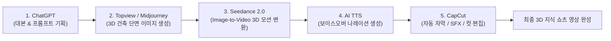

최근 유튜브 쇼츠와 인스타그램 릴스에서 '지진 시 건물이 땅과 따로 움직이는 면진구조 원리', '초고층 빌딩 하중 분산 공법'처럼 **3D 그래픽으로 복잡한 원리를 직관적으로 보여주는 지식 정보형 숏폼 영상**이 폭발적인 인기를 끌고 있습니다.

기존에는 3D Max나 Blender를 능숙하게 다루는 전문 모델러의 작업이 필요했지만, 최신 AI 생성 도구들을 체인 형태로 연결하면 **촬영이나 3D 툴 없이도 단 몇 시간 만에 고품질 3D 지식 쇼츠를 100% AI로 제작**할 수 있습니다.

<!--more-->

## Sources

- [원문 유튜브 영상: 요즘 뜨는 건축 쇼츠, AI로 직접 만들어봤습니다 (AI Playground)](https://youtu.be/DVq3IYEydHo)
- [Topview AI 공식 웹사이트](https://www.topview.ai/)

---

## 1. 5단계 AI 쇼츠 제작 파이프라인

---

## 2. 단계별 상세 제작 워크플로우

1. **기획 및 프롬프트 생성 (ChatGPT)**:
   * 1분 미만의 명확한 설명 대본을 도출하고, 문장마다 시각화할 건축 단면/물리 구조의 이미지 생성용 영어 프롬프트를 함께 뽑아냅니다.
2. **3D 컨셉 이미지 생성 (Topview / Midjourney)**:
   * 면진 장치(LRB 베어링), 지하 지반 구조, 건물 하부 단면 등 디테일한 3D 렌더링 스타일의 키프레임 이미지를 생성합니다.
3. **정지 이미지를 3D 동작 영상으로 변환 (Seedance 2.0)**:
   * 생성된 정지 이미지를 Image-to-Video 모델인 Seedance에 전달하여 지진 진동 시 베어링이 충격을 흡수하며 상부 건물이 수평을 유지하는 물리 애니메이션 클립을 생성합니다.
4. **AI 음성 나레이션 (TTS)**:
   * 전문 지식 전달에 적합한 신뢰감 있는 톤의 AI 성우 음성을 추출합니다.
5. **최종 컷 편집 및 후보정 (CapCut)**:
   * 영상 클립과 오디오 싱크를 맞추고, 자동 캡션(자막), 핵심 강조 효과음(SFX), 배경음악(BGM), 줌인/줌아웃 카메라 무빙을 추가하여 렌더링합니다.

---

## 3. 확장 적용 분야

* **기계/공학**: 자동차 엔진/변속기 작동 원리, 제트 엔진 추진 원리
* **인프라/토목**: 해저 터널 굴착 공법, 현수교 케이블 장력 원리
* **과학/물리**: 지진파 전달 경로, 로켓 단 분리 시퀀스 등
