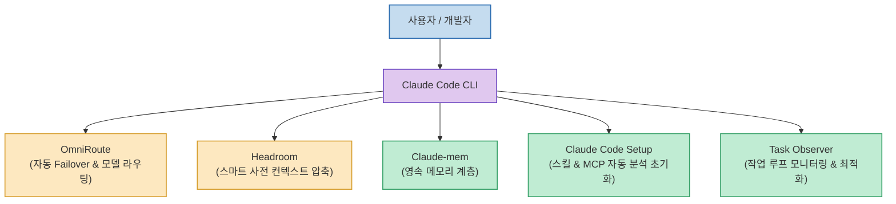

클로드 코드(Claude Code)나 Claude Desktop을 실무에 적극적으로 사용하다 보면, **"사용량 한도가 너무 빨리 소진되거나, 새 세션을 열 때마다 프로젝트 구조와 컨텍스트를 처음부터 다시 설명해야 하는 문제"**에 부딪히게 됩니다.

이는 작업량이 많아서가 아니라, 기본 환경 설정이 비어 있어 발생하는 병목입니다. 클로드의 컨텍스트 유지력과 모델 가용성을 비약적으로 높여주는 **5가지 필수 확장 도구와 토큰 최적화 세팅**을 정리합니다.

<!--more-->

## Sources

- [원문 유튜브 숏츠: 클로드에 무조건 설치해야하는 5개 (AI싱크클럽)](https://youtube.com/shorts/oDW7XUrzork)
- [Claude Code 공식 기술 문서 및 설정 가이드](https://docs.anthropic.com/en/docs/agents-and-tools/claude-code/overview)

---

## 1. 클로드 확장 생태계 구조

---

## 2. 필수 추천 5대 확장 도구

1. **OmniRoute (오토 모델 라우터)**:
   * 클로드 API 토큰이나 사용 한도(Rate Limit)에 도달했을 때, 작업 중단 없이 자동으로 다른 모델(예: Haiku, GPT-4o, 로컬 오픈소스 모델)이나 백업 엔드포인트로 매끄럽게 우회(Failover)해 줍니다.
2. **Headroom (헤드룸)**:
   * 컨텍스트 윈도우 한계에 도달하기 전에 오래된 대화 이력과 중복 파일 내용을 스마트하게 사전 압축하여 **토큰 낭비와 컨텍스트 오염(Context Rot)**을 방지합니다.
3. **Claude-mem (영속 메모리 시스템)**:
   * 세션이 종료되거나 새로 시작되어도 이전 대화에서 내린 아키텍처 결정, 수정 히스토리, 주요 요구사항을 영구 보관하고 새 세션에 즉시 주입합니다.
4. **Claude Code Setup (공식 셋업 플러그인)**:
   * 프로젝트 코드베이스를 자동으로 스캔하여 현재 레포지토리에 꼭 필요한 커스텀 스킬(Skills), 라이프사이클 훅(Hooks), MCP 서버 구성을 추천 및 설정합니다.
5. **Task Observer (태스크 옵저버)**:
   * 에이전트의 코드 편집과 터미널 실행 과정을 실시간 모니터링하여 반복적인 실수나 비효율적인 루프를 진단하고 워크플로우를 개선합니다.

---

## 3. 토큰 낭비를 줄이는 실전 팁

* **`CLAUDE.md` 적극 활용**: 프로젝트 루트에 코딩 컨벤션, 빌드/테스트 명령어, 절대 건드리지 말아야 할 디렉토리를 명시해 두면 클로드가 세션마다 자동으로 읽어 불필요한 탐색 토큰을 아낄 수 있습니다.
* **구조화된 프롬프트(Structured Prompt)**: 서술형 대신 `[대상 파일 / 발생 오류 / 기대 동작]` 형태로 핵심만 간결하게 지시합니다.
* **주기적인 `/compact` 및 `/clear`**: 대화가 길어지면 `/compact`로 요약 압축하여 컨텍스트 창을 확보하고, 새로운 작업을 시작할 때는 `/clear`로 초기화합니다.
