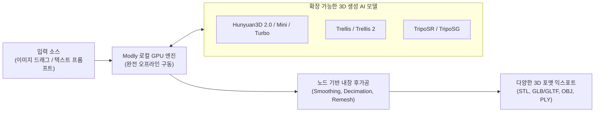

최근 Hunyuan3D, Trellis, TripoSR 등 이미지나 텍스트로부터 실시간에 가깝게 3D 모델을 생성하는 오픈소스 AI 기술이 급격히 발전하고 있습니다. 하지만 이를 직접 로컬에서 실행하려면 복잡한 파이썬 환경 설정과 의존성 문제를 해결해야 했습니다.

**Modly**(`lightningpixel/modly`)는 클라우드 구독이나 API 키 없이 **사용자의 로컬 GPU(Windows/Linux/Mac)만으로 3D 메쉬를 즉시 생성하고 후가공할 수 있는 올인원 오픈소스 데스크톱 애플리케이션**입니다.

<!--more-->

## Sources

- [Modly GitHub 공식 저장소 (lightningpixel/modly)](https://github.com/lightningpixel/modly)
- [Hunyuan3D 및 Trellis 오픈소스 3D 생성 연구]

---

## 1. Modly 로컬 3D 생성 아키텍처

---

## 2. 주요 핵심 기능 및 차별점

1. **100% 로컬 오프라인 실행 & 프라이버시 보호**:
   * 외부 서버로 이미지나 데이터를 전송하지 않으며, API 키 발급이나 구독 결제 없이 내 그래픽 카드의 하드웨어 가속(CUDA / Apple Silicon MPS)으로 즉시 3D 메쉬를 렌더링합니다.
2. **직관적인 노드 기반(Node-based) 워크플로우**:
   * ComfyUI처럼 시각적인 노드 연결 방식을 지원하여, 3D 모델 생성 후 스무딩(Smoothing), 폴리곤 수 감소(Decimation), 리메싱(Remeshing) 등 필수 3D 후가공 작업을 앱 내에서 원스톱으로 처리합니다.
3. **플러그인 형태의 다양한 3D AI 모델 교체 지원**:
   * 빠른 프리뷰 생성이 필요할 때는 경량 모델(TripoSR, Hunyuan3D Mini Turbo)을, 고품질 텍스처와 디테일이 필요할 때는 고성능 모델(Trellis, Hunyuan3D 2.0)을 유연하게 교체할 수 있습니다.
4. **산업 표준 3D 포맷 익스포트**:
   * **STL**: 3D 프린터 슬라이서(Bambu Studio, Cura 등)로 즉시 슬라이싱 가능.
   * **GLB / GLTF, OBJ, PLY**: 블렌더(Blender), 언리얼 엔진, 유니티(Unity), 웹 3D 뷰어로 즉시 가져오기 지원.
5. **CLI 헤드리스(Headless) 자동화 지원**:
   * GUI 앱뿐만 아니라 CLI 명령어를 제공하여 파이프라인 스크립트나 AI 에이전트가 백그라운드에서 수백 장의 이미지를 3D 파일로 일괄 변환(Batch Processing)할 수 있습니다.
