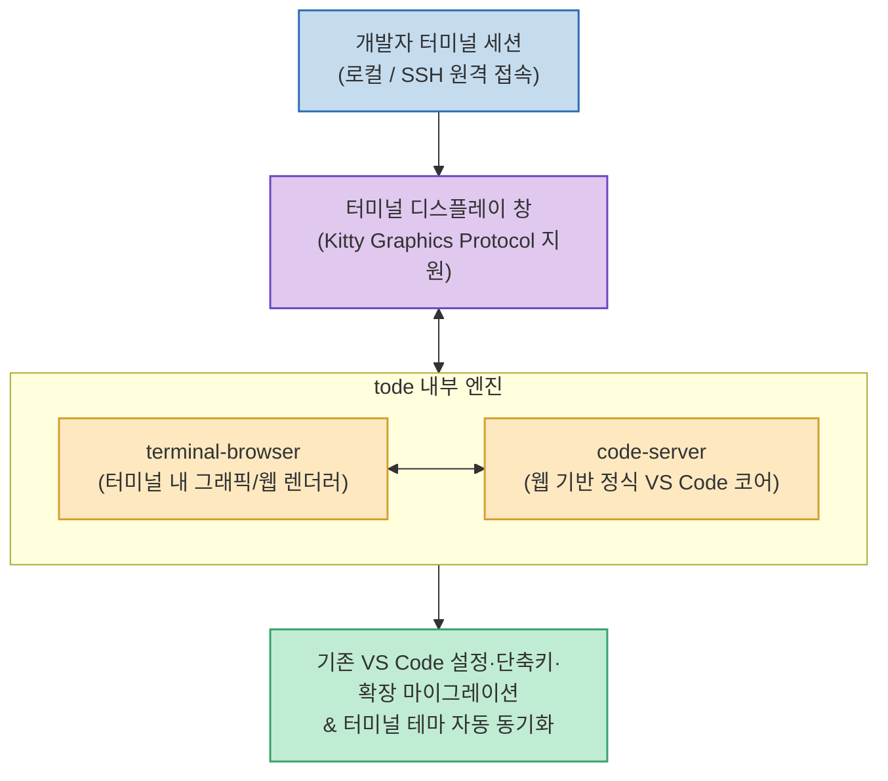

개발 워크플로우가 Claude Code, Codex, Agy 등 AI 에이전트 CLI와 SSH 터미널 중심으로 이동하면서, 에디터와 터미널 창 사이를 빈번하게 오가는 컨텍스트 스위칭이 개발 생산성의 새로운 병목으로 떠올랐습니다.

Next.js 팀 출신 엔지니어 Rob Pruzan이 공개한 **`tode` (terminal-code)**는 터미널을 벗어나지 않고 **터미널 화면 안에서 실제 GUI와 동일한 VS Code를 즉시 띄워 편집할 수 있는 혁신적인 오픈소스 도구**입니다.

<!--more-->

## Sources

- [원문 스레드 게시물 (엉클잡스)](https://www.threads.com/@unclejobs.ai/post/DcQBIOvDFvv)
- [tode 공식 프로젝트 웹사이트](https://tode.sh)

---

## 1. tode 내부 작동 아키텍처



---

## 2. tode의 핵심 원리와 차별점

* **에디터를 터미널용으로 재작성하지 않음**:
  * TUI 기반으로 기능을 축소한 에디터가 아니라, **`terminal-browser`**(터미널 고해상도 그래픽 렌더러)와 **`code-server`**(브라우저용 오픈소스 VS Code)를 결합하여 VS Code의 풀스택 기능을 터미널 창 안에서 100% 동일하게 제공합니다.
* **SSH 원격 서버 개발 완벽 지원 (`works over SSH`)**:
  * 원격 클라우드 서버나 GPU 인스턴스에 SSH로 접속한 상태에서 `tode .`을 치면, 로컬 VS Code의 Remote-SSH 연결이나 포트포워딩 설정 없이 원격 터미널 화면 자체에서 VS Code가 즉시 열립니다.
* **기존 설정 마이그레이션 & 테마 동기화**:
  * `tode --import` 옵션을 사용하면 기존에 PC에 설치되어 있던 VS Code의 단축키(키바인딩), 확장 프로그램(Extensions), 개인 설정을 그대로 가져옵니다.
  * 현재 실행 중인 터미널의 색상 테마와 폰트 스타일을 감지하여 에디터 외관을 자동으로 동기화합니다.

---

## 3. 설치 및 빠른 시작

```bash
# 1. tode 설치 (한 줄 설치 스크립트)
curl -fsSL https://tode.sh/install | bash

# 2. 현재 디렉토리에서 tode 실행
tode .

# 3. 기존 VS Code 설정 가져오기
tode --import
```

---

## 4. 지원 환경 및 요구사항

* **터미널 그래픽 프로토콜 지원 필요**: Kitty Graphics Protocol을 지원하는 최신 터미널(Ghostty, Kitty, WezTerm 등)에서 가장 쾌적하게 동작합니다.
* **지원 플랫폼**: macOS (Apple Silicon) 및 Linux 네이티브 지원 (Windows는 WSL2 환경에서 구동 가능).

에이전트 CLI, 원격 서버 터미널, 풀스택 에디터가 **"터미널 단일 뷰"**로 통합되는 최신 개발 환경의 변화를 체감할 수 있는 도구입니다.
