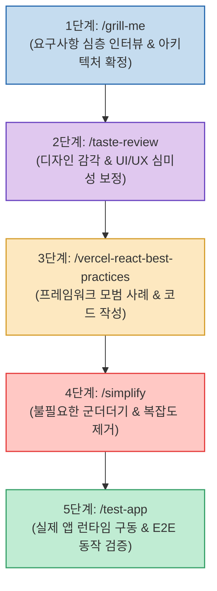

최신 프론티어 AI 모델(Claude Opus, GPT 등)은 매우 강력한 코딩 능력을 갖추고 있지만, "이 기능 만들어줘"라는 단발성 프롬프트만으로는 과도한 추상화, 어색한 기본 UI, 런타임 오류 같은 고질적인 문제를 피하기 어렵습니다.

프로덕션 수준의 고품질 소프트웨어를 안정적으로 개발하기 위해서는 **전문 소프트웨어 엔지니어링 팀의 업무 분장처럼 세부 검증 스킬들을 유기적으로 연결한 5단계 파이프라인**을 구축해야 합니다.

<!--more-->

## Sources

- [원문 X 게시물: 0xCheshire](https://x.com/0xCheshire/status/2089525278267826301)
- [Ben Holmes 원문 영상 및 가이드](https://x.com/BHolmesDev/status/2089351545616056628)

---

## 1. 5단계 AI 엔지니어링 스킬 파이프라인

---

## 2. 5대 핵심 Skills 상세 역할

1. **`/grill-me` (요구사항 심층 인터뷰 & 기획 확정)**:
   * AI가 섣불리 코드를 작성하기 전에, 기획 의도, 예외 처리, 데이터 구조, 엣지 케이스를 역으로 끈질기게 질문(Grill)하여 명확한 청사진을 세웁니다.
2. **`/taste-review` (디자인 심미성 & UI/UX 품질 검증)**:
   * AI 기본 스타일의 투박한 화면을 탈피하여 타이포그래피, 여백, 일관된 컬러 팔레트, 마이크로 인터랙션 등 심미적인 디자인 감각을 주입합니다.
3. **`/vercel-react-best-practices` (React/Next.js 아키텍처 모범 규준)**:
   * Vercel의 공식 엔지니어링 규칙을 적용하여 불필요한 리렌더링 방지, 서버/클라이언트 컴포넌트 분리, 상태 관리 최적화를 강제합니다.
4. **`/simplify` (불필요한 군더더기 및 복잡도 제거)**:
   * AI 특유의 과도한 추상화 클래스, 불필요한 래퍼 함수, 장황한 보일러플레이트 코드를 가차 없이 쳐내어 간결하고 읽기 쉬운 코드로 정제합니다.
5. **`/test-app` (런타임 E2E 실전 검증)**:
   * 코드가 이론적으로 맞다는 상상 검증을 금지하고, 실제 앱을 터미널에서 구동하여 엔드투엔드(E2E) 테스트를 직접 통과시키도록 만듭니다.

---

## 3. 시사점

**"생각하기 ➔ 디자인하기 ➔ 올바르게 구현하기 ➔ 단순화하기 ➔ 실제로 검증하기"**로 이어지는 완결된 파이프라인을 스킬 체인으로 모듈화함으로써, 프론티어 모델의 잠재력을 100% 끌어낼 수 있습니다.
