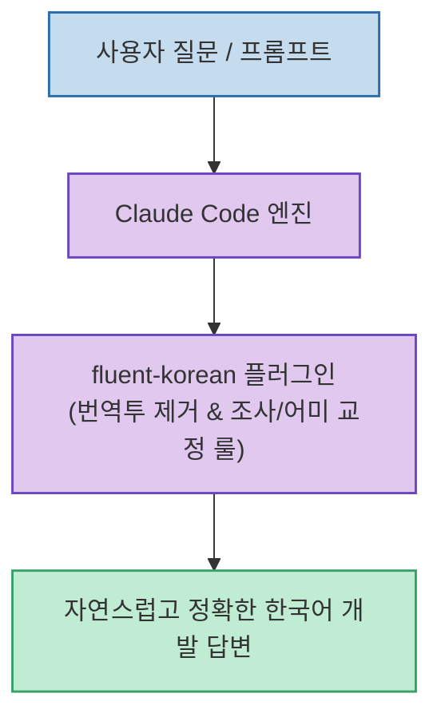

Claude Code는 영어 프롬프트뿐만 아니라 한국어 지시에도 높은 수준의 코드 생성 성능을 보여주지만, 한국어로 설명하거나 요약할 때 **"특유의 직역체 번역투나 부자연스러운 조사 결합, 어색한 어미 종결"**이 종종 나타납니다.

국어학 전공자가 개발하여 공개한 **`snflkd/fluent-korean`** 플러그인은 클로드의 언어 생성 프롬프트를 교정하여 **개발 맥락에 맞는 깔끔하고 자연스러운 한국어 문장으로 답변하도록 돕는 Claude Code 전용 스킬**입니다.

<!--more-->

## Sources

- [원문 X 게시물 (H)](https://x.com/hmmmmmm1458/status/2090250855278874949)

---

## 1. fluent-korean 동작 흐름



---

## 2. 설치 및 적용 방법 (단 2줄)

Claude Code 터미널 환경에서 마켓플레이스 등록과 플러그인 설치를 2줄의 명령어로 완료할 수 있습니다:

```bash
# 1. 마켓플레이스 저장소 추가
/plugin marketplace add snflkd/fluent-korean

# 2. fluent-korean 플러그인 설치
/plugin install fluent-korean@fluent-korean

# 3. 세션 초기화 및 플러그인 적용
/clear
```

---

## 3. 주요 개선 효과

* **직역체/번역투 표현 완화**: 영어 문장 구조를 그대로 직역하면서 발생하는 긴 관형절과 수동태 표현을 한국어 고유의 능동형 문장으로 간결하게 교정.
* **자연스러운 기술 용어 결합**: 영문 프로그래밍 용어(API, 훅, 컴포넌트 등) 뒤에 붙는 한국어 조사(은/는, 이/가, 을/를)의 오류를 방지.
* **명확한 종결 어미 톤**: 개발 설명에 최적화된 명료하고 전문적인 서술 어투 확립.
