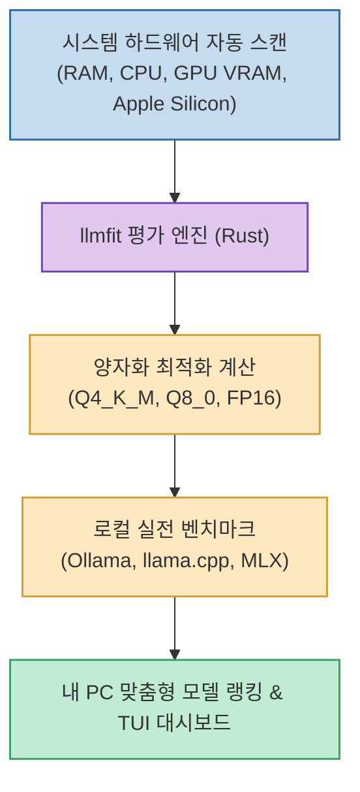

Llama 3, Qwen, DeepSeek 등 다양한 오픈소스 LLM이 쏟아져 나오면서 내 PC에서 직접 로컬 AI를 구동하려는 개발자가 늘고 있습니다. 하지만 특정 모델이 내 컴퓨터에서 원활하게 돌아갈지, VRAM이 부족해 OOM(Out of Memory)이 발생하진 않을지 일일이 다운로드받아 테스트하는 것은 상당한 시간과 저장 공간을 낭비하게 만듭니다.

**`llmfit`**(`AlexsJones/llmfit`)은 터미널 실행 즉시 **시스템 하드웨어를 스캔하여 내 PC 환경에서 가장 완벽하게 구동되는 최적의 로컬 모델과 양자화(Quantization) 버전을 랭킹으로 제안하는 Rust 기반 오픈소스 CLI/TUI 도구**입니다.

<!--more-->

## Sources

- [원문 X 게시물: Brais Moure](https://x.com/MoureDev/status/2090068954299371994)
- [llmfit 공식 웹사이트](https://www.llmfit.org/)
- [llmfit GitHub 공식 저장소](https://github.com/AlexsJones/llmfit)

---

## 1. llmfit 하드웨어 평가 아키텍처



---

## 2. 주요 핵심 기능

1. **초고속 하드웨어 자동 감지**:
   * Apple Silicon(통합 메모리), NVIDIA(CUDA VRAM), AMD, Intel Arc, NPU를 즉각 인식하여 가용 메모리와 대역폭을 파악합니다.
2. **다차원 모델 스코어링 & 추천 랭킹**:
   * 모델별 출력 품질(Quality), 예상 추론 속도(tokens/sec), 메모리 적합도, 컨텍스트 윈도우 지원 크기를 종합 점수화하여 최적의 추천 리스트를 제공합니다.
3. **최적 양자화(Quantization) 레벨 자동 제안**:
   * 메모리 부족 오류 없이 최상의 추론 품질을 얻을 수 있는 정밀한 양자화 포맷(Q4_K_M, Q8_0, FP16 등)을 알아서 계산합니다.
4. **로컬 실측 벤치마크 지원**:
   * Ollama, llama.cpp, MLX 런타임과 직접 연동하여 내 하드웨어에서의 실제 토큰 생성 속도를 측정하고 결과를 커뮤니티와 공유할 수 있습니다.

---

## 3. 설치 및 사용법

```bash
# macOS / Linux (Homebrew)
brew install AlexsJones/llmfit/llmfit

# Windows (Scoop)
scoop install llmfit

# Rust Cargo
cargo install llmfit

# 실행 (인터랙티브 TUI 대시보드)
llmfit
```
