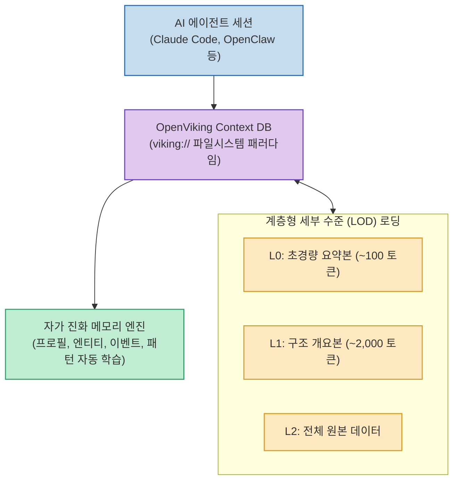

AI 에이전트를 장시간 구동하거나 복잡한 멀티 세션 작업을 진행할 때 가장 큰 장애물은 **"컨텍스트 분절과 치솟는 토큰 비용, 그리고 불투명한 벡터 검색(RAG)의 검색 실패"**입니다.

바이트댄스(ByteDance)의 볼케이노 엔진(Volcengine) 팀이 오픈소스로 공개한 **`OpenViking`**은 기존의 평면적인 벡터 DB 검색 대신 **계층적 파일시스템 패러다임(`viking://`)과 계층형 세부 수준(LOD) 로딩**을 도입하여, **기억 정확도를 최대 82%까지 향상시키고 입력 토큰 소모량을 91% 절감**한 자가진화형 컨텍스트 데이터베이스입니다.

<!--more-->

## Sources

- [원문 X 게시물 (휜)](https://x.com/moneynena/status/2090675236736040997)
- [OpenViking GitHub 공식 저장소](https://github.com/volcengine/OpenViking)

---

## 1. OpenViking 시스템 아키텍처

---

## 2. 핵심 아키텍처 및 차별점

1. **파일시스템 패러다임 (`viking://`)**:
   * 에이전트 메모리, 지식 문서, 스킬을 불투명한 벡터 임베딩 덩어리로 두지 않고, 파일 및 디렉토리 계층 구조로 구조화합니다. 에이전트는 `ls`, `tree`, `find`, `read`와 같은 결정론적 명령어로 컨텍스트를 탐색합니다.
2. **계층형 LOD (Level of Detail) 점진적 로딩**:
   * **L0 (Summary)**: 100토큰 내외의 초소형 요약본으로 지식 맵을 파악.
   * **L1 (Overview)**: 2,000토큰 내외의 구조화된 개요.
   * **L2 (Full Data)**: 심층 세부 작업이 필요한 순간에만 원본 데이터를 로드.
   * 이 방식으로 불필요한 프롬프트 토큰 낭비를 최대 91% 방지합니다.
3. **자가 진화형 메모리 (Self-evolving Memory)**:
   * 사용자 선호도, 엔티티 관계, 해결된 버그 패턴을 세션 종료 시 자동으로 추출하고 갱신하여 시간이 지날수록 사용자 작업 환경에 맞춤 최적화됩니다.

---

## 3. 실측 벤치마크 결과

* **Claude Code 대화 기억 정확도**: 기존 57% ➔ **80%** (23%p 상승)
* **OpenClaw 기억 정확도**: 기존 24% ➔ **82%** (58%p 대폭 상승)
* **비용 절감**: 입력 토큰 최대 **91% 감소**로 더 빠르고 저렴한 운영 가능
