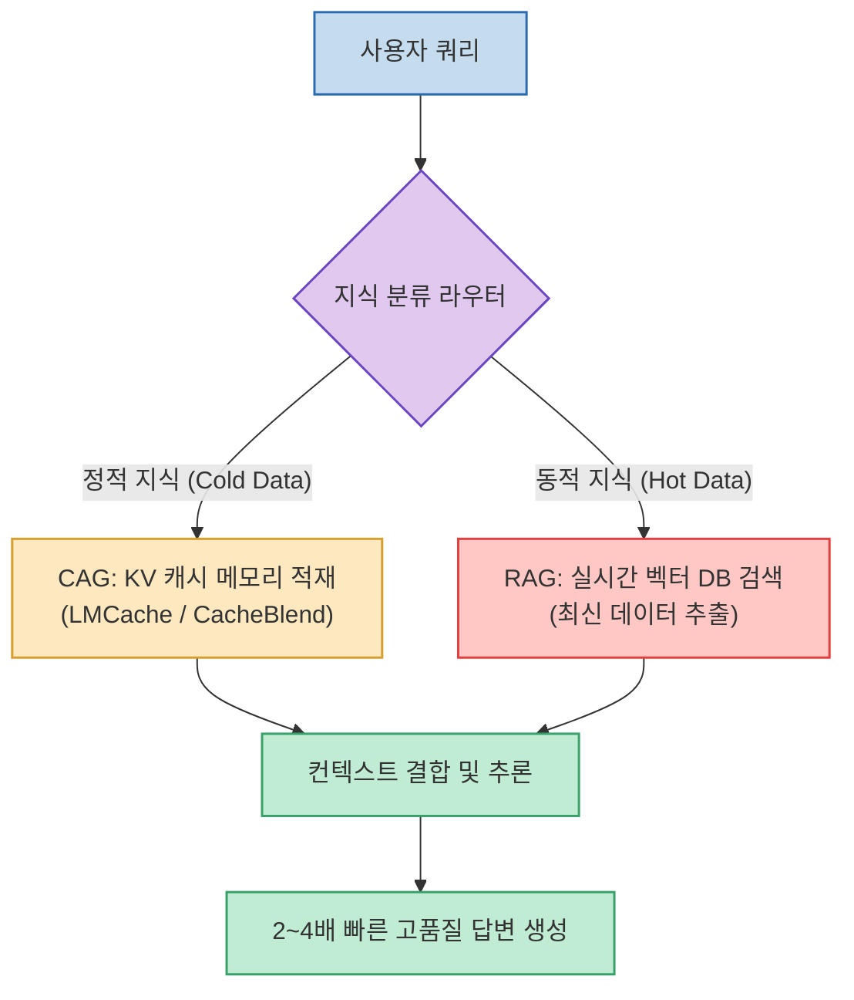

전통적인 검색 증강 생성(RAG)은 최신 데이터를 LLM에 주입하는 표준 기술로 자리 잡았지만, **"수개월 동안 전혀 변하지 않는 정적 데이터(사내 규정, API 문서, 고정 지침)조차 매 쿼리마다 벡터 DB 검색과 임베딩 연산을 반복해야 하는 비효율"**이 존재합니다.

**CAG (Cache-Augmented Generation, 캐시 증강 생성)**는 모델이 읽은 토큰을 내부 **KV (Key-Value) 캐시 메모리**에 영구 보관해 두고 즉각 재사용하는 방식으로, RAG와 결합했을 때 **추론 속도를 2~4배 향상시키고 토큰 비용을 획기적으로 절감**할 수 있습니다.

<!--more-->

## Sources

- [원문 X 게시물: Akshay Pachaar](https://x.com/akshay_pachaar/status/2090427358964830612)
- [LMCache GitHub 공식 오픈소스 저장소](https://github.com/LMCache/LMCache)

---

## 1. RAG + CAG 하이브리드 아키텍처

---

## 2. 2계층 지식 분할 전략

* **Cold Data (정적 지식 계층 - CAG)**:
  * 사내 규정집, 제품 카탈로그, 프레임워크 공식 문서 등 거의 바뀌지 않는 데이터는 모델의 KV 캐시(Prompt Cache)에 1회 적재하여 영구 재사용합니다.
* **Hot Data (동적 지식 계층 - RAG)**:
  * 당일 뉴스, 실시간 주가, 최근 대화 세션 로그 등 실시간 변동 데이터만 벡터 DB 검색을 통해 동적으로 가져옵니다.

---

## 3. Prefix Caching의 맹점과 LMCache의 해결책

* **기존 Prompt Caching의 한계**:
  * 상용 API(OpenAI, Anthropic)의 프롬프트 캐싱은 **바이트 단위의 정확한 접두사(Exact Prefix) 일치**에만 작동합니다.
  * 두 개 이상의 캐시된 문서를 결합하거나 순서가 바뀌면 즉시 캐시 미스(Cache Miss)가 발생하여 캐시 활용률이 급감합니다.
* **CacheBlend (LMCache)의 혁신**:
  * 트랜스포머의 어텐션은 대부분 문서 내부 로컬 토큰끼리 참조하고, 문서 경계를 넘는 어텐션은 극소수라는 점에 착안.
  * **CacheBlend**는 문서 경계의 극소수 토큰만 빠르게 재계산하고 개별 캐시된 KV 블록들을 동적으로 병합하여, **문서 결합 순서와 무관하게 2~4배 빠른 속도로 다중 문서를 쿼리**할 수 있도록 지원합니다.
