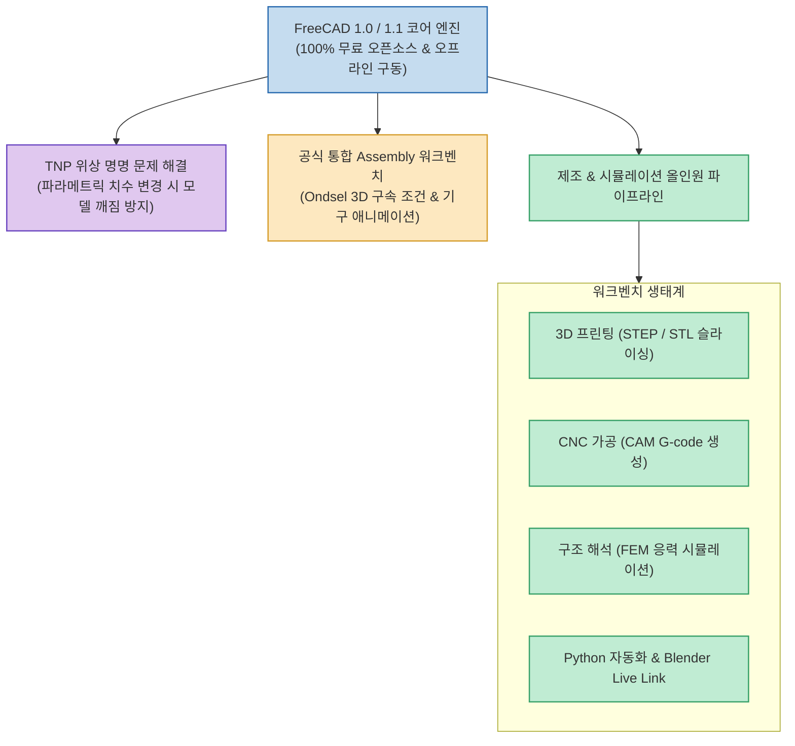

상용 CAD 소프트웨어(Fusion 360, SolidWorks 등)의 매년 인상되는 구독료와 폐쇄적인 클라우드 종속 정책에 피로감을 느끼는 엔지니어와 메이커들이 늘어나고 있습니다.

FreeCAD 1.0 및 1.1 정식 릴리스는 단순한 마이너 업데이트를 넘어, **고질적인 파라메트릭 깨짐 현상(TNP)을 공식 해결하고 강력한 네이티브 어셈블리(Assembly) 워크벤치와 제조 파이프라인을 내장**함으로써, **취미용 장난감을 넘어 실제 프로덕션 엔지니어링 표준으로 도약**했습니다.

<!--more-->

## Sources

- [원문 유튜브 영상: 30 Reasons to use FreeCAD in 2026 (Deltahedra)](https://youtu.be/3JweHyvE_m8)
- [FreeCAD 공식 웹사이트](https://www.freecad.org/)
- [Blender Live Link (Channels) 오픈소스](https://github.com/mnesarco/Channels)

---

## 1. FreeCAD 2026 핵심 아키텍처

---

## 2. 2026년 FreeCAD 도입의 결정적 5대 강점

1. **Topological Naming Problem (TNP)의 완벽한 해결**:
   * 모델 중간 단계의 치수를 수정할 때 면/선의 고유 ID가 바뀌어 상위 피처가 붕괴되던 가장 큰 단점이 공식 알고리즘으로 해결되어 설계 안정성이 극대화되었습니다.
2. **공식 통합 어셈블리(Assembly) 워크벤치**:
   * 외부 서드파티 플러그인 없이도 Ondsel 솔버를 통해 부품 간 3D 구속 조건(Constraints)을 직관적으로 부여하고 기구 작동 애니메이션을 검증할 수 있습니다.
3. **완전한 무료 오픈소스 & 영구 데이터 소유권**:
   * 유료 구독 라이선스나 계정 정지 위험 없이, 100% 로컬 파일 포맷으로 데이터를 안전하게 영구 보관합니다.
4. **강력한 스크립팅 & Blender Live Link**:
   * 모든 모델링 작업을 Python 스크립트로 자동화할 수 있으며, Blender와의 실시간 채널 연동으로 최고급 포토리얼리스틱 렌더링을 구현합니다.
5. **올인원 엔지니어링 툴셋 (CAM, FEM, TechDraw)**:
   * 3D 모델링뿐만 아니라 CNC 가공용 G-code 생성(CAM), 구조적 하중 시뮬레이션(FEM), 2D 엔지니어링 표준 도면 출력(TechDraw)까지 단일 프로그램 내에서 처리합니다.
