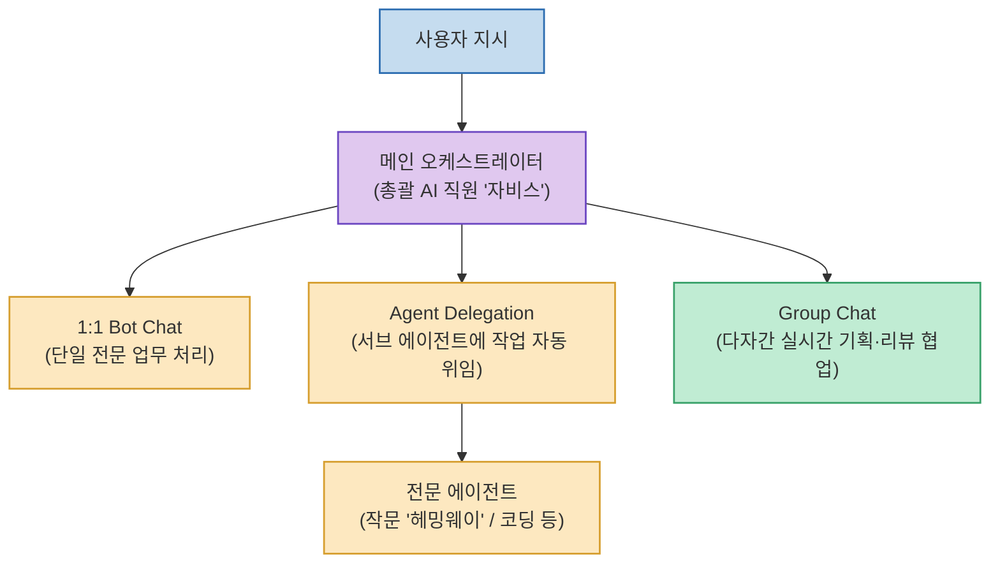

전문화된 시스템 프롬프트와 페르소나를 가진 여러 AI 직원을 만들어 두더라도, 사용자가 중간에서 A 에이전트의 답변을 복사해 B 에이전트의 채팅창에 붙여넣어야 한다면 '인간 클립보드' 노가다로 인한 피로감이 누적됩니다.

Nous Research의 Hermes Agent 데스크톱에 공개된 **`Bot Mode (봇 모드)`**는 에이전트들이 **인간의 중개 없이 서로 직접 대화하며 하위 업무를 자동 위임(Delegation)하고, 그룹 챗(Group Chat)을 통해 하나의 결과물을 공동 검토**할 수 있는 진화된 멀티 에이전트 협업 환경을 제공합니다.

<!--more-->

## Sources

- [원문 유튜브 영상: Hermes Bot Mode 출시! AI 직원끼리 협업 더 쉬워졌습니다](https://youtu.be/blZuddQ196E)
- [Hermes Bot Mode 공식 가이드 문서](https://hermes-agent.nousresearch.com/docs/user-guide/bot-mode)
- [Hermes Agent 공식 GitHub 저장소](https://github.com/NousResearch/hermes-agent)

---

## 1. Hermes Bot Mode 협업 아키텍처

---

## 2. 4가지 핵심 협업 대화 공간

1. **Direct Bot Chat (1:1 직접 대화)**:
   * 특정 전문 역할을 가진 단일 에이전트(예: 총괄 비서 자비스)와 사용자가 직접 대화하며 작업을 지시하는 기본 모드.
2. **Agent Delegation (자동 업무 위임)**:
   * 메인 에이전트가 복합 프로젝트를 수행하다가 특정 전문 분야(글쓰기, 데이터 분석 등)가 필요한 순간 특화 에이전트(예: 작문 전문 헤밍웨이)를 호출하여 하위 태스크를 넘기고 결과물만 받아 취합합니다.
3. **Group Chat (다자간 실시간 공동 검토)**:
   * 기획자, 개발자, QA 리뷰어 등 여러 에이전트가 한 대화방에 참여하여, 한 에이전트의 초안을 다른 에이전트가 실시간으로 피드백하고 수정하는 팀 단위 협업을 지원합니다.
4. **Session 격리 및 컨텍스트 제어**:
   * 에이전트 간 불필요한 컨텍스트 오염을 차단하기 위해 작업별로 독립된 세션을 운영하거나 필요 시 공유 세션을 분리 관리합니다.

---

## 3. 시사점

단일 모델 중심의 프롬프팅에서 벗어나, **각자의 전문 시스템 프롬프트와 도구를 가진 AI 직원 팀을 오케스트레이션하여 자율 협업을 구현하는 멀티 에이전트 팀 빌딩**의 표준적인 방향을 제시합니다.
