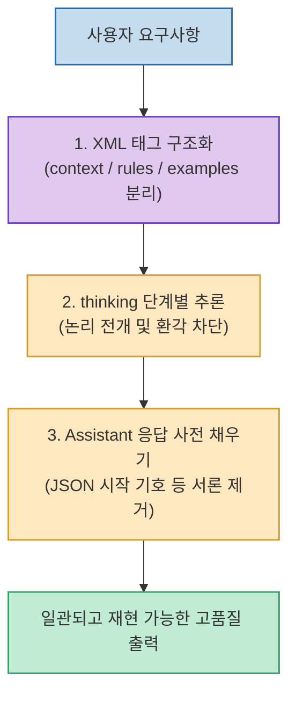

인터넷상에 수많은 고가의 유료 프롬프트 엔지니어링 강의가 있지만, **모델을 직접 설계하고 훈련한 앤트로픽(Anthropic) 연구진이 무료로 공개한 24분짜리 공식 인터랙티브 워크숍**만큼 Claude의 내부 작동 원리와 실전 기법을 명확하게 짚어주는 자료는 드뭅니다.

Claude의 문맥 이해 가중치를 최적화하고 일관된 고품질 출력을 얻기 위해 반드시 알아야 할 **Claude 특화 4대 프롬프팅 핵심 원칙과 실무 가이드**를 정리합니다.

<!--more-->

## Sources

- [원문 유튜브 영상: Anthropic's FREE 24-Min Prompt Engineering Workshop](https://youtu.be/pQ6G9TQfGIA)
- [Anthropic 공식 인터랙티브 프롬프트 엔지니어링 워크숍 문서](https://docs.anthropic.com/en/docs/build-with-claude/prompt-engineering/overview)

---

## 1. Claude 프롬프팅 최적화 흐름도

---

## 2. Claude 프롬프팅 4대 핵심 원칙

1. **XML 태그 기반의 명확한 문맥 분리 (`<instructions>`, `<context>`, `<rules>`)**:
   * Claude는 XML 태그 파싱에 가장 최적화되어 있습니다. 지시문, 참조 문서, 제약 조건, 출력 형식을 XML 태그로 감싸주면 명령과 본문을 절대 혼동하지 않습니다.
2. **응답 사전 채우기 (Prefilling the Assistant)**:
   * 불필요한 인사말이나 서론 없이 즉시 구조화된 포맷(예: `{` 또는 `[` 시작)으로 응답을 받고 싶을 때, Assistant 메시지의 시작 부분을 미리 입력해 두는 기법으로 JSON 파싱 실패를 원천 차단합니다.
3. **단계별 생각 유도 (Thinking / Chain-of-Thought)**:
   * 복잡한 논리나 아키텍처 결정을 내릴 때 곧바로 결론을 요구하지 않고 `<thinking>` 태그 내에서 단계별 분석을 선행하도록 유도하여 환각을 획기적으로 줄입니다.
4. **구체적인 골든 예시(Few-shot Examples) 제공**:
   * *"전문적이고 간결하게 작성해줘"* 같은 모호한 형용사 지시 대신, 원하는 입력-출력 형태의 예시를 2~3개 직접 보여주는 것이 10배 이상 안정적인 재현성을 보장합니다.

---

## 3. 피해야 할 흔한 실수

* **GPT용 프롬프트 그대로 복사하기**: GPT와 Claude는 어텐션 가중치와 지시 해석 패턴이 다르므로, Claude에서는 XML 태그와 사전 채우기(Prefilling) 기법을 사용하는 것이 훨씬 강력합니다.
* **명시적 가드레일 누락**: 역할(Role)만 부여하고 에러 핸들링 규칙이나 금지 사항을 명시하지 않으면 모델이 임의로 과도한 가정을 세워 코드를 작성할 위험이 있습니다.
