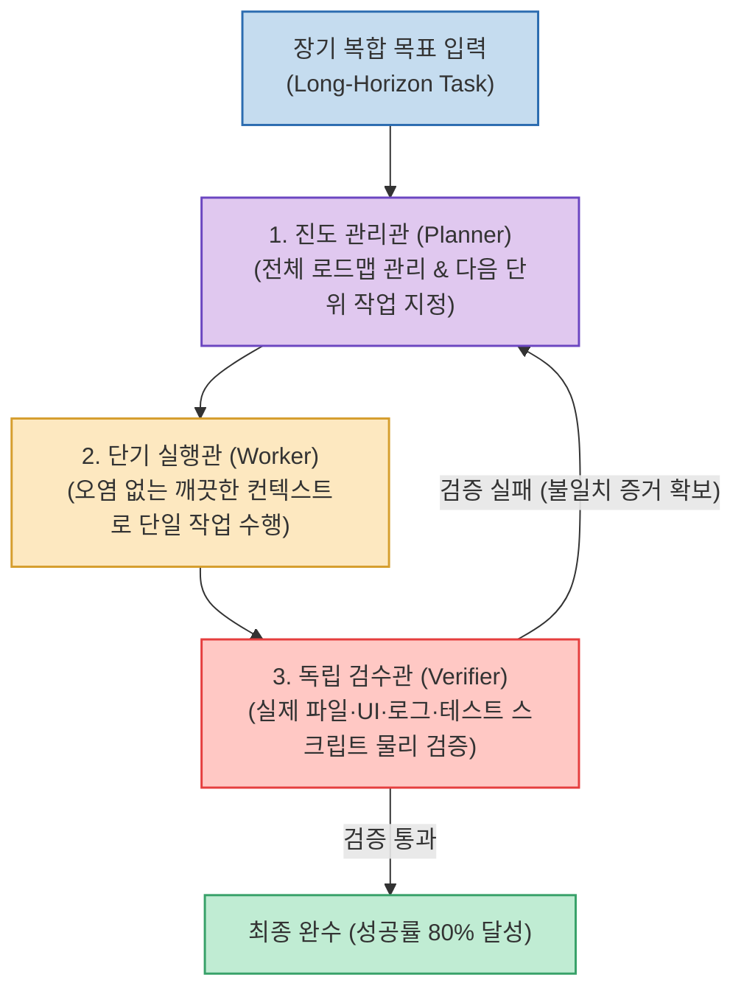

Claude Code, Codex, Agy 등 최신 AI 에이전트에게 1~2시간 이상 소요되는 복합적인 작업을 맡기면, 초기 1~2시간은 순조롭게 진행되다가 뒤로 갈수록 맥락이 오염되어 엉뚱한 결론을 내리거나 절반만 만들고 "완료했습니다"라고 거짓 보고(Hallucinated Completion)하는 붕괴 현상이 발생합니다.

고덕지도(AMAP-ML) 팀이 개발하여 Hugging Face 주간 1위를 기록한 **`LongHorizon-Harness`**는 에이전트 단일 세션에 모든 히스토리를 누적하지 않고, **진도 관리관(Planner), 단기 실행관(Worker), 독립 검수관(Verifier)으로 역할을 명확히 쪼갠 3인 1조 하네스 시스템**을 구축하여 **작업 완수율을 50%에서 80%로 대폭 향상시키고 토큰을 24% 절감**했습니다.

<!--more-->

## Sources

- [원문 X 게시물: Ryrenz](https://x.com/Ryrenz/status/2091322231997571450)
- [LongHorizon-Harness GitHub 공식 저장소](https://github.com/AMAP-ML/LongHorizon-Harness)
- [AMAP-ML 연구 논문 (arXiv)]

---

## 1. 3인 1조 분업 및 물리 검증 아키텍처

---

## 2. 역할별 핵심 원리와 차별점

1. **진도 관리관 (Planner / Orchestrator)**:
   * 전체 목표의 진행 상황과 마일스톤만 추적하며, 오직 *"다음에 실행해야 할 단위 태스크가 무엇인가"*만 판단하여 실행관에게 전달합니다.
2. **단기 실행관 (Worker / Executor)**:
   * 이전 단계의 불필요한 노이즈가 없는 깨끗한 컨텍스트(Fresh Context)를 주입받아 배정된 한 가지 작업에만 집중합니다.
3. **엄격한 독립 검수관 (Verifier / Ground-Truth Inspector)**:
   * 실행관의 "완료했습니다"라는 텍스트 응답을 절대 신뢰하지 않고, 실제 OS 파일 시스템, GUI 화면 상태, 터미널 실행 로그, 유닛 테스트 스크립트를 직접 실행하여 물리적 증거(Ground Truth)를 확인합니다. 검증 실패 시 구체적 실패 증거를 첨부해 재작업을 지시합니다.

---

## 3. 주요 성과 및 지원 범위

* **크로스 애플리케이션 지원**: 터미널 코딩뿐만 아니라 브라우저, 스프레드시트, 오피스 문서, 디자인/3D 소프트웨어 등 OS 전반의 GUI/CLI 작업을 통합 오케스트레이션.
* **모델 독립성**: Claude, GPT, Qwen 등 다양한 모델을 연결할 수 있으며, 기획/실행/검수 단계별로 최적의 모델을 분리 매핑 가능.
* **토큰 및 성공률**: 다중 앱 연동 작업 성공률을 기존 50% ➔ **80%로 격상**, 불필요한 방황을 줄여 **토큰 소모량 24% 절감**.
