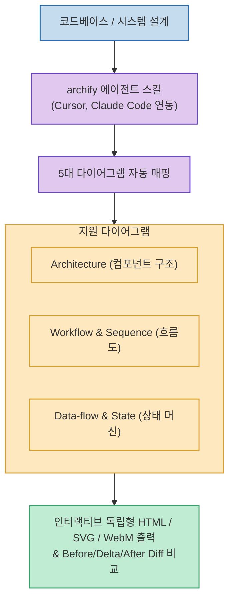

새로운 코드베이스를 파악하거나 대규모 리팩토링을 진행할 때, 프로젝트의 모듈 간 의존성, 데이터 파이프라인, 비즈니스 워크플로우를 한눈에 파악할 수 있는 시각적 다이어그램은 필수적입니다.

**`archify`**(`tt-a1i/archify`)는 Cursor, Claude Code, Codex 등 AI 코딩 에이전트가 코드베이스 전체를 스스로 분석하여 **단일 인터랙티브 HTML 기반의 5대 기술 다이어그램을 자동 생성하고, Before/Delta/After 형태의 아키텍처 Diff 비교까지 지원하는 에이전트 전용 스킬**입니다.

<!--more-->

## Sources

- [archify GitHub 공식 저장소 (tt-a1i/archify)](https://github.com/tt-a1i/archify)

---

## 1. archify 다이어그램 생성 파이프라인



---

## 2. 지원하는 5대 핵심 다이어그램

1. **시스템 아키텍처 (Architecture)**: 모듈 간 레이어, 마이크로서비스 및 컴포넌트 간 의존성 구조.
2. **워크플로우 (Workflow)**: 비즈니스 로직과 단계별 작업 처리 파이프라인.
3. **시퀀스 (Sequence)**: API 엔드포인트 호출 및 비동기 이벤트 전달 순서.
4. **데이터 플로우 (Data-flow)**: 상태 관리, 캐시, 데이터베이스 쿼리 흐름.
5. **생명주기/상태 머신 (Lifecycle/State)**: 객체 및 프로세스의 상태 전이도.

---

## 3. 주요 특징 및 활용법

* **단일 독립형(Standalone) 인터랙티브 HTML**:
  * 다크/라이트 모드 토글, 노드 검색 및 하이라이트 추적, 부드러운 모션 인터랙션이 내장되어 별도 뷰어 없이 브라우저에서 바로 열람 가능합니다.
* **아키텍처 스냅샷 Diff 비교 (Before / Delta / After)**:
  * 리팩토링이나 새로운 모듈 추가 전후의 구조 변화를 Git diff처럼 시각적으로 비교해 아키텍처 변경점을 검증합니다.
* **다양한 미디어 포맷 익스포트**:
  * SVG, PNG, JPEG, WebP 정적 이미지뿐만 아니라 동적 흐름을 보여주는 WebM 영상 출력 지원.

```bash
# 1. 스킬 글로벌 설치
npx skills add tt-a1i/archify -g

# 2. 에이전트 프롬프트로 실행 지시
"Use archify to map this repository's runtime architecture"
```
