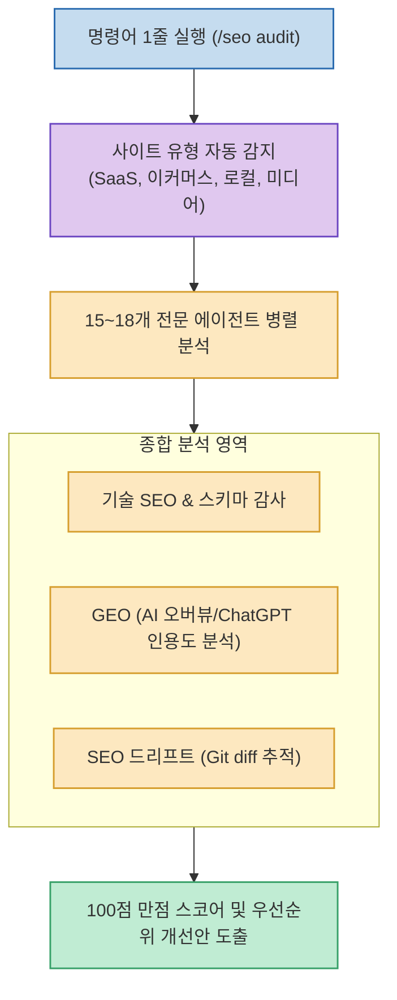

매달 수십만 원에서 수백만 원에 달하는 유료 SEO 분석 도구(Ahrefs, Semrush 등)의 구독료는 개인 개발자나 스타트업에게 상당한 부담이 됩니다.

**`Claude SEO`**는 Claude Code CLI 환경에서 터미널 명령어 한 줄(`/seo audit`)로 **최대 18개의 전문 AI 에이전트가 사이트 유형을 감지하고 기술 SEO, 스키마, 백링크, 그리고 최신 AI 검색 최적화(GEO)까지 병렬로 심층 감사하는 100% 무료 오픈소스 에이전트 팩**입니다.

<!--more-->

## Sources

- [원문 Threads 게시물 (coke_ai)](https://www.threads.com/@coke_ai/post/Dca6m8gGL_X)
- [Claude SEO 공식 웹사이트](https://claude-seo.md)

---

## 1. Claude SEO 병렬 감사 아키텍처

---

## 2. 주요 핵심 기능 및 차별점

1. **원클릭 병렬 에이전트 감사 (`/seo audit`)**:
   * SaaS, 이커머스, 블로그, 기업 포털 등 사이트의 성격을 판별한 뒤 18개 특화 에이전트가 투입되어 1~2분 만에 100점 만점 종합 진단 리포트를 생성합니다.
2. **AI 검색 시대 대응: GEO (Generative Engine Optimization)**:
   * 단순 구글 키워드 랭킹을 넘어, **구글 AI Overviews(SGE), ChatGPT Search, Perplexity** 등 LLM 검색 엔진에서 내 웹페이지가 얼마나 인용되고 신뢰성 있게 노출되는지 점수화합니다.
3. **SEO 드리프트(Drift) Git diff 모니터링**:
   * 소스 코드 변경이나 콘텐츠 수정으로 인해 SEO 점수가 깎이는 현상을 Git diff처럼 버전별로 추적하고 시각화합니다.
4. **기존 유료 툴 및 GSC 데이터 연동**:
   * Google Search Console은 물론 Ahrefs, Semrush API와 연동되어 기존 유료 데이터를 바탕으로 AI 심층 분석 레이어를 제공합니다.

---

## 3. 패키지 구성 및 설치

* **구성**: 25개 스킬, 32개 커맨드, 8개 확장 통합 패키지
* **비용**: 100% 무료 및 오픈소스 (GitHub 1.4만 스타)
