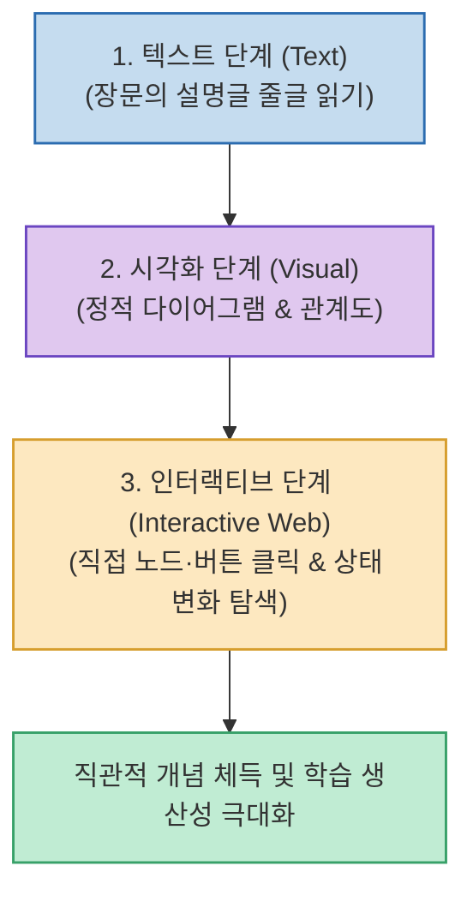

AI에게 복잡한 엔지니어링 개념이나 아키텍처를 물어보면 대부분 수십 줄의 긴 마크다운 텍스트와 정의 목록을 출력합니다. 하지만 텍스트 줄글만으로는 컴포넌트 간의 상호작용과 상태 변화를 직관적으로 체감하기 어렵습니다.

Anthropic 내부에서 널리 쓰이는 **`/eli5` 스킬**의 핵심은 **"아무것도 모르는 사람을 위해 큰 그림과 적은 글자, 그리고 직접 눌러보며 탐색할 수 있는 인터랙티브 웹(HTML Artifact)으로 개념을 시각화하라"**는 것입니다.

<!--more-->

## Sources

- [원문 Threads 게시물 (AppCaster)](https://www.threads.com/@appcast/post/DcZnnb0Af8B)
- [Anthropic 커뮤니티 Skills 및 Artifacts 가이드]

---

## 1. 설명 방식의 3단계 진화



---

## 2. 왜 인터랙티브 웹(HTML Artifact)인가?

1. **직접 조작하는 관계망 탐색**:
   * "그래프의 노드와 엣지는 이렇습니다"라는 설명 대신, `[사용자] ─(사용)─ [Python] ➔ [기업]` 같은 관계도를 직접 클릭하고 필터링하면서 데이터 연결 구조를 즉시 이해할 수 있습니다.
2. **단계별 상태 변화 시뮬레이션**:
   * 슬라이더나 단계별 버튼(Step 1 ➔ Step 2 ➔ Step 3)을 배치하여, 데이터가 흘러가고 상태가 바뀌는 과정을 실시간 애니메이션과 반응형 화면으로 확인할 수 있습니다.
3. **비교 개념의 토글 전환**:
   * RAG vs CAG, SQL vs NoSQL 등의 비교 대상을 버튼 클릭 한 번으로 나란히 또는 오버레이로 전환하며 차이점을 체감합니다.

---

## 3. 실전 ELI5 인터랙티브 프롬프트 템플릿

```text
다음 개념을 ELI5(5살 아이에게 설명하듯) 방식으로 설명해 줘.

[조건]
1. 이 주제를 전혀 모르는 사람을 기준으로 설명
2. 긴 Markdown 글줄은 최소화하고 큰 그림, 도형, 관계도, 화살표 중심 구성
3. 버튼, 노드, 카드를 직접 눌러보며 개념을 탐색할 수 있는 인터랙티브 웹(HTML)으로 표현
4. 단계별 흐름(Step-by-step)을 선택하면 시각적 변화가 보이도록 구현
5. 비교할 개념이 있다면 토글/버튼으로 차이를 직접 비교 가능하게 구성
6. 모바일 화면에서도 보기 편하게 반응형 레이아웃 적용

주제:
[여기에 알고 싶은 개념 입력]
```

AI에게 단순히 **"설명해 줘"**가 아니라 **"내가 쉽게 이해하고 조작할 수 있는 전용 인터페이스를 만들어 줘"**라고 요청하는 인터랙션의 전환점입니다.
