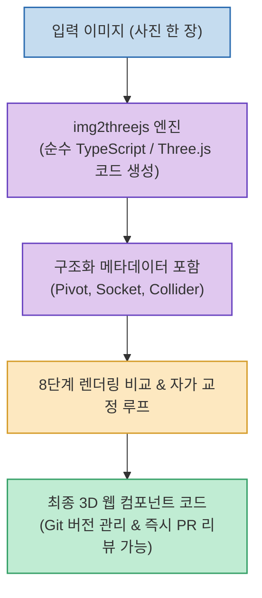

대부분의 3D AI 생성 도구(Hunyuan3D, TripoSR 등)는 결과물로 바이너리 3D 파일(GLB, OBJ, STL 등)을 출력합니다. 하지만 이러한 바이너리 파일은 코드 레벨에서 파라미터를 수정하기 어렵고, Git diff를 통한 버전 관리나 PR 코드 리뷰가 불가능하다는 구조적 한계가 있습니다.

**`img2threejs`**(`img2threejs/img2threejs`)는 사진 한 장을 입력받아 **바이너리 메시 대신 브라우저에서 즉시 실행 및 커스텀 가능한 '순수 TypeScript / Three.js 코드'로 직접 변환해 주는 획기적인 오픈소스 프로젝트**입니다.

<!--more-->

## Sources

- [원문 Threads 게시물 (h2smusic)](https://www.threads.com/@h2smusic/post/Dcdt3Ohk9NL)
- [img2threejs GitHub 공식 저장소](https://github.com/img2threejs/img2threejs)

---

## 1. img2threejs 생성 및 자가 교정 아키텍처

---

## 2. 왜 바이너리 대신 'Three.js 코드'인가?

1. **완벽한 Git 버전 관리와 코드 리뷰**:
   * 불투명한 대용량 바이너리 대신 사람이 읽고 수정할 수 있는 TypeScript 코드로 생성되므로, 변경 이력을 Git diff로 추적하고 PR 코드 리뷰를 즉시 진행할 수 있습니다.
2. **구조화된 인터랙션 메타데이터 내장**:
   * 모델의 중심 회전축(Pivot), 장착 지점(Socket), 물리 충돌 영역(Collider) 정보가 코드 레벨에 프로퍼티로 정의되어 있어 웹 애니메이션과 물리 엔진 연결이 압도적으로 수월합니다.
3. **8단계 렌더링 비교 검증(Self-Refinement)**:
   * 생성된 Three.js 코드를 가상 캔버스에서 렌더링한 뒤, 원본 이미지와 8단계에 걸친 시각적 비교 루프를 거쳐 코드를 스스로 최적화하고 오차를 보정합니다.
4. **Claude Code 등 AI 에이전트 연동**:
   * 에이전트 CLI(Claude Code 등)의 스킬로 연동하여, 대화형으로 3D 웹 인터랙션 컴포넌트를 즉시 코드로 합성하고 프로젝트에 통합할 수 있습니다.
