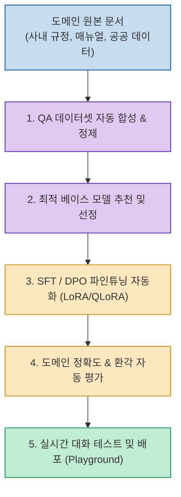

특정 산업이나 기업의 폐쇄적인 도메인 지식을 반영한 전용 AI 모델(도메인 특화 LLM)을 구축하려면 데이터 전처리, QA 합성, 모델 선정, 파인튜닝(SFT/DPO), 정량적 평가에 이르는 복잡한 MLOps/LLMOps 엔지니어링 과정을 거쳐야 합니다.

KISTI-NTIS의 AI 에이전트 연구 생태계(KISTI_BLUESKY) 일환으로 개발된 **`NELLA` (Nifty-Enhanced LLMOps Agent)**는 사용자가 업로드한 문서를 바탕으로 **학습 데이터 합성부터 LoRA/QLoRA 파인튜닝, 자동 평가, 실시간 플레이그라운드 테스트까지 전체 라이프사이클을 자연어 대화로 자동화하는 Agentic LLMOps 프레임워크**입니다.

<!--more-->

## Sources

- [NELLA GitHub 공식 저장소 (leeryong/NELLA)](https://github.com/leeryong/NELLA)
- [KISTI-NTIS AI Agent Research Project]

---

## 1. NELLA 5단계 LLMOps 파이프라인

---

## 2. 주요 핵심 기능

1. **문서 기반 QA 학습 데이터 자동 합성**:
   * PDF, Word 등 원본 문서를 업로드하면 에이전트가 문맥을 분할 분석하여 모델 파인튜닝에 필요한 고품질 Instruction-Response 데이터셋을 자동 생성합니다.
2. **최적 베이스 모델 추천 및 선정**:
   * 프로젝트 요구사항, 도메인 언어 특성, 하드웨어(GPU VRAM) 리소스에 맞춰 가장 적합한 오픈소스 베이스 모델을 추천합니다.
3. **효율적 파인튜닝 자동화 (SFT / DPO)**:
   * LoRA / QLoRA 등 최신 PEFT(파라미터 효율적 미세조정) 기법을 활용하여 복잡한 코드 작성 없이 명령 한 번으로 모델 학습을 자동 수행합니다.
4. **도메인 특화 성능 자동 평가 (Evaluation)**:
   * 파인튜닝된 모델이 원본 문서의 지식을 정확히 반영하는지, 환각(Hallucination)이 없는지 벤치마크 지표를 통해 정량적으로 검증합니다.
5. **실시간 대화 테스트 및 피드백 (Playground)**:
   * 학습이 완료된 도메인 전용 모델과 즉시 채팅하며 성능을 테스트하고 추가 개선점을 도출할 수 있습니다.

---

## 3. 시사점

**Human-in-the-Loop** 구조를 채택하여 자동화 프로세스 속에서도 사용자가 데이터셋과 학습 설정을 직접 검수·통제할 수 있으며, 머신러닝 전문 지식이 부족한 실무자도 사내 전용 AI 모델을 손쉽게 빌드할 수 있는 환경을 제공합니다.
