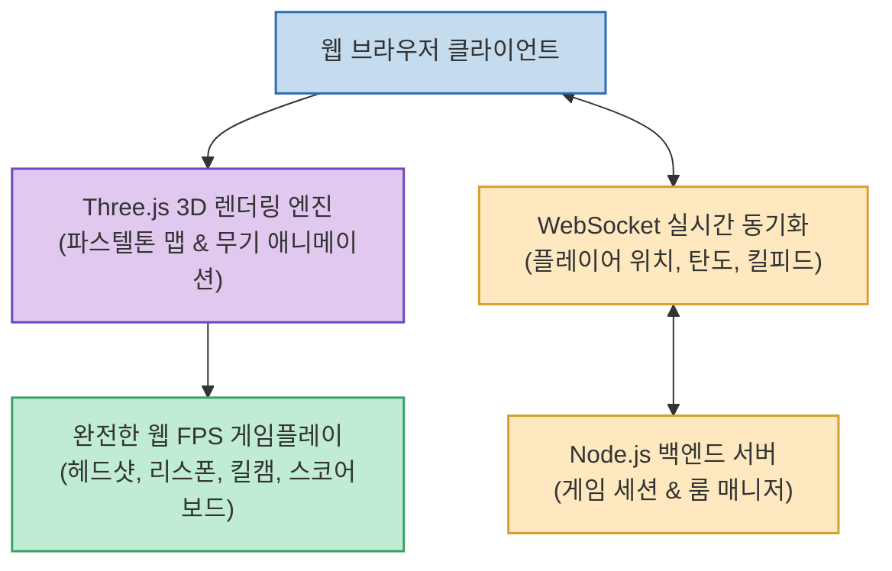

웹 브라우저 기술이 고도화되면서 별도의 무거운 클라이언트 설치 없이 브라우저 URL 접속만으로 쾌적한 3D 멀티플레이 게임을 즐길 수 있는 환경이 열리고 있습니다.

**`Pastel Nuketown`**(`luckeyfaraday/pastel-nuketown`)은 콜 오브 듀티(Call of Duty)의 전설적인 맵 'Nuketown'을 아기자기한 파스텔톤 로우폴리 3D 그래픽으로 구현하고, **Three.js와 Node.js WebSocket을 결합해 완벽한 싱글 및 실시간 멀티플레이 FPS 시스템을 구축한 오픈소스 프로젝트**입니다.

<!--more-->

## Sources

- [원문 Threads 게시물 (sandpia_com)](https://www.threads.com/@sandpia_com/post/Dcdu5_PgbOc)
- [Pastel Nuketown GitHub 공식 저장소](https://github.com/luckeyfaraday/pastel-nuketown)

---

## 1. Pastel Nuketown 기술 아키텍처

---

## 2. 주요 핵심 구현 기능

1. **실시간 멀티플레이 & 싱글플레이 모드 지원**:
   * Node.js WebSocket 서버를 통해 다수의 플레이어가 동일한 룸에 접속하여 지연 없이 동기화된 총격전을 즐길 수 있습니다.
2. **정교한 무기 및 타격 시스템**:
   * SMG(기관단총), 샷건(산탄총), 라이플(소총) 3대 무기군이 구현되어 있으며, 탄도학, 무기 반동, 재장전(Reload) 애니메이션, 헤드샷 판정을 완벽히 지원합니다.
3. **완전한 FPS 인게임 이벤트 시스템**:
   * 실시간 킬피드(Kill Feed), 킬캠(Killcam), 점수판(Scoreboard), 플레이어 사망 후 리스폰 메커니즘 등 상용 FPS의 필수 요소가 모두 갖춰져 있습니다.

---

## 3. 웹 3D 개발 레퍼런스로서의 가치

* **Three.js 씬 최적화**: 로우폴리 파스텔톤 에셋을 활용해 웹 브라우저에서도 높은 프레임률(FPS)을 유지하는 렌더링 최적화 레퍼런스를 제공합니다.
* **클라이언트-서버 상태 동기화**: 고속으로 움직이는 플레이어의 좌표 및 타격 판정을 WebSocket으로 가볍게 처리하는 네트워킹 아키텍처를 학습하기에 적합합니다.
