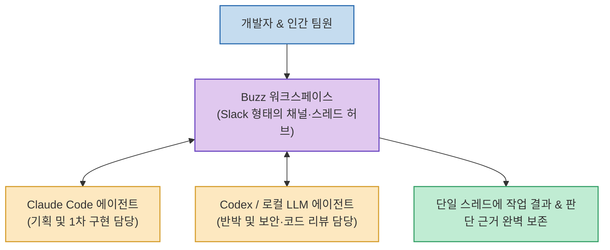

Claude Code, Codex, Cursor 등 다양한 AI 코딩 에이전트를 사용하다 보면, 각자의 작업 결과와 사람이 남긴 피드백, 의사결정 맥락이 도구마다 파편화되어 *"그때 왜 그렇게 판단하고 코드를 고쳤는지"* 사후 추적이 어려워지는 문제가 발생합니다.

트위터 창업자 잭 도시(Jack Dorsey)가 이끄는 블록(Block) 팀이 오픈소스로 공개한 **`Buzz`**(`block/buzz`)는 **인간과 여러 AI 에이전트가 Slack 형태의 단일 채널과 스레드에서 동등한 팀원으로 상주하며 협업할 수 있도록 설계된 인간-에이전트 통합 워크스페이스**입니다.

<!--more-->

## Sources

- [원문 유튜브 영상: 요즘 가장 핫한 AI툴 Buzz, 클로드코드·코덱스를 한 팀으로 쓰는 법!](https://youtu.be/3RApTxBeE7E)
- [Buzz 공식 웹사이트](https://buzz.xyz)
- [Buzz GitHub 공식 저장소 (block/buzz)](https://github.com/block/buzz)
- [Block 공식 발표 블로그](https://block.xyz/inside/introducing-buzz-where-humans-and-agents-work-together)

---

## 1. Buzz 협업 워크스페이스 아키텍처

---

## 2. 주요 핵심 기능 및 차별점

1. **단일 스레드 기반의 컨텍스트 및 의사결정 보존**:
   * 개별 터미널에 흩어지던 대화 이력과 피드백을 단일 스레드에 누적하여, 프로젝트 참여자 누구나 에이전트의 결정 배경과 히스토리를 투명하게 열람할 수 있습니다.
2. **다자간 역할 분담 협업 (기획담당 vs 비판/보안담당)**:
   * 예를 들어 `@ClaudeCode`에게 1차 기능 설계를 지시하면, `@Codex`가 보안 취약점과 엣지 케이스를 반박하고, 인간 리더가 최종 컨펌하는 전문 팀 단위 워크플로우를 구성할 수 있습니다.
3. **유연한 모델 연결 및 로컬 LLM 지원**:
   * 상용 클라우드 API뿐만 아니라 Ollama 등을 통한 사내 로컬 오픈소스 모델도 팀원으로 등록하여 비용과 보안을 최적화할 수 있습니다.
4. **동료 초대 및 실시간 공유**:
   * 실제 팀원들을 채널에 초대하여 AI 에이전트들과 실시간으로 스레드를 공유하고 의견을 나눌 수 있습니다.

---

## 3. 시사점

개별 터미널에서 1:1로만 쓰이던 AI 코딩 도구를 팀 단위 커뮤니케이션 공간으로 통합하여, **사람과 다양한 AI 직원이 실시간으로 소통하고 기록을 공유하는 미래형 개발 협업 플랫폼의 표준**을 제시합니다.
