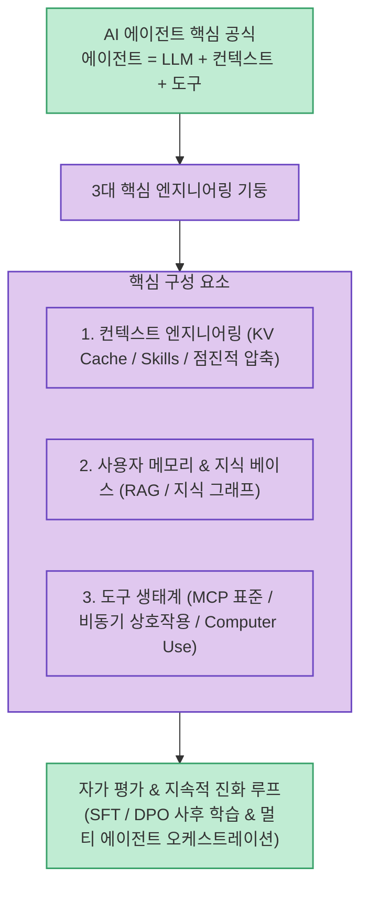

단순히 프롬프트로 챗봇과 대화하는 수준을 넘어 복잡한 비즈니스 로직과 개발 업무를 자율적으로 완수하는 AI 에이전트를 구축하려면, **"에이전트 = LLM + 컨텍스트 + 도구"**라는 핵심 공식을 기반으로 정밀한 하네스(Harness) 엔지니어링을 설계해야 합니다.

Bojie Li가 집필하고 전 세계 커뮤니티가 14개 언어로 번역에 참여한 오픈소스 도서 **`AI Agents in Depth (AI 에이전트를 깊이 이해하기)`**는 기초 설계부터 프로덕션 배포까지 총 10개 장과 94개의 연계 실습 코드를 통해 엔지니어링 실전을 다루는 완성형 가이드북입니다.

<!--more-->

## Sources

- [GitHub 공식 저장소 (bojieli/ai-agent-book)](https://github.com/bojieli/ai-agent-book)
- [온라인 웹북 (AI Agents in Depth)](https://bojieli.github.io/ai-agent-book/)
- [한국어 PDF 다운로드](https://github.com/bojieli/ai-agent-book/releases/download/latest/AI-Agents-in-Depth-ko.pdf)

---

## 1. AI 에이전트 핵심 엔지니어링 아키텍처

---

## 2. 도서 10개 장 핵심 구성 및 주제

1. **AI 에이전트 기초**:
   * 에이전트 = LLM + 컨텍스트 + 도구. 경쟁력의 핵심인 하네스(Harness) 엔지니어링 원리.
2. **컨텍스트 엔지니어링 (Context Engineering)**:
   * KV Cache 최적화, 프롬프트 엔지니어링, Agent Skills 구조화 및 점진적 컨텍스트 압축(LOD).
3. **사용자 메모리와 지식 베이스**:
   * 세션 간 장기 메모리(Long-term Memory), 지능형 RAG, 구조화 색인 및 지식 그래프(Knowledge Graph).
4. **도구 (Tools & MCP)**:
   * MCP(Model Context Protocol) 표준, 인식·실행·협업 도구 연동, 이벤트 기반 비동기 도구 탐색.
5. **코딩 에이전트와 코드 생성**:
   * 새로운 도구를 실시간으로 스스로 제작하는 메타 도구로서의 코드와 프로덕션 코딩 에이전트 아키텍처.
6. **상호작용 (관찰 공간과 행동 공간의 확장)**:
   * 멀티모달 확장, 비동기 이벤트 시스템, 음성(Voice), 컴퓨터 유즈(Computer Use), 로보틱스 연동.
7. **에이전트 평가 (Agent Evaluation)**:
   * 에이전트 성능을 비교 가능한 정량적 신호로 변환하는 평가 환경, 벤치마크 지표, 통계적 유의성 검증.
8. **모델 사후 학습 (Post-training)**:
   * 에이전트 특화 SFT(지도 미세조정), DPO, RLHF 및 파라미터 효율적 튜닝 기법.
9. **에이전트의 지속적 진화 (Self-Evolution)**:
   * 자가 반성(Self-Reflection), 실패 사례 기반 피드백 루프, 자가 진화 메모리 구축.
10. **프로덕션 배포와 멀티 에이전트 오케스트레이션**:
    * 복수 에이전트 협업 체계, 보안 가드레일, 안정적인 서비스 운영 아키텍처.

---

## 3. 시사점

단순한 챗봇 프롬프팅 단계를 넘어, **컨텍스트 설계, 장기 메모리 구조화, MCP 도구 확장, 자가 평가 및 진화 루프**까지 AI 에이전트 엔지니어링 전반을 체계적으로 마스터할 수 있는 최고의 오픈소스 교과서입니다.
