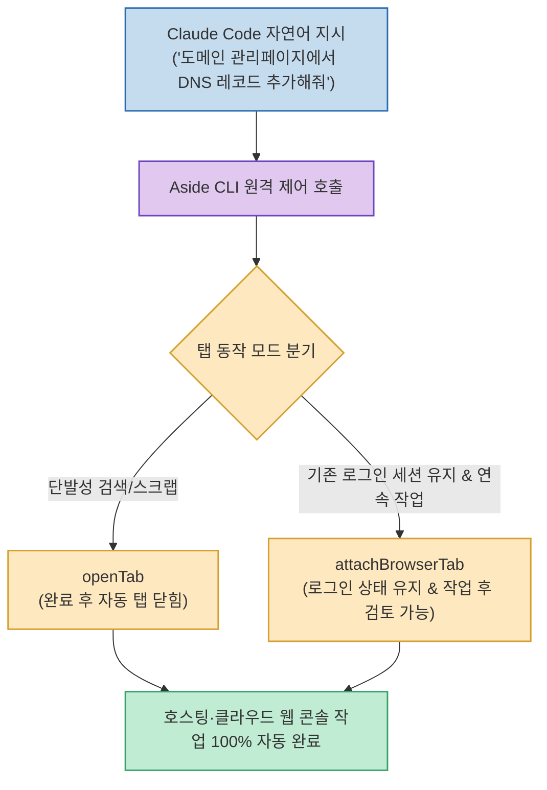

Claude Code로 서버나 웹 애플리케이션을 구축한 후, 호스팅 관리자 페이지에 접속해 DNS 레코드를 추가하거나 클라우드 콘솔을 설정하는 작업은 여전히 브라우저를 직접 띄워 클릭해야 하는 번거로움이 있었습니다.

AI 브라우저 **`Aside`의 CLI 도구**를 활용하면, Claude Code 터미널에서 프롬프트 명령 한 줄로 **에이전트가 브라우저 탭을 원격 제어하여 로그인된 세션을 이어받고(`attach`), 웹 관리자 콘솔 설정을 100% 자율적으로 완료**할 수 있습니다.

<!--more-->

## Sources

- [원문 Threads 게시물 (윤자동)](https://www.threads.com/@yun_ja_dong/post/DcfsU2QE2Om)
- [Aside 브라우저 공식 가이드 및 CLI 문서]

---

## 1. Aside CLI 원격 제어 아키텍처

---

## 2. 탭 동작 방식의 2가지 핵심 구분

1. **`openTab` (단발성 작업)**:
   * 단순 웹 정보 검색, 일회성 데이터 스크래핑 등 작업 완료 후 탭이 자동으로 닫혀도 무방한 일시적인 태스크에 사용합니다.
2. **`attachBrowserTab` / `attach` (연속성 작업 & 세션 유지 - 핵심 팁)**:
   * 이미 로그인된 브라우저 세션(구글 로그인, 호스팅 관리자 등)을 그대로 재활용하여 작업을 수행해야 하거나, 작업 완료 후 사용자가 브라우저 화면에서 결과를 직접 확인해야 할 때 탭을 유지시킵니다.

---

## 3. 실전 활용 사례

* **서버 도메인 DNS 자동 연결**: 오라클/AWS 서버를 프로비저닝한 뒤, Claude Code에게 Aside CLI를 통해 도메인 등록 사이트(가비아, 호스팅케이알 등)에 접속해 A 레코드와 CNAME을 추가하도록 명령.
* **복사-붙여넣기 없는 엔드투엔드 개발**: 코드 작성부터 인프라 설정, 웹 배포 콘솔 조작까지 터미널 대화창 하나에서 끊김 없이 완료할 수 있습니다.
