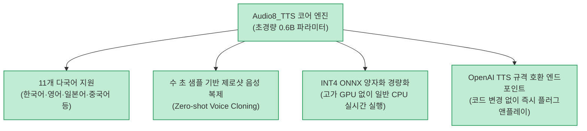

자연스러운 음성 합성(TTS)과 음성 복제(Voice Cloning) 모델은 대부분 수십 억(Billion) 개의 파라미터와 무거운 고가 GPU 인프라를 요구하여 로컬 디바이스나 가벼운 클라우드 서버에서 운영하기 어려웠습니다.

**`Audio8_TTS`**(`Audio8-AI/Audio8_TTS`)는 불과 **0.6B (6억 파라미터)** 크기의 초경량 모델이면서 **한국어, 영어, 일본어, 중국어 등 11개 다국어 지원과 제로샷 음성 복제, 그리고 INT4 ONNX 양자화를 통한 일반 CPU 실시간 구동**을 지원하는 혁신적인 오픈소스 TTS 엔진입니다.

<!--more-->

## Sources

- [원문 Threads 게시물 (h2smusic)](https://www.threads.com/@h2smusic/post/Dcj1_7lE67-)
- [Audio8_TTS GitHub 공식 저장소](https://github.com/Audio8-AI/Audio8_TTS)

---

## 1. Audio8 TTS 아키텍처

---

## 2. 주요 핵심 기능

1. **0.6B 초경량 & 11개 언어 완벽 지원**:
   * 한국어, 영어, 일본어, 중국어, 스페인어, 독일어, 프랑스어 등 주요 11개 언어의 자연스러운 발음과 문맥 억양을 생성합니다.
2. **단 몇 초 샘플로 완성되는 제로샷 보이스 클로닝**:
   * 사전 파인튜닝 없이 짧은 참조 음성 파일만 전달하면 해당 화자의 고유 음색과 억양을 즉각 복제하여 음성을 합성합니다.
3. **INT4 ONNX 기반 CPU 실시간 렌더링**:
   * GPU가 없는 일반 노트북이나 저사양 가상 머신(VM) CPU에서도 지연 없이 실시간(Real-time) 이상 속도로 음성을 출력합니다.
4. **OpenAI API 호환 엔드포인트**:
   * OpenAI의 `v1/audio/speech` 규격을 완벽 지원하여, 기존 LLM 에이전트나 음성 파이프라인에서 엔드포인트 주소만 바꾸어 즉시 무료로 대체할 수 있습니다.

---

## 3. 시사점

고가의 클라우드 GPU 구독 없이도 로컬 PC나 엣지 디바이스에서 **음성 비서, AI 오디오북, 게임 캐릭터 음성 등 고품질 다국어 음성 서비스를 100% 로컬 무료로 구축**할 수 있는 강력한 경량화 솔루션입니다.
