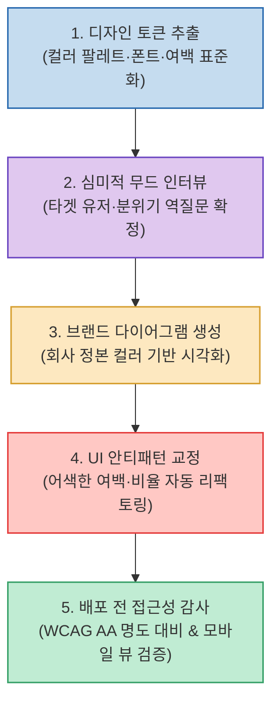

클로드(Claude Code)에게 웹 컴포넌트나 UI 디자인을 지시했을 때 매번 밋밋하고 투박한 화면이 출력되는 이유는 모델의 지능이 부족해서가 아니라, **"참조하고 따라야 할 일관된 디자인 시스템 기준(Design Tokens)이 주어지지 않았기 때문"**입니다.

브랜드 색상과 폰트 추출부터 심미적 무드 인터뷰, 레이아웃 안티패턴 교정, 배포 전 접근성 검사까지 클로드의 디자인 결과물을 프로 수준으로 끌어올리는 **5대 핵심 디자인 스킬과 실전 워크플로우**를 정리합니다.

<!--more-->

## Sources

- [원문 유튜브 쇼츠: 무조건 설치해야하는 클로드 디자인 스킬 (AI싱크클럽)](https://youtube.com/shorts/49Yc4rS6sIU)
- [Claude Code 디자인 스킬 생태계 가이드]

---

## 1. 5단계 디자인 최적화 워크플로우

---

## 2. 필수 추천 5대 디자인 스킬

1. **디자인 토큰 추출 및 온보딩 (`Design Token Extractor / DesignLang`)**:
   * 레퍼런스 웹사이트나 기존 브랜드 문서를 파싱하여 색상 팔레트(OKLCH, Hex), 폰트 스택, 기본 간격(Spacing) 규칙을 추출해 `style-guide.md`로 표준화합니다.
2. **브랜드 맞춤형 다이어그램 (`Diagram Design`)**:
   * 기본 흑백 차트 대신, 정의된 브랜드 컬러와 폰트를 자동으로 상속받아 세련된 인포그래픽과 인터랙티브 다이어그램을 생성합니다.
3. **심미적 기준 및 무드 인터뷰 (`Taste Review / Deep-Interview`)**:
   * AI가 섣불리 코드를 짜기 전에 타겟 유저층, 원하는 비주얼 톤앤매너, 모바일 반응형 우선순위를 역으로 질문하여 디자인 청사진을 명확히 합니다.
4. **UI 완성도 및 안티패턴 교정 (`Impeccable`)**:
   * 들쭉날쭉한 여백, 폰트 크기 깨짐, 촌스러운 그림자 등 AI 특유의 디자인 결함을 감지하고 세련된 마이크로 인터랙션과 여백 비율로 자동 리팩토링합니다.
5. **배포 전 접근성 & 명도 대비 감사 (`Pre-flight Audit`)**:
   * WCAG AA 기준의 명도 대비율, 모바일 뷰포트 가독성, 텍스트 겹침 현상을 배포 전에 자동으로 전수 검사하여 결함을 차단합니다.

---

## 3. 시사점

단순히 *"예쁘게 만들어줘"*라는 모호한 프롬프트 대신, **디자인 토큰 추출 ➔ 무드 확정 ➔ 안티패턴 교정 ➔ 배포 전 접근성 검사**로 이어지는 디자인 시스템 파이프라인을 스킬로 주입하는 것이 고품질 프론트엔드 개발의 핵심입니다.
