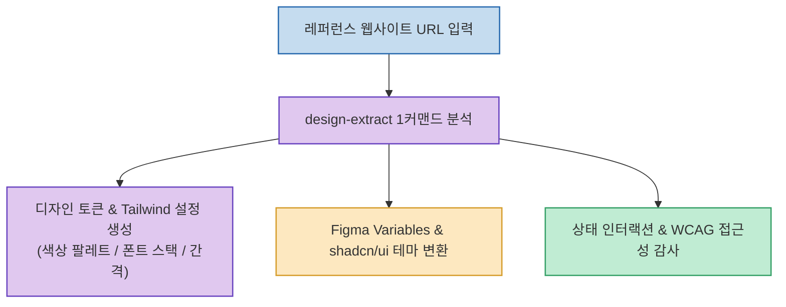

레퍼런스 삼고 싶은 세련된 웹사이트를 발견했을 때, 브라우저 개발자 도구(F12)를 열고 일일이 색상 코드와 폰트 크기, 마진/패딩 여백을 복사해 오는 작업은 상당한 시간과 노력을 소모합니다.

**`design-extract`**(`Manavarya09/design-extract`)는 URL 입력 한 줄로 **웹사이트의 색상, 타이포그래피, 반응형 브레이크포인트, 상태 스타일(Hover/Focus)을 분석하여 Tailwind CSS 설정, Figma Variables, shadcn/ui 테마 코드로 즉시 변환해 주는 오픈소스 도구**입니다.

<!--more-->

## Sources

- [원문 X 게시물: GitHub AI Projects Community 🇯🇵 (@trendtech33566)](https://x.com/trendtech33566/status/2092915126336909701)
- [design-extract GitHub 공식 저장소 (Manavarya09/design-extract)](https://github.com/Manavarya09/design-extract)

---

## 1. design-extract 추출 및 변환 파이프라인

---

## 2. 주요 핵심 기능 및 차별점

1. **원클릭 디자인 토큰 & Tailwind 설정 생성**:
   * 웹페이지 전반에서 쓰인 프라이머리/세컨더리 컬러 팔레트, 폰트 패밀리, 스페이싱, 둥근 모서리(Border Radius) 값을 추출해 `tailwind.config.js` 및 CSS 변수로 패키징합니다.
2. **Figma Variables & shadcn/ui 테마 호환**:
   * UI 디자이너가 쓰는 Figma의 Variables JSON 포맷 및 React 프론트엔드 생태계 표준인 shadcn/ui 테마 형식으로 원클릭 변환을 지원합니다.
3. **인터랙션 상태(State) & 반응형 뷰포트 정밀 분석**:
   * 정적인 화면 요소뿐만 아니라 hover, focus, active 시 변화하는 스타일과 모바일/태블릿 반응형 레이아웃 룰을 추출합니다.
4. **WCAG 웹 접근성 & 디자인 일관성(Drift) 감사**:
   * 텍스트와 배경의 명도 대비율을 자동으로 검사해 웹 접근성 준수 여부를 확인하고, 시스템 표준에서 벗어난 변칙 스타일을 감지합니다.

---

## 3. 시사점

UI 리서치와 프론트엔드 초기 세팅 시간을 대폭 단축하여, **훌륭한 웹 디자인 레퍼런스를 내 프로젝트와 디자인 시스템에 즉시 이식하고 재활용**할 수 있는 실전 생산성 도구입니다.
