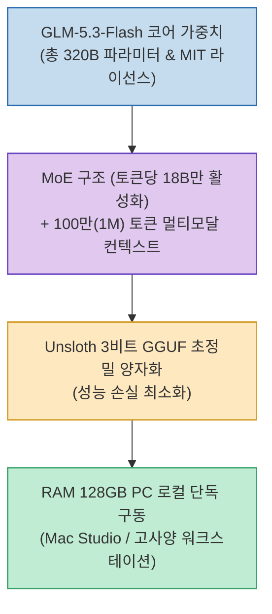

글로벌 오픈 LLM 라우팅 플랫폼인 OpenRouter에서 6일 연속 1위를 지키며 화제를 모았던 익명 모델 'Ox Alpha'의 정체가 ZhipuAI의 **`GLM-5.3-Flash`**로 밝혀졌습니다.

ZhipuAI는 모델 가중치를 MIT 라이선스로 전격 공개했으며, 오픈소스 경량화 최적화 팀인 Unsloth가 단 하루 만에 **3비트 GGUF 양자화 버전**을 배포하여 **3,200억(320B) 규모의 초대형 플래그십 모델을 Mac Studio 등 128GB RAM PC에서 100% 로컬로 구동**할 수 있게 되었습니다.

<!--more-->

## Sources

- [원문 Threads 게시물 (choi.openai)](https://www.threads.com/@choi.openai/post/DcjpimAAoc5)
- [GLM-5.3-Flash Hugging Face 저장소 (Unsloth)](https://huggingface.co/unsloth/GLM-5.3-Flash-GGUF)

---

## 1. GLM-5.3-Flash 로컬 구동 아키텍처

---

## 2. 주요 핵심 스펙 및 기술적 특징

1. **320B 총 파라미터 / 18B 실시간 활성화 (MoE)**:
   * 전체 용량은 320B에 달하지만, 토큰을 추론할 때마다 문맥에 필요한 **약 18B 파라미터만 선별 활성화되는 고효율 Mixture of Experts 구조**를 채택해 빠른 추론 속도를 구현합니다.
2. **Unsloth 3비트 GGUF 정밀 양자화**:
   * 기존에는 대형 모델을 로컬에서 돌리려면 1비트 수준까지 극단적으로 깎아내며 큰 성능 저하를 감수해야 했으나, Unsloth의 3비트 양자화는 지능 손실을 최소화하면서 메모리 요구량을 128GB 이내로 압축했습니다.
3. **100만(1M) 토큰 컨텍스트 & 멀티모달**:
   * 대규모 저장소 코드와 방대한 서적을 한 번에 올릴 수 있는 100만 토큰 컨텍스트를 지원하며, 텍스트, 이미지, 영상 멀티모달 이해 능력을 갖추고 있습니다.

---

## 3. 시사점

초거대 프론티어 AI 모델의 로컬 실행이 실험실을 벗어나, **개인 개발자와 연구자가 최고 성능의 AI를 클라우드 종속 없이 온프레미스/로컬 워크스테이션에 직접 소유하는 시대**가 열리고 있습니다.
