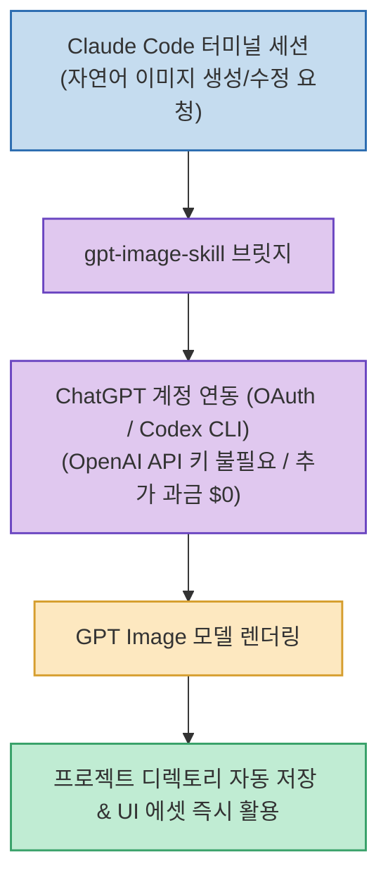

Claude Code는 코딩과 파일 관리, 에이전트 루프에서 압도적인 성능을 발휘하지만, 웹/앱 개발 중 UI 그래픽이나 일러스트 이미지를 직접 생성하는 기능이 부족하여 별도의 유료 OpenAI API 키를 연결해야 하는 비용 부담이 있었습니다.

CHOI 님이 개발한 **`gpt-image-skill`**(`GENEXIS-AI/gpt-image-skill`)은 **별도의 OpenAI API 키 결제 없이, 이미 구독 중인 ChatGPT 계정(OAuth / Codex CLI)을 연동하여 Claude Code 터미널에서 GPT Image를 무료로 즉시 생성**할 수 있는 에이전트 전용 스킬입니다.

<!--more-->

## Sources

- [원문 Threads 게시물 (gpt_minje)](https://www.threads.com/@gpt_minje/post/DchZs2Lkt0I)
- [gpt-image-skill GitHub 공식 저장소](https://github.com/GENEXIS-AI/gpt-image-skill)

---

## 1. gpt-image-skill 연동 아키텍처

---

## 2. 주요 핵심 기능 및 차별점

1. **추가 API 과금 없는 ChatGPT 구독 연동**:
   * 이미지 생성 건당 과금되는 무거운 API 결제 대신, 이미 사용 중인 ChatGPT Plus/Team/Pro 플랜의 혜택을 그대로 활용합니다.
2. **Claude Code 내 실시간 프롬프트 생성 및 수정**:
   * 코딩 도중 "로그인 페이지에 어울리는 3D 일러스트 생성해줘"라고 요청하면, 에이전트가 즉시 GPT Image를 호출하여 결과물을 도출합니다.
3. **레퍼런스 스타일 유지 및 대화형 보정**:
   * 기존 이미지를 참조 이미지로 주입하여 일관된 톤앤매너를 유지하거나, 이전 이미지의 특정 부분을 수정하는 연속 작업이 가능합니다.
4. **프로젝트 에셋 디렉토리 자동 저장**:
   * 생성된 고화질 이미지를 현재 작업 중인 웹/앱 프로젝트 폴더에 자동으로 다운로드하고 코드 내 `` 경로를 연결해 줍니다.

---

## 3. 시사점

Claude의 정밀한 코딩 능력과 ChatGPT의 탁월한 이미지 생성 모델을 결합하여, **서로 다른 LLM 플랫폼의 장점을 단일 터미널에서 추가 비용 없이 통합 활용하는 크로스 플랫폼 에이전트 워크플로우**의 대표적인 사례입니다.
