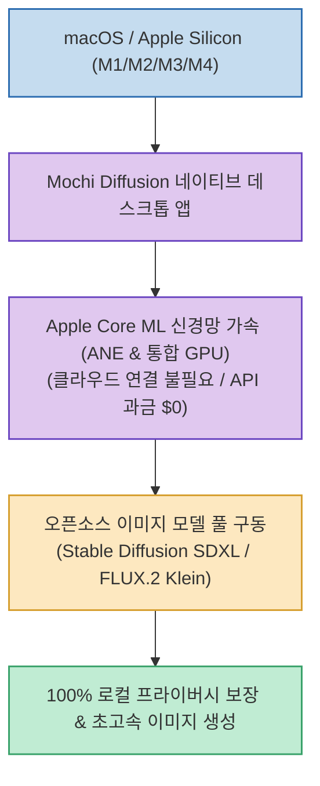

AI 이미지 생성을 시도할 때 매번 유료 클라우드 서비스(Midjourney, DALL-E)의 구독료를 지불하거나, 복잡한 파이썬 가상환경 세팅 및 WebUI/ComfyUI 설치에 지친 Mac 사용자들이 많습니다.

**`Mochi Diffusion`**(`MochiDiffusion/MochiDiffusion`)은 복잡한 설정 없이 일반 맥 앱처럼 설치하여, **Apple Silicon(M1~M4)의 Neural Engine과 GPU를 활용해 Stable Diffusion 및 최신 FLUX.2 Klein 모델을 100% 로컬 오프라인에서 초고속으로 구동하는 네이티브 오픈소스 데스크톱 앱**입니다.

<!--more-->

## Sources

- [원문 Threads 게시물 (h2smusic)](https://www.threads.com/@h2smusic/post/Dci9PHqE2Jy)
- [Mochi Diffusion GitHub 공식 저장소](https://github.com/MochiDiffusion/MochiDiffusion)

---

## 1. Mochi Diffusion 로컬 가속 아키텍처

---

## 2. 주요 핵심 기능 및 차별점

1. **100% 로컬 오프라인 & 프라이버시 보호**:
   * 이미지 생성 데이터와 프롬프트가 외부 클라우드 서버로 전송되지 않고 내 Mac 안에서만 처리되므로, 보안이 중요한 프로젝트나 비공개 작업물을 안전하게 제작할 수 있습니다.
2. **Apple Silicon Core ML 가속 최적화**:
   * 애플의 Neural Engine(ANE)과 통합 메모리 GPU 구조를 네이티브로 활용하여 매우 빠른 이미지 생성 속도와 낮은 발열/전력 소모를 제공합니다.
3. **최신 오픈소스 모델 생태계 지원**:
   * 전통적인 Stable Diffusion(SD 1.5, SDXL, SD 3) 모델뿐만 아니라, 뛰어난 디테일과 텍스트 렌더링 성능을 자랑하는 **최신 FLUX.2 Klein 모델**까지 손쉽게 실행할 수 있습니다.
4. **직관적인 네이티브 macOS GUI**:
   * 터미널 명령어 입력 없이 직관적인 Mac 네이티브 인터페이스에서 해상도, 스텝 수, CFG 스케일, 네거티브 프롬프트 등을 손쉽게 조절할 수 있습니다.

---

## 3. 시사점

고가의 엔비디아(NVIDIA) GPU 외장 그래픽 카드나 복잡한 클라우드 인프라 없이도, **맥북이나 Mac Studio의 하드웨어 잠재력을 100% 끌어내어 고화질 AI 이미지를 무제한 무료로 생성**할 수 있는 실전 솔루션입니다.
