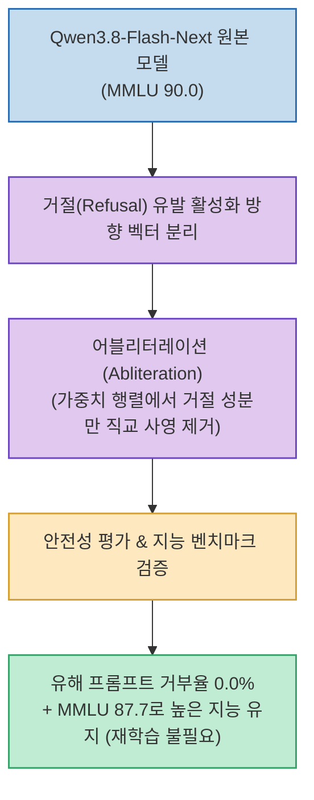

알리바바가 고성능 오픈소스 모델 `Qwen3.8-Flash-Next`를 발표한 지 불과 하루 만에, AI 게이트웨이 및 에이전트 보안 기업 OrcaRouter가 **모델의 거절(Refusal) 메커니즘만 선택적으로 도려낸 무검열(Uncensored) 버전**을 공개했습니다.

안전성 평가 8종에서 유해 프롬프트 거부율은 0.0%로 완전 제거되었으나, 종합 지능 벤치마크(MMLU)는 90.0에서 87.7로 단 2.3%p 하락하는 데 그쳤습니다. 모델 재학습 없이 가중치 수술만으로 검열을 무력화한 **`어블리터레이션(Abliteration)`** 기법을 분석합니다.

<!--more-->

## Sources

- [원문 Threads 게시물 (choi.openai)](https://www.threads.com/@choi.openai/post/Dcjz6btj2Ga)
- [Qwen3.8-Flash-Next-Uncensored Hugging Face 저장소](https://huggingface.co/orcarouter/Qwen3.8-Flash-Next-Uncensored-GGUF)

---

## 1. 어블리터레이션 가중치 수술 메커니즘

---

## 2. 핵심 원리: 어블리터레이션(Abliteration)이란?

1. **거절 활성화 방향(Refusal Direction) 분리**:
   * 모델이 질문에 대해 *"죄송하지만 해당 요청은 처리할 수 없습니다"*라고 응답하는 과정은 신경망 내부의 특정 활성화 방향(Direction) 신호에 집중되어 있습니다.
2. **선택적 가중치 제거 (직교 사영)**:
   * 수많은 GPU 자원이 들어가는 파인튜닝이나 재학습 없이, 모델 가중치 행렬에서 거절 방향의 벡터 성분만 수학적으로 직교 사영(Orthogonal Projection)하여 지워냅니다.
3. **지능 보존과 부작용 최소화**:
   * 일반 지식, 논리 추론, 코딩 관련 가중치는 그대로 유지되므로 MMLU 87.7의 강력한 지능을 유지하면서 과도한 가드레일 거부 반응만 깔끔하게 제거됩니다.

---

## 3. AI 보안 및 거버넌스 시사점

* **가중치 공개와 안전 가드레일의 분리**: 오픈소스 모델의 가중치가 공개되는 순간, 모델 내부 가중치에 심어둔 안전장치는 언제든 분리될 수 있음이 증명되었습니다.
* **런타임 방화벽의 중요성**: 안전한 AI 활용을 위해서는 모델 내부 가중치 검열에 의존하기보다, **외부 API 게이트웨이 및 에이전트 런타임 방화벽** 단계에서 보안 정책을 강제하는 체계로 진화해야 합니다.
