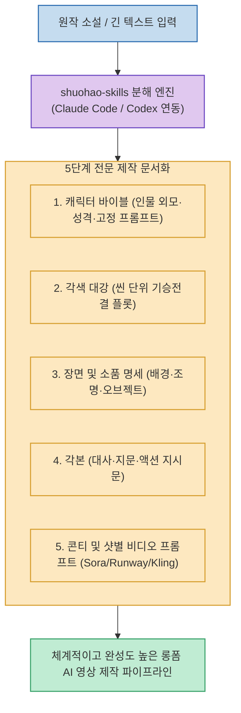

Sora, Kling, Runway, Midjourney 등 뛰어난 생성형 비디오 모델이 등장했지만, 원작 소설이나 긴 줄거리를 바탕으로 일관된 롱폼 영상을 제작하려면 **"캐릭터 외모의 일관성, 씬별 소품과 조명, 전문 각본과 샷별 콘티 프롬프트"**라는 체계적인 기획 파이프라인이 필수적입니다.

**`shuohao-skills`**(`eternityspring/shuohao-skills`)는 영상을 직접 렌더링하는 대신, **원작 소설 한 권을 입력받아 전문 영화/애니메이션 제작에 필요한 5대 핵심 기획 문서로 자동 분해해 주는 Claude Code 및 Codex 연동 오픈소스 스킬 팩**입니다.

<!--more-->

## Sources

- [원문 Threads 게시물 (h2smusic)](https://www.threads.com/@h2smusic/post/Dci2CGUE8n6)
- [shuohao-skills GitHub 공식 저장소](https://github.com/eternityspring/shuohao-skills)

---

## 1. 5단계 영상 제작 문서화 파이프라인

---

## 2. 5대 핵심 제작 문서 구성

1. **캐릭터 바이블 (Character Profiles)**:
   * 주요 등장인물의 연령, 외모 특징, 의상 스타일을 정의하고, 영상 모델에서 인물 일관성을 유지할 수 있는 고정 프롬프트 태그를 도출합니다.
2. **각색 대강 (Adaptation Outline)**:
   * 방대한 텍스트의 핵심 갈등과 플롯을 영상 호흡에 맞는 씬(Scene) 단위 기승전결 구조로 재배치합니다.
3. **장면 및 소품 명세 (Scenes & Props List)**:
   * 각 씬별 배경 환경, 시간대, 조명(Lighting), 핵심 상호작용 소품과 카메라 앵글을 명세화합니다.
4. **표준 각본 (Screenplay / Script)**:
   * 영화 시나리오 표준 형식에 맞춘 대사, 지문, 액션 연출 지시문을 완성합니다.
5. **콘티 및 비디오 생성 프롬프트 (Storyboard Prompts)**:
   * Sora, Runway, Kling 등에 바로 복사해 실행할 수 있는 카메라 워크, 피사체 모션, 화풍 키워드를 포함한 샷(Shot)별 생성 프롬프트를 출력합니다.

---

## 3. 시사점

중구난방 단발성 프롬프트 생성에서 벗어나, **"기획 ➔ 각색 ➔ 설계 ➔ 콘티 ➔ 생성"으로 이어지는 정통 영상 제작 워크플로우를 AI 에이전트 스킬로 시스템화**하여 영상 품질과 제작 속도를 동시에 잡을 수 있습니다.
