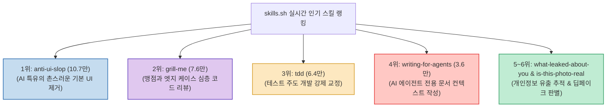

Claude Code의 스킬(Skills) 생태계가 급격히 확장되면서, 전 세계 개발자들이 실제로 어떤 스킬을 가장 많이 설치하고 업무에 활용하는지 파악하는 것이 중요해졌습니다.

글로벌 에이전트 스킬 플랫폼 **`skills.sh`의 실시간 설치 수 집계**를 바탕으로, 단순 코드 생성을 넘어 **UI 품질 정제, 기획 맹점 리뷰, TDD 강제 등 실무 엔지니어링 품질을 극대화해 주는 이번 주 인기 클로드 스킬 TOP 6**를 정리합니다.

<!--more-->

## Sources

- [원문 Threads 게시물 (dotlinefacelab)](https://www.threads.com/@dotlinefacelab/post/DciFZazicmr)
- [skills.sh 공식 스킬 디렉토리](https://skills.sh)

---

## 1. 이번 주 인기 스킬 랭킹

---

## 2. TOP 6 스킬 상세 분석

1. **`anti-ui-slop` (10.7만 회 - 1위)**:
   * AI 특유의 촌스러운 그라데이션, 어색한 여백, 기본 컴포넌트 남발 등 '조잡한 AI UI'를 감지하고 세련된 디자인 시스템으로 교정합니다.
2. **`grill-me` (7.6만 회 - 2위)**:
   * AI가 바로 코드를 작성하지 않고 아키텍처 맹점, 데이터 흐름, 예외 처리를 개발자에게 끈질기게 역질문하여 명확한 설계를 이끌어냅니다.
3. **`tdd` (6.4만 회 - 3위)**:
   * 구현 코드에 앞서 반드시 실패하는 단위/통합 테스트를 먼저 작성하도록 강제하는 테스트 주도 개발 워크플로우를 주입합니다.
4. **`writing-for-agents` (3.6만 회 - 4위)**:
   * 사람이 아닌 AI 에이전트가 오독 없이 가장 빠르고 정확하게 실행할 수 있는 시스템 규칙 및 컨텍스트 문서를 작성합니다.
5. **`what-leaked-about-you` (+346% 급상승 - 5위)**:
   * 온라인과 공개 저장소에 노출된 개인정보 및 API 키 유출을 추적 진단하는 보안 스킬입니다.
6. **`is-this-photo-real` (+336% 급상승 - 6위)**:
   * 픽셀 아티팩트를 분석해 AI 생성 가짜 이미지와 딥페이크를 판별하는 검증 스킬입니다.

---

## 3. 시사점

개발자들의 관심이 '코드 자동 생성'에서 **'생성된 코드의 완성도 검증, 테스트 주도성(TDD), UI 품질 통제'**로 이동하고 있음을 명확히 보여줍니다.
