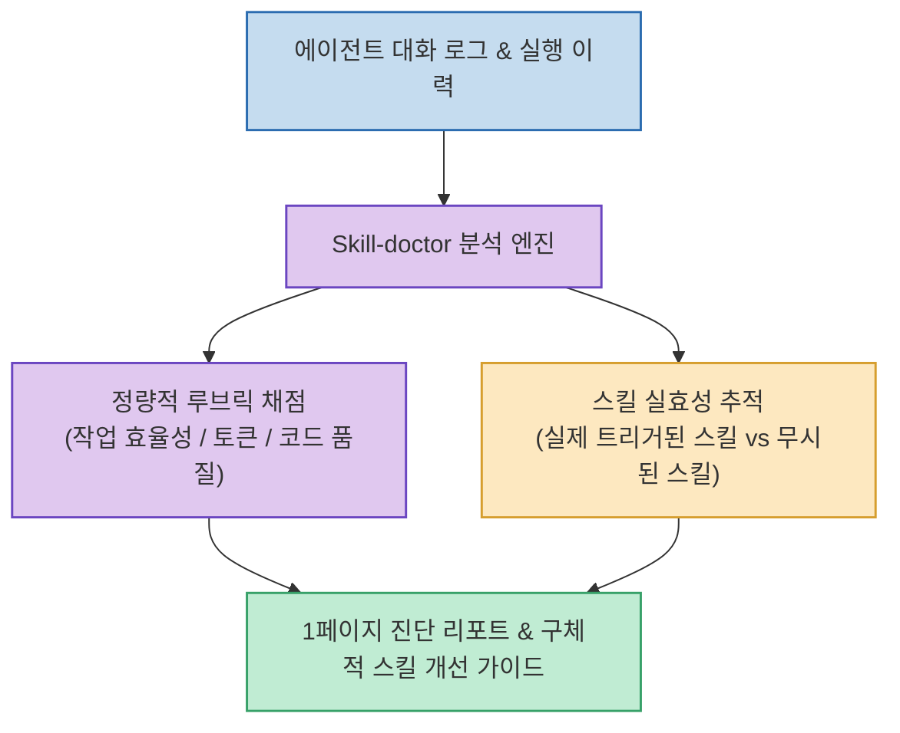

Claude Code, Cursor, Codex 등 AI 코딩 에이전트에 다양한 스킬(Skills)과 시스템 프롬프트를 추가하면서도, **"내가 추가한 스킬이 실제로 작동했는지, 오히려 불필요한 토큰만 낭비하거나 에이전트의 판단을 방해하지는 않았는지"**를 객관적으로 측정하기는 어려웠습니다.

터미널 도구 Warp 팀이 공개한 **`Skill-doctor`**는 에이전트와의 대화 로그를 분석하여 **작업 효율성과 코드 품질 관점에서 점수를 매기고, 어떤 스킬이 유효하게 작동했는지와 개선점을 1장의 진단 리포트로 출력해 주는 스킬 검증 도구**입니다.

<!--more-->

## Sources

- [원문 X 게시물: AI駆動塾 (@L_go_mrk)](https://x.com/L_go_mrk/status/2092929366590112088)
- [Warp Community Skills 공식 저장소](https://github.com/warpdotdev/community-skills)

---

## 1. Skill-doctor 진단 파이프라인

---

## 2. 주요 핵심 기능

1. **대화 로그 기반 루브릭(Rubric) 정량 채점**:
   * 에이전트와 나눈 실제 대화 이력과 CLI 실행 로그를 파싱하여, 토큰 소모량 대비 작업 속도(효율성)와 생성된 코드의 견고성(품질)을 체계적인 기준표로 채점합니다.
2. **스킬 실효성 추적 (Trigger & Impact Analysis)**:
   * 프로젝트에 주입한 여러 스킬 중 실제로 에이전트의 행동을 유도한 스킬과, 문맥에서 무시되거나 충돌을 일으킨 스킬을 명확히 구분해 냅니다.
3. **공유 가능한 1페이지 진단 요약 리포트**:
   * 팀원이나 개발자 커뮤니티에 공유할 수 있도록 스킬별 점수, 개선해야 할 프롬프트 지시문, 제거해야 할 불필요한 규칙을 한 장의 리포트로 요약 제공합니다.

---

## 3. 시사점

스킬을 무작정 많이 등록하는 '스킬 과열' 상태를 방지하고, **데이터와 채점 루브릭을 바탕으로 최적의 에이전트 스킬셋을 지속적으로 다듬고 최적화**할 수 있도록 돕는 실전 평가 도구입니다.
