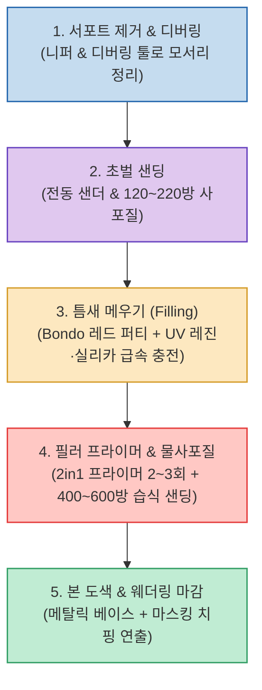

FDM 3D 프린터(Bambu Lab X1C 등)로 출력한 부품과 소품은 특유의 거친 적층선(Layer Lines)과 서포트 분리 자국 때문에 완성도가 떨어져 보이기 쉽습니다.

소품 및 코스프레 프롭 전문 제작 채널인 The Armorer's Forge(M.M.'s Prop Shop)가 공개한 **`3D 프린팅 후가공(Smoothing & Finishing) 완벽 가이드`**는 단순한 손사포질 반복을 넘어, **전동 샌딩 툴, Bondo 레드 퍼티, UV 레진과 흄드 실리카 급속 경화, 2-in-1 필러 프라이머, 그리고 마스킹 치핑 웨더링 기법을 결합해 작업 시간은 절반으로 줄이고 표면 품질은 극대화하는 5단계 프로세스**를 제공합니다.

<!--more-->

## Sources

- [원문 유튜브 영상: The Ultimate Guide to Smoothing & Finishing Your 3D Prints (The Armorer's Forge)](https://youtu.be/P5-jtvYlA1c)
- [The Armorer's Forge 공식 Etsy 스토어](https://thearmorersforge.etsy.com)

---

## 1. 3D 프린팅 표면 후가공 5단계 프로세스

---

## 2. 단계별 핵심 실전 노하우

1. **1단계: 서포트 제거 및 디버링 (Deburring)**:
   * 니퍼(Flush Cutter)로 서포트를 떼어낸 뒤, 모서리와 홀 안쪽의 거스러미는 **디버링 툴(Deburring Tool)**과 금속 줄을 사용해 면을 1차 평탄화합니다.
2. **2단계: 초벌 샌딩 (Sanding)**:
   * 120~220방 거친 사포로 단차를 잡습니다. 특히 넓은 면적이나 완만한 곡면은 **전동 샌더(Electric Foot Sander 활용)**를 사용하면 손으로 수 시간 걸릴 샌딩을 수 분 만에 끝낼 수 있습니다. 분진 방지를 위해 방진 마스크 착용과 물사포질(Wet Sanding)을 권장합니다.
3. **3단계: 표면 결함 충전 (Filling & Putty)**:
   * **Bondo Spot Putty**: 미세한 단차와 레이어 틈에 얇게 펴 바른 뒤 건조 후 샌딩.
   * **UV 레진 + 흄드 실리카(Fumed Silica) 급속 퍼티**: UV 레진에 실리카 파우더를 섞어 걸쭉하게 만든 뒤 깊은 틈새에 바르고 UV 라이트를 비추면 10초 만에 굳어 즉시 샌딩할 수 있습니다.
4. **4단계: 필러 프라이머 도포 및 물사포질**:
   * 표면 미세 틈을 메워주는 2-in-1 필러 프라이머 스프레이를 2~3회 얇게 도포합니다. 건조 후 400~600방 사포로 물사포질을 진행하면 매끄러운 도자기 같은 질감이 완성됩니다.
5. **5단계: 본 도색 및 마스킹 치핑 웨더링**:
   * 금속 질감의 베이스코트(실버/건메탈)를 도포한 뒤, **마스킹 플루이드(Masking Fluid)**를 모서리에 찍어 바르고 상단 메인 컬러를 칠합니다. 도색이 마른 후 마스킹을 긁어내면 실제 금속 페인트가 벗겨진 듯한 리얼한 배틀 데미지 웨더링을 연출할 수 있습니다.

---

## 3. 시사점

무작정 사포질만 반복하는 비효율적인 수작업에서 벗어나, **전동 샌딩 + Bondo/UV 레진 하이브리드 퍼티 + 필러 프라이머** 파이프라인을 구축함으로써 FDM 출력물의 한계를 뛰어넘는 고품질 결과물을 제작할 수 있습니다.
